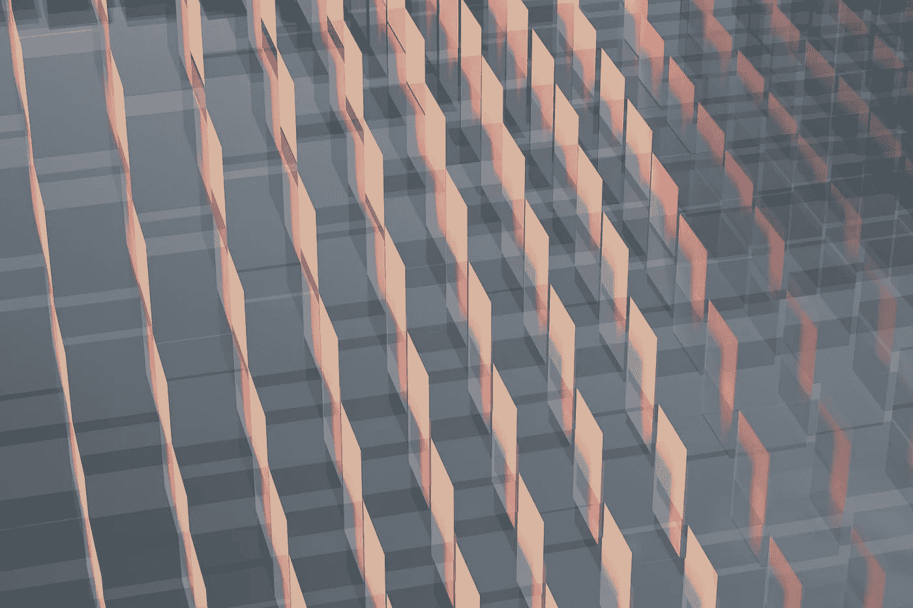
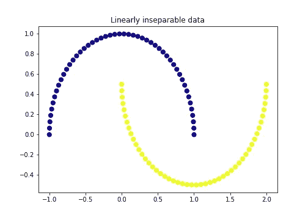
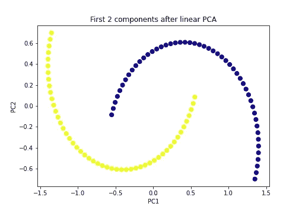
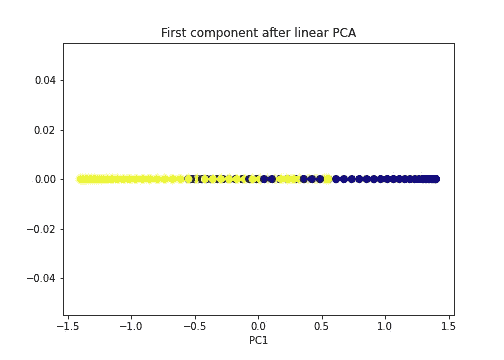
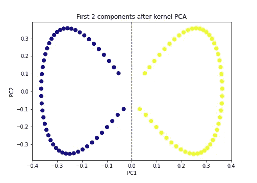
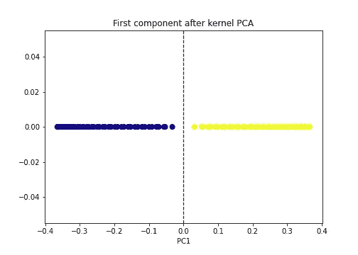
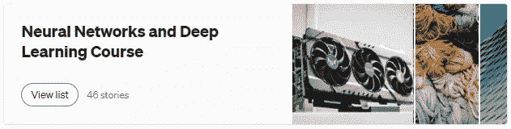

# 线性不可分数据的降维

> 原文：<https://towardsdatascience.com/dimensionality-reduction-for-linearly-inseparable-data-5030f0dc0f5e>

## 基于核主成分分析的非线性降维



[斯蒂夫·约翰森](https://unsplash.com/ja/@steve_j?utm_source=unsplash&utm_medium=referral&utm_content=creditCopyText)在 [Unsplash](https://unsplash.com/?utm_source=unsplash&utm_medium=referral&utm_content=creditCopyText) 上拍照

标准 PCA 适合于*线性*维度缩减，因为它在减少数据中的特征数量时进行线性变换。换句话说，标准 PCA 很好地处理*线性可分离的*数据，其中不同的类别可以通过绘制直线(在 2D 数据的情况下)或超平面(在 3D 和更高维数据的情况下)来清楚地分离。

标准 PCA 对于*线性不可分的*数据效果不佳，在这些数据中，不同的类别不能通过绘制直线或超平面来清楚地分开，而只能通过使用弯曲的判定边界来分开。

对于非线性降维，我们可以使用标准 PCA 的非线性形式 ***核 PCA*** 。

> 标准 PCA 和核 PCA 都降低了数据的维数(特征的数量),但是只有核 PCA 可以使数据线性分离，同时仍然降低数据的维数——作者

# 内核和内核技巧

***内核绝招*** 是将线性不可分的数据转换到数据线性可分的更高维度的过程。这是通过使用内核实现的。内核是一个转换数据的函数。

# KenelPCA()中的重要超参数

内核 PCA 是通过使用 Scikit-learn 中的 Kernel PCA()类实现的。使用该类时，用户需要指定 3 个重要的超参数。

*   **n_components:** 我们想要保留的组件数量。当`n_components=None`(默认)时，所有组件被保留。阅读[这篇文章](/how-to-select-the-best-number-of-principal-components-for-the-dataset-287e64b14c6d)可以找到更多关于调整这个超参数的信息。
*   **内核:**用于 PCA 的内核类型。KernelPCA()类中使用了 4 种类型的核:*、*、*、【poly】、*、【rbf】、*、【sigmoid】、*。当内核为*‘线性’*时，将应用标准(线性)PCA。可以通过使用其他内核之一来执行非线性 PCA。*‘RBF’*(径向基函数)是最常见的一种。默认为*‘线性’*内核。**
*   **gamma:** 这就是所谓的*‘poly’*、*‘RBF’*和*‘sigmoid’*内核的*内核系数*。浮点值可用于 gamma。默认值为`None`，它使用由(1/特征数)计算的值。阅读[这篇文章](/python-implementation-of-grid-search-and-random-search-for-hyperparameter-optimization-2d6a82ebf75c)以找到关于调整这个超参数的更多信息。

# 应用主成分分析和核主成分分析的例子

## 生成非线性数据

为了解释应用 PCA 和内核 PCA 的过程，我们将使用 Scikit-learn[***make _ moons***](https://pub.towardsai.net/7-scikit-learn-utilities-to-generate-artificial-synthetic-data-11624f0d2095#f4f9)*函数生成 ***moons 数据*** (线性不可分)。*

*卫星数据包含两个交错的半圆，可以如下显示。*

```
*import matplotlib.pyplot as plt
plt.figure(figsize=[7, 5])

from sklearn.datasets import make_moons
X, y = make_moons(n_samples=100, noise=None, 
                  random_state=0)

plt.scatter(X[:, 0], X[:, 1], c=y, s=50, cmap='plasma')
plt.title('Linearly inseparable data')
plt.savefig("original_data.png")*
```

**

*(图片由作者提供)*

*生成的数据中有 100 个观察值。每个点代表一个观察。数据中有两类。它们由两种不同的颜色(黄色和蓝色)表示。这两个类是线性不可分的。我们不能通过画一条直线来区分这两个阶级。*

## *对线性不可分的数据应用线性 PCA*

*在对数据应用核 PCA 之前，我们将首先尝试应用线性 PCA 并查看输出。*

> ***示例 1:** 通过保持 2 个分量来应用线性 PCA*

*这里，我们通过保留 2 个主成分将线性 PCA 应用于卫星数据。卫星数据的原始维度是二维的。因此，当保持两个(全部)分量时，维数不会降低。*

```
*from sklearn.decomposition import PCA

pca = PCA(n_components=2)
X_pca = pca.fit_transform(X)

plt.figure(figsize=[7, 5])
plt.scatter(X_pca[:, 0], X_pca[:, 1], c=y, s=50, cmap='plasma')
plt.title('First 2 components after linear PCA')
plt.xlabel('PC1')
plt.ylabel('PC2')
plt.savefig("linear_PCA_2_components.png")*
```

**

*(图片由作者提供)*

> *在通过保留两个分量将线性 PCA 应用于 2 维非线性卫星数据之后，数据的维数没有减少，并且类别仍然不是线性可分的。*

> ***示例 2:** 通过仅保留一个分量来应用线性 PCA*

*这里，我们只保留一个主成分，将线性主成分分析应用于卫星数据。卫星数据的原始维度是二维的。所以保留一个分量，维度会减少一半。*

```
*import numpy as np
from sklearn.decomposition import PCA

pca = PCA(n_components=1)
X_pca = pca.fit_transform(X)

plt.figure(figsize=[7, 5])
plt.scatter(X_pca[:, 0], np.zeros((100,1)), c=y, s=50, cmap='plasma')
plt.title('First component after linear PCA')
plt.xlabel('PC1')
plt.savefig("linear_PCA_1_component.png")*
```

**

*(图片由作者提供)*

> *在通过保留一个分量将线性 PCA 应用于二维非线性卫星数据之后，数据的维数已经减少了一半，但是类别仍然不是线性可分的。*

*虽然线性 PCA 可以降低线性不可分数据的维数，但这两类仍然是线性不可分的。*

## *对线性不可分数据应用核主成分分析*

*现在，我们将内核 PCA 应用于数据，并查看输出。*

> ***示例 3:** 通过保留 2 个分量来应用内核 PCA*

*这里，我们通过保留 2 个主成分将核 PCA 应用于卫星数据。卫星数据的原始维度是二维的。因此，在应用核主成分分析后，维数不会减少。*

```
*from sklearn.decomposition import KernelPCA

kpca = KernelPCA(n_components=2, kernel='rbf', gamma=15)
X_kpca = kpca.fit_transform(X)

plt.figure(figsize=[7, 5])
plt.scatter(X_kpca[:, 0], X_kpca[:, 1], c=y, s=50, cmap='plasma')
plt.title('First 2 components after kernel PCA')
plt.axvline(x=0.0, linestyle='dashed', color='black', linewidth=1.2)
plt.xlabel('PC1')
plt.ylabel('PC2')
plt.savefig("kernel_PCA_2_components.png")*
```

**

*(图片由作者提供)*

> *在通过保留两个分量将核 PCA 应用于 2 维非线性卫星数据之后，数据的维数没有减少*，但是类现在是线性可分的！*

> ****幕后:**对线性不可分的数据应用核主成分分析时，核(此处为*‘RBF’*)函数将原始数据临时投影到一个新的高维特征空间中，在该空间中类变得线性可分。然后，该算法将高维数据投影回二维数据，该二维数据可以绘制成 2D 图，如上述示例所示。这个过程是不可见的。所以，降维过程已经在幕后发生了——来源:[2021 年你应该知道的 11 种降维技术](/11-dimensionality-reduction-techniques-you-should-know-in-2021-dcb9500d388b)(我自己的文章)*

> ***示例 4:** 通过仅保留一个分量来应用内核 PCA*

*在这里，我们只保留一个主成分，将核主成分分析应用于卫星数据。卫星数据的原始维度是二维的。因此，应用核主成分分析后，维数将减少一半。*

```
*import numpy as np
from sklearn.decomposition import KernelPCA

kpca = KernelPCA(n_components=1, kernel='rbf', gamma=15)
X_kpca = kpca.fit_transform(X)

plt.figure(figsize=[7, 5])
plt.scatter(X_kpca[:, 0], np.zeros((100,1)), c=y, s=50, cmap='plasma')
plt.axvline(x=0.0, linestyle='dashed', color='black', linewidth=1.2)
plt.title('First component after kernel PCA')
plt.xlabel('PC1')
plt.savefig("kernel_PCA_1_component.png")*
```

**

*(图片由作者提供)*

> *在通过保留一个分量将核 PCA 应用于 2 维非线性卫星数据之后，数据的维数已经降低，并且类现在是线性可分的！*

*只有内核 PCA 可以使数据线性分离，同时仍然降低数据的维数！*

# *使用内核 PCA 的限制*

*   *用户应将*【RBF】**【poly】*和*【sigmoid】*内核的***gamma***值指定为超参数。它需要实现超参数调谐技术，例如 [*随机搜索*或*网格搜索*](/python-implementation-of-grid-search-and-random-search-for-hyperparameter-optimization-2d6a82ebf75c) 。*
*   *与 PCA 不同， ***n_component*** 超参数不接受浮点值。因此，我们不能通过指定需要由主成分解释的方差来选择最佳的成分数。*

*今天的帖子到此结束。*

*如果您有任何问题或反馈，请告诉我。*

## *人工智能课程怎么样？*

*[](https://rukshanpramoditha.medium.com/list/neural-networks-and-deep-learning-course-a2779b9c3f75)

**点击图片进入课程！**(作者截图)* 

## *阅读下一篇(强烈推荐)*

*   ***2021 年你应该知道的 11 种降维技术***

*</11-dimensionality-reduction-techniques-you-should-know-in-2021-dcb9500d388b>  

*   **降维的 11 种不同用途**

</11-different-uses-of-dimensionality-reduction-4325d62b4fa6>  

*   **为数据集选择最佳数量的主成分**

</how-to-select-the-best-number-of-principal-components-for-the-dataset-287e64b14c6d>  

*   **用 Scikit 学习主成分分析(PCA)**

</principal-component-analysis-pca-with-scikit-learn-1e84a0c731b0>  

*   **主成分分析—回答了 18 个问题**

<https://rukshanpramoditha.medium.com/principal-component-analysis-18-questions-answered-4abd72041ccd>  

## 支持我当作家

我希望你喜欢阅读这篇文章。如果你愿意支持我成为一名作家，请考虑 [***注册会员***](https://rukshanpramoditha.medium.com/membership) *以获得无限制的媒体访问权限。它只需要每月 5 美元，我会收到你的会员费的一部分。*

<https://rukshanpramoditha.medium.com/membership>  

非常感谢你一直以来的支持！下一篇文章再见。祝大家学习愉快！

[鲁克山·普拉莫迪塔](https://medium.com/u/f90a3bb1d400?source=post_page-----5030f0dc0f5e--------------------------------)
**2022–12–19***