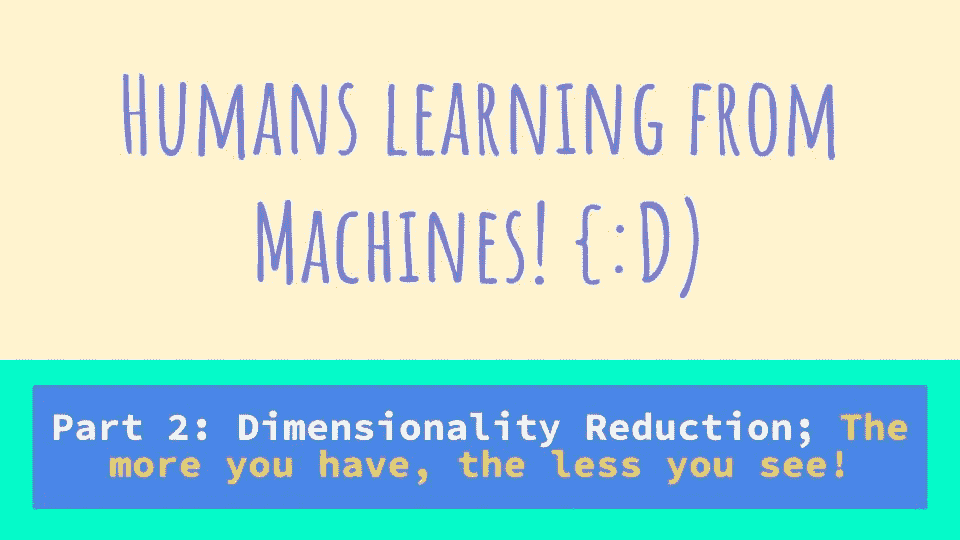
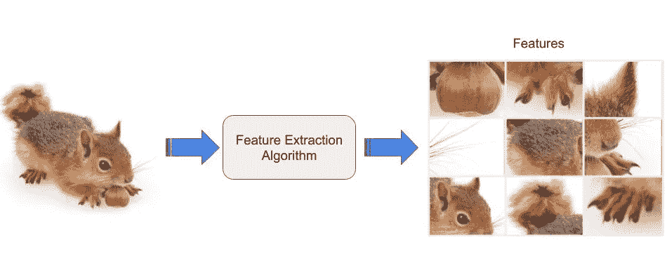
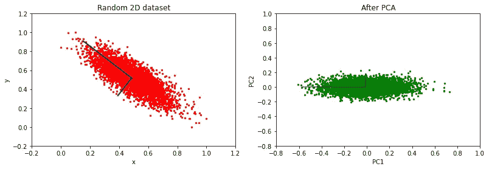

# 降维:拥有的越多，看到的越少！

> 原文：<https://towardsdatascience.com/dimensionality-reduction-the-more-you-have-the-less-you-see-ac9dbc546be6>

## 人类向机器学习:第二部分

## 人工智能和机器学习概念的哲学要点:降维

来源:作者图片

欢迎来到**人类向机器学习**的第二部分。在这个系列中，我们讨论人工智能中一些有趣概念的哲学相关性。[第一部:**维度的诅咒；越多不一定越好！**](/the-curse-of-dimensionality-more-is-not-always-better-585b5a49fce3?sk=e8912c8978784a8cf94a3762e8c6958b) ，我们探讨了更多数据如何在计算负担、空间体积、可视化和参数估计方面影响可学性。

在这一部分中，我们将讨论如何处理维数灾难，以及如何应用这些概念来改善我们的福祉。

# 1.4 处理维数灾难

当我们结束第一部分时，当我们被我们周围的无限数据淹没时，我们会改变我们的视角，从不同的角度看待事物，以区分噪音和相关信息。这本质上就是所谓的降维。

因此，降维是只保留数据的“有趣”特征并去除噪声内容的过程。这使我们能够保留相关信息，同时大大减少存储信息所需的空间。

现在，让我们看看如何实现这一点。

# 2.降维

降维可以通过几种方法实现。在本文中，我们将讨论一些有助于使用较少的要素来表示数据的方法。有基于上下文的和[无监督的](https://en.wikipedia.org/wiki/Unsupervised_learning)降维。

## 2.1 特征提取

来源:松鼠图片由 [Onder Ornel](https://unsplash.com/photos/CgSbUJYN6Xo) 拍摄，作者修改

这是处理维数灾难最常见的方法之一。在这个过程中，我们试图从现有的特征中提炼出新的特征，这些新的特征可以代表具有更低维度和**更高“区分度”**能力的数据。这是一种基于上下文的方法，其中来自数据的领域知识和智能模式识别起着重要作用。

根据用例，我们可以减少要智能使用的数据。

例如，当你明天有一场考试，必须在 6 个小时内完成 40 章，因为你几天前才正式“开始”学习，但进入动力阶段需要看 7 部电影，打扫公寓，用荒谬的明确命令整理衣柜，看 YouTube 上关于人们用竹子和粘土建造游泳池的视频，并梦想着你准备充分的场景，最后问上帝为什么我又把一切都拖到最后一分钟？！！！:P

来源:作者图片

目标慢慢的从在学科上打好基础变成了莫名其妙的通过考试！最低限度是我们现在正在寻找的！现在你的选择是

1.  6 小时端到端学习 40 章，这是最难的选择；我们会希望自己像[谢尔顿·库珀](https://bigbangtheory.fandom.com/wiki/Sheldon_Cooper)或[迈克·罗斯](https://suits.fandom.com/wiki/Mike_Ross)一样拥有过目不忘的记忆力，并认识到这是不可能的，然后放手
2.  在网上找一些有 40 章概要的东西，它将给出一个概述。互联网将再次呈现无限资源，需要一段时间来清理路径，开始学习。
3.  去找那位神级的朋友，他会做最后一分钟的讲座，只包含最重要的部分，并提供关于其他部分的基本背景，这样你至少可以尝试从那部分提问，并得到部分分数。

当然，选项 3 听起来最合适..！！！让我们抽出一点时间来感谢所有在最后一刻演讲并救了我们一命的朋友们。他们是真正的无名英雄！:D

因此，您会注意到，最初的数据是 40 个章节，需要进行端到端的处理，然后缩减为一个摘要，只关注一些相关的部分。在这里，有一个已经处理过数据的乐于助人的朋友为我们减少了数据。

与这一现实场景类似，我们也可以应用逻辑来实现这一缩减。例如，在面部识别中，我们输入一个人的图像作为输入，并使用模型将整个图像简化为仅存储相关信息，如眼睛、鼻子等的位置。，这大大减少了要存储和比较的信息。

因此，使用直观或逻辑过程，特征提取集中于对手边的问题最重要的几个特征。

类似地，当我们被想法淹没时，我们可以通过专注于我们能控制的事情并忽略我们不能控制的事情来进行特征提取，80%的噪音立即被清除。

> 拥抱不确定性，专注于我们能控制的事情，是在不被压垮的情况下完成事情的方法。

现在让我们来看看最流行的降维方法之一，称为主成分分析(PCA)。

## 2.2 主成分分析:视角改变的力量

在之前的特征提取中，我们看到了如何过滤特征并组合多个特征来降低维数。如果我们获得的数据是全新的，并且我们没有太多上下文来进行智能特征提取，该怎么办？下面是解决这个问题的数学方法，称为 PCA。

PCA 从数据中确定主要的变化模式。该算法将坐标系与数据的形状相匹配，然后将数据投影到这个“自然”坐标系中。[协方差](https://en.wikipedia.org/wiki/Covariance)和[方差](https://en.wikipedia.org/wiki/Variance)的概念用于理解每个属性的重要性及其与其他属性的关系。

因此，在 PCA 中，我们消除了不太“有趣”的特征，即具有低方差的特征，然后仅使用“有趣”的特征，即具有高方差的特征来表示数据。新的特征将被表现出来，这样它们就彼此独立了。因此，命名为“主要组件”。下图显示了 PCA 的示例。

来源:作者图像

图中左图为二维随机数据，右图为二维随机数据的 PCA 空间投影。请注意，相同的数据在这里用正交轴表示。黑线表示存在最大差异的轴。请注意，在 PCA 后的图像中，我们可以看到 PC1 轴的值在-0.6 和 0.8 之间变化，而 PC2 轴的值在-0.2 和 0.2 之间变化。因此，我们可以看到，PC1 维度的方差非常高，PC2 维度的方差较低。因此，对于某些问题，我们可以决定只使用 PC1 维度。

PCA 的技术解释有点数学化，超出了本文的范围。根据上一篇文章的反馈，我将减轻技术负担，保持轻松阅读。伙计们，让我们放松并阅读！:D

如果你有足够的动力去钻研主成分分析的一些数学知识，你可以阅读这篇由 [Matt Brems](https://matthew-brems.medium.com/) 撰写的解释清晰的[文章](/a-one-stop-shop-for-principal-component-analysis-5582fb7e0a9c)。

因此，当呈现无限维的数据时，会有很多比信息更混乱的信息。当你过于专注于某件事太久，它总是模糊的。

所以最好的选择是休息一下，放松一下，换个角度看问题。当你冷静下来，没有偏见的假设时，你可以看到相关的信息。

> 所以，让我们试着找出我们生活中的“主要”组成部分，试着把我们的时间和精力花在那里，而不要迷失在这个充满维度的世界里！:P

非常感谢您花费宝贵的时间。在下一集《人类向机器学习》中，我们将探索学习的基本类型，以及我们如何在不同的情况下运用它们来实现最佳成长。请继续关注人类向机器学习:第三部分，

# 监督和非监督学习；生命的阴阳！

10 月上映！(还是那句话，慢作家。为延迟道歉:P)

请在 [LinkedIn](https://www.linkedin.com/in/sreekiranar/) 或通过[电子邮件](http://sreekiranar@gmail.com/)告诉我您的宝贵建议和反馈。

鸣谢:降维的技术方面我是从伯明翰大学计算机科学学院的[彼得·蒂诺](https://www.cs.bham.ac.uk/~pxt/)博士、[伊恩·斯泰尔斯](https://www.cs.bham.ac.uk/~ibs/)博士和[卡希夫·拉吉普特](https://www.birmingham.ac.uk/staff/profiles/dubai/rajpoot-kashif.aspx)博士的讲座中学到的。花一点时间来表达我对他们无价服务的感激之情！:D

一如既往，

# 快乐学习:D