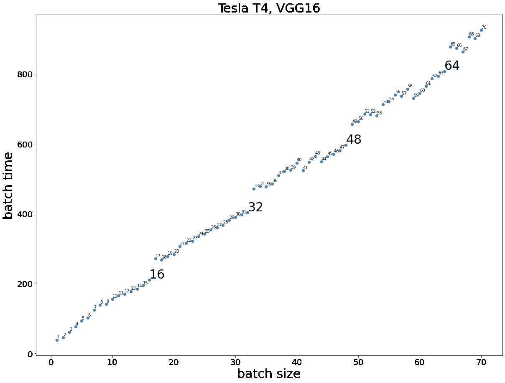
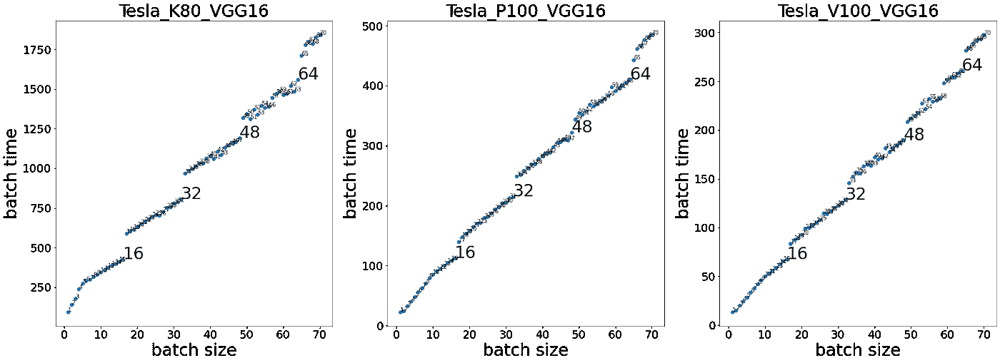
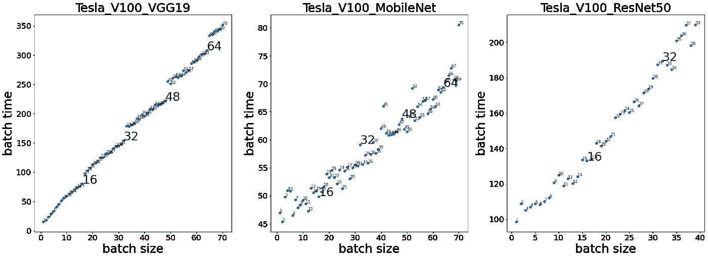

# 随着批量增加，CNN 训练时间不连续

> 原文：<https://towardsdatascience.com/discontinuity-in-cnn-training-time-with-increase-batch-size-bd2849129283>

致谢:&[【禺期】李](https://www.linkedin.com/in/yuqiliofficial/) @ [艾帕卡公司](https://www.linkedin.com/company/aipaca)

照片由[艾米丽·莫特](https://unsplash.com/@emilymorter?utm_source=medium&utm_medium=referral)在 [Unsplash](https://unsplash.com?utm_source=medium&utm_medium=referral) 上拍摄

# 背景

随着新的机器学习模型的规模越来越大，模型训练时间分析是当今的重要课题之一。除了像 GPTs 这样的超级巨型模型，计算机视觉模型对于像数据科学家和研究人员这样的普通最终用户来说训练起来很慢。根据任务和数据，计算机视觉模型的训练时间可能从几个小时到几周不等。

在本文中，我们讨论了我们对模型训练时间的研究中的一个有趣的发现。为了明确我们所说的训练时间的含义，我们想知道一个 GPU 配置为一批数据训练一个模型需要多长时间。显然，它取决于许多变量，如模型结构、优化器、批量大小等。然而，给定关于配置和模型设置的足够知识，并且如果一批的训练时间是已知的，我们能够计算一个时期的训练时间，因此也能够计算给定时期数目的总训练时间。

当我们获得 CNN 模型的训练时间数据时，我们固定了模型结构、输入和输出大小、优化器和损失函数，但是没有固定批量大小。换句话说，我们想知道在其他条件不变的情况下，增加批量是如何影响训练时间的。

在我们这样做之前，我们确定的是批量大小和批量训练时间之间存在正相关。我们不确定的是，这是线性关系还是非线性关系？如果是线性的，斜率是多少？如果是非线性的，是二次还是三次关系？带着这些问题，我们做了实验，观察到了一些我们没有想到的东西。

# 实验

我们在特斯拉 T4 云实例上运行 TensorFlow [VGG16](https://www.tensorflow.org/api_docs/python/tf/keras/applications/vgg16/VGG16) ，使用默认输入形状(224，224，3)、优化器和损失函数的 CategoricalCrossentropy。我们将批量从 1 增加到 70。实验结果如下所示，x 轴是批量大小，y 轴显示相应的批量训练时间。有趣的是，我们的预期是部分正确的，我们确实观察到批量大小和批量训练时间之间的正线性关系。然而，在批量大小等于 16、32、48 和 64 时，我们观察到批量训练时间的“跳跃”。

作者制作的图像

这是特斯拉 T4 上 VGG16 的批量大小对批量时间的图，我们观察到关系的总体斜率几乎没有变化，这意味着很可能证实了线性关系。然而，在特定的批量，特别是 16、32、48 和 64，线性关系破裂，并且在这些位置发生不连续。

我们可以肯定地说，值 16、32、48 和 64 不会随机出现，它们是 16 的倍数，恰好与 GPU 的 PCIe 链接最大宽度 16x 的值相同。PCIe 是 PCI Express 的缩写，引自 wiki“PCI Express 电气接口是通过同时通道的数量来衡量的。(通道是数据的单个发送/接收行。这个比喻就是一条双向交通的高速公路。)".简而言之，PCIe 越宽，同时传输的数据流量就越多。

我们对培训过程的假设如下。在 VGG16 的训练周期中，对于每个批量训练步骤，批量中的每个数据点被分配使用一个 PCIe 通道，如果批量小于或等于 16，则不需要额外的轮次，来自每个 PCIe 通道的结果被组合，因此我们具有线性关系。当批大小大于 16 但小于 32 时，需要另一轮来计算整个批，这由于新一轮的分配而导致训练时间的“跳跃”(我们假设新一轮需要一些额外的时间来导致曲线的移动或“跳跃”)。

# 不同 GPU 上的轨迹

为了验证我们对上述实验的观察，我们进行了相同的实验，但在不同的 GPU 设置上，下图显示了特斯拉 K80、特斯拉 P100 和特斯拉 V100 的结果。

从图中我们可以看出，第一，V100 的速度> P100 > T4 > K80，因为对于相同的批量，V100 的批量时间< P100 < T4 < K80。其次，他们在 16 岁、32 岁、48 岁和 64 岁都有“跳跃”。对于所有四个 GPU，它们都具有 16 倍的 PCIe 链接最大宽度。(我们想要比较 PCIe 链接最大宽度不是 16 倍的 GPU 的结果，但是，我们在谷歌上可以找到的所有 GPU 云实例都是 PCIe 链接最大宽度 16 倍的)。

# 不同模型结构的试验

为了测试我们在不同模型上的发现，我们在 V100 上对 VGG19 MobileNet 和 ResNet50 运行了相同的实验。

结果很有趣。对于 VGG19，我们仍然可以找到与 VGG16 完全相同的模式，但是预期的训练时间稍长。然而，对于 MobileNet 和 ResNet50，我们不再观察到这种模式。事实上，与 VGGs 相比，MobileNet 和 ResNet50 的训练时间波动更大。

对于这种现象，我们还没有一个好的解释。我们现在可以说的是，对于类似于 VGGs 的常规 CNN 结构，这种“跳跃”行为是成立的。对于其他不同的 CNN 结构，我们不再观察。进一步的调查和研究正在进行中。

作者制作的图像

# 结束语

*这项研究来自一个名为* [*培训成本计算器*](https://github.com/aipaca-mlops/ML-training-cost-calculator) *(TCC)的开源研究项目。项目目标是通过产生一个巨大的 ML 实验数据库来理解影响机器学习训练时间(TT)的因素。基于数据库，TCC 能够预测不同云服务器上培训作业的 TT，从而为您的特定 ML 模型匹配最佳服务器。如果你对这个领域感兴趣，请加入我们成为贡献者。*

在这篇文章中，我们展示了类似 VGG 的 CNN 模型的“跳跃”现象。我们的解释是 PCIe 车道分配导致了这一点。

但我们目前的解释仍然存在问题:为什么我们没有从我们的解释中看到双倍的训练时间，因为如果批量大小为 32，GPU 需要进行两轮相同的计算。以及为什么这种情况只发生在 VGG16 和 VGG19 上，而没有发生在 MobileNet 和 ResNets 上。这些问题需要进一步的调查和研究。

[代码](https://github.com/aipaca-mlops/ML-training-cost-calculator/blob/create_readme_xin/experiments/ClassicModels.ipyn)复制实验