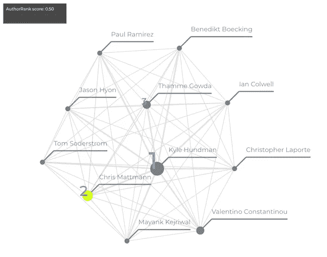
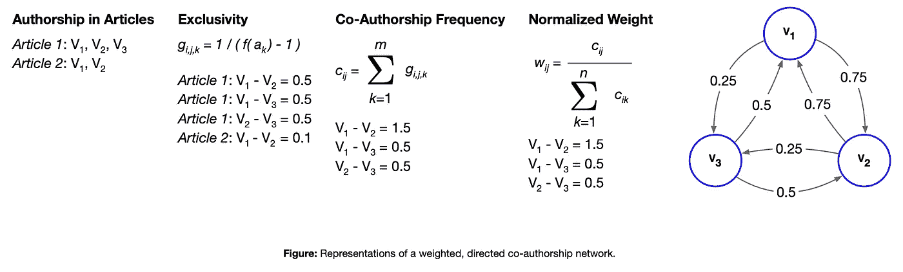
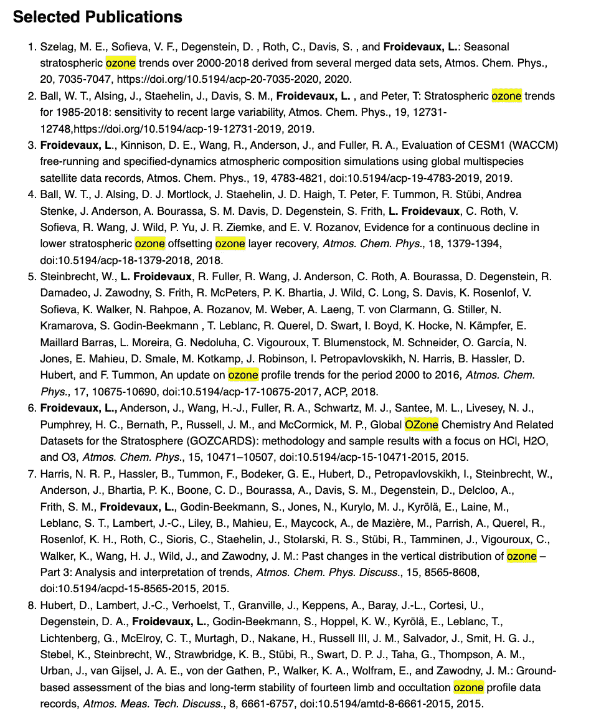

# 通过合著网络发现研究合作

> 原文：<https://towardsdatascience.com/discovering-research-collaborations-through-co-authorship-networks-fd4930682bae>

## 数据可以告诉你很多，前提是你知道去哪里找，怎么找。

AuthorRank 可以帮助发现和解释跨学术文本、跨大型语料库或过滤结果(如搜索结果)的协作。了解 AuthorRank——在开源 Python 实现中可用[此处](https://github.com/adidier17/AuthorRank)——如何帮助量化学术合作的强度，并发现沟通研究团队的关键人物。



为说明目的而创建的合作作者网络示例。位于协作网络更中心的作者获得更高的权重，由他们的节点的大小来指示。在这种视觉效果中，作者之间线条的粗细表明了基于合作关系的个人关系强度。来源: [AuthorRank Python 包](https://github.com/adidier17/AuthorRank)(由瓦伦蒂诺·康斯坦蒂努创建，发布在链接库中)。

# 来自协作网络的见解

数据可以告诉你很多，前提是你知道去哪里找，怎么找。

当利用适当的数据处理和自然语言处理(NLP)技术时，文本数据(自然语言)的语料库可以提供丰富的信息:数据中包含的主题及其随时间的分布，特定位置或个人被提及的频率，甚至语言结构如何随时间变化。总的来说，这些技术有助于提供有价值的见解，可以用来理解以前的工作或为未来的决策提供信息。

当想要理解大量的研究工作(学术论文)时，更好地理解论文作者是如何合作的会很有帮助。合作是科学和研究工作的核心，有效的跨学科合作往往能够产生变革性的成就。此外，了解哪些作者在一部作品中最有影响力可能有助于确定主题专业知识。

在本文中，我们探索并应用了刘等人提出的作者排名方法。艾尔。到一系列学术论文，特别是公开的出版物，其作者利用来自[微波肢体探测器(MLS)](https://mls.jpl.nasa.gov/) 实验的数据，这是一个由加州帕萨迪纳[喷气推进实验室](https://www.jpl.nasa.gov/)管理的[美国宇航局](https://www.nasa.gov)地球科学项目。这些学术论文都以某种方式与来自 MLS 实验的数据相关，但都集中在各种不同的研究领域。

以下摘自 AuthorRank [Github 知识库](https://github.com/adidier17/AuthorRank)的摘录深入探讨了 AuthorRank 的工作方式:

AuthorRank 方法是对 PageRank 的一种改进，page rank 是谷歌对网页搜索结果进行排名的原始算法。PageRank 的工作原理是转移状态。页面的排名是其反向链接排名的总和——如果一个网页有许多反向链接或几个排名高的反向链接，其排名也高。该算法适用于有向图，其中节点是网页，有向边表示从一个页面到另一个页面的链接。假设每个节点将其等级均匀地转移到它所连接的所有其他节点。



AuthorRank 创建了一个合作作者网络，代表科学合作的结构和单个研究人员的状态，而不是网页。在网络中，每个节点代表一个作者，每个边代表一个协作。边是双向的，表示协作的对称性质。与假定每个节点平等地转移状态的 PageRank 不同，当考虑协作中的状态时，应该给予经常一起合著的作者更高的状态，并且随着论文中作者数量的增加，应该降低状态。因此，根据下图所示的合著频率和文章的合著者总数，对边进行加权。

让我们看看哪些作者影响最大。

# 关于数据的一点点

从 1991 年首次发射高层大气研究卫星(UARS)开始，到 2004 年发射地球观测系统(EOS) Aura 任务，MLS 实验测量地球大气层边缘自然发生的微波热辐射，遥感特定大气气体、温度、压力和云冰的垂直剖面。

MLS 实验有助于理解地球大气层如何随时间演变。大气科学研究人员，更一般地说，地球科学研究人员经常利用 MLS 数据来更好地了解我们星球对来自太阳的致命紫外线辐射的唯一保护。

如果你感兴趣，可以从美国国家航空航天局的地球数据门户网站下载 MLS 的数据。

我们今天要检查的数据是 PDF 文档的语料库，特别是引用 MLS 数据的[出版物](https://mls.jpl.nasa.gov/publications)(就像上面的例子)。PDF 文档已被下载，并由名为 PDFMiner 的软件预处理成机器可读的文本，元数据如作者列表和出版日期由 CrossRef API 提供(使用论文的数字对象标识符或 DOI 进行查询)。我们在这里只使用作者列表和文本数据，但是数据集——在这里[可用](https://github.com/adidier17/AuthorRank/blob/main/data/microwave_limb_sounder.json)及其所有特性——也可以以其他方式使用。

# 使用 AuthorRank Python 包

AuthorRank 算法是用 Python 3 实现的[，带有一个同名的 Python 包。这个易于使用且灵活的 Python 包是我们将用于将 AuthorRank 方法应用于我们的文档语料库(利用 MLS 数据的学术论文)的工具。](https://github.com/adidier17/AuthorRank)

在开始之前，建立一个虚拟环境是个好主意。如果你对虚拟环境不熟悉，看一下 Python 语言文档的这一部分[以了解更多关于如何和为什么使用它们的信息。](https://docs.python.org/3/tutorial/venv.html)

AuthorRank Python 包可以从 Python 包索引 PyPI:

```
pip install author-rank
```

检查以确保 AuthorRank 已安装非常简单:

```
# import AuthorRank
import author_rank as ar# check version 
print(ar.__version__)
```

# 发现研究小组和关键链接

让我们深入研究这些数据。我们将从使用 Python 的`json`模块加载数据开始:

```
import json# read in the MLS data
with open("microwave_limb_sounder.json", 'r') as f:
    # read in docs that have authors
    docs = [json.loads(d) for d in f.readlines()]
    docs = [d["_source"] for d in docs if "author" in     d["_source"].keys()]
```

上面的代码首先导入`json`模块，然后读入 JSON 文件的每一行(每一行代表一个文档)。然后，每份文件都被用`json.loads()`转换成一本字典。最后，只保留列出了作者的文档进行分析。

总体分析数据肯定是有逻辑的，尤其是对于较小的数据集，比如文档数为数百甚至数千的数据集。但是，我们可能有兴趣了解哪些研究人员在特定的研究领域最有影响力。

MLS 数据通常用于了解臭氧气体和臭氧层。让我们筛选包含“臭氧”一词的论文数据:

```
# subsetting to documents with a substring in the textozone_docs = [d for d in docs if "ozone" in d["text"]]
```

这种过滤产生 950 个文档。

要将 AuthorRank 应用于这组文档，首先创建一个 AuthorRank graph 对象:

```
# create an AuthorRank object
ar_graph = ar.Graph()
```

AuthorRank Python 包在幕后利用了 [NetworkX](https://networkx.org/) ，这意味着您可以将该包的工具应用于最终的合著关系图。但首先，将 AuthorRank 算法应用于与臭氧相关的文档:

```
# fit to the data
ar_graph.fit(    
    documents=ozone_docs,    
    progress_bar=False, # helpful
    authorship_key="author",    
    keys=set(["given", "family"])
)
```

注意`authorship_key`和`keys`参数，它们告诉 Python 包*在哪里*寻找作者信息以及*如何*解释它。`authorship_key`参数告诉 Python 包哪个键包含唯一标识的作者信息。另一方面,`keys`参数告诉 Python 包哪些键——当一起使用时——可以用作作者的惟一标识符，在本例中是名和姓。

最后，让我们检索顶级作者列表，并在结果列表中调整分数:

```
# get the top authors for a set of documents
top = ar_graph.top_authors(    
    normalize_scores=True, # scales top-n to [0,1]
    n=5
)# print the results
for i, j in zip(top[0], top[1]):    
    print(i, j)>>>
('L.', 'Froidevaux') 1.0
('J. W.', 'Waters') 0.3836040020890074
('M. L.', 'Santee') 0.27529129022124343
('G. L.', 'Manney') 0.24224671041380447
('W. G.', 'Read') 0.0
```

长度根据 AuthorRank 的说法，Froidevaux 是利用 MLS 数据进行臭氧研究的最有影响力的作者之一。快速浏览一下这位科学家的研究兴趣和选定的出版物,就可以看出 Froidevaux 博士对平流层臭氧趋势和臭氧层的浓厚兴趣。



Froidevaux 博士的[精选出版物](https://science.jpl.nasa.gov/people/froidevaux/)说明了他对臭氧层和臭氧气体研究的关注。

有许多技术可以帮助更好地理解文本语料库，从命名实体识别(NER)到使用变压器模型的文本摘要(深度学习)。这些技术，尤其是总体而言，可以让数据科学家和企业了解之前锁定在数据中且未被发现的见解。

在这里，我们探索了使用 AuthorRank——一种基于谷歌 PageRank 的图表技术——来更好地了解作者在特定研究领域的影响(利用 MLS 数据的臭氧相关论文)。我们将 AuthorRank 应用于 MLS 数据的子集，并看到 AuthorRank 表明 l . Froidevaux——后来研究臭氧的科学家——是该研究领域最有影响力的作者之一。AuthorRank 和[它的 Python 实现](https://github.com/adidier17/AuthorRank)可以很容易地应用于其他文本语料库和数据集。

# 更多数据科学文章

喜欢这篇文章吗？请查看下面的其他数据科学文章。

*   [用局部异常值概率识别异常值](/identifying-outliers-with-local-outlier-probabilities-2b5781e86e01)
*   [使用美国各州直观查看欠拟合和过拟合](/a-visual-look-at-under-and-overfitting-using-u-s-states-7fd0d8ade053)