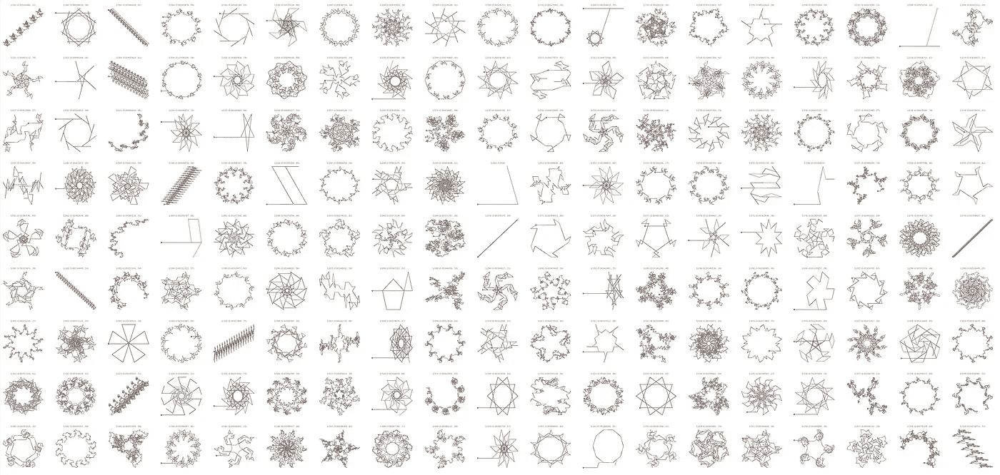
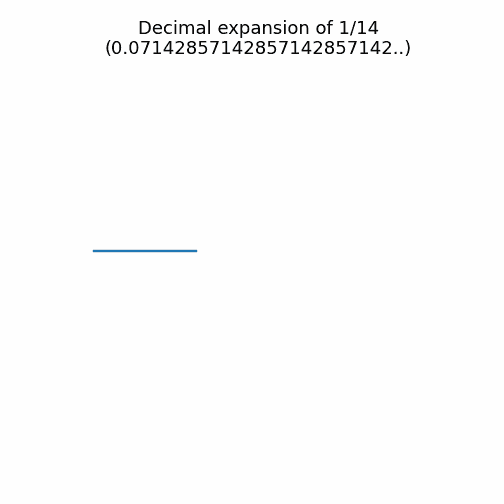
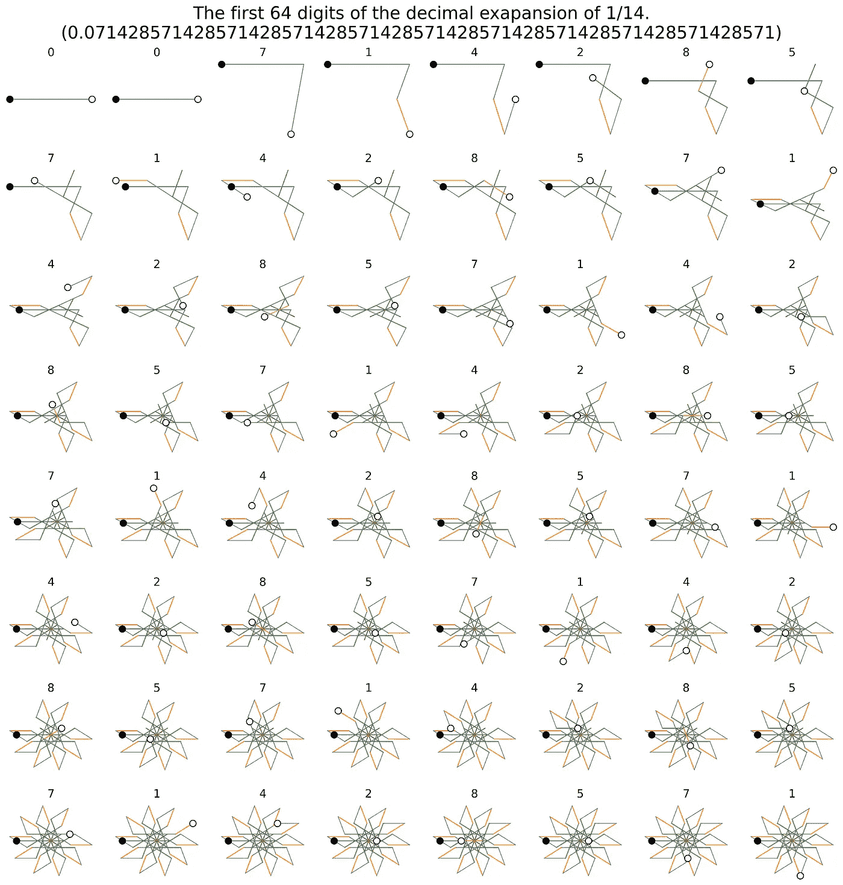
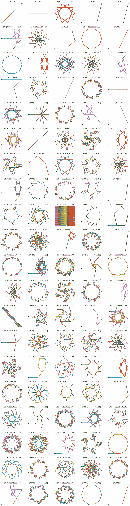
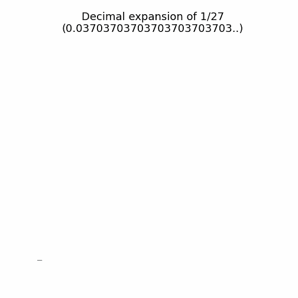
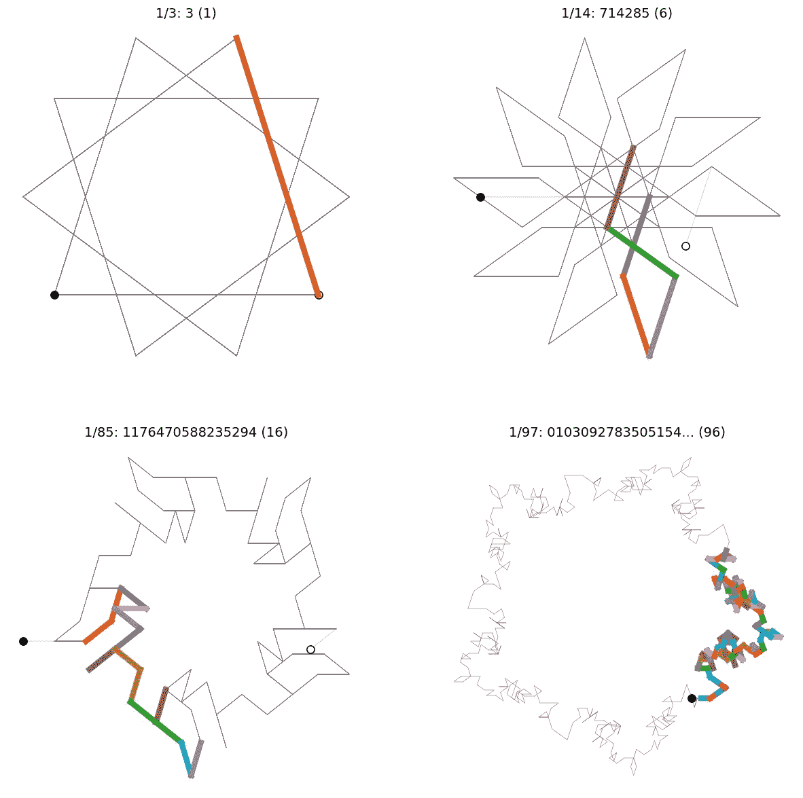
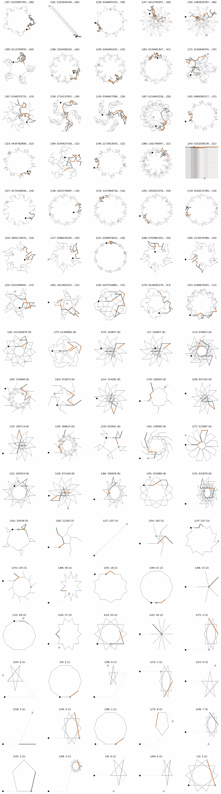

# 发现分数的形状

> 原文：<https://towardsdatascience.com/discovering-the-shape-of-fractions-e9034ab0085c>

## 1/n 形式分数的十进制展开的可视化数据驱动探索



作者收集了 1/n .图像形式的部分可视化。

> 数学家的图案，就像画家或诗人的一样，必须是美丽的…
> 
> G.哈代

上周，我又看了一个很棒的[数字迷](https://www.numberphile.com/)视频。在视频中，[布雷迪](https://www.bradyharanblog.com/about/)与[马特·汉德森](https://twitter.com/matthen2)谈论了更多他对数字的迷人想象。在这一集[中](https://www.numberphile.com/videos/plotting-pi-and-searching-for-mona-lisa) Matt 讲述了我们如何使用[海龟图形](https://docs.python.org/3/library/turtle.html)和一个非常酷的笔式绘图仪来可视化无理数[的无限位数，例如*π*或*φ*(黄金比例)。](https://en.wikipedia.org/wiki/Irrational_number)

这让我想到了我女儿最近在做的一些关于分数及其小数展开式的数学，以及 Matt 的一些想法是否会帮助她更好地理解正在发生的事情？至少，我希望一个更直观的关于数字的对话能够激发对支撑数学的美丽模式的更深刻的欣赏…嘿，*爸爸可以做梦…*

无论如何，在这篇文章中，我将描述我是如何应用 Matt 的一些想法来开始我自己对数字视觉景观的探索的。我决定把重点放在形式为 *1/n* 的简单分数上，这里我将查看从 1 到 100 的 *n* 的值。我的目的是描述我所使用的方法，并展示由此产生的观想，以及它们最有趣的一些方面，但在大多数情况下，我会让观想自己说话。

Matt 使用可视化方法非常简单，我在本文的最后提供了一个基本 Python 实现的代码片段。方法大概是这样的:

*   想象一下，我们正在控制一个小型机器人(海龟图形中的“海龟”)，它能够在移动时绘制出它所遵循的路径。
*   为了简单起见，这个机器人总是向前移动一个单位的距离，我们想要可视化的数字决定了它移动的方向。
*   因为有 10 个可能的数字(0，1，2，…，9)，所以有 10 个可能的方向，数字 *d* 转换成角度 *d*360/10 度。*因此*，*数字 1 将使机器人从当前航向旋转 36 度，数字 2 将产生 72 度的旋转，依此类推。
*   以这种方式，任何数字都可以通过遵循编码在其数字中的方向指令来可视化。这些数字也可以用来给路径上产生的每个线段分配一种颜色；10 个数字有 10 种可能的颜色。

下面的动画展示了我们如何使用这种方法来可视化分数 1/14 的十进制展开的前 64 位(. 0714285…)。1/14 的十进制扩展是无限的——它被称为*重复分数*或*重复十进制*——数字 714285 永远重复，但正如我们将看到的，不是任何分数都是重复的。每个连续的数字对应一个新的彩色编码线段。在这种情况下，前两个数字(00)导致两个水平(蓝色)线段，因为；转向角度为 0。接下来是数字 7 的 252 度急转弯(7 x 36 = 252 ),然后是数字 1 的 36 度小转弯，以此类推。



为 1/14 的十进制扩展中的前 64 位数字生成的可视化动画；每个数字定义了旋转角度，并被分配了一个预定义的颜色。图片作者。

为了便于读者更从容地分析，下面的序列显示了该动画的各个帧。在每一帧中，起点由填充标记指示，终点由未填充标记指示。每一帧都标有相应的数字。



1/14 的十进制扩展的前 64 位的动画帧。起点由填充标记指示，终点由未填充标记指示。根据十进制扩展中相应的数字对线段进行颜色编码。图片作者。

现在我们已经掌握了可视化过程，让我们来看看将它应用于一些熟悉的分数的结果。

下面是形式为 *1/n* 的所有分数的网格，其中 *n* 的值从 1 到 100。每个图显示了十进制扩展的前 1000 位数字，如果它们存在的话；简单的*不重复的*分数，如 *1/2* 、 *1/4* 等。不要有无限的十进制扩展，所以只贡献少数数字给观想。如上所述，线段被着色以反映数字和相应的转角，所以每个可视化的形状和颜色告诉我们十进制扩展的数字。



为 1/n 形式的分数的十进制展开的前 1000 个数字产生的可视化，其中 n 的值从 1 到 100。每一个可视化都标有分数及其部分小数展开。图片作者。

当我第一次看到这些图像时，我被它们的视觉趣味和震撼力所打动。我没想到像 1/7 这样简单的分数会产生如此对称的“螺旋桨”,看看 1/83 或 1/98 的视觉化的复杂本质，它们看起来就像精致的花卉花环。



可视化 1/27 的十进制扩展的前 100 位。图片作者。

作为一个题外话，值得强调的是，所有这些可视化都被缩放以最大化易读性——通过确保它们填充可用的框架——但这模糊了 1/27 可视化的结构，从表面上看，它看起来像一条简单的直线，表示不重复的分数。事实上，这个分数有一个更复杂的阶梯状可视化，如上图所示，当我们放大它的十进制展开的前 100 位时。

显而易见，复杂的结构和旋转对称在许多可视化中是显而易见的，这是由于它们的十进制扩展的周期性而产生的。它们重复出现的数字共同创造了视觉化的重复结构。在数学语言中，这些无限重复的数字序列被称为 [*重复*或*重复*](https://en.wikipedia.org/wiki/Repeating_decimal) ，重复的长度被称为其*周期*。



四次可视化，以突出每个分数的重复数字序列的第一次出现。每一个可视化都用它的分数、它的十进制扩展的一部分和它的重复序列的长度(重复周期)标记在括号中。图片作者。

上面的四个可视化显示了分数 1/3、1/14、1/85 和 1/97 的十进制展开中的前 1000 个数字，以某种方式突出显示了与每个分数的重复数字的第一次出现相对应的可视化部分。

选择这些部分是因为它们具有不同的重复周期。1/3 的重复是单个数字“3”(句点 1)，这意味着它的可视化由与当前航向成 108 度角的单个线段(红色)的重复组成，如图所示。

分数 1/14 有一个 6 位数的 reptend ('714285 ')，它转化为一个单独的'*叶片*'，形成 10 叶片，螺旋桨式可视化。请注意，对于 1/14 的 6 位数 reptend，只有 5 条线段可见。这是因为它的最后一个数字“5”导致视觉化返回自身(180 度旋转)来模糊“8”的前一个线段。

时间越长，事情越复杂。1/85 的 16 位数重复对应于它的五边形视觉化的一边，而 1/97 的 96 位数重复创造了它的 5 个角块之一。

从可视化的角度来看，重复序列的长度是复杂性的一个有用的度量，因为具有较长重复序列的片段往往比那些具有较短重复序列的片段产生更丰富的可视化。为了了解这一点，下面的图表按照其长度的降序重新排列。此外，他们突出了对应于重复第一次出现的观想部分。这有助于阐明每一个观想是如何由一系列重复的组成部分组成的。



n 值从 1 到 100 的重复(重复周期> 1)分数 1/n 的十进制展开的前 1000 位的可视化。每个可视化的起点由填充的标记指示，终点由未填充的标记指示。每个可视化突出显示其第一个重复序列，每个可视化的标题显示分数本身，直到其重复数字的前 10 位，以及其重复数字序列的长度(其重复周期)。如前所述，基于相应的重复数字对每个线段进行颜色编码。图片作者。

通常，reptend 有助于视觉化的作品是直观的。例如，在像 *1/7* 和 *1/14* 这样的片段中，它对应于主'*叶片*中的一个，类似地，对于 *1/19* 这样的片段，它对应于观想的单个'*臂*。然而，对于像 *1/94* 、 *1/71* 和 *1/62* 这样的片段来说，重复结构远没有那么明显，实际上是以一种复杂得多的方式通过可视化编织而成的。

还要注意*素数分数* ( *素数的倒数* ) — *1/p 其中 p 是素数*—*p>5*与非素数分数相比，具有更长的表示和更大的可视化复杂度。我确信这是数论者众所周知的——例如，*对于除了 2 和 5 之外的任何素数 p，1/p 的十进制展开以一个周期重复划分 p-1*——但有趣的是看到它也反映在可视化中，值得进一步研究。

这篇文章的目的是*开始*对形式为 *1/n* 的简单分数的可视化探索，使用它们的十进制展开作为一组方向指令来指导可视化过程。我发现，就其揭示的结构的丰富性和规律性而言，结果既引人注目又引人入胜。

我已经集中在观想和重复十进制展开的本质之间的关系上。具有更长重复序列的分数与更复杂的可视化相关联，但是到目前为止我只触及了表面，还有许多值得进一步研究的内容:

*   为什么大部分的可视化显示出 *5 重*或者 *10 重*旋转对称？想必和我用过 base 10 有关？对于较大的 *n* 值或 *1/n* 的倍数，这种情况会持续吗？在其他数基中，观想是如何变化的？对称性可以从十进制展开本身确定吗，也就是说，不产生观想？
*   显然，一些分数之间存在着密切的关系。例如，基于 3、6 和 7 的倍数的分数是相似的，当然还有 10 的倍数(1/n、1/10n、1/100n 等。)将产生几乎相同的可视化，除了由于小数点后任何额外的' *0* '而导致的平移。从这些关系中我们可以学到什么？它们如何影响观想？
*   当我们组合——加/减，乘/除——分数时会怎样？他们的观想会以可预测的方式改变吗？
*   有明显不同种类的观想，例如，星星、螺旋桨、五边形和十边形、楼梯等等。这是完整的集合吗？还是有简单分数的额外视觉化类别？

我最初的目标是帮助我的女儿对我们周围的数字中存在的模式有更高的鉴赏力…这是如何实现的呢？我们只能说这是一项正在进行的工作。但是从好的一面来看，至少可视化技术是成功的。在我们家，我们现在都有自己最喜欢的分数，当她试图发现可视化中的重复结构并将它们与十进制扩展的数字匹配时，看到她的兴趣得到了发展，这是令人欣慰的。

# 附录

下面的 Python 代码片段包含了给定数字的可视化代码。在这项工作中，我使用 [Matplotlib](https://www.google.com/url?sa=t&rct=j&q=&esrc=s&source=web&cd=&ved=2ahUKEwiZycTQjun1AhWvgVwKHfi3A2oQFnoECAoQAQ&url=https%3A%2F%2Fmatplotlib.org%2F&usg=AOvVaw0YgZr7XYZzco6IDaGIE2sw) 来产生可视化效果，并使用 [Mpmath](https://www.google.com/url?sa=t&rct=j&q=&esrc=s&source=web&cd=&ved=2ahUKEwiY3P3fjun1AhVHXsAKHUD_CoUQFnoECAYQAQ&url=https%3A%2F%2Fmpmath.org%2F&usg=AOvVaw1QTvCfZijcPLQ4k5vGoy-M) 来获得所需的浮点精度；Python 的默认精度不够。

```
def draw_number(ax, n):
    """Plot a simple graph for a number n.

    Args:
    ax: axis (Matplotlib) used for the visualisation.
    n: the number to visualise; a decimal expansion of a fraction.
    """ # Convert n into a string of digits; remove the decimal point.
    digits = str(n).replace('.', '')    coords = [(0, 0)]   # The origin/start coord.
    heading = 0         # An 'easterly' heading. # Iterate over each digit...
    for digit in digits: # Convert the digit into an int.
        n = int(digit) # Use n to pick a turn angle; assumes base 10.
        deg = n*360/10

        # Update the current heading with the new turn angle.
        heading+=deg # The current x, y coords.
        current_x, current_y = coords[-1]

        # Calculate the x and y offset based on the new heading.
        x_offset = math.cos(math.pi*heading/180)
        y_offset = math.sin(math.pi*heading/180)

        # The new x and y coords.
        new_x, new_y = current_x + x_offset, current_y + y_offset

        # Plot the new line from the current to the new xy
        ax.plot([current_x, new_x], [current_y, new_y]) # Add the new xy to the coord list.
        coords.append((new_x, new_y))

    # Mark the start and end points
    ax.plot(
      [coords[0][0]]*2, [coords[0][1]]*2, 
      marker='o', markersize=8, markeredgecolor='k', color='k'
    )
    ax.plot(
      [coords[-1][0]]*2, [coords[-1][1]]*2, 
      marker='o', markersize=8, markeredgecolor='k', color='w'
    ) # Return the coords than have been plotted.
    return coords
```