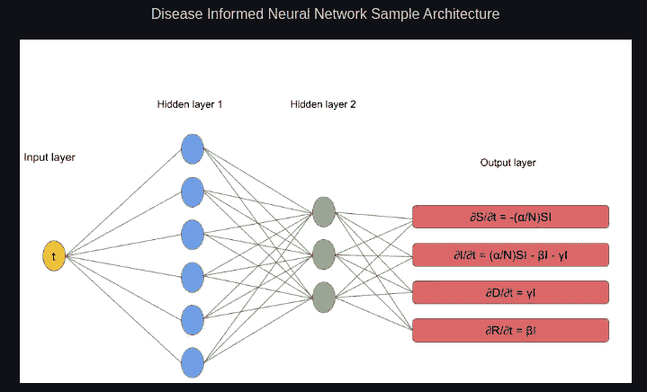
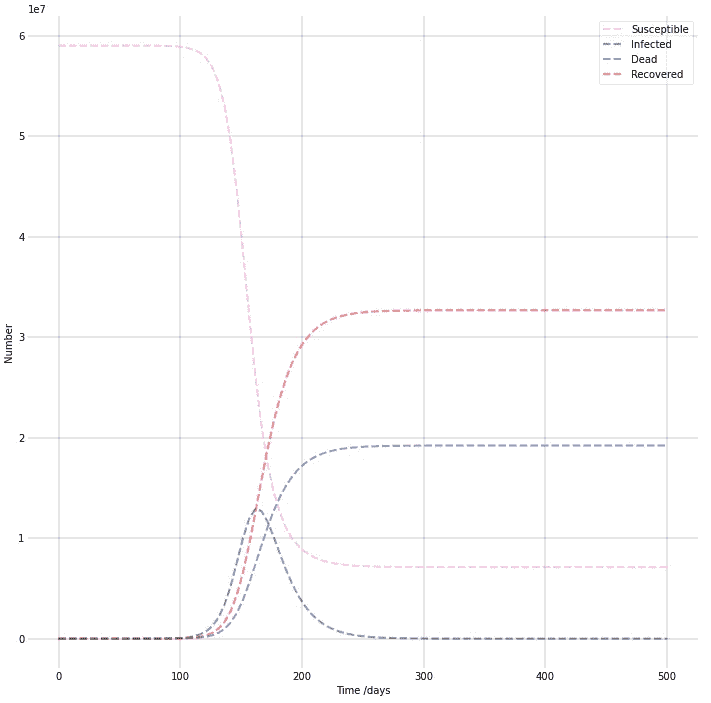
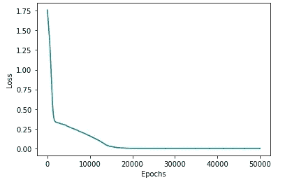
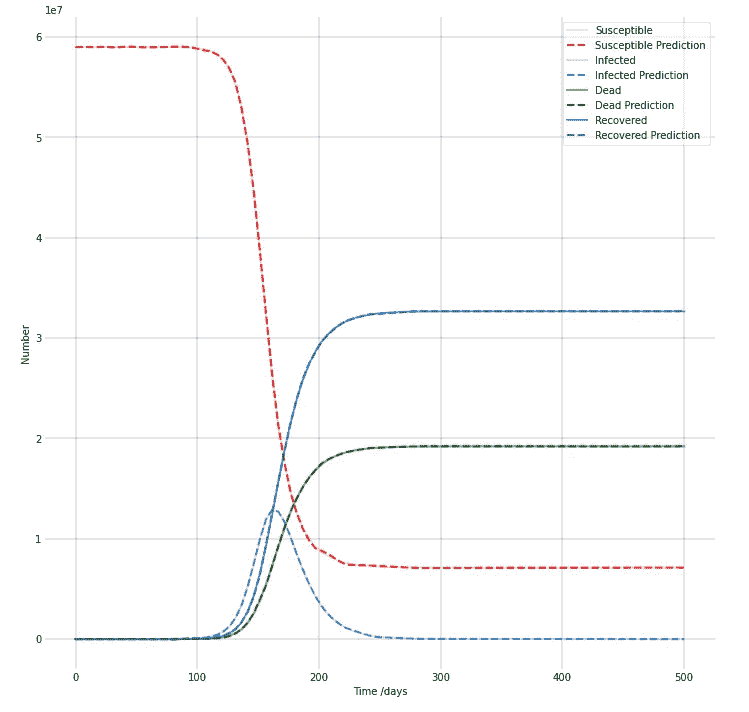

# 疾病通知神经网络

> 原文：<https://towardsdatascience.com/disease-informed-neural-networks-aa1f17f598a4>

# 疾病通知神经网络

## 神经网络能够学习疾病如何传播，预测其进展，并找到其独特的参数(如死亡率)。

在本教程中，我介绍了疾病通知神经网络(DINNs)。在[论文](https://arxiv.org/abs/2110.05445)中，我们使用 DINNs 来确定 11 种高传染性和致命性疾病的动态。这些系统的复杂性和参数数量各不相同。这些疾病包括 COVID，炭疽，艾滋病毒，寨卡，天花，结核病，肺炎，埃博拉病毒，登革热，脊髓灰质炎和麻疹。完整的代码&实验可以在[这里](https://github.com/Shaier/DINN)找到，具体的教程笔记本可以在[这里](https://github.com/Shaier/DINN/blob/master/tutorial.ipynb)找到。



DINN 示例架构。输入是不同的时间点(第 1 天、第 2 天、…、第 100 天)，输出是每个时间点每个疾病区室(易感、感染、死亡等)的值。图片作者。

疾病在它们影响的有机体、它们的症状和它们传播的速度方面有很大的不同。为了更好地理解疾病，就像大多数机器学习问题一样，我们需要数据。在本教程中，为了简化，我们将生成数据，而不是从真实世界环境中收集数据(尽管在本文中，我们确实使用了来自[这里](https://github.com/CSSEGISandData/COVID-19)的真实 COVID 数据)。

对于那些没有流行病学和微分方程背景的人来说，我会在这里保持简单。DINN 输入时间步长(第 1 天、第 2 天、…、第 100 天)，每天输出每个疾病区间中的人数。“车厢”只是对不同群体的一个花哨称呼。例如，我们有“受感染”组，它代表人口中有多少人被感染(它实际上是一个计数，比如 5 个人)。“易感”群体代表有多少人没有被感染，但可以被感染。诸如此类。这些区间/组是由数学家/其他人决定的，他们对疾病如何传播进行建模，并在数学上写成一组微分方程。

好了，这就是背景，让我们开始编码。

# 考虑下面的微分方程系统

dS/dt =-(α/N)S I

dI/dt =(α/N)S I-βI-γI

dD/dt =γI

dR/dt =βI

在哪里

beta =“有效/明显”每日回收率

gamma = "有效/明显"每日死亡率

α=感染率

N =人口规模

> 他的系统代表了一个 COVID 模型，有 4 个区间:易感(ds/dt)、感染(dI/dt)、死亡(dD/dt)和康复(dR/dt)。同样为了简化，这些车厢只是对每个车厢里有多少人的计数。

一旦有了方程式，生成数据就非常简单:

导入用于生成和可视化数据的库

```
**import** numpy **as** np
**from** scipy.integrate **import** odeint
**import** matplotlib.pyplot **as** plt
```

我们首先设定一些从文献中获得的信息

```
*# Initial conditions (from the literature)*
N **=** 59e6 *#population size*

S0 **=** N **-** 1 *#everyone starts out as susceptible, except for 1 person that is infected*
I0 **=** 1 *#1 infected person*
D0 **=** 0
R0 **=** 0

*# A grid of time points (in days)*
t **=** np**.**linspace(0, 500, 100) *#from day 0 to day 500, generate 100 points*

*#parameters (from the literature)*
alpha **=** 0.191
beta **=** 0.05
gamma **=** 0.0294
```

# 然后，我们用一个函数写出方程组，该函数将计算每个时间步长(例如一天)下每个区间的值

```
*# The SIDR model differential equations.*
**def** deriv(y, t, alpha, betta, gamma):
    S, I, D, R **=** y
    dSdt **=** **-** (alpha **/** N) ***** S ***** I
    dIdt **=** (alpha **/** N) ***** S ***** I **-** beta ***** I **-** gamma ***** I 
    dDdt **=** gamma ***** I
    dRdt **=** beta ***** I

    **return** dSdt, dIdt, dDdt, dRdt
```

# 然后，我们将初始条件传递给函数，以获得我们之前选择的长度(500 天，每个区间 100 个数据点)的每个区间的值

```
*# Initial conditions vector*
y0 **=** S0, I0, D0, R0
*# Integrate the SIR equations over the time grid, t.*
ret **=** odeint(deriv, y0, t, args**=**(alpha, beta, gamma))
S, I, D, R **=** ret**.**T
```

# 我们现在可以画出结果

```
*# Plot the data*
fig **=** plt**.**figure(figsize**=**(12,12))
ax **=** fig**.**add_subplot(111, facecolor**=**'#dddddd', axisbelow**=True**)
ax**.**set_facecolor('xkcd:white')

ax**.**plot(t, S, 'violet', alpha**=**0.5, lw**=**2, label**=**'Susceptible', linestyle**=**'dashed')
ax**.**plot(t, I, 'darkgreen', alpha**=**0.5, lw**=**2, label**=**'Infected', linestyle**=**'dashed')
ax**.**plot(t, D, 'blue', alpha**=**0.5, lw**=**2, label**=**'Dead', linestyle**=**'dashed')
ax**.**plot(t, R, 'red', alpha**=**0.5, lw**=**2, label**=**'Recovered', linestyle**=**'dashed')

ax**.**set_xlabel('Time /days')
ax**.**set_ylabel('Number')
ax**.**yaxis**.**set_tick_params(length**=**0)
ax**.**xaxis**.**set_tick_params(length**=**0)
ax**.**grid(b**=True**, which**=**'major', c**=**'black', lw**=**0.2, ls**=**'-')
legend **=** ax**.**legend()
legend**.**get_frame()**.**set_alpha(0.5)
**for** spine **in** ('top', 'right', 'bottom', 'left'):
    ax**.**spines[spine]**.**set_visible(**False**)
plt**.**show()
```



COVID 生成的数据。图片作者。

# 并将结果保存为 csv 文件

```
*#save to csv file*
COVID_Data **=** np**.**asarray([t, S, I, D, R]) np**.**savetxt("COVID_Tutorial.csv", COVID_Data, delimiter**=**",")
```

# 太好了！现在我们有数据可以处理了。开始训练神经网络。

我将把整个训练过程分成几个部分。这些部分本身可能是不可运行的(也就是说，你不能运行代码——这就是为什么我要把它们注释掉)。关键是，我认为首先理解每个部分在做什么，然后看看它们是如何一起工作的，这将更容易理解这个过程。我将在主函数前写“> > > >”，这样更容易理解(因为我会在后面添加一些部分)。

# 1.导入库

```
**import** torch
**from** torch.autograd **import** grad
**import** torch.nn **as** nn
**from** numpy **import** genfromtxt
**import** torch.optim **as** optim
**import** matplotlib.pyplot **as** plt
**import** torch.nn.functional **as** Ftorch**.**manual_seed(1234) *#set seed (optional)*
```

# 2.加载数据

```
covid_data **=** genfromtxt('COVID_Tutorial.csv', delimiter**=**',') *#in the form of [t,S,I,D,R]*
```

# 3.定义类别

```
**#>>>> MAIN FUNCTION
class** DINN(nn**.**Module):
    **def** __init__(self, t, S_data, I_data, D_data, R_data): *# remember that the data was saved as [t,S,I,D,R]*
        super(DINN, self)**.**__init__()
        *# here all the "loading the data" and training is happening*
        **pass**
```

# 4.现在我们需要定义一些初始条件

```
**#>>>>
class** DINN(nn**.**Module):
    **def** __init__(self, t, S_data, I_data, D_data, R_data): *#[t,S,I,D,R]*
        super(DINN, self)**.**__init__()

        self**.**N **=** 59e6 *#population size*

        *#for the time steps, we need to convert them to a tensor, a float, and eventually to reshape it so it can be used as a batch*
        self**.**t **=** torch**.**tensor(t, requires_grad**=True**)
        self**.**t_float **=** self**.**t**.**float()
        self**.**t_batch **=** torch**.**reshape(self**.**t_float, (len(self**.**t),1)) *#reshape for batch*         *#for the compartments we just need to convert them into tensors*
        self**.**S **=** torch**.**tensor(S_data)
        self**.**I **=** torch**.**tensor(I_data)
        self**.**D **=** torch**.**tensor(D_data)
        self**.**R **=** torch**.**tensor(R_data) self**.**losses **=** [] *# here I saved the model's losses per epoch*
```

# 5.这部分有两个选项。要么你知道参数(α，β，γ)的值，要么你不知道。

如果您想知道，如果我们只是使用它们生成数据，我们怎么可能不知道它们的值，请记住，我们也可以从环境中获取数据，因此我们可能没有参数

# 如果我们不知道它们的值，我们让神经网络来学习

注意“蒂尔达”部分的原因很快就清楚了。基本上就是把变量限制在一定的范围内(想象一下告诉神经网络学习 alpha，但不是从负无穷大到无穷大，而是从-100 到 100)

```
*# self.alpha_tilda = torch.nn.Parameter(torch.rand(1, requires_grad=True))*
*# self.beta_tilda = torch.nn.Parameter(torch.rand(1, requires_grad=True))*
*# self.gamma_tilda = torch.nn.Parameter(torch.rand(1, requires_grad=True))*
```

# 如果我们知道它们的值，我们只需设置它

```
*# self.alpha_tilda = torch.tensor(0.191)*
*# self.beta_tilda = torch.tensor(0.05)*
*# self.gamma_tilda = torch.tensor(0.0294)*
```

# 假设我们不认识他们:

```
**#>>>>
class** DINN(nn**.**Module):
    **def** __init__(self, t, S_data, I_data, D_data, R_data): *#[t,S,I,D,R]*
        super(DINN, self)**.**__init__()

        self**.**N **=** 59e6 *#population size*

        *#for the time steps, we need to convert them to a tensor, a float, and eventually to reshape it so it can be used as a batch*
        self**.**t **=** torch**.**tensor(t, requires_grad**=True**)
        self**.**t_float **=** self**.**t**.**float()
        self**.**t_batch **=** torch**.**reshape(self**.**t_float, (len(self**.**t),1)) *#reshape for batch*         *#for the compartments we just need to convert them into tensors*
        self**.**S **=** torch**.**tensor(S_data)
        self**.**I **=** torch**.**tensor(I_data)
        self**.**D **=** torch**.**tensor(D_data)
        self**.**R **=** torch**.**tensor(R_data) self**.**losses **=** [] *# here I saved the model's losses per epoch* *#setting the parameters*
        self**.**alpha_tilda **=** torch**.**nn**.**Parameter(torch**.**rand(1, requires_grad**=True**))
        self**.**beta_tilda **=** torch**.**nn**.**Parameter(torch**.**rand(1, requires_grad**=True**))
        self**.**gamma_tilda **=** torch**.**nn**.**Parameter(torch**.**rand(1, requires_grad**=True**))
```

# 6.标准化数据

还记得我们的人口规模是 5900 万吗？还记得只有 1 名感染者和几乎 5900 万易感人群吗？这些价值观的巨大变化对网络学习来说相当具有挑战性。因此，为了便于训练，我们将每个区间标准化为 0 到 1 之间

```
*# find values for normalization**# max values*
*# self.S_max = max(self.S)*
*# self.I_max = max(self.I)*
*# self.D_max = max(self.D)*
*# self.R_max = max(self.R)**# min values*
*# self.S_min = min(self.S)*
*# self.I_min = min(self.I)*
*# self.D_min = min(self.D)*
*# self.R_min = min(self.R)**# create new normalized parameters (which is why the "hat" parts)*
*# self.S_hat = (self.S - self.S_min) / (self.S_max - self.S_min)*
*# self.I_hat = (self.I - self.I_min) / (self.I_max - self.I_min)*
*# self.D_hat = (self.D - self.D_min) / (self.D_max - self.D_min)*
*# self.R_hat = (self.R - self.R_min) / (self.R_max - self.R_min)***#>>>>
class** DINN(nn**.**Module):
    **def** __init__(self, t, S_data, I_data, D_data, R_data): *#[t,S,I,D,R]*
        super(DINN, self)**.**__init__()

        self**.**N **=** 59e6 *#population size*

        *#for the time steps, we need to convert them to a tensor, a float, and eventually to reshape it so it can be used as a batch*
        self**.**t **=** torch**.**tensor(t, requires_grad**=True**)
        self**.**t_float **=** self**.**t**.**float()
        self**.**t_batch **=** torch**.**reshape(self**.**t_float, (len(self**.**t),1)) *#reshape for batch*         *#for the compartments we just need to convert them into tensors*
        self**.**S **=** torch**.**tensor(S_data)
        self**.**I **=** torch**.**tensor(I_data)
        self**.**D **=** torch**.**tensor(D_data)
        self**.**R **=** torch**.**tensor(R_data) self**.**losses **=** [] *# here I saved the model's losses per epoch* *#setting the parameters*
        self**.**alpha_tilda **=** torch**.**nn**.**Parameter(torch**.**rand(1, requires_grad**=True**))
        self**.**beta_tilda **=** torch**.**nn**.**Parameter(torch**.**rand(1, requires_grad**=True**))
        self**.**gamma_tilda **=** torch**.**nn**.**Parameter(torch**.**rand(1, requires_grad**=True**)) *#find values for normalization*
        self**.**S_max **=** max(self**.**S)
        self**.**I_max **=** max(self**.**I)
        self**.**D_max **=** max(self**.**D)
        self**.**R_max **=** max(self**.**R)
        self**.**S_min **=** min(self**.**S)
        self**.**I_min **=** min(self**.**I)
        self**.**D_min **=** min(self**.**D)
        self**.**R_min **=** min(self**.**R) *#normalize*
        self**.**S_hat **=** (self**.**S **-** self**.**S_min) **/** (self**.**S_max **-** self**.**S_min)
        self**.**I_hat **=** (self**.**I **-** self**.**I_min) **/** (self**.**I_max **-** self**.**I_min)
        self**.**D_hat **=** (self**.**D **-** self**.**D_min) **/** (self**.**D_max **-** self**.**D_min)
        self**.**R_hat **=** (self**.**R **-** self**.**R_min) **/** (self**.**R_max **-** self**.**R_min)
```

# 7.稍后计算梯度的一个有点“黑客”的方法

PyTorch 似乎没有计算梯度的简单方法。问题是“grad”只知道如何从标量张量传播梯度(我们网络的输出不是)，这就是为什么我必须计算雅可比矩阵。所以我没有计算整个雅可比矩阵，而是用这种“黑客”的方式

```
*# matrices (x4 for S,I,D,R) for the gradients*
*# What's important here:*
*# We have 4 compartments, hence the value 4 in "torch.zeros((len(self.t), 4))".* 
*# If we had 20 compartments we would write torch.zeros((len(self.t), 20))*
*# Also, we're setting each specific column in the formed matrices to 1**# self.m1 = torch.zeros((len(self.t), 4)); self.m1[:, 0] = 1*
*# self.m2 = torch.zeros((len(self.t), 4)); self.m2[:, 1] = 1*
*# self.m3 = torch.zeros((len(self.t), 4)); self.m3[:, 2] = 1*
*# self.m4 = torch.zeros((len(self.t), 4)); self.m4[:, 3] = 1**# See (https://stackoverflow.com/questions/67472361/using-pytorchs-autograd-efficiently-with-tensors-by-calculating-the-jacobian) for more details***#>>>>
class** DINN(nn**.**Module):
    **def** __init__(self, t, S_data, I_data, D_data, R_data): *#[t,S,I,D,R]*
        super(DINN, self)**.**__init__()

        self**.**N **=** 59e6 *#population size*

        *#for the time steps, we need to convert them to a tensor, a float, and eventually to reshape it so it can be used as a batch*
        self**.**t **=** torch**.**tensor(t, requires_grad**=True**)
        self**.**t_float **=** self**.**t**.**float()
        self**.**t_batch **=** torch**.**reshape(self**.**t_float, (len(self**.**t),1)) *#reshape for batch*         *#for the compartments we just need to convert them into tensors*
        self**.**S **=** torch**.**tensor(S_data)
        self**.**I **=** torch**.**tensor(I_data)
        self**.**D **=** torch**.**tensor(D_data)
        self**.**R **=** torch**.**tensor(R_data) self**.**losses **=** [] *# here I saved the model's losses per epoch* *#setting the parameters*
        self**.**alpha_tilda **=** torch**.**nn**.**Parameter(torch**.**rand(1, requires_grad**=True**))
        self**.**beta_tilda **=** torch**.**nn**.**Parameter(torch**.**rand(1, requires_grad**=True**))
        self**.**gamma_tilda **=** torch**.**nn**.**Parameter(torch**.**rand(1, requires_grad**=True**)) *#find values for normalization*
        self**.**S_max **=** max(self**.**S)
        self**.**I_max **=** max(self**.**I)
        self**.**D_max **=** max(self**.**D)
        self**.**R_max **=** max(self**.**R)
        self**.**S_min **=** min(self**.**S)
        self**.**I_min **=** min(self**.**I)
        self**.**D_min **=** min(self**.**D)
        self**.**R_min **=** min(self**.**R) *#normalize*
        self**.**S_hat **=** (self**.**S **-** self**.**S_min) **/** (self**.**S_max **-** self**.**S_min)
        self**.**I_hat **=** (self**.**I **-** self**.**I_min) **/** (self**.**I_max **-** self**.**I_min)
        self**.**D_hat **=** (self**.**D **-** self**.**D_min) **/** (self**.**D_max **-** self**.**D_min)
        self**.**R_hat **=** (self**.**R **-** self**.**R_min) **/** (self**.**R_max **-** self**.**R_min)        *#matrices (x4 for S,I,D,R) for the gradients*
        self**.**m1 **=** torch**.**zeros((len(self**.**t), 4)); self**.**m1[:, 0] **=** 1
        self**.**m2 **=** torch**.**zeros((len(self**.**t), 4)); self**.**m2[:, 1] **=** 1
        self**.**m3 **=** torch**.**zeros((len(self**.**t), 4)); self**.**m3[:, 2] **=** 1
        self**.**m4 **=** torch**.**zeros((len(self**.**t), 4)); self**.**m4[:, 3] **=** 1
```

# 8.让我们初始化网络和可学习的参数

```
*# # Initializing the neural network*
*# self.net_sidr = self.Net_sidr()*

*# # adding the parameters (alpha, beta, gamma) to the list of learnable parameters (basically, without this part only the neural network's weights will be updated, so we're telling the model to learn alpha, beta, and gamma as well)*
*# self.params = list(self.net_sidr.parameters())*
*# self.params.extend(list([self.alpha_tilda, self.beta_tilda, self.gamma_tilda]))***#>>>>
class** DINN(nn**.**Module):
    **def** __init__(self, t, S_data, I_data, D_data, R_data): *#[t,S,I,D,R]*
        super(DINN, self)**.**__init__()

        self**.**N **=** 59e6 *#population size*

        *#for the time steps, we need to convert them to a tensor, a float, and eventually to reshape it so it can be used as a batch*
        self**.**t **=** torch**.**tensor(t, requires_grad**=True**)
        self**.**t_float **=** self**.**t**.**float()
        self**.**t_batch **=** torch**.**reshape(self**.**t_float, (len(self**.**t),1)) *#reshape for batch* 

        *#for the compartments we just need to convert them into tensors*
        self**.**S **=** torch**.**tensor(S_data)
        self**.**I **=** torch**.**tensor(I_data)
        self**.**D **=** torch**.**tensor(D_data)
        self**.**R **=** torch**.**tensor(R_data)

        self**.**losses **=** [] *# here I saved the model's losses per epoch*

        *#setting the parameters*
        self**.**alpha_tilda **=** torch**.**nn**.**Parameter(torch**.**rand(1, requires_grad**=True**))
        self**.**beta_tilda **=** torch**.**nn**.**Parameter(torch**.**rand(1, requires_grad**=True**))
        self**.**gamma_tilda **=** torch**.**nn**.**Parameter(torch**.**rand(1, requires_grad**=True**))

        *#find values for normalization*
        self**.**S_max **=** max(self**.**S)
        self**.**I_max **=** max(self**.**I)
        self**.**D_max **=** max(self**.**D)
        self**.**R_max **=** max(self**.**R)
        self**.**S_min **=** min(self**.**S)
        self**.**I_min **=** min(self**.**I)
        self**.**D_min **=** min(self**.**D)
        self**.**R_min **=** min(self**.**R)

        *#normalize*
        self**.**S_hat **=** (self**.**S **-** self**.**S_min) **/** (self**.**S_max **-** self**.**S_min)
        self**.**I_hat **=** (self**.**I **-** self**.**I_min) **/** (self**.**I_max **-** self**.**I_min)
        self**.**D_hat **=** (self**.**D **-** self**.**D_min) **/** (self**.**D_max **-** self**.**D_min)
        self**.**R_hat **=** (self**.**R **-** self**.**R_min) **/** (self**.**R_max **-** self**.**R_min)        

        *#matrices (x4 for S,I,D,R) for the gradients*
        self**.**m1 **=** torch**.**zeros((len(self**.**t), 4)); self**.**m1[:, 0] **=** 1
        self**.**m2 **=** torch**.**zeros((len(self**.**t), 4)); self**.**m2[:, 1] **=** 1
        self**.**m3 **=** torch**.**zeros((len(self**.**t), 4)); self**.**m3[:, 2] **=** 1
        self**.**m4 **=** torch**.**zeros((len(self**.**t), 4)); self**.**m4[:, 3] **=** 1

        *#NN*
        self**.**net_sidr **=** self**.**Net_sidr()
        self**.**params **=** list(self**.**net_sidr**.**parameters())
        self**.**params**.**extend(list([self**.**alpha_tilda, self**.**beta_tilda, self**.**gamma_tilda]))
```

# 9.迫使参数在一定范围内

正如我之前提到的，我们可以让模型学习从负无穷大到无穷大的参数，但我们为什么要这样做呢？这些参数通常有一些合理的范围。这里我们强制这些范围

```
*#force parameters to be in the range of (-1, 1)*
@property
**def** alpha(self):
    **return** torch**.**tanh(self**.**alpha_tilda) 

@property
**def** beta(self):
    **return** torch**.**tanh(self**.**beta_tilda) 

@property
**def** gamma(self):
    **return** torch**.**tanh(self**.**gamma_tilda) 

*#note that you can easily play with that:*

*#force parameters to be in various ranges*
@property
**def** alpha(self):
    **return** torch**.**tanh(self**.**alpha_tilda) ***** 0.5 *# range of (-0.5, 0.5)*

@property
**def** beta(self):
    **return** torch**.**tanh(self**.**beta_tilda) ***** 0.01 **+** 1 *# range of (-0.99, 1.01)*

@property
**def** gamma(self):
    **return** torch**.**tanh(self**.**gamma_tilda) ***** 100 *# range of (-100, 100)*

*# Also note that we call these alpha, beta, and gamma (in comparison to "alpha_tilda", etc. from before)*

*# If you know the values of the parameters you just need to change this to:*
@property
**def** alpha(self):
    **return** self**.**alpha_tilda

@property
**def** beta(self):
    **return** self**.**beta_tilda

@property
**def** gamma(self):
    **return** self**.**gamma_tilda**#>>>>
class** DINN(nn**.**Module):
    **def** __init__(self, t, S_data, I_data, D_data, R_data): *#[t,S,I,D,R]*
        super(DINN, self)**.**__init__()

        self**.**N **=** 59e6 *#population size*

        *#for the time steps, we need to convert them to a tensor, a float, and eventually to reshape it so it can be used as a batch*
        self**.**t **=** torch**.**tensor(t, requires_grad**=True**)
        self**.**t_float **=** self**.**t**.**float()
        self**.**t_batch **=** torch**.**reshape(self**.**t_float, (len(self**.**t),1)) *#reshape for batch* 

        *#for the compartments we just need to convert them into tensors*
        self**.**S **=** torch**.**tensor(S_data)
        self**.**I **=** torch**.**tensor(I_data)
        self**.**D **=** torch**.**tensor(D_data)
        self**.**R **=** torch**.**tensor(R_data)

        self**.**losses **=** [] *# here I saved the model's losses per epoch*

        *#setting the parameters*
        self**.**alpha_tilda **=** torch**.**nn**.**Parameter(torch**.**rand(1, requires_grad**=True**))
        self**.**beta_tilda **=** torch**.**nn**.**Parameter(torch**.**rand(1, requires_grad**=True**))
        self**.**gamma_tilda **=** torch**.**nn**.**Parameter(torch**.**rand(1, requires_grad**=True**))

        *#find values for normalization*
        self**.**S_max **=** max(self**.**S)
        self**.**I_max **=** max(self**.**I)
        self**.**D_max **=** max(self**.**D)
        self**.**R_max **=** max(self**.**R)
        self**.**S_min **=** min(self**.**S)
        self**.**I_min **=** min(self**.**I)
        self**.**D_min **=** min(self**.**D)
        self**.**R_min **=** min(self**.**R)

        *#normalize*
        self**.**S_hat **=** (self**.**S **-** self**.**S_min) **/** (self**.**S_max **-** self**.**S_min)
        self**.**I_hat **=** (self**.**I **-** self**.**I_min) **/** (self**.**I_max **-** self**.**I_min)
        self**.**D_hat **=** (self**.**D **-** self**.**D_min) **/** (self**.**D_max **-** self**.**D_min)
        self**.**R_hat **=** (self**.**R **-** self**.**R_min) **/** (self**.**R_max **-** self**.**R_min)        

        *#matrices (x4 for S,I,D,R) for the gradients*
        self**.**m1 **=** torch**.**zeros((len(self**.**t), 4)); self**.**m1[:, 0] **=** 1
        self**.**m2 **=** torch**.**zeros((len(self**.**t), 4)); self**.**m2[:, 1] **=** 1
        self**.**m3 **=** torch**.**zeros((len(self**.**t), 4)); self**.**m3[:, 2] **=** 1
        self**.**m4 **=** torch**.**zeros((len(self**.**t), 4)); self**.**m4[:, 3] **=** 1

        *#NN*
        self**.**net_sidr **=** self**.**Net_sidr()
        self**.**params **=** list(self**.**net_sidr**.**parameters())
        self**.**params**.**extend(list([self**.**alpha_tilda, self**.**beta_tilda, self**.**gamma_tilda]))

    *#force parameters to be in a range*
    @property
    **def** alpha(self):
        **return** torch**.**tanh(self**.**alpha_tilda) 

    @property
    **def** beta(self):
        **return** torch**.**tanh(self**.**beta_tilda) 

    @property
    **def** gamma(self):
        **return** torch**.**tanh(self**.**gamma_tilda)
```

# 10.创建神经网络

```
**class** Net_sidr(nn**.**Module): *# input = [[t1], [t2]...[t100]] -- that is, a batch of timesteps* 
    **def** __init__(self):
        super(DINN**.**Net_sidr, self)**.**__init__()

        self**.**fc1**=**nn**.**Linear(1, 20) *#takes 100 t's*
        self**.**fc2**=**nn**.**Linear(20, 20)
        self**.**fc3**=**nn**.**Linear(20, 20)
        self**.**fc4**=**nn**.**Linear(20, 20)
        self**.**fc5**=**nn**.**Linear(20, 20)
        self**.**fc6**=**nn**.**Linear(20, 20)
        self**.**fc7**=**nn**.**Linear(20, 20)
        self**.**fc8**=**nn**.**Linear(20, 20)
        self**.**out**=**nn**.**Linear(20, 4) *#outputs S, I, D, R (100 S, 100 I, 100 D, 100 R --- since we have a batch of 100 timesteps)*

    **def** forward(self, t_batch):
        sidr**=**F**.**relu(self**.**fc1(t_batch))
        sidr**=**F**.**relu(self**.**fc2(sidr))
        sidr**=**F**.**relu(self**.**fc3(sidr))
        sidr**=**F**.**relu(self**.**fc4(sidr))
        sidr**=**F**.**relu(self**.**fc5(sidr))
        sidr**=**F**.**relu(self**.**fc6(sidr))
        sidr**=**F**.**relu(self**.**fc7(sidr))
        sidr**=**F**.**relu(self**.**fc8(sidr))
        sidr**=**self**.**out(sidr)
        **return** sidr**#>>>>
class** DINN(nn**.**Module):
    **def** __init__(self, t, S_data, I_data, D_data, R_data): *#[t,S,I,D,R]*
        super(DINN, self)**.**__init__()

        self**.**N **=** 59e6 *#population size*

        *#for the time steps, we need to convert them to a tensor, a float, and eventually to reshape it so it can be used as a batch*
        self**.**t **=** torch**.**tensor(t, requires_grad**=True**)
        self**.**t_float **=** self**.**t**.**float()
        self**.**t_batch **=** torch**.**reshape(self**.**t_float, (len(self**.**t),1)) *#reshape for batch* 

        *#for the compartments we just need to convert them into tensors*
        self**.**S **=** torch**.**tensor(S_data)
        self**.**I **=** torch**.**tensor(I_data)
        self**.**D **=** torch**.**tensor(D_data)
        self**.**R **=** torch**.**tensor(R_data)

        self**.**losses **=** [] *# here I saved the model's losses per epoch*

        *#setting the parameters*
        self**.**alpha_tilda **=** torch**.**nn**.**Parameter(torch**.**rand(1, requires_grad**=True**))
        self**.**beta_tilda **=** torch**.**nn**.**Parameter(torch**.**rand(1, requires_grad**=True**))
        self**.**gamma_tilda **=** torch**.**nn**.**Parameter(torch**.**rand(1, requires_grad**=True**))

        *#find values for normalization*
        self**.**S_max **=** max(self**.**S)
        self**.**I_max **=** max(self**.**I)
        self**.**D_max **=** max(self**.**D)
        self**.**R_max **=** max(self**.**R)
        self**.**S_min **=** min(self**.**S)
        self**.**I_min **=** min(self**.**I)
        self**.**D_min **=** min(self**.**D)
        self**.**R_min **=** min(self**.**R)

        *#normalize*
        self**.**S_hat **=** (self**.**S **-** self**.**S_min) **/** (self**.**S_max **-** self**.**S_min)
        self**.**I_hat **=** (self**.**I **-** self**.**I_min) **/** (self**.**I_max **-** self**.**I_min)
        self**.**D_hat **=** (self**.**D **-** self**.**D_min) **/** (self**.**D_max **-** self**.**D_min)
        self**.**R_hat **=** (self**.**R **-** self**.**R_min) **/** (self**.**R_max **-** self**.**R_min)        

        *#matrices (x4 for S,I,D,R) for the gradients*
        self**.**m1 **=** torch**.**zeros((len(self**.**t), 4)); self**.**m1[:, 0] **=** 1
        self**.**m2 **=** torch**.**zeros((len(self**.**t), 4)); self**.**m2[:, 1] **=** 1
        self**.**m3 **=** torch**.**zeros((len(self**.**t), 4)); self**.**m3[:, 2] **=** 1
        self**.**m4 **=** torch**.**zeros((len(self**.**t), 4)); self**.**m4[:, 3] **=** 1

        *#NN*
        self**.**net_sidr **=** self**.**Net_sidr()
        self**.**params **=** list(self**.**net_sidr**.**parameters())
        self**.**params**.**extend(list([self**.**alpha_tilda, self**.**beta_tilda, self**.**gamma_tilda]))

    *#force parameters to be in a range*
    @property
    **def** alpha(self):
        **return** torch**.**tanh(self**.**alpha_tilda) *#* 0.1 + 0.2*

    @property
    **def** beta(self):
        **return** torch**.**tanh(self**.**beta_tilda) *#* 0.01 + 0.05*

    @property
    **def** gamma(self):
        **return** torch**.**tanh(self**.**gamma_tilda) *#* 0.01 + 0.03*

    **class** Net_sidr(nn**.**Module): *# input = [[t1], [t2]...[t100]] -- that is, a batch of timesteps* 
        **def** __init__(self):
            super(DINN**.**Net_sidr, self)**.**__init__()

            self**.**fc1**=**nn**.**Linear(1, 20) *#takes 100 t's*
            self**.**fc2**=**nn**.**Linear(20, 20)
            self**.**fc3**=**nn**.**Linear(20, 20)
            self**.**fc4**=**nn**.**Linear(20, 20)
            self**.**fc5**=**nn**.**Linear(20, 20)
            self**.**fc6**=**nn**.**Linear(20, 20)
            self**.**fc7**=**nn**.**Linear(20, 20)
            self**.**fc8**=**nn**.**Linear(20, 20)
            self**.**out**=**nn**.**Linear(20, 4) *#outputs S, I, D, R (100 S, 100 I, 100 D, 100 R --- since we have a batch of 100 timesteps)*

        **def** forward(self, t_batch):
            sidr**=**F**.**relu(self**.**fc1(t_batch))
            sidr**=**F**.**relu(self**.**fc2(sidr))
            sidr**=**F**.**relu(self**.**fc3(sidr))
            sidr**=**F**.**relu(self**.**fc4(sidr))
            sidr**=**F**.**relu(self**.**fc5(sidr))
            sidr**=**F**.**relu(self**.**fc6(sidr))
            sidr**=**F**.**relu(self**.**fc7(sidr))
            sidr**=**F**.**relu(self**.**fc8(sidr))
            sidr**=**self**.**out(sidr)
            **return** sidr
```

# 11.现在有点复杂的部分，我们创建另一个函数，它采用时间步长批处理，并将其传递给神经网络

我们主要是想优化神经网络，还有这个有方程组的函数

```
**def** net_f(self, t_batch):

        *#pass the timesteps batch to the neural network*
        sidr_hat **=** self**.**net_sidr(t_batch)

        *#organize S,I,D,R from the neural network's output -- note that these are normalized values -- hence the "hat" part*
        S_hat, I_hat, D_hat, R_hat **=** sidr_hat[:,0], sidr_hat[:,1], sidr_hat[:,2], sidr_hat[:,3]**#>>>>
class** DINN(nn**.**Module):
    **def** __init__(self, t, S_data, I_data, D_data, R_data): *#[t,S,I,D,R]*
        super(DINN, self)**.**__init__()

        self**.**N **=** 59e6 *#population size*

        *#for the time steps, we need to convert them to a tensor, a float, and eventually to reshape it so it can be used as a batch*
        self**.**t **=** torch**.**tensor(t, requires_grad**=True**)
        self**.**t_float **=** self**.**t**.**float()
        self**.**t_batch **=** torch**.**reshape(self**.**t_float, (len(self**.**t),1)) *#reshape for batch* 

        *#for the compartments we just need to convert them into tensors*
        self**.**S **=** torch**.**tensor(S_data)
        self**.**I **=** torch**.**tensor(I_data)
        self**.**D **=** torch**.**tensor(D_data)
        self**.**R **=** torch**.**tensor(R_data)

        self**.**losses **=** [] *# here I saved the model's losses per epoch*

        *#setting the parameters*
        self**.**alpha_tilda **=** torch**.**nn**.**Parameter(torch**.**rand(1, requires_grad**=True**))
        self**.**beta_tilda **=** torch**.**nn**.**Parameter(torch**.**rand(1, requires_grad**=True**))
        self**.**gamma_tilda **=** torch**.**nn**.**Parameter(torch**.**rand(1, requires_grad**=True**))

        *#find values for normalization*
        self**.**S_max **=** max(self**.**S)
        self**.**I_max **=** max(self**.**I)
        self**.**D_max **=** max(self**.**D)
        self**.**R_max **=** max(self**.**R)
        self**.**S_min **=** min(self**.**S)
        self**.**I_min **=** min(self**.**I)
        self**.**D_min **=** min(self**.**D)
        self**.**R_min **=** min(self**.**R)

        *#normalize*
        self**.**S_hat **=** (self**.**S **-** self**.**S_min) **/** (self**.**S_max **-** self**.**S_min)
        self**.**I_hat **=** (self**.**I **-** self**.**I_min) **/** (self**.**I_max **-** self**.**I_min)
        self**.**D_hat **=** (self**.**D **-** self**.**D_min) **/** (self**.**D_max **-** self**.**D_min)
        self**.**R_hat **=** (self**.**R **-** self**.**R_min) **/** (self**.**R_max **-** self**.**R_min)        

        *#matrices (x4 for S,I,D,R) for the gradients*
        self**.**m1 **=** torch**.**zeros((len(self**.**t), 4)); self**.**m1[:, 0] **=** 1
        self**.**m2 **=** torch**.**zeros((len(self**.**t), 4)); self**.**m2[:, 1] **=** 1
        self**.**m3 **=** torch**.**zeros((len(self**.**t), 4)); self**.**m3[:, 2] **=** 1
        self**.**m4 **=** torch**.**zeros((len(self**.**t), 4)); self**.**m4[:, 3] **=** 1

        *#NN*
        self**.**net_sidr **=** self**.**Net_sidr()
        self**.**params **=** list(self**.**net_sidr**.**parameters())
        self**.**params**.**extend(list([self**.**alpha_tilda, self**.**beta_tilda, self**.**gamma_tilda]))

    *#force parameters to be in a range*
    @property
    **def** alpha(self):
        **return** torch**.**tanh(self**.**alpha_tilda) *#* 0.1 + 0.2*

    @property
    **def** beta(self):
        **return** torch**.**tanh(self**.**beta_tilda) *#* 0.01 + 0.05*

    @property
    **def** gamma(self):
        **return** torch**.**tanh(self**.**gamma_tilda) *#* 0.01 + 0.03*

    **class** Net_sidr(nn**.**Module): *# input = [[t1], [t2]...[t100]] -- that is, a batch of timesteps* 
        **def** __init__(self):
            super(DINN**.**Net_sidr, self)**.**__init__()

            self**.**fc1**=**nn**.**Linear(1, 20) *#takes 100 t's*
            self**.**fc2**=**nn**.**Linear(20, 20)
            self**.**fc3**=**nn**.**Linear(20, 20)
            self**.**fc4**=**nn**.**Linear(20, 20)
            self**.**fc5**=**nn**.**Linear(20, 20)
            self**.**fc6**=**nn**.**Linear(20, 20)
            self**.**fc7**=**nn**.**Linear(20, 20)
            self**.**fc8**=**nn**.**Linear(20, 20)
            self**.**out**=**nn**.**Linear(20, 4) *#outputs S, I, D, R (100 S, 100 I, 100 D, 100 R --- since we have a batch of 100 timesteps)*

        **def** forward(self, t_batch):
            sidr**=**F**.**relu(self**.**fc1(t_batch))
            sidr**=**F**.**relu(self**.**fc2(sidr))
            sidr**=**F**.**relu(self**.**fc3(sidr))
            sidr**=**F**.**relu(self**.**fc4(sidr))
            sidr**=**F**.**relu(self**.**fc5(sidr))
            sidr**=**F**.**relu(self**.**fc6(sidr))
            sidr**=**F**.**relu(self**.**fc7(sidr))
            sidr**=**F**.**relu(self**.**fc8(sidr))
            sidr**=**self**.**out(sidr)
            **return** sidr

    **def** net_f(self, t_batch):

            *#pass the timesteps batch to the neural network*
            sidr_hat **=** self**.**net_sidr(t_batch)

            *#organize S,I,D,R from the neural network's output -- note that these are normalized values -- hence the "hat" part*
            S_hat, I_hat, D_hat, R_hat **=** sidr_hat[:,0], sidr_hat[:,1], sidr_hat[:,2], sidr_hat[:,3]
```

# 12.我们现在想要得到每个隔间对时间的导数(这就是为什么我们必须做“hacky”雅可比部分)

我们这样做是为了插入方程组(你将在下一步看到)

```
*# #S_t*
*# sidr_hat.backward(self.m1, retain_graph=True)*
*# S_hat_t = self.t.grad.clone()*
*# self.t.grad.zero_()*

*# #I_t*
*# sidr_hat.backward(self.m2, retain_graph=True)*
*# I_hat_t = self.t.grad.clone()*
*# self.t.grad.zero_()*

*# #D_t*
*# sidr_hat.backward(self.m3, retain_graph=True)*
*# D_hat_t = self.t.grad.clone()*
*# self.t.grad.zero_()*

*# #R_t*
*# sidr_hat.backward(self.m4, retain_graph=True)*
*# R_hat_t = self.t.grad.clone()*
*# self.t.grad.zero_()***#>>>>
class** DINN(nn**.**Module):
    **def** __init__(self, t, S_data, I_data, D_data, R_data): *#[t,S,I,D,R]*
        super(DINN, self)**.**__init__()

        self**.**N **=** 59e6 *#population size*

        *#for the time steps, we need to convert them to a tensor, a float, and eventually to reshape it so it can be used as a batch*
        self**.**t **=** torch**.**tensor(t, requires_grad**=True**)
        self**.**t_float **=** self**.**t**.**float()
        self**.**t_batch **=** torch**.**reshape(self**.**t_float, (len(self**.**t),1)) *#reshape for batch* 

        *#for the compartments we just need to convert them into tensors*
        self**.**S **=** torch**.**tensor(S_data)
        self**.**I **=** torch**.**tensor(I_data)
        self**.**D **=** torch**.**tensor(D_data)
        self**.**R **=** torch**.**tensor(R_data)

        self**.**losses **=** [] *# here I saved the model's losses per epoch*

        *#setting the parameters*
        self**.**alpha_tilda **=** torch**.**nn**.**Parameter(torch**.**rand(1, requires_grad**=True**))
        self**.**beta_tilda **=** torch**.**nn**.**Parameter(torch**.**rand(1, requires_grad**=True**))
        self**.**gamma_tilda **=** torch**.**nn**.**Parameter(torch**.**rand(1, requires_grad**=True**))

        *#find values for normalization*
        self**.**S_max **=** max(self**.**S)
        self**.**I_max **=** max(self**.**I)
        self**.**D_max **=** max(self**.**D)
        self**.**R_max **=** max(self**.**R)
        self**.**S_min **=** min(self**.**S)
        self**.**I_min **=** min(self**.**I)
        self**.**D_min **=** min(self**.**D)
        self**.**R_min **=** min(self**.**R)

        *#normalize*
        self**.**S_hat **=** (self**.**S **-** self**.**S_min) **/** (self**.**S_max **-** self**.**S_min)
        self**.**I_hat **=** (self**.**I **-** self**.**I_min) **/** (self**.**I_max **-** self**.**I_min)
        self**.**D_hat **=** (self**.**D **-** self**.**D_min) **/** (self**.**D_max **-** self**.**D_min)
        self**.**R_hat **=** (self**.**R **-** self**.**R_min) **/** (self**.**R_max **-** self**.**R_min)        

        *#matrices (x4 for S,I,D,R) for the gradients*
        self**.**m1 **=** torch**.**zeros((len(self**.**t), 4)); self**.**m1[:, 0] **=** 1
        self**.**m2 **=** torch**.**zeros((len(self**.**t), 4)); self**.**m2[:, 1] **=** 1
        self**.**m3 **=** torch**.**zeros((len(self**.**t), 4)); self**.**m3[:, 2] **=** 1
        self**.**m4 **=** torch**.**zeros((len(self**.**t), 4)); self**.**m4[:, 3] **=** 1

        *#NN*
        self**.**net_sidr **=** self**.**Net_sidr()
        self**.**params **=** list(self**.**net_sidr**.**parameters())
        self**.**params**.**extend(list([self**.**alpha_tilda, self**.**beta_tilda, self**.**gamma_tilda]))

    *#force parameters to be in a range*
    @property
    **def** alpha(self):
        **return** torch**.**tanh(self**.**alpha_tilda) *#* 0.1 + 0.2*

    @property
    **def** beta(self):
        **return** torch**.**tanh(self**.**beta_tilda) *#* 0.01 + 0.05*

    @property
    **def** gamma(self):
        **return** torch**.**tanh(self**.**gamma_tilda) *#* 0.01 + 0.03*

    **class** Net_sidr(nn**.**Module): *# input = [[t1], [t2]...[t100]] -- that is, a batch of timesteps* 
        **def** __init__(self):
            super(DINN**.**Net_sidr, self)**.**__init__()

            self**.**fc1**=**nn**.**Linear(1, 20) *#takes 100 t's*
            self**.**fc2**=**nn**.**Linear(20, 20)
            self**.**fc3**=**nn**.**Linear(20, 20)
            self**.**fc4**=**nn**.**Linear(20, 20)
            self**.**fc5**=**nn**.**Linear(20, 20)
            self**.**fc6**=**nn**.**Linear(20, 20)
            self**.**fc7**=**nn**.**Linear(20, 20)
            self**.**fc8**=**nn**.**Linear(20, 20)
            self**.**out**=**nn**.**Linear(20, 4) *#outputs S, I, D, R (100 S, 100 I, 100 D, 100 R --- since we have a batch of 100 timesteps)*

        **def** forward(self, t_batch):
            sidr**=**F**.**relu(self**.**fc1(t_batch))
            sidr**=**F**.**relu(self**.**fc2(sidr))
            sidr**=**F**.**relu(self**.**fc3(sidr))
            sidr**=**F**.**relu(self**.**fc4(sidr))
            sidr**=**F**.**relu(self**.**fc5(sidr))
            sidr**=**F**.**relu(self**.**fc6(sidr))
            sidr**=**F**.**relu(self**.**fc7(sidr))
            sidr**=**F**.**relu(self**.**fc8(sidr))
            sidr**=**self**.**out(sidr)
            **return** sidr

    **def** net_f(self, t_batch):

            *#pass the timesteps batch to the neural network*
            sidr_hat **=** self**.**net_sidr(t_batch)

            *#organize S,I,D,R from the neural network's output -- note that these are normalized values -- hence the "hat" part*
            S_hat, I_hat, D_hat, R_hat **=** sidr_hat[:,0], sidr_hat[:,1], sidr_hat[:,2], sidr_hat[:,3]

            *#S_t*
            sidr_hat**.**backward(self**.**m1, retain_graph**=True**)
            S_hat_t **=** self**.**t**.**grad**.**clone()
            self**.**t**.**grad**.**zero_()

            *#I_t*
            sidr_hat**.**backward(self**.**m2, retain_graph**=True**)
            I_hat_t **=** self**.**t**.**grad**.**clone()
            self**.**t**.**grad**.**zero_()

            *#D_t*
            sidr_hat**.**backward(self**.**m3, retain_graph**=True**)
            D_hat_t **=** self**.**t**.**grad**.**clone()
            self**.**t**.**grad**.**zero_()

            *#R_t*
            sidr_hat**.**backward(self**.**m4, retain_graph**=True**)
            R_hat_t **=** self**.**t**.**grad**.**clone()
            self**.**t**.**grad**.**zero_()
```

# 13.我们现在取消了区间的标准化，因为我们实际上不希望方程改变，我们只是希望网络学习得更快

```
*# #unnormalize*
*# S = self.S_min + (self.S_max - self.S_min) * S_hat*
*# I = self.I_min + (self.I_max - self.I_min) * I_hat*
*# D = self.D_min + (self.D_max - self.D_min) * D_hat* 
*# R = self.R_min + (self.R_max - self.R_min) * R_hat***#>>>>
class** DINN(nn**.**Module):
    **def** __init__(self, t, S_data, I_data, D_data, R_data): *#[t,S,I,D,R]*
        super(DINN, self)**.**__init__()

        self**.**N **=** 59e6 *#population size*

        *#for the time steps, we need to convert them to a tensor, a float, and eventually to reshape it so it can be used as a batch*
        self**.**t **=** torch**.**tensor(t, requires_grad**=True**)
        self**.**t_float **=** self**.**t**.**float()
        self**.**t_batch **=** torch**.**reshape(self**.**t_float, (len(self**.**t),1)) *#reshape for batch* 

        *#for the compartments we just need to convert them into tensors*
        self**.**S **=** torch**.**tensor(S_data)
        self**.**I **=** torch**.**tensor(I_data)
        self**.**D **=** torch**.**tensor(D_data)
        self**.**R **=** torch**.**tensor(R_data)

        self**.**losses **=** [] *# here I saved the model's losses per epoch*

        *#setting the parameters*
        self**.**alpha_tilda **=** torch**.**nn**.**Parameter(torch**.**rand(1, requires_grad**=True**))
        self**.**beta_tilda **=** torch**.**nn**.**Parameter(torch**.**rand(1, requires_grad**=True**))
        self**.**gamma_tilda **=** torch**.**nn**.**Parameter(torch**.**rand(1, requires_grad**=True**))

        *#find values for normalization*
        self**.**S_max **=** max(self**.**S)
        self**.**I_max **=** max(self**.**I)
        self**.**D_max **=** max(self**.**D)
        self**.**R_max **=** max(self**.**R)
        self**.**S_min **=** min(self**.**S)
        self**.**I_min **=** min(self**.**I)
        self**.**D_min **=** min(self**.**D)
        self**.**R_min **=** min(self**.**R)

        *#normalize*
        self**.**S_hat **=** (self**.**S **-** self**.**S_min) **/** (self**.**S_max **-** self**.**S_min)
        self**.**I_hat **=** (self**.**I **-** self**.**I_min) **/** (self**.**I_max **-** self**.**I_min)
        self**.**D_hat **=** (self**.**D **-** self**.**D_min) **/** (self**.**D_max **-** self**.**D_min)
        self**.**R_hat **=** (self**.**R **-** self**.**R_min) **/** (self**.**R_max **-** self**.**R_min)        

        *#matrices (x4 for S,I,D,R) for the gradients*
        self**.**m1 **=** torch**.**zeros((len(self**.**t), 4)); self**.**m1[:, 0] **=** 1
        self**.**m2 **=** torch**.**zeros((len(self**.**t), 4)); self**.**m2[:, 1] **=** 1
        self**.**m3 **=** torch**.**zeros((len(self**.**t), 4)); self**.**m3[:, 2] **=** 1
        self**.**m4 **=** torch**.**zeros((len(self**.**t), 4)); self**.**m4[:, 3] **=** 1

        *#NN*
        self**.**net_sidr **=** self**.**Net_sidr()
        self**.**params **=** list(self**.**net_sidr**.**parameters())
        self**.**params**.**extend(list([self**.**alpha_tilda, self**.**beta_tilda, self**.**gamma_tilda]))

    *#force parameters to be in a range*
    @property
    **def** alpha(self):
        **return** torch**.**tanh(self**.**alpha_tilda) *#* 0.1 + 0.2*

    @property
    **def** beta(self):
        **return** torch**.**tanh(self**.**beta_tilda) *#* 0.01 + 0.05*

    @property
    **def** gamma(self):
        **return** torch**.**tanh(self**.**gamma_tilda) *#* 0.01 + 0.03*

    **class** Net_sidr(nn**.**Module): *# input = [[t1], [t2]...[t100]] -- that is, a batch of timesteps* 
        **def** __init__(self):
            super(DINN**.**Net_sidr, self)**.**__init__()

            self**.**fc1**=**nn**.**Linear(1, 20) *#takes 100 t's*
            self**.**fc2**=**nn**.**Linear(20, 20)
            self**.**fc3**=**nn**.**Linear(20, 20)
            self**.**fc4**=**nn**.**Linear(20, 20)
            self**.**fc5**=**nn**.**Linear(20, 20)
            self**.**fc6**=**nn**.**Linear(20, 20)
            self**.**fc7**=**nn**.**Linear(20, 20)
            self**.**fc8**=**nn**.**Linear(20, 20)
            self**.**out**=**nn**.**Linear(20, 4) *#outputs S, I, D, R (100 S, 100 I, 100 D, 100 R --- since we have a batch of 100 timesteps)*

        **def** forward(self, t_batch):
            sidr**=**F**.**relu(self**.**fc1(t_batch))
            sidr**=**F**.**relu(self**.**fc2(sidr))
            sidr**=**F**.**relu(self**.**fc3(sidr))
            sidr**=**F**.**relu(self**.**fc4(sidr))
            sidr**=**F**.**relu(self**.**fc5(sidr))
            sidr**=**F**.**relu(self**.**fc6(sidr))
            sidr**=**F**.**relu(self**.**fc7(sidr))
            sidr**=**F**.**relu(self**.**fc8(sidr))
            sidr**=**self**.**out(sidr)
            **return** sidr

    **def** net_f(self, t_batch):

            *#pass the timesteps batch to the neural network*
            sidr_hat **=** self**.**net_sidr(t_batch)

            *#organize S,I,D,R from the neural network's output -- note that these are normalized values -- hence the "hat" part*
            S_hat, I_hat, D_hat, R_hat **=** sidr_hat[:,0], sidr_hat[:,1], sidr_hat[:,2], sidr_hat[:,3]

            *#S_t*
            sidr_hat**.**backward(self**.**m1, retain_graph**=True**)
            S_hat_t **=** self**.**t**.**grad**.**clone()
            self**.**t**.**grad**.**zero_()

            *#I_t*
            sidr_hat**.**backward(self**.**m2, retain_graph**=True**)
            I_hat_t **=** self**.**t**.**grad**.**clone()
            self**.**t**.**grad**.**zero_()

            *#D_t*
            sidr_hat**.**backward(self**.**m3, retain_graph**=True**)
            D_hat_t **=** self**.**t**.**grad**.**clone()
            self**.**t**.**grad**.**zero_()

            *#R_t*
            sidr_hat**.**backward(self**.**m4, retain_graph**=True**)
            R_hat_t **=** self**.**t**.**grad**.**clone()
            self**.**t**.**grad**.**zero_() 

            *#unnormalize*
            S **=** self**.**S_min **+** (self**.**S_max **-** self**.**S_min) ***** S_hat
            I **=** self**.**I_min **+** (self**.**I_max **-** self**.**I_min) ***** I_hat
            D **=** self**.**D_min **+** (self**.**D_max **-** self**.**D_min) ***** D_hat      
            R **=** self**.**R_min **+** (self**.**R_max **-** self**.**R_min) ***** R_hat
```

# 14.最后(几乎)，我们写出我们想要学习的方程组

这些几乎与最初的方程组相同，除了我们在这里有另一个规范化组件(例如"/ (self。S_max —自我。S_min)")，并且我们在这里使用偏导数(例如“S”相对于时间)。我们基本上是把每个隔间的右边移到左边(因此导数后面有负号)

```
*# f1_hat = S_hat_t - (-(self.alpha / self.N) * S * I)  / (self.S_max - self.S_min)*
*# f2_hat = I_hat_t - ((self.alpha / self.N) * S * I - self.beta * I - self.gamma * I ) / (self.I_max - self.I_min)*
*# f3_hat = D_hat_t - (self.gamma * I) / (self.D_max - self.D_min)*
*# f4_hat = R_hat_t - (self.beta * I ) / (self.R_max - self.R_min)***#>>>>
class** DINN(nn**.**Module):
    **def** __init__(self, t, S_data, I_data, D_data, R_data): *#[t,S,I,D,R]*
        super(DINN, self)**.**__init__()

        self**.**N **=** 59e6 *#population size*

        *#for the time steps, we need to convert them to a tensor, a float, and eventually to reshape it so it can be used as a batch*
        self**.**t **=** torch**.**tensor(t, requires_grad**=True**)
        self**.**t_float **=** self**.**t**.**float()
        self**.**t_batch **=** torch**.**reshape(self**.**t_float, (len(self**.**t),1)) *#reshape for batch*         *#for the compartments we just need to convert them into tensors*
        self**.**S **=** torch**.**tensor(S_data)
        self**.**I **=** torch**.**tensor(I_data)
        self**.**D **=** torch**.**tensor(D_data)
        self**.**R **=** torch**.**tensor(R_data) self**.**losses **=** [] *# here I saved the model's losses per epoch* *#setting the parameters*
        self**.**alpha_tilda **=** torch**.**nn**.**Parameter(torch**.**rand(1, requires_grad**=True**))
        self**.**beta_tilda **=** torch**.**nn**.**Parameter(torch**.**rand(1, requires_grad**=True**))
        self**.**gamma_tilda **=** torch**.**nn**.**Parameter(torch**.**rand(1, requires_grad**=True**)) *#find values for normalization*
        self**.**S_max **=** max(self**.**S)
        self**.**I_max **=** max(self**.**I)
        self**.**D_max **=** max(self**.**D)
        self**.**R_max **=** max(self**.**R)
        self**.**S_min **=** min(self**.**S)
        self**.**I_min **=** min(self**.**I)
        self**.**D_min **=** min(self**.**D)
        self**.**R_min **=** min(self**.**R) *#normalize*
        self**.**S_hat **=** (self**.**S **-** self**.**S_min) **/** (self**.**S_max **-** self**.**S_min)
        self**.**I_hat **=** (self**.**I **-** self**.**I_min) **/** (self**.**I_max **-** self**.**I_min)
        self**.**D_hat **=** (self**.**D **-** self**.**D_min) **/** (self**.**D_max **-** self**.**D_min)
        self**.**R_hat **=** (self**.**R **-** self**.**R_min) **/** (self**.**R_max **-** self**.**R_min)        *#matrices (x4 for S,I,D,R) for the gradients*
        self**.**m1 **=** torch**.**zeros((len(self**.**t), 4)); self**.**m1[:, 0] **=** 1
        self**.**m2 **=** torch**.**zeros((len(self**.**t), 4)); self**.**m2[:, 1] **=** 1
        self**.**m3 **=** torch**.**zeros((len(self**.**t), 4)); self**.**m3[:, 2] **=** 1
        self**.**m4 **=** torch**.**zeros((len(self**.**t), 4)); self**.**m4[:, 3] **=** 1 *#NN*
        self**.**net_sidr **=** self**.**Net_sidr()
        self**.**params **=** list(self**.**net_sidr**.**parameters())
        self**.**params**.**extend(list([self**.**alpha_tilda, self**.**beta_tilda, self**.**gamma_tilda])) *#force parameters to be in a range*
    @property
    **def** alpha(self):
        **return** torch**.**tanh(self**.**alpha_tilda) *#* 0.1 + 0.2* @property
    **def** beta(self):
        **return** torch**.**tanh(self**.**beta_tilda) *#* 0.01 + 0.05*

    @property
    **def** gamma(self):
        **return** torch**.**tanh(self**.**gamma_tilda) *#* 0.01 + 0.03* **class** Net_sidr(nn**.**Module): *# input = [[t1], [t2]...[t100]] -- that is, a batch of timesteps* 
        **def** __init__(self):
            super(DINN**.**Net_sidr, self)**.**__init__() self**.**fc1**=**nn**.**Linear(1, 20) *#takes 100 t's*
            self**.**fc2**=**nn**.**Linear(20, 20)
            self**.**fc3**=**nn**.**Linear(20, 20)
            self**.**fc4**=**nn**.**Linear(20, 20)
            self**.**fc5**=**nn**.**Linear(20, 20)
            self**.**fc6**=**nn**.**Linear(20, 20)
            self**.**fc7**=**nn**.**Linear(20, 20)
            self**.**fc8**=**nn**.**Linear(20, 20)
            self**.**out**=**nn**.**Linear(20, 4) *#outputs S, I, D, R (100 S, 100 I, 100 D, 100 R --- since we have a batch of 100 timesteps)* **def** forward(self, t_batch):
            sidr**=**F**.**relu(self**.**fc1(t_batch))
            sidr**=**F**.**relu(self**.**fc2(sidr))
            sidr**=**F**.**relu(self**.**fc3(sidr))
            sidr**=**F**.**relu(self**.**fc4(sidr))
            sidr**=**F**.**relu(self**.**fc5(sidr))
            sidr**=**F**.**relu(self**.**fc6(sidr))
            sidr**=**F**.**relu(self**.**fc7(sidr))
            sidr**=**F**.**relu(self**.**fc8(sidr))
            sidr**=**self**.**out(sidr)
            **return** sidr **def** net_f(self, t_batch):

            *#pass the timesteps batch to the neural network*
            sidr_hat **=** self**.**net_sidr(t_batch)

            *#organize S,I,D,R from the neural network's output -- note that these are normalized values -- hence the "hat" part*
            S_hat, I_hat, D_hat, R_hat **=** sidr_hat[:,0], sidr_hat[:,1], sidr_hat[:,2], sidr_hat[:,3] *#S_t*
            sidr_hat**.**backward(self**.**m1, retain_graph**=True**)
            S_hat_t **=** self**.**t**.**grad**.**clone()
            self**.**t**.**grad**.**zero_() *#I_t*
            sidr_hat**.**backward(self**.**m2, retain_graph**=True**)
            I_hat_t **=** self**.**t**.**grad**.**clone()
            self**.**t**.**grad**.**zero_() *#D_t*
            sidr_hat**.**backward(self**.**m3, retain_graph**=True**)
            D_hat_t **=** self**.**t**.**grad**.**clone()
            self**.**t**.**grad**.**zero_() *#R_t*
            sidr_hat**.**backward(self**.**m4, retain_graph**=True**)
            R_hat_t **=** self**.**t**.**grad**.**clone()
            self**.**t**.**grad**.**zero_()            *#unnormalize*
            S **=** self**.**S_min **+** (self**.**S_max **-** self**.**S_min) ***** S_hat
            I **=** self**.**I_min **+** (self**.**I_max **-** self**.**I_min) ***** I_hat
            D **=** self**.**D_min **+** (self**.**D_max **-** self**.**D_min) ***** D_hat      
            R **=** self**.**R_min **+** (self**.**R_max **-** self**.**R_min) ***** R_hat                    f1_hat **=** S_hat_t **-** (**-**(self**.**alpha **/** self**.**N) ***** S ***** I)  **/** (self**.**S_max **-** self**.**S_min)
            f2_hat **=** I_hat_t **-** ((self**.**alpha **/** self**.**N) ***** S ***** I **-** self**.**beta ***** I **-** self**.**gamma ***** I ) **/** (self**.**I_max **-** self**.**I_min)
            f3_hat **=** D_hat_t **-** (self**.**gamma ***** I) **/** (self**.**D_max **-** self**.**D_min)
            f4_hat **=** R_hat_t **-** (self**.**beta ***** I ) **/** (self**.**R_max **-** self**.**R_min)
```

# 15.最后，我们返回我们学到的想要优化的值— — S、I、D、R 和每个系统的区间(例如 f1_hat)

```
*# return f1_hat, f2_hat, f3_hat, f4_hat, S_hat, I_hat, D_hat, R_hat***#>>>>
class** DINN(nn**.**Module):
    **def** __init__(self, t, S_data, I_data, D_data, R_data): *#[t,S,I,D,R]*
        super(DINN, self)**.**__init__()

        self**.**N **=** 59e6 *#population size*

        *#for the time steps, we need to convert them to a tensor, a float, and eventually to reshape it so it can be used as a batch*
        self**.**t **=** torch**.**tensor(t, requires_grad**=True**)
        self**.**t_float **=** self**.**t**.**float()
        self**.**t_batch **=** torch**.**reshape(self**.**t_float, (len(self**.**t),1)) *#reshape for batch* 

        *#for the compartments we just need to convert them into tensors*
        self**.**S **=** torch**.**tensor(S_data)
        self**.**I **=** torch**.**tensor(I_data)
        self**.**D **=** torch**.**tensor(D_data)
        self**.**R **=** torch**.**tensor(R_data)

        self**.**losses **=** [] *# here I saved the model's losses per epoch*

        *#setting the parameters*
        self**.**alpha_tilda **=** torch**.**nn**.**Parameter(torch**.**rand(1, requires_grad**=True**))
        self**.**beta_tilda **=** torch**.**nn**.**Parameter(torch**.**rand(1, requires_grad**=True**))
        self**.**gamma_tilda **=** torch**.**nn**.**Parameter(torch**.**rand(1, requires_grad**=True**))

        *#find values for normalization*
        self**.**S_max **=** max(self**.**S)
        self**.**I_max **=** max(self**.**I)
        self**.**D_max **=** max(self**.**D)
        self**.**R_max **=** max(self**.**R)
        self**.**S_min **=** min(self**.**S)
        self**.**I_min **=** min(self**.**I)
        self**.**D_min **=** min(self**.**D)
        self**.**R_min **=** min(self**.**R)

        *#normalize*
        self**.**S_hat **=** (self**.**S **-** self**.**S_min) **/** (self**.**S_max **-** self**.**S_min)
        self**.**I_hat **=** (self**.**I **-** self**.**I_min) **/** (self**.**I_max **-** self**.**I_min)
        self**.**D_hat **=** (self**.**D **-** self**.**D_min) **/** (self**.**D_max **-** self**.**D_min)
        self**.**R_hat **=** (self**.**R **-** self**.**R_min) **/** (self**.**R_max **-** self**.**R_min)        

        *#matrices (x4 for S,I,D,R) for the gradients*
        self**.**m1 **=** torch**.**zeros((len(self**.**t), 4)); self**.**m1[:, 0] **=** 1
        self**.**m2 **=** torch**.**zeros((len(self**.**t), 4)); self**.**m2[:, 1] **=** 1
        self**.**m3 **=** torch**.**zeros((len(self**.**t), 4)); self**.**m3[:, 2] **=** 1
        self**.**m4 **=** torch**.**zeros((len(self**.**t), 4)); self**.**m4[:, 3] **=** 1

        *#NN*
        self**.**net_sidr **=** self**.**Net_sidr()
        self**.**params **=** list(self**.**net_sidr**.**parameters())
        self**.**params**.**extend(list([self**.**alpha_tilda, self**.**beta_tilda, self**.**gamma_tilda]))

    *#force parameters to be in a range*
    @property
    **def** alpha(self):
        **return** torch**.**tanh(self**.**alpha_tilda) *#* 0.1 + 0.2*

    @property
    **def** beta(self):
        **return** torch**.**tanh(self**.**beta_tilda) *#* 0.01 + 0.05*

    @property
    **def** gamma(self):
        **return** torch**.**tanh(self**.**gamma_tilda) *#* 0.01 + 0.03*

    **class** Net_sidr(nn**.**Module): *# input = [[t1], [t2]...[t100]] -- that is, a batch of timesteps* 
        **def** __init__(self):
            super(DINN**.**Net_sidr, self)**.**__init__()

            self**.**fc1**=**nn**.**Linear(1, 20) *#takes 100 t's*
            self**.**fc2**=**nn**.**Linear(20, 20)
            self**.**fc3**=**nn**.**Linear(20, 20)
            self**.**fc4**=**nn**.**Linear(20, 20)
            self**.**fc5**=**nn**.**Linear(20, 20)
            self**.**fc6**=**nn**.**Linear(20, 20)
            self**.**fc7**=**nn**.**Linear(20, 20)
            self**.**fc8**=**nn**.**Linear(20, 20)
            self**.**out**=**nn**.**Linear(20, 4) *#outputs S, I, D, R (100 S, 100 I, 100 D, 100 R --- since we have a batch of 100 timesteps)*

        **def** forward(self, t_batch):
            sidr**=**F**.**relu(self**.**fc1(t_batch))
            sidr**=**F**.**relu(self**.**fc2(sidr))
            sidr**=**F**.**relu(self**.**fc3(sidr))
            sidr**=**F**.**relu(self**.**fc4(sidr))
            sidr**=**F**.**relu(self**.**fc5(sidr))
            sidr**=**F**.**relu(self**.**fc6(sidr))
            sidr**=**F**.**relu(self**.**fc7(sidr))
            sidr**=**F**.**relu(self**.**fc8(sidr))
            sidr**=**self**.**out(sidr)
            **return** sidr

    **def** net_f(self, t_batch):

            *#pass the timesteps batch to the neural network*
            sidr_hat **=** self**.**net_sidr(t_batch)

            *#organize S,I,D,R from the neural network's output -- note that these are normalized values -- hence the "hat" part*
            S_hat, I_hat, D_hat, R_hat **=** sidr_hat[:,0], sidr_hat[:,1], sidr_hat[:,2], sidr_hat[:,3]

            *#S_t*
            sidr_hat**.**backward(self**.**m1, retain_graph**=True**)
            S_hat_t **=** self**.**t**.**grad**.**clone()
            self**.**t**.**grad**.**zero_()

            *#I_t*
            sidr_hat**.**backward(self**.**m2, retain_graph**=True**)
            I_hat_t **=** self**.**t**.**grad**.**clone()
            self**.**t**.**grad**.**zero_()

            *#D_t*
            sidr_hat**.**backward(self**.**m3, retain_graph**=True**)
            D_hat_t **=** self**.**t**.**grad**.**clone()
            self**.**t**.**grad**.**zero_()

            *#R_t*
            sidr_hat**.**backward(self**.**m4, retain_graph**=True**)
            R_hat_t **=** self**.**t**.**grad**.**clone()
            self**.**t**.**grad**.**zero_() 

            *#unnormalize*
            S **=** self**.**S_min **+** (self**.**S_max **-** self**.**S_min) ***** S_hat
            I **=** self**.**I_min **+** (self**.**I_max **-** self**.**I_min) ***** I_hat
            D **=** self**.**D_min **+** (self**.**D_max **-** self**.**D_min) ***** D_hat      
            R **=** self**.**R_min **+** (self**.**R_max **-** self**.**R_min) ***** R_hat        

            f1_hat **=** S_hat_t **-** (**-**(self**.**alpha **/** self**.**N) ***** S ***** I)  **/** (self**.**S_max **-** self**.**S_min)
            f2_hat **=** I_hat_t **-** ((self**.**alpha **/** self**.**N) ***** S ***** I **-** self**.**beta ***** I **-** self**.**gamma ***** I ) **/** (self**.**I_max **-** self**.**I_min)
            f3_hat **=** D_hat_t **-** (self**.**gamma ***** I) **/** (self**.**D_max **-** self**.**D_min)
            f4_hat **=** R_hat_t **-** (self**.**beta ***** I ) **/** (self**.**R_max **-** self**.**R_min)        

            **return** f1_hat, f2_hat, f3_hat, f4_hat, S_hat, I_hat, D_hat, R_hat
```

# 16.培训过程:

这里，我们只创建一个名为“train”的函数，它将需要多个历元来训练，并将训练网络

```
**def** train(self, n_epochs):
      *# train*
      print('\nstarting training...\n')

      **for** epoch **in** range(n_epochs):
        *# lists to hold the output (maintain only the final epoch)*
        S_pred_list **=** []
        I_pred_list **=** []
        D_pred_list **=** []
        R_pred_list **=** []

        *# we pass the timesteps batch into net_f*
        f1, f2, f3, f4, S_pred, I_pred, D_pred, R_pred **=** self**.**net_f(self**.**t_batch) *# net_f outputs f1_hat, f2_hat, f3_hat, f4_hat, S_hat, I_hat, D_hat, R_hat*

        self**.**optimizer**.**zero_grad() *#zero grad*

        *#append the values to plot later (note that we unnormalize them here for plotting)*
        S_pred_list**.**append(self**.**S_min **+** (self**.**S_max **-** self**.**S_min) ***** S_pred)
        I_pred_list**.**append(self**.**I_min **+** (self**.**I_max **-** self**.**I_min) ***** I_pred)
        D_pred_list**.**append(self**.**D_min **+** (self**.**D_max **-** self**.**D_min) ***** D_pred)
        R_pred_list**.**append(self**.**R_min **+** (self**.**R_max **-** self**.**R_min) ***** R_pred)

        *#calculate the loss --- MSE of the neural networks output and each compartment*
        loss **=** (torch**.**mean(torch**.**square(self**.**S_hat **-** S_pred))**+** 
                torch**.**mean(torch**.**square(self**.**I_hat **-** I_pred))**+**
                torch**.**mean(torch**.**square(self**.**D_hat **-** D_pred))**+**
                torch**.**mean(torch**.**square(self**.**R_hat **-** R_pred))**+**
                torch**.**mean(torch**.**square(f1))**+**
                torch**.**mean(torch**.**square(f2))**+**
                torch**.**mean(torch**.**square(f3))**+**
                torch**.**mean(torch**.**square(f4))
                ) 

        loss**.**backward()
        self**.**optimizer**.**step()
        self**.**scheduler**.**step() 

        *# append the loss value (we call "loss.item()" because we just want the value of the loss and not the entire computational graph)*
        self**.**losses**.**append(loss**.**item())

        **if** epoch **%** 1000 **==** 0:          
          print('\nEpoch ', epoch)

          print('alpha: (goal 0.191 ', self**.**alpha)
          print('beta: (goal 0.05 ', self**.**beta)
          print('gamma: (goal 0.0294 ', self**.**gamma)

          print('#################################')                

      **return** S_pred_list, I_pred_list, D_pred_list, R_pred_list**#>>>>
class** DINN(nn**.**Module):
    **def** __init__(self, t, S_data, I_data, D_data, R_data): *#[t,S,I,D,R]*
        super(DINN, self)**.**__init__()

        self**.**N **=** 59e6 *#population size*

        *#for the time steps, we need to convert them to a tensor, a float, and eventually to reshape it so it can be used as a batch*
        self**.**t **=** torch**.**tensor(t, requires_grad**=True**)
        self**.**t_float **=** self**.**t**.**float()
        self**.**t_batch **=** torch**.**reshape(self**.**t_float, (len(self**.**t),1)) *#reshape for batch* 

        *#for the compartments we just need to convert them into tensors*
        self**.**S **=** torch**.**tensor(S_data)
        self**.**I **=** torch**.**tensor(I_data)
        self**.**D **=** torch**.**tensor(D_data)
        self**.**R **=** torch**.**tensor(R_data)

        self**.**losses **=** [] *# here I saved the model's losses per epoch*

        *#setting the parameters*
        self**.**alpha_tilda **=** torch**.**nn**.**Parameter(torch**.**rand(1, requires_grad**=True**))
        self**.**beta_tilda **=** torch**.**nn**.**Parameter(torch**.**rand(1, requires_grad**=True**))
        self**.**gamma_tilda **=** torch**.**nn**.**Parameter(torch**.**rand(1, requires_grad**=True**))

        *#find values for normalization*
        self**.**S_max **=** max(self**.**S)
        self**.**I_max **=** max(self**.**I)
        self**.**D_max **=** max(self**.**D)
        self**.**R_max **=** max(self**.**R)
        self**.**S_min **=** min(self**.**S)
        self**.**I_min **=** min(self**.**I)
        self**.**D_min **=** min(self**.**D)
        self**.**R_min **=** min(self**.**R)

        *#normalize*
        self**.**S_hat **=** (self**.**S **-** self**.**S_min) **/** (self**.**S_max **-** self**.**S_min)
        self**.**I_hat **=** (self**.**I **-** self**.**I_min) **/** (self**.**I_max **-** self**.**I_min)
        self**.**D_hat **=** (self**.**D **-** self**.**D_min) **/** (self**.**D_max **-** self**.**D_min)
        self**.**R_hat **=** (self**.**R **-** self**.**R_min) **/** (self**.**R_max **-** self**.**R_min)        

        *#matrices (x4 for S,I,D,R) for the gradients*
        self**.**m1 **=** torch**.**zeros((len(self**.**t), 4)); self**.**m1[:, 0] **=** 1
        self**.**m2 **=** torch**.**zeros((len(self**.**t), 4)); self**.**m2[:, 1] **=** 1
        self**.**m3 **=** torch**.**zeros((len(self**.**t), 4)); self**.**m3[:, 2] **=** 1
        self**.**m4 **=** torch**.**zeros((len(self**.**t), 4)); self**.**m4[:, 3] **=** 1

        *#NN*
        self**.**net_sidr **=** self**.**Net_sidr()
        self**.**params **=** list(self**.**net_sidr**.**parameters())
        self**.**params**.**extend(list([self**.**alpha_tilda, self**.**beta_tilda, self**.**gamma_tilda]))

    *#force parameters to be in a range*
    @property
    **def** alpha(self):
        **return** torch**.**tanh(self**.**alpha_tilda) *#* 0.1 + 0.2*

    @property
    **def** beta(self):
        **return** torch**.**tanh(self**.**beta_tilda) *#* 0.01 + 0.05*

    @property
    **def** gamma(self):
        **return** torch**.**tanh(self**.**gamma_tilda) *#* 0.01 + 0.03*

    **class** Net_sidr(nn**.**Module): *# input = [[t1], [t2]...[t100]] -- that is, a batch of timesteps* 
        **def** __init__(self):
            super(DINN**.**Net_sidr, self)**.**__init__()

            self**.**fc1**=**nn**.**Linear(1, 20) *#takes 100 t's*
            self**.**fc2**=**nn**.**Linear(20, 20)
            self**.**fc3**=**nn**.**Linear(20, 20)
            self**.**fc4**=**nn**.**Linear(20, 20)
            self**.**fc5**=**nn**.**Linear(20, 20)
            self**.**fc6**=**nn**.**Linear(20, 20)
            self**.**fc7**=**nn**.**Linear(20, 20)
            self**.**fc8**=**nn**.**Linear(20, 20)
            self**.**out**=**nn**.**Linear(20, 4) *#outputs S, I, D, R (100 S, 100 I, 100 D, 100 R --- since we have a batch of 100 timesteps)*

        **def** forward(self, t_batch):
            sidr**=**F**.**relu(self**.**fc1(t_batch))
            sidr**=**F**.**relu(self**.**fc2(sidr))
            sidr**=**F**.**relu(self**.**fc3(sidr))
            sidr**=**F**.**relu(self**.**fc4(sidr))
            sidr**=**F**.**relu(self**.**fc5(sidr))
            sidr**=**F**.**relu(self**.**fc6(sidr))
            sidr**=**F**.**relu(self**.**fc7(sidr))
            sidr**=**F**.**relu(self**.**fc8(sidr))
            sidr**=**self**.**out(sidr)
            **return** sidr

    **def** net_f(self, t_batch):

            *#pass the timesteps batch to the neural network*
            sidr_hat **=** self**.**net_sidr(t_batch)

            *#organize S,I,D,R from the neural network's output -- note that these are normalized values -- hence the "hat" part*
            S_hat, I_hat, D_hat, R_hat **=** sidr_hat[:,0], sidr_hat[:,1], sidr_hat[:,2], sidr_hat[:,3]

            *#S_t*
            sidr_hat**.**backward(self**.**m1, retain_graph**=True**)
            S_hat_t **=** self**.**t**.**grad**.**clone()
            self**.**t**.**grad**.**zero_()

            *#I_t*
            sidr_hat**.**backward(self**.**m2, retain_graph**=True**)
            I_hat_t **=** self**.**t**.**grad**.**clone()
            self**.**t**.**grad**.**zero_()

            *#D_t*
            sidr_hat**.**backward(self**.**m3, retain_graph**=True**)
            D_hat_t **=** self**.**t**.**grad**.**clone()
            self**.**t**.**grad**.**zero_()

            *#R_t*
            sidr_hat**.**backward(self**.**m4, retain_graph**=True**)
            R_hat_t **=** self**.**t**.**grad**.**clone()
            self**.**t**.**grad**.**zero_() 

            *#unnormalize*
            S **=** self**.**S_min **+** (self**.**S_max **-** self**.**S_min) ***** S_hat
            I **=** self**.**I_min **+** (self**.**I_max **-** self**.**I_min) ***** I_hat
            D **=** self**.**D_min **+** (self**.**D_max **-** self**.**D_min) ***** D_hat      
            R **=** self**.**R_min **+** (self**.**R_max **-** self**.**R_min) ***** R_hat        

            f1_hat **=** S_hat_t **-** (**-**(self**.**alpha **/** self**.**N) ***** S ***** I)  **/** (self**.**S_max **-** self**.**S_min)
            f2_hat **=** I_hat_t **-** ((self**.**alpha **/** self**.**N) ***** S ***** I **-** self**.**beta ***** I **-** self**.**gamma ***** I ) **/** (self**.**I_max **-** self**.**I_min)
            f3_hat **=** D_hat_t **-** (self**.**gamma ***** I) **/** (self**.**D_max **-** self**.**D_min)
            f4_hat **=** R_hat_t **-** (self**.**beta ***** I ) **/** (self**.**R_max **-** self**.**R_min)        

            **return** f1_hat, f2_hat, f3_hat, f4_hat, S_hat, I_hat, D_hat, R_hat

    **def** train(self, n_epochs):
        *# train*
        print('\nstarting training...\n')

        **for** epoch **in** range(n_epochs):
            *# lists to hold the output (maintain only the final epoch)*
            S_pred_list **=** []
            I_pred_list **=** []
            D_pred_list **=** []
            R_pred_list **=** []

            *# we pass the timesteps batch into net_f*
            f1, f2, f3, f4, S_pred, I_pred, D_pred, R_pred **=** self**.**net_f(self**.**t_batch) *# net_f outputs f1_hat, f2_hat, f3_hat, f4_hat, S_hat, I_hat, D_hat, R_hat*

            self**.**optimizer**.**zero_grad() *#zero grad*

            *#append the values to plot later (note that we unnormalize them here for plotting)*
            S_pred_list**.**append(self**.**S_min **+** (self**.**S_max **-** self**.**S_min) ***** S_pred)
            I_pred_list**.**append(self**.**I_min **+** (self**.**I_max **-** self**.**I_min) ***** I_pred)
            D_pred_list**.**append(self**.**D_min **+** (self**.**D_max **-** self**.**D_min) ***** D_pred)
            R_pred_list**.**append(self**.**R_min **+** (self**.**R_max **-** self**.**R_min) ***** R_pred)

            *#calculate the loss --- MSE of the neural networks output and each compartment*
            loss **=** (torch**.**mean(torch**.**square(self**.**S_hat **-** S_pred))**+** 
                    torch**.**mean(torch**.**square(self**.**I_hat **-** I_pred))**+**
                    torch**.**mean(torch**.**square(self**.**D_hat **-** D_pred))**+**
                    torch**.**mean(torch**.**square(self**.**R_hat **-** R_pred))**+**
                    torch**.**mean(torch**.**square(f1))**+**
                    torch**.**mean(torch**.**square(f2))**+**
                    torch**.**mean(torch**.**square(f3))**+**
                    torch**.**mean(torch**.**square(f4))
                    ) 

            loss**.**backward()
            self**.**optimizer**.**step()
            self**.**scheduler**.**step() 

            *# append the loss value (we call "loss.item()" because we just want the value of the loss and not the entire computational graph)*
            self**.**losses**.**append(loss**.**item())

            **if** epoch **%** 1000 **==** 0:          
                print('\nEpoch ', epoch)

                print('alpha: (goal 0.191 ', self**.**alpha)
                print('beta: (goal 0.05 ', self**.**beta)
                print('gamma: (goal 0.0294 ', self**.**gamma)

                print('#################################')                

        **return** S_pred_list, I_pred_list, D_pred_list, R_pred_list
```

# 17.训练网络

```
**%%**timedinn **=** DINN(covid_data[0], covid_data[1], covid_data[2], covid_data[3], 
            covid_data[4]) *#in the form of [t,S,I,D,R]*learning_rate **=** 1e-6
optimizer **=** optim**.**Adam(dinn**.**params, lr **=** learning_rate)
dinn**.**optimizer **=** optimizerscheduler **=** torch**.**optim**.**lr_scheduler**.**CyclicLR(dinn**.**optimizer, base_lr**=**1e-5, max_lr**=**1e-3, step_size_up**=**1000, mode**=**"exp_range", gamma**=**0.85, cycle_momentum**=False**)dinn**.**scheduler **=** schedulerS_pred_list, I_pred_list, D_pred_list, R_pred_list **=** dinn**.**train(50000) *#train*
```

> ……..……..

```
starting training... Epoch  0
alpha: (goal 0.191  tensor([0.0290], grad_fn=<TanhBackward>)
beta: (goal 0.05  tensor([0.3816], grad_fn=<TanhBackward>)
gamma: (goal 0.0294  tensor([0.2541], grad_fn=<TanhBackward>)
```

> ……..……..

# 18.绘制损失和价值

```
plt**.**plot(dinn**.**losses[0:], color **=** 'teal')
plt**.**xlabel('Epochs')
plt**.**ylabel('Loss')
```



损失与时代。图片作者。

```
fig **=** plt**.**figure(figsize**=**(12,12))
ax **=** fig**.**add_subplot(111, facecolor**=**'#dddddd', axisbelow**=True**)
ax**.**set_facecolor('xkcd:white')

ax**.**plot(covid_data[0], covid_data[1], 'pink', alpha**=**0.5, lw**=**2, label**=**'Susceptible')
ax**.**plot(covid_data[0], S_pred_list[0]**.**detach()**.**numpy(), 'red', alpha**=**0.9, lw**=**2, label**=**'Susceptible Prediction', linestyle**=**'dashed')

ax**.**plot(covid_data[0], covid_data[2], 'violet', alpha**=**0.5, lw**=**2, label**=**'Infected')
ax**.**plot(covid_data[0], I_pred_list[0]**.**detach()**.**numpy(), 'dodgerblue', alpha**=**0.9, lw**=**2, label**=**'Infected Prediction', linestyle**=**'dashed')

ax**.**plot(covid_data[0], covid_data[3], 'darkgreen', alpha**=**0.5, lw**=**2, label**=**'Dead')
ax**.**plot(covid_data[0], D_pred_list[0]**.**detach()**.**numpy(), 'green', alpha**=**0.9, lw**=**2, label**=**'Dead Prediction', linestyle**=**'dashed')

ax**.**plot(covid_data[0], covid_data[4], 'blue', alpha**=**0.5, lw**=**2, label**=**'Recovered')
ax**.**plot(covid_data[0], R_pred_list[0]**.**detach()**.**numpy(), 'teal', alpha**=**0.9, lw**=**2, label**=**'Recovered Prediction', linestyle**=**'dashed')

ax**.**set_xlabel('Time /days')
ax**.**set_ylabel('Number')
ax**.**yaxis**.**set_tick_params(length**=**0)
ax**.**xaxis**.**set_tick_params(length**=**0)
ax**.**grid(b**=True**, which**=**'major', c**=**'black', lw**=**0.2, ls**=**'-')
legend **=** ax**.**legend()
legend**.**get_frame()**.**set_alpha(0.5)
**for** spine **in** ('top', 'right', 'bottom', 'left'):
    ax**.**spines[spine]**.**set_visible(**False**)
plt**.**show()
```



COVID 数据和 DINNs COVID 预测。图片作者。

给你。我们从不同群体计数形式的数据(即多少人易感、感染、死亡等)开始，训练一个神经网络来预测疾病将如何传播。不仅如此，我们还使用神经网络来预测疾病参数(如死亡率)。

接下来，你可以探索我们研究过的其他疾病(在页面顶部的 github 链接中)，或者你可以针对一种新的疾病训练你自己的 DINN。

> 如果你对我的更多作品感兴趣，你可以看看我的 [Github](https://github.com/shaier) ，我的[学者页面](https://scholar.google.com/citations?user=paO-O00AAAAJ&hl=en&oi=sra)，或者我的[网站](https://shaier.github.io/)