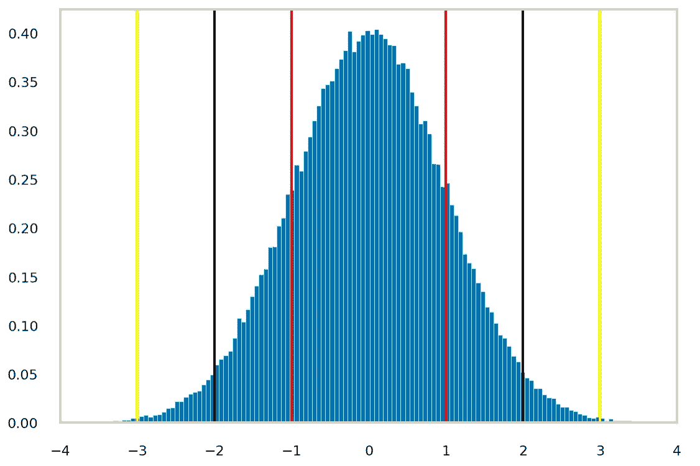
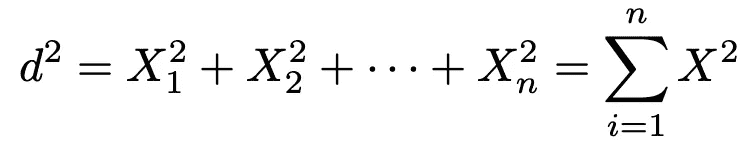
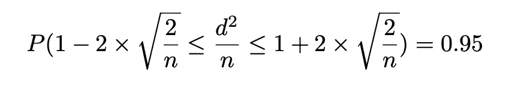
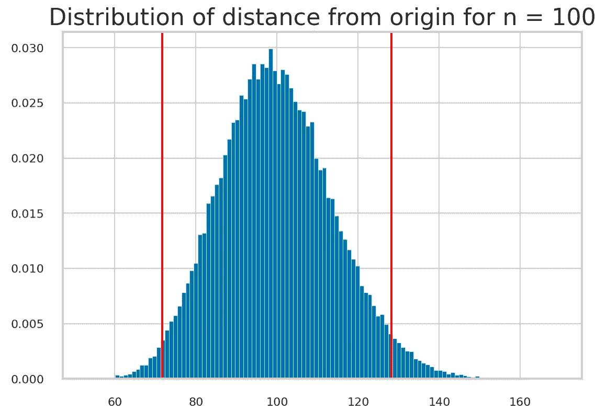
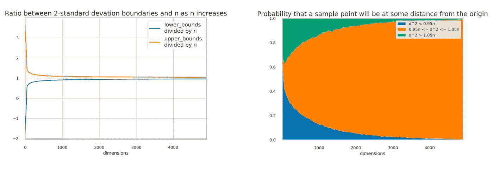

# 迪士尼电影是对的——我们都是特殊的，从统计数据来看也是如此

> 原文：<https://towardsdatascience.com/disney-movies-were-right-we-are-all-special-and-statistically-so-3bb56e79ab71>

## *一点点统计理论会让你相信“普通人”的想法其实只是一个大神话*

来自 [PixaBay](https://pixabay.com/photos/disney-land-castle-night-dark-2584304/) 的 StockSnap 照片

我喜欢迪斯尼电影！！！

除了所有神奇的王国和惊险的冒险、神秘和浪漫，迪士尼电影最擅长的一件事就是让我相信，毕竟我是特别的。

如今，我们通过与他人的比较而生活。我们想要过令人兴奋的生活，不仅仅是一个“普通人”或“简”，如果你在技术行业工作，我们想要成为 10 倍于工程师的朋友，从一个初创企业赚到数百万美元，并在太浩湖买得起一栋度假别墅。因此，在所有不断提醒我们在单调的资本主义激烈竞争中是多么微不足道的电影中，当我们在周日晚上重新观看《玩具总动员》或《摇滚夏令营》等电影时，会有一种深深的舒适感。通过一系列振奋人心的歌曲，看到伍迪或米切尔(黛米·洛瓦托饰)认识到他们是特别的，他们应该因为做自己而得到同样多的爱和关注，这难道不好吗？然后到了星期一，你告诉自己，你又回到了激烈竞争的现实中:“那很有趣，但毕竟是电影。”

但是，如果我告诉你，从统计学上来说，这些电影是正确的，我们几乎不可能是“正常”和“普通”的，我们每个人都是真正特殊的人，那会怎么样？

# **正态分布的误导性**

标准的正态分布。每对红色、黑色和黄色线显示了与平均值的 1、2 和 3 标准偏差差。图片作者。

我们大多数人都熟悉正态分布和著名的 68–95–99.7 规则，即 68%、95%和 99.7%的人口将位于平均值的 1、2 和 3 个标准偏差内。*换句话说，几乎所有观察到的数据都极其接近平均值。*

一个流行的例子是身高。美国成年男性(> 20 岁)的身高根据经验呈正态分布，均值为 5'7 ' "，标准差为 3 英寸。所以当你看到你周围的大多数人身高在 5 英尺 2 英寸到 6 英尺 2 英寸之间时，你应该不会感到惊讶。

这可能会让你想到:同样的逻辑，它也应该适用于其他属性，如体重、天赋、教育水平等。对吗？我们中的任何一个人，包括我自己，似乎都很可能在各方面都很一般，没有什么特别的东西可以展示。

嗯，有一件事你忘了考虑:维度。

# 维度的“祝福”

让我们用数学术语重新审视这个问题:假设每个人的有 *n* 个因子，每个因子都由一个独立的标准正态随机变量表示。也就是说，每个人的属性向量的形式为( *x* 1， *x* 2， *x* 2，…， *xn* )，其中每个 *xi* i.i.d .均为正态，均值为 0，方差为 1。每个因子的期望值都是 0，所以你可能会期望大部分点都堆在原点附近(0，0，0，…，0)，对吧？

要想知道我们离平均值(0，0，0，…，0)有多远，一个方法就是看看欧几里德范数。为了简化计算，我使用了平方欧几里德范数，但想法是一样的。特别地，我们想要找到这个距离 P(d)的分布，并且看到分布质量最大化的地方或者大多数点位于哪里。

由于 d 来自于 *n-* i.i.d 标准正态分布的平方和，所以 d 遵循具有 *n* 自由度的卡方分布。为了研究 *n* 自由度卡方分布的行为，我们可以用均值为 *n* 方差为 *2n* 的正态分布来近似它。

既然很难去思考 d 是如何表现的，尤其是当 n 增加时，我们也可以改变我们的变量，看看 ***d /n*** 。直观上，我们可以想到围绕原点的多个半径值不同的球体。我们特别关心半径为 *n，*的球体，我们想看看相对于这个半径为 *n* 的虚拟球体，这些点是如何分布的。很容易看出找到 ***d /n*** 的分布为:

由于 ***d /n*** 遵循正态分布，我们也可以应用 68–95–99.7 规则:

这意味着 95%的点位于我们之前提到的半径为 n*n*的假想球的[1–2 *σ，1+2*σ]之间。随着 *n* 的增加，这个空间变得越来越小，也就是说这些点离球体越来越近。当 *n* → ∞时，所有点都位于假想球面上。

这是令人惊讶的，因为最初，我们认为大部分的点会靠近原点。事实上，它们中的大部分都在一个半径为 *n* 的 *n 维*肥皂泡中，距离原点*n*。

> 最初，我们认为大部分的点会靠近原点。事实上，它们中的大部分都在一个半径为 *n* 的 *n 维*肥皂泡中，距离原点*n*。

# 模拟

我知道不是每个人都喜欢数学证明，所以我会试着用一个小模拟来说服你。

作者图片

对于不同的 *n* 值，我们采样了大量的“人”——其中每个人都来自一个 *n-* 维正态分布。然后我们计算每个人到“平均乔”或原点的*距离*(欧几里德范数的平方)。这里的图表显示了当 *n = 100 时的距离分布。*

两条红线表示偏离平均值 2 个标准偏差，95%的点存在于此处。在下图中，我们看到当 n → ∞时，边界和 *n* 之间的比率接近 1，这表明大多数点位于距离原点 n 距离的非常小的区域内。

作者图片

另一种看待这个问题的方式显示在右图中:当我们达到 2000 维时，几乎所有从分布中采样的向量都具有接近 1 的幅度，并且几乎没有点接近原点。

# 一些警告:

所以我希望我已经让你相信:存在着或多或少属于平均身高或体重的人。但是，如果有 100 个或更多大致独立变化的标准来衡量人们，那么可能没有人在各方面都是平均的；与众不同的方式太多了。

然而，这种分析依赖于独立性的假设。我们需要想出很多独立的因素来说服自己，我们是特别的。大多数共同属性不一定如此，例如，身高和体重可以通过遗传相关联，你从事各种运动的能力通过你的体格相关联，等等。

但是，至少现在，每当你看到另一部告诉你要相信特殊自我的劣质迪士尼电影时，至少你知道这种说法有一些统计数据支持。

如果你喜欢这篇文章，你可能也会喜欢我的另一篇关于有趣的统计事实和经验法则的文章

*   [优化生活的统计法则:呼唤效应](/a-statistical-rule-to-optimize-your-life-the-lindys-effect-96d2c75b080d)
*   [规则三:计算尚未发生事件的概率](/the-rule-of-three-calculating-the-probability-of-events-that-have-not-yet-occurred-106144dc2c39)

对于其他深潜分析:

*   [贝叶斯统计如何说服我去健身房？](/how-bayesian-statistics-convinced-me-to-hit-the-gym-fa737b0a7ac)
*   [利用数据驱动的体育博彩策略赚大钱](/making-big-bucks-with-a-data-driven-sports-betting-strategy-6c21a6869171)
*   疫情时代的爱情:约会的概率方法

这个项目的完整代码(模拟和图形)可以在我的 [Github](https://github.com/tuangauss/DataScienceProjects/blob/master/Python/n_dimensionalNormal.py) 中找到。