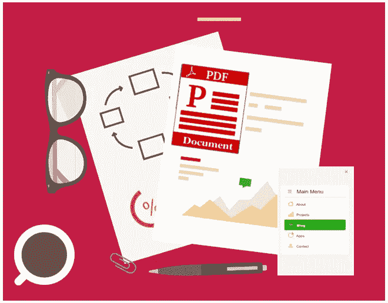
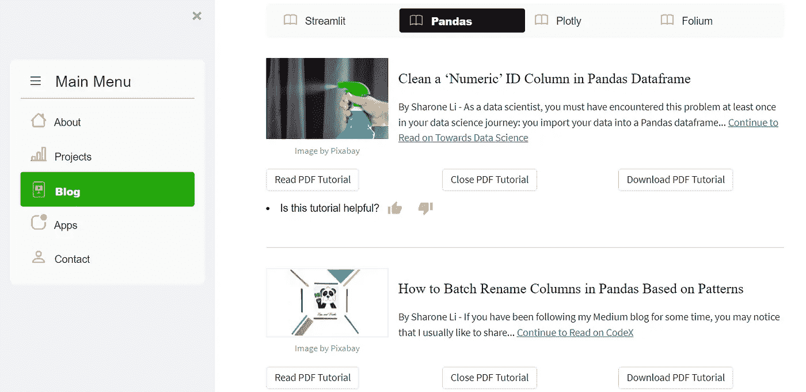
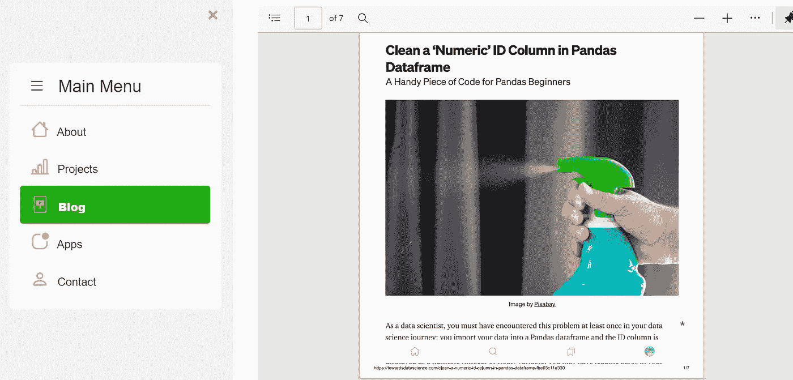
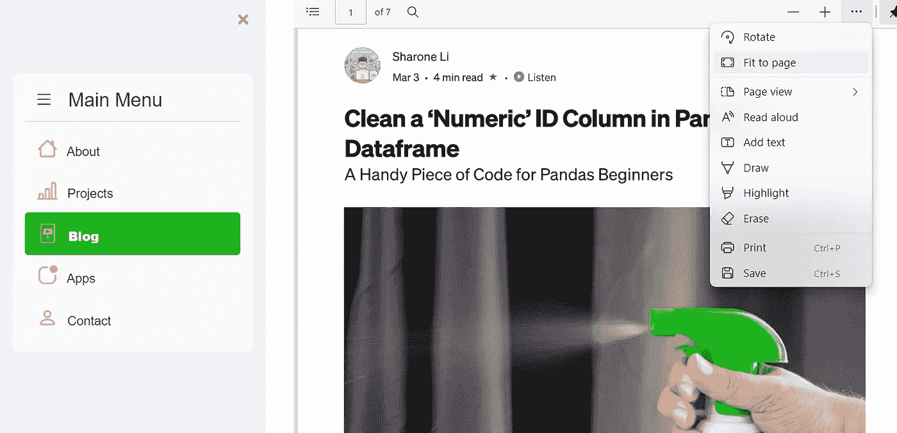
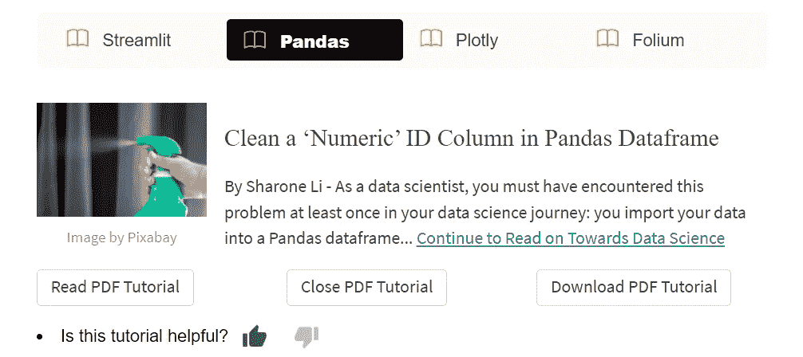

# 在 Streamlit 中显示和下载 PDF:一个博客用例

> 原文：<https://towardsdatascience.com/display-and-download-pdf-in-streamlit-a-blog-use-case-5fc1ac87d4b1>

## 简化用例想法—创建一个博客来记录和展示您的工作



图片由[皮克斯拜](https://pixabay.com/vectors/papers-business-paper-desk-office-4496457/)(作者修改)

# 介绍

Streamlit 是一个开源的 python 框架，主要由数据科学家和数据工程师用来快速轻松地构建机器学习和数据 app。然而，Streamlit 的用例当然不仅限于构建数据应用。

例如，作为一名有抱负的数据科学家，您也可以使用 Streamlit 创建一个个人网站来展示和推广您的个人资料和数据科学工作。你可以在 Streamlit 应用程序中以 PDF 文档的形式显示你的简历，或者如果你写了一些数据科学文章，你也可以创建一个博客页面，并将你的 PDF 帖子嵌入到你的 Streamlit 应用程序中，如下所示。



作者图片

由于我已经在之前的[文章](https://medium.com/codex/create-a-multi-page-app-with-the-new-streamlit-option-menu-component-3e3edaf7e7ad)中分享了如何使用`streamlit-option-menu`创建一个多页面的 streamlit 应用程序，所以我不会在这里花时间解释如何创建导航栏以及应用程序中的所有页面。相反，我将重点向您展示如何在 Streamlit 中显示和下载 PDF 文档，以及如何应用我们学到的知识在该应用程序中创建“博客”页面。

[](https://medium.com/codex/create-a-multi-page-app-with-the-new-streamlit-option-menu-component-3e3edaf7e7ad) [## 使用新的简化选项菜单组件创建一个多页面应用程序

### 还用 st.radio()创建菜单？是时候尝试在 Github 中提供完整代码的 Streamlit-Option-Menu 了

medium.com](https://medium.com/codex/create-a-multi-page-app-with-the-new-streamlit-option-menu-component-3e3edaf7e7ad) 

下面是一个 YouTube 视频短片，演示了博客页面的外观:

作者提供的 YouTube 视频演示

# 如何在 Streamlit 中嵌入 PDF

要在 Streamlit 中嵌入/显示 PDF 文档，我们需要做以下三件事:

1.打开 PDF 文件，并使用 base64 编码对其进行编码(如果没有 base64 编码，您的 PDF 文件将无法正常显示，即 404 错误)。此外，base64 编码可以很好地处理 2MB 以下的文件，所以如果您的 PDF 文件大小大于 2MB，您应该在编码前先[压缩](https://www.adobe.com/acrobat/online/compress-pdf.html?mv=search&sdid=DZTGZX2P&ef_id=CjwKCAiAjoeRBhAJEiwAYY3nDARHYPn2H7Cs1ZrGfMDx01ikownQ-DYhp0EX_mKnwWtC6TyrWP3tjBoCG_QQAvD_BwE:G:s&s_kwcid=AL!3085!3!559402382057!e!!g!!pdf%20compress!12981897010!121481297003&cmpn=mobile-search&gclid=CjwKCAiAjoeRBhAJEiwAYY3nDARHYPn2H7Cs1ZrGfMDx01ikownQ-DYhp0EX_mKnwWtC6TyrWP3tjBoCG_QQAvD_BwE)。

```
with open(file_path,"rb") as f: base64_pdf = base64.b64encode(f.read()).decode('utf-8')
```

2.在 HTML iframe 中嵌入 base64 编码的文件。您可以使用`width`和`height`参数来调整 iframe 的宽度和高度。

```
pdf_display = f'<iframe src="data:application/pdf;base64,{base64_pdf}" width="800" height="800" type="application/pdf"></iframe>'
```

3.使用`st.markdown`在 Streamlit 中渲染 pdf 文档

```
st.markdown(pdf_display, unsafe_allow_html=True)
```

将这三个步骤放在一起，我们可以定义一个在 Streamlit 中显示 PDF 文档的函数:



作者图片



适合页面(图片由作者提供)

# 如何在 Streamlit 中下载 PDF

为了使用户能够从 Streamlit 应用程序下载 PDF 文件，我们可以使用`st.download_button()`来完成。

# 创建“博客”页面

现在我们知道了如何嵌入 PDF 文档来简化它，并使用户能够下载它，让我们将刚刚学到的东西付诸实践，并创建演示应用程序中显示的“博客”页面。

在博客页面上，我们将列出三篇(或更多)文章。对于每个帖子，我们将显示帖子的特色图片以及标题和一些介绍性文本。用户可以点击链接选择继续阅读[介质](https://medium.com/)上的剩余帖子。用户可以选择打开 PDF 版本的帖子，并在应用程序中阅读。他们也可以关闭文档或将其下载到自己的计算机上。

第 1–5 行:我们定义了一个函数，稍后将调用该函数在 Streamlit 中显示 PDF 文档。

第 7–18 行:我们为第一篇文章添加了特色图片和介绍性文字。我们使用`st.container()`来并排放置图像和文本。在第 18 行，我们还使用`st.markdown()`来包含文章最初发布的 URL。

第 20–32 行:我们创建了三个按钮，使用户能够打开、关闭或下载 PDF 文档。确保在第 23 行将 PDF 文件放在与 streamlit 应用程序的 python 文件相同的文件夹中。如果您的 PDF 文件大于 2MB，您需要先压缩文件并将其大小减小到 2MB 以下。

第 34–35 行:我们使用 Streamlit 的新定制组件`streamlit-text-rating`添加了一个小的反馈部分。该组件使用户能够对他们在 Steamlit 应用程序中阅读的文本内容进行评级。您可以使用以下命令安装这个新组件:

```
pip install streamlit-text-rating
```



作者图片

这就对了。您已将第一篇文章添加到“博客”页面。使用相同的代码结构，您可以轻松地向“博客”页面添加更多的文章。你可以在我的 [Github repo](https://github.com/insightsbees/Personal_Website/blob/main/website_app.py) 中找到创建导航菜单和博客页面的完整代码。

为了让事情变得更有趣，你也可以将你的简历作为 PDF 文档嵌入到“关于”页面，并在其他页面展示你的项目。下一次，当你面试你梦想中的数据科学职位时，你可以自豪地在你用 Streamlit 创建的个人网站上展示你出色的工作！

感谢阅读！希望你喜欢这篇文章，并渴望尝试使用 Streamlit 创建自己的网站！

你可以通过这个[推荐链接](https://medium.com/@insightsbees/membership)注册 Medium 会员(每月 5 美元)来获得我的作品和 Medium 的其他内容。通过这个链接注册，我将收到你的会员费的一部分，不需要你额外付费。谢谢大家！