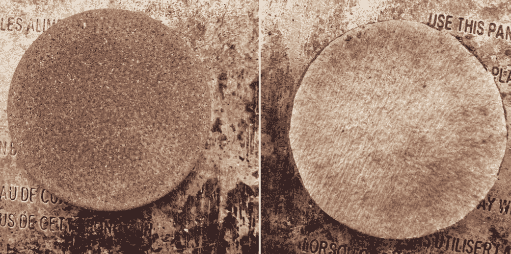
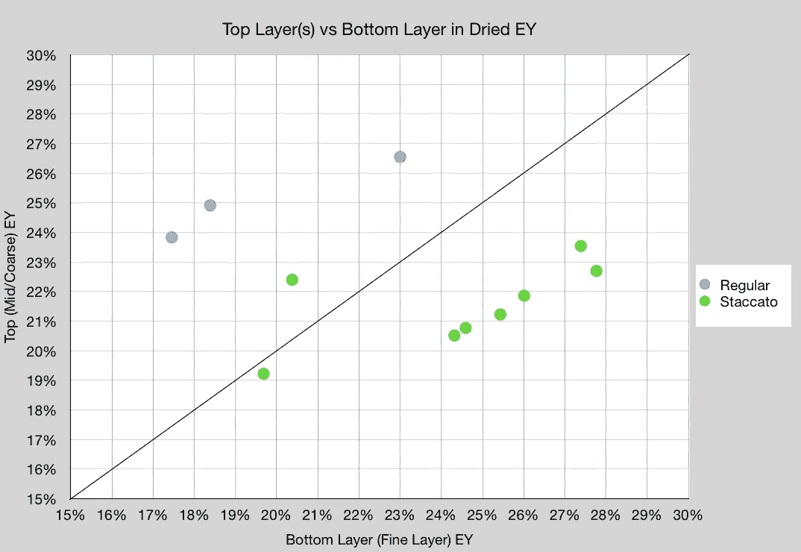
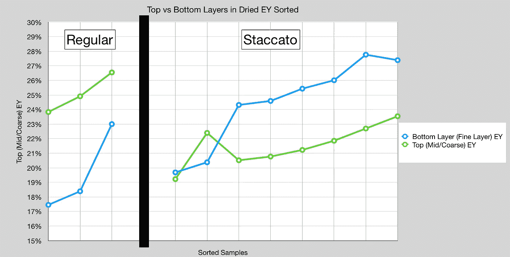

# 剖析咖啡萃取:第 2 部分

> 原文：<https://towardsdatascience.com/dissecting-coffee-extraction-part-2-74eb35805089>

## 咖啡数据科学

## 分层分割提取

在之前的中，我看了一些干咖啡豆的提取，一些镜头在层与层之间有一个纸过滤器。我用这个纸过滤器干净利落地切开圆盘，逐层检查咖啡萃取物。这些结果与以前的结果一致，以前的结果显示，对于普通的咖啡果，顶部比底部提取得快得多。然而，对于断奏圆盘，底部(精细层)提取速度比顶部快。

我收集了更多的数据，但是是在一台新机器上(像样的咖啡机)。以前，我使用杠杆机器，这意味着即使在我停止击球后，仍有更多的水通过冰球。有了像样的浓缩咖啡机，我可以只用稍微多一点的水通过冰球来检查冰球。

所有图片由作者提供

# 设备/技术

[浓缩咖啡机](/taxonomy-of-lever-espresso-machines-f32d111688f1) : [像样的浓缩咖啡机](/developing-a-decent-profile-for-espresso-c2750bed053f)

[咖啡研磨机](/rok-beats-niche-zero-part-1-7957ec49840d) : [小生零](https://youtu.be/2F_0bPW7ZPw)和[同道码](https://fellowproducts.com/products/ode-brew-grinder)带 [SPP 毛刺](http://www.sspgrind.com/)

咖啡:[家庭烘焙咖啡](https://rmckeon.medium.com/coffee-roasting-splash-page-780b0c3242ea)，中杯(第一口+ 1 分钟)

镜头准备:[断奏夯实](/staccato-tamping-improving-espresso-without-a-sifter-b22de5db28f6)(常规)和[断奏](https://medium.com/overthinking-life/staccato-espresso-leveling-up-espresso-70b68144f94)

[预输注](/pre-infusion-for-espresso-visual-cues-for-better-espresso-c23b2542152e):长，约 25 秒

输液:[压力脉动](/pressure-pulsing-for-better-espresso-62f09362211d)

[过滤篮](https://rmckeon.medium.com/espresso-baskets-and-related-topics-splash-page-ff10f690a738) : 20g VST

其他设备: [Atago TDS 计](/affordable-coffee-solubility-tools-tds-for-espresso-brix-vs-atago-f8367efb5aa4)、 [Acaia Pyxis 秤](/data-review-acaia-scale-pyxis-for-espresso-457782bafa5d)

# 绩效指标

我使用提取率(EY ),通过干燥圆盘并称重干燥的圆盘来计算。

首先，我比较了散点图中的顶部和底部。断奏的底部比顶部有更高的 EY，但常规的底部有更低的 EY。

我整理了这些数据，并把它们绘制成了线图。两个断奏的镜头没有跟随这个趋势，因为它们引导了很多。

该数据给出了一些增加 EY 的指示。断奏圆盘的底部提取得很好，这意味着如果增加顶部 EY，底部可能会过度提取。但这也是一个更清楚的迹象，表明顶部可以更好地设计，以增加提取。

此外，常规圆盘的底部没有被提取。这也可能是顶层卡在底层的问题。这也可以暗示水是如何从顶部和底部流过的。如果水在顶部更均匀，但在底部开始形成通道(即 donuting)，那么底部的水就更少。这可以使用用过的圆盘上的径向切口来进一步研究。

如果你愿意，可以在推特、 [YouTube](https://m.youtube.com/channel/UClgcmAtBMTmVVGANjtntXTw?source=post_page---------------------------) 和 [Instagram](https://www.instagram.com/espressofun/) 上关注我，我会在那里发布不同机器上的浓缩咖啡照片和浓缩咖啡相关的视频。你也可以在 [LinkedIn](https://www.linkedin.com/in/dr-robert-mckeon-aloe-01581595) 上找到我。也可以关注我在[中](https://towardsdatascience.com/@rmckeon/follow)和[订阅](https://rmckeon.medium.com/subscribe)。

# [我的进一步阅读](https://rmckeon.medium.com/story-collection-splash-page-e15025710347):

[我未来的书](https://www.kickstarter.com/projects/espressofun/engineering-better-espresso-data-driven-coffee)

[我的链接](https://rmckeon.medium.com/my-links-5de9eb69c26b?source=your_stories_page----------------------------------------)

[浓缩咖啡系列文章](https://rmckeon.medium.com/a-collection-of-espresso-articles-de8a3abf9917?postPublishedType=repub)

工作和学校故事集