# 剖析生日悖论

> 原文：<https://towardsdatascience.com/dissecting-the-birthday-paradox-c26754aff6b5>

## 统计学并不总是很直观


照片由[阿迪·戈尔茨坦](https://unsplash.com/@adigold1?utm_source=medium&utm_medium=referral)在 [Unsplash](https://unsplash.com?utm_source=medium&utm_medium=referral)

# 介绍

试着回答这个问题，但不要实际算出来。

> 你需要多少人在一个房间里来确保有 50%的机会让两个人过同一天生日？

你会纯粹凭直觉回答什么？合理的答案应该是什么样的？50 个人？100?183?365?

当我遇到这个问题时，我猜测答案是大约 70-80 人。之后我算了一下，答案让我大吃一惊。

显然只需要 23 个人！

让我们证明这一点。

## 目录

```
* The Math -- proving it mathematically
* Exploring Real World Data -- checking our theory
* Why this isn't so intuitive
* Code and References
```

# 数学

## 假设

我们将做以下假设来简化问题:

*   没有闰年
*   每一天都同样可能是一个潜在的生日

第一个假设让我们假设有 365 个可能的出生日期。

**第二个假设**意味着我们正在解决最坏的情况，因为任何不平衡都会使两个日期更有可能冲突(比如，两个生日在同一天)。

## 微不足道的案子

假设我们正好有两个人。他们同一天生日的概率有多大？

第一个人可以在一年中的任何一天过生日，但是第二个人需要和第一个人在同一天过生日。

所以概率可以这样算出来:

```
P_2 = number of possible days for the 1st person * number of possibilities for the 2nd Person / total number of possibilities.
```

这相当于:

```
P_2 = 365 * 1 / 365 * 365 = 1/365
```

这只是 0.3%左右。

## **对于人数较多的人**

当我们有更多的人要考虑时，比如说，5 个人，首先计算没有生日匹配的概率，然后找到这个概率的补集就更容易了。

对于 5 个人:

*   第一个人可以有 365 个生日中的任何一个——365 种方式
*   第二个人可以拥有任何东西，除了第一个人的生日——364 种方式。
*   类似地，第三、第四和第五个人有 363、362 和 361 个可能的生日
*   我们将它们相乘，然后除以可能日期的总数——365 乘以 365..(5 次)—^ 5 区 365 号
*   我们从 1 中减去这个结果，得到匹配的概率，因为我们刚刚计算的是没有匹配

我们在这里的结果是:

```
P(A) = 1 - 365 * 364 * 363 * 362 * 361 / 365 ^ 5
     = 0.027
```

## 通解

让我们为一群人解决这个问题。

按照与上面相同的逻辑，我们将首先计算补数，然后从`1`中减去它，以获得我们想要的答案。第一个人可以在任何一天生日— `365`可能性。除了第一个人的生日之外，第二个人可以在任何一天过生日——`364`可能性，等等。

```
P_n(A)' = 365*364*363*...(365-(n-1)) / 365 ^ n
```

从鸽笼原理(甚至通过直观的方法)，对于`n > 365`、`P_n == 1`。

这可以像这样进一步简化。

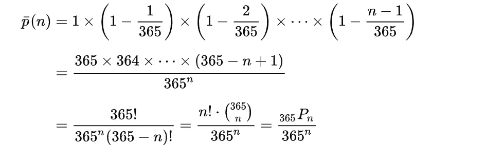

计算互补概率—维基百科

```
P_n(A)' = (365 p n) / 365 ^ n
```

其中`(365 p n)`代表总数`365`中`n`项的排列数。

因此，为了计算我们实际需要什么，我们有:

```
P_n(A) = 1 - P_n(A)'
```

对于`n = 23`，我们得到的刚好超过`50%`(准确地说是`50.7%`)，这与我们最初的答案一致，即需要 23 个人才能有`50%`的生日匹配机会。

# 真实世界的数据

现在让我们来看一些真实的数据，看看我们的假设是否足以模拟真实世界的场景。

我们将使用来自**538**的出生日期数据集。它链接在下面的参考文献中。这是在[知识共享署名 4.0 国际许可](http://creativecommons.org/licenses/by/4.0/)下，正如他们的[网站](https://data.fivethirtyeight.com/)上提到的。

数据集是 2000 年至 2014 年间的出生频率，看起来像这样。

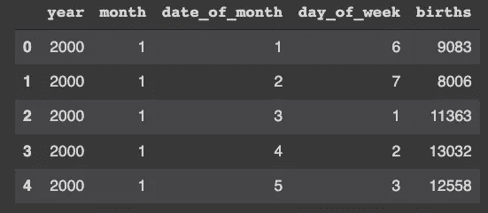

数据集的几行-按作者分类的图像

一个更广泛的 EDA 将被添加到附带的笔记本，链接在最后。

## 预处理

很难找到如此干净的数据集。我们所要做的就是删除一些列并创建一个日期时间列。

```
# drop an irrelevant column
df = df.drop('day_of_week', axis=1)# rename day_of_month to day -- helps with the datetime conversion
df = df.rename({"date_of_month": "day"}, axis=1)# convert year, month and day into datetime
df['date'] = pd.to_datetime(df[['year', 'month', 'day']])# drop the now redundant year, month and day cols
df = df.drop(['year', 'month', 'day'], axis=1)
```

我们的数据框`df`现在看起来像这样。

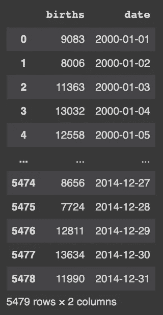

经过处理的数据框-作者提供的图像

## 分析数据

我们将使用`calmap`库来绘制 2014 年的出生热图。该库接受用 DateTimeIndex 索引的数据，所以让我们先创建它。

```
# accessing the rows belonging for 2014
df_14 = df[df['date'].dt.year == 2014]# duplicating the "birth" column into a separate series
df_dates_14 = pd.Series(df_14['births'])# setting the index to df_14’s date column
df_dates_14.index = df_14['date']
```

现在让我们创建日历图。

```
plt.figure(figsize=(30, 10))_ = calmap.yearplot(df_dates_14)
```

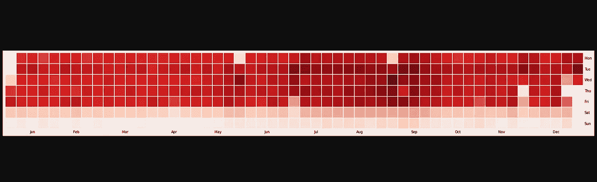

2014 年日历热图—图片由作者提供

很明显，如我们所料，一致性假设不成立。你可以看到，在周末和一些公共假日，出生人数明显减少。让我们更仔细地看看这个。

## 挑战一致性假设

虽然我们没有闰日的第一个假设足够安全，不会对我们的答案产生重大影响，但我们做出的第二个假设(每个日期的可能性相等)似乎有点不现实。嗯，确实是。

数据显示，生日有两种潜在的模式——美国模式和欧洲模式。**美国的出生模式**显示在九月有一个明显的高峰，而**欧洲模式**在春季有一个大的高峰，随后在九月有一个较小的高峰。

另一个反常现象出现在节假日——因为更多的医院关门，在像公共假日这样的日子出生的可能性更小。

同样，周末的出生人数也比平日略少。

所有这些都指向一个事实，即真实世界的数据并不遵循一致性的假设。我们很快就会看到这种变化对我们的答案有多大影响。

## 寻找不同样本量的概率

让我们假设一年，比如 2014 年。我们将随机抽取不同样本量的日期，并计算至少有两个相同生日的概率。

我们将进行两种实验——一种有一致性假设，另一种没有。

**效用函数**

让我们首先创建一个效用函数，它接受:

*   数据帧
*   样本量
*   用于测试的样本数量
*   一面引发统一的旗帜

在高层次上，这个函数简单地从我们的数据框中创建给定样本大小的多个样本，并检查该样本是否有生日匹配。然后，它返回这些样本中匹配的部分。

它看起来会像这样:

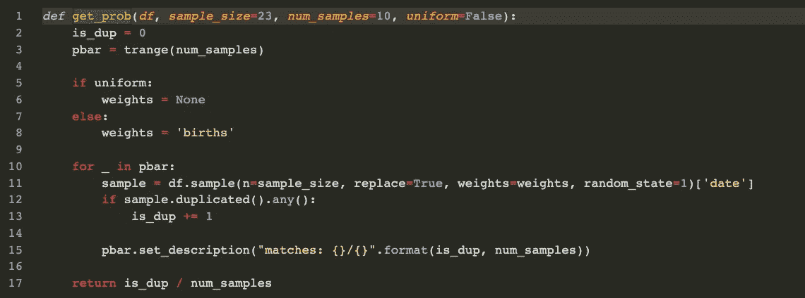

效用函数——作者的形象

现在，让我们针对不同的样本大小，计算至少有一个生日匹配的样本的分数。

我们暂时不强加一致性假设。请记住，我们现在期望在样本量为`23`时比计算出的`0.507`有更高的概率，因为出生日期的不一致性使得生日匹配更容易。

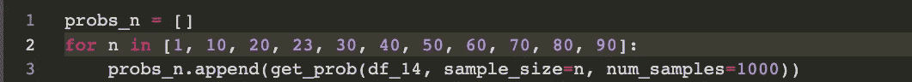

计算不同样本大小的概率-按作者分类的图片

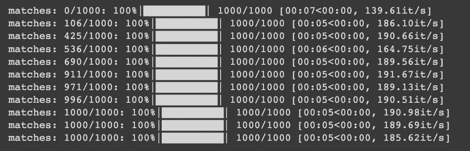

让我们画出结果。

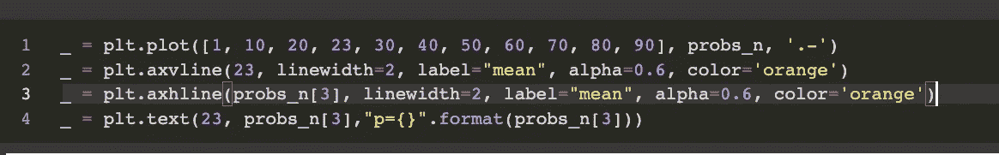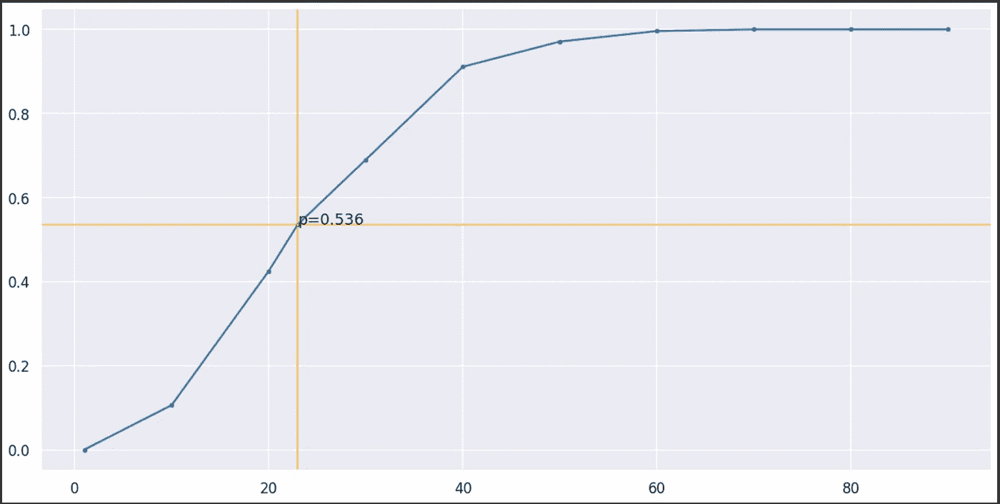

不同样本大小的匹配发生概率图(不一致)-按作者分类的图像

不出所料，我们得到了一个比`0.5`略高的值。

让我们重复这个实验。但这一次，我们将对日期进行统一加权。对于`23`的样本量，我们期望概率略大于 0.5，但小于我们在前一个案例中得到的概率。

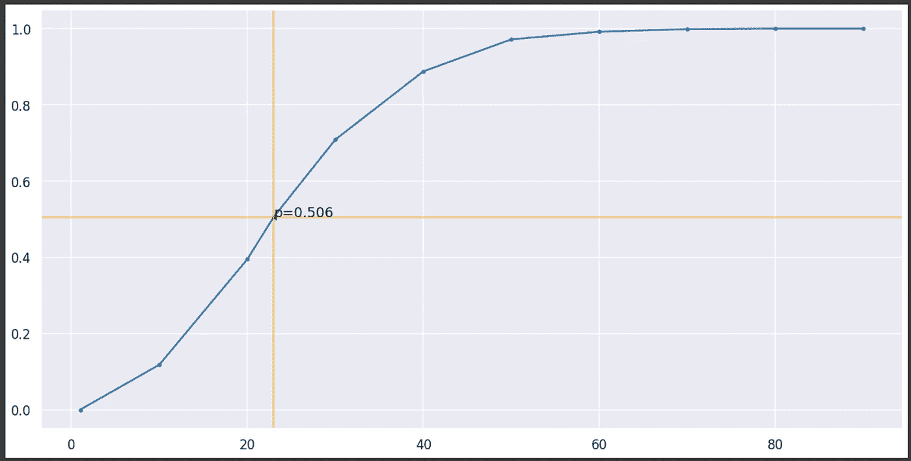

不同样本大小的匹配发生概率图(统一)-图片由作者提供

这和我们没有一致性假设时得到的值非常相似。这里的关键点是，对于`n = 23`，我们得到了一个比没有均匀性假设时稍低的值。

这与直觉一致，即如果一些日期比其他日期更有可能，那么两个人更有可能有相同的生日。虽然这只是我们数据集中 15 年中的一年，但对所有年份进行平均可能会得到更一致的结果(尽管我们不会这样做，因为文章越来越长)。

## 一致性假设有多重要？

记住这些发现，这个假设有多重要？我们计算出的答案 23 会不会比 1 高了很多？还是 3？也许更多？

Mario Cortina Borja 和 John Haigh 的论文对此进行了深入的解释。他们使用递归公式来计算答案会有多大的变化。他们得出了一个乘数`0.99917`，这意味着答案在很大程度上仍然是`23`，即使我们放松了一致性规则。

这篇论文在参考文献部分有链接。

如果我们从数据集(2000 年至 2014 年)中检查这一趋势，我们会得到一个图来加强这一点。

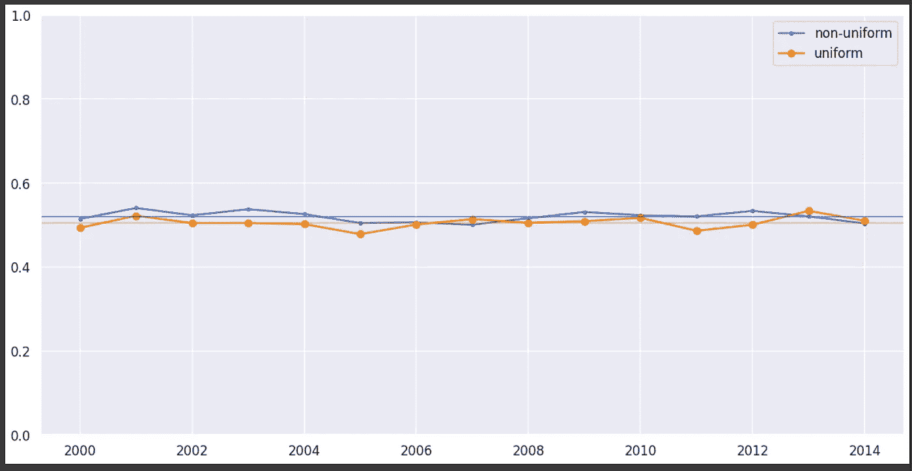

样本大小为 23 的匹配概率趋势—作者图片

几乎所有的年份，“均匀”的情节都比“不均匀”的情节低很多。趋势线后面非常淡的蓝色和橙色水平线代表均值。两者接近，一致均值低于预期。

# 为什么它不那么直观

正如你可能想象的那样，我们非常重视两个特定人的生日匹配，这是一个`0.3%`。虽然这种概率确实很小，但我们没有考虑这样一个事实，即当我们有`23`人时，我们谈论的是`253`对个体。

这样想想，任何两个人同一天生日的几率似乎都没那么小，尤其是唯一的生日只有 365 个。

# 示例代码和参考

## 资料组

我在这里使用了**出生**数据集(知识共享许可)。

[](https://data.fivethirtyeight.com/)  

## 论文谈均匀性假设

[https://RSS . online library . Wiley . com/doi/10.1111/j . 1740-9713.2007 . 00246 . x](https://rss.onlinelibrary.wiley.com/doi/10.1111/j.1740-9713.2007.00246.x)

## 密码

[](https://github.com/Polaris000/BlogCode/tree/main/BirthdayParadox)  

## 更新

> 26.4.22

添加缺少的结果

# 最后

我写这篇文章是为了分享一个统计问题，这个问题的答案在没有实际解决之前并不明显。这表明统计在某些情况下不是很直观。

我希望这是一次有趣的阅读，你能从中得到一些东西。感谢阅读。