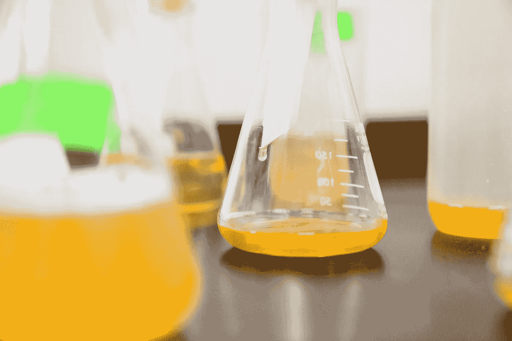
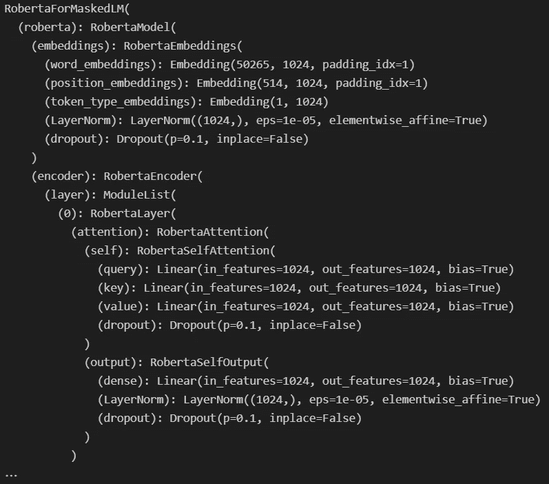
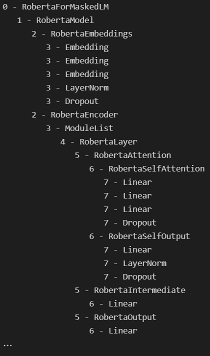
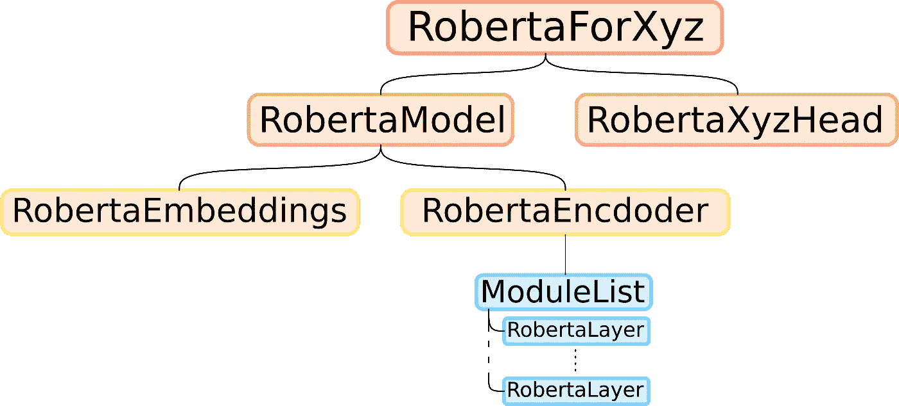
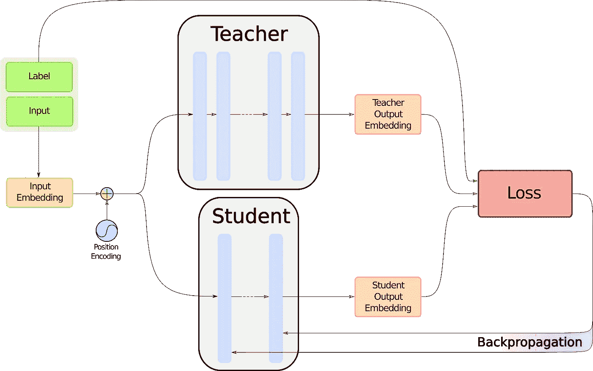
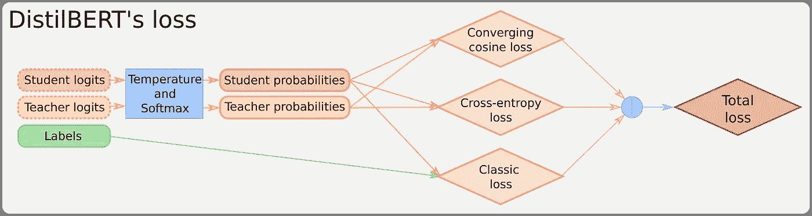
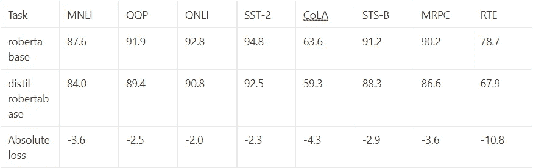

# 类伯特模型的提炼:代码

> 原文：<https://towardsdatascience.com/distillation-of-bert-like-models-the-code-73c31e8c2b0a>

就像化学蒸馏一样，我们将从模型中提取重要的东西:知识。照片由[在](https://unsplash.com/@elevatebeer?utm_source=medium&utm_medium=referral)[的](https://unsplash.com?utm_source=medium&utm_medium=referral)上提升

# 概述

如果你没有注意到，机器学习模型已经变得越来越大，以至于训练一个模型可能会对那些没有多余集群的人造成伤害。此外，即使有一个训练有素的模型，当你的硬件不符合模型对它应该运行的预期时，推理的时间和内存成本也会飙升。因此，为了缓解这个问题，与其说*放弃*类似伯特的模型和它们的厚层，不如说被称为**蒸馏**的技术已经被开发出来，用来将网络缩小到一个合理的大小，同时将性能损失降到最低。

如果你已经阅读了本系列的第一篇文章，那就不是新闻了，这里是[这里是](/distillation-of-bert-like-models-the-theory-32e19a02641f)。在这篇文章中，我们讨论了 DistilBERT [1]如何引入一种简单而有效的蒸馏技术，这种技术可以很容易地应用于任何类似 BERT 的模型，但是我们避开了任何具体的实现。现在，我们将进入细节，看看我们如何从想法进入。py 文件。

本文是关于以 DistilBERT 的方式提取类似 BERT 的模型的两部分系列文章的第 2 部分。对于第一部分，你可以跟随这个[链接](/distillation-of-bert-like-models-the-theory-32e19a02641f)。然而，如果你认为你已经很好地掌握了蒸馏法，可以跳过阅读。

# 摘要

一、学生模型的初始化
二。自定义损失函数
III。一个更漂亮的实现。五、结论

# 一.学生模型的初始化

因为我们想从一个现有的模型初始化一个新的模型，我们需要访问旧模型的权重，也就是老师。我们会认为预先存在的模型是在 PyTorch 上实现的**拥抱脸模型，因为它当然是。因此，要获得权重，我们首先必须知道如何访问它们。我们将使用罗伯塔[2]大号作为我们的教师模型。**

## 拥抱脸的模型结构

我们可以尝试的第一件事是打印出模型，这应该能让我们深入了解它是如何制造的。当然，我们总是可以挖掘拥抱脸文档[3]，但这并不有趣。

运行这段代码后，我们会得到:

简单的罗伯塔印花给人第一印象(图片由作者提供)

模型的结构开始出现，但我们可以让它更漂亮。在拥抱脸模型中，我们可以通过使用。children()生成器。因此，如果我们想要搅动整个模型，我们需要调用。children()，在每个 child 上产生，等等…这描述了一个**递归**函数，我们在这里编码:

这给出了:

罗伯塔的递归窥视(作者图片)

通过展开这一树，RoBERTa 模型的结构似乎与其他类似 BERT 的模型一样，如下所示:

类伯特模型的架构(图片由作者提供)

## 复制老师的体重

我们知道，要以 DistilBERT [1]的方式初始化一个类似 BERT 的模型，我们只需要复制除了 Roberta 层最深层次之外的所有内容，我们忽略了其中的一半。首先，我们需要创建学生模型，其架构与教师相同，但隐藏层数是教师的一半。
要做到这一点，我们只需要使用教师模型的**配置**，它是一个类似字典的对象，描述了拥抱脸模型的架构。当查看 roberta.config 属性时，我们可以看到以下内容:

罗伯塔配置(图片由作者提供)

我们感兴趣的是 num-hidden-layers 属性。让我们编写一个函数来复制这个配置，通过将其除以 2 来更改该属性，并使用新配置创建一个新模型:

当然，这个函数引入了一个缺失的部分，distill _ roberta _ weights。这个函数会把老师一半的权重放在学生的图层里，但是我们还是需要编码。既然**递归**在探索教师模型方面工作得很好，我们可以用同样的想法来探索和复制它的一部分。我们将同时浏览教师模型和学生模型，在此过程中从一个模型向另一个模型复制零件。唯一的诀窍是小心隐藏层部分，只复制一半。
该函数实现了以下功能:

该函数通过递归和类型检查，确保学生模型与教师模型相同，对于 Roberta 层是安全的。人们可以注意到，如果我们想在初始化教师时改变复制哪些层，只有编码器部分的 for 循环需要改变。

现在我们有了学生模型，我们需要训练它。这部分相对简单，除了我们将要使用的**损失函数**。

# 二。自定义损失函数

作为对 DistilBERT 培训过程的回顾，我们可以看看下图:

蒸馏过程(图片由作者提供)

我们将注意力转向写着“损失”的红色大盒子。但是在揭示里面是什么之前，我们需要知道*我们如何*收集我们要喂它的东西。从这个图表中，我们可以看到我们需要 3 样东西:标签、学生和教师的嵌入。标签，我们已经有了，否则，我们可能会有更大的问题。现在让我们得到另外两个。

## 检索教师和学生的输入

在这里，我们将坚持我们的例子，并使用一个带有**分类**头的 RoBERTa 来说明这一部分。我们需要的是一个函数，给定一个类似 BERT 的模型的输入，那么两个张量，input_ids 和 attention_mask，以及模型本身，将返回该模型的 logits。由于我们使用了拥抱脸，这非常简单，我们唯一需要的知识就是往哪里看。

我们为学生和老师这样做，第一个有渐变，第二个没有。

## 编码损失

如果损失函数有点模糊，我们可以推荐回到第一篇文章来阅读损失函数。但是，如果您没有时间做这个，这个图表应该有所帮助:

蒸馏者的损失(图片由作者提供)

我们称之为“收敛余弦损失”的是用于对齐两个输入向量的常规余弦损失。要了解更多信息，请参考本系列的第一部分。这是代码:

# 三。更漂亮的实现

我希望 python 是一种面向对象的编程语言不会让您感到震惊。因此，由于所有这些函数使用几乎相同的对象，不把它们作为**类**的一部分似乎有些奇怪。如果你想实现这一点，我建议使用一个蒸馏器类来整理代码，就像这个[要点](https://gist.github.com/remi-or/4814577c59f4f38fcc89729ce4ba21e6)一样。我们不打算嵌入这个，因为它很长。

当然，还缺少一些东西，比如 GPU 支持，整个训练程序等等。但是 DistilBERT 所有的关键思想都可以在那里找到。

# 四。结果

那么，以这种方式提炼出来的模型最终表现如何呢？对于 DistilBERT，可以阅读原文[1]。对于罗伯塔来说，拥抱脸已经有了一个蒸馏过的版本，就在这里。在 GLUE benchmark [4]上，我们可以比较这两个模型:

罗伯塔对迪夫罗伯塔(图片由作者提供)

至于时间和内存成本，这个模型的大小大约是 roberta-base 的三分之二，速度是 Roberta-base 的两倍。

# 动词 （verb 的缩写）结论

通过这一系列的两篇文章，您应该有足够的知识来提炼出您遇到的任何类似 BERT 的模型。但是为什么就此打住呢？自然界充满了蒸馏方法，像 TinyBERT [5]或 MobileBERT [6]。如果你认为其中一个更符合你的需要，你应该读一读这些文章。谁知道呢，你可能想尝试一种全新的蒸馏方法，因为这是一个日益发展的领域。

## 谢谢

感谢我以前在[professor ob . ai](http://ProfessorBob.ai)的同事 Ha Quang Lee 和 Meng，他们首先教会了我关于 DistilBERT 的知识，并纠正了我的代码。

## 参考

[1]维克多·桑，弗拉达利出道，朱利安·肖蒙德，托马斯·沃尔夫，[蒸馏伯特，伯特的蒸馏版:更小，更快，更便宜，更轻](https://arxiv.org/pdf/1910.01108.pdf) (2019)，拥抱脸

[2]刘、米莱奥特、纳曼戈亚尔、杜、曼达尔乔希、陈、奥梅尔列维、、卢克塞特勒莫耶、韦塞林斯托扬诺夫、[罗伯塔:稳健优化的伯特预训练方法](https://arxiv.org/pdf/1907.11692.pdf) (2019)、arXiv

[3]拥抱脸团队归功于朱利安·肖蒙德，[拥抱脸的罗伯塔文档](https://huggingface.co/docs/transformers/model_doc/roberta)，拥抱脸

[4] Alex WANG，Amanpreet SINGH，Julian MICHAEL，Felix HILL，Omer LEVY，Samuel R. BOWMAN， [GLUE:一个用于自然语言理解的多任务基准和分析平台](https://arxiv.org/pdf/1804.07461v3.pdf) (2019)，arXiv

[5]焦，尹宜春，，尚，辛江，，，，李，， [TinyBERT:蒸馏 BERT 用于自然语言理解](https://arxiv.org/pdf/1909.10351.pdf) (2019)，arXiv

[6]孙志清，于鸿坤，，宋，，刘，，丹尼·周， [MobileBERT:一种面向资源受限设备的紧凑任务不可知 BERT](https://arxiv.org/pdf/2004.02984.pdf)(2020)，arXiv