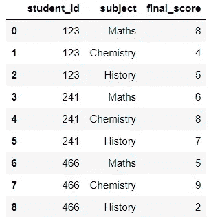
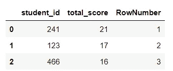
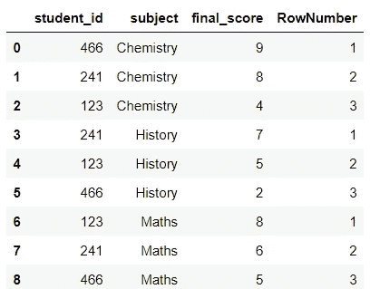
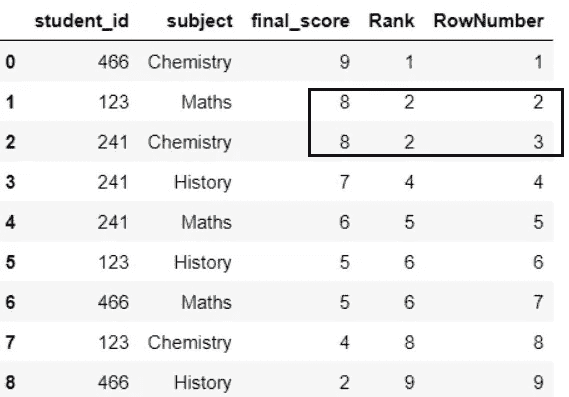
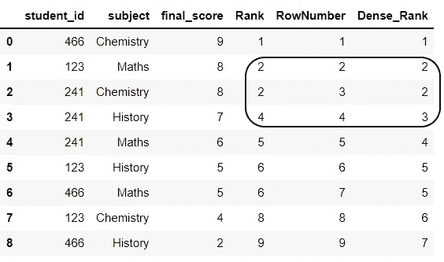
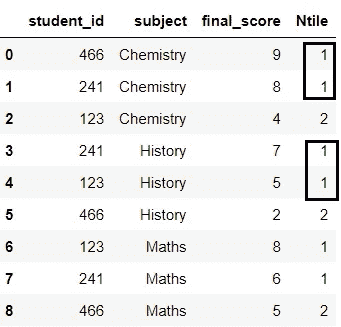

# 区分 SQL 中的 4 个排名函数

> 原文：<https://towardsdatascience.com/distinguish-4-ranking-functions-in-sql-37db99107c05>

# 区分 SQL 中的 4 个排名函数

## 不同排名函数的备忘单


埃里克·普劳泽特在 [Unsplash](https://unsplash.com?utm_source=medium&utm_medium=referral) 上拍摄的照片

# 介绍

SQL 中有一些排名函数，有时区分它们的用法令人沮丧。这就是为什么在这篇文章中，我想和你分享我在处理不同排名函数时的备忘单。希望在查询结果的时候能节省你一些时间。

总的来说，当谈到等级函数时，会有四种类型的函数:

*   排名()
*   密集等级()
*   ROW_NUMBER()
*   NTILE()

让我们在下面的例子中看看这四个。

# 数据集

在我们开始每个函数之前，让我们创建一个用于操作的数据集。这些数据显示了学生在三个科目上的最终成绩:数学、化学和历史。

```
data = {'student_id':[123,123,123,241,241,241,466,466,466],
        'subject':['Maths','Chemistry','History','Maths', 'Chemistry','History','Maths','Chemistry','History'],
        'final_score':[8,4,5,6,8,7,5,9,2]}
df = pd.DataFrame(data)
```



# 句法

**RANK、DENSE_RANK、**和 **ROW_NUMBER** 函数的语法实际上非常相似。

```
RANK_FUNCTION() OVER (
   [PARTITION BY expression, ]
   ORDER BY expression (ASC | DESC) );
```

同时， **NTILE** 函数的语法与这三个略有不同:

```
NTILE(number of groups) OVER (
   [PARTITION BY expression, ] 
   ORDER BY expression [ASC | DESC]); 
```

我们可以这样解释这些论点:

*   **RANK_FUNCTION:** `ROW_NUMBER`，`RANK`，`DENSE_RANK`
*   **分区由 *:*** 非强制参数。它将输出分成多个分区。
*   **ORDER BY:** 指定排序后如何将排名数字应用于结果集。
*   **组数:**要生成的组数。

# 行数

这是最基本的排名功能。基于每个分区的 OVER 子句中所述的顺序，按顺序返回每行的等级(例如，1、2、3…)。需要注意的一点是，在具有相同值的行中，我们不会有相同的排名。

**例 1(无分区):**我想根据学生在所有科目上的总分对他们进行排名。输出如图 1 所示。

```
SELECT *, 
ROW_NUMBER() OVER(ORDER BY total_score DESC) RowNumber
   FROM (SELECT student_id, SUM(final_score) AS total_score
            FROM df 
            GROUP BY student_id)
```



图 1:基于总分的排名——按作者排序的图片

**例 2(带分区):**学生各科成绩排名

```
SELECT *, 
ROW_NUMBER() OVER(PARTITION BY subject ORDER BY final_score DESC) RowNumber
   FROM df
```



图 2:分区排名——作者图片

如图 2 所示，通过`PARTITION BY`**“主题】，**排名是基于每个主题内的分数决定的。

# 等级

基本上，`RANK`和`ROW_NUMBER`的作用是一样的。唯一的区别是，`ROW_NUMBER`避免了排名结果的重复，而`RANK`给予相同的值相同的排名数字。因此，排名数字不是唯一的。

**例 3** :找出谁的最终分数最高，不分科目。

```
SELECT *, 
RANK() OVER(ORDER BY final_score DESC) Rank
   FROM df
```



图 3:应用等级函数

图 3 显示，与避免排名数字重复的`ROW_NUMBER`不同，`RANK`将最终分数相似的学生放在同一排名中。学生 123 和 242 在数学和化学上得了 8 分，所以他们都排名第二，因为他们有第二高的分数。

# 密集 _ 秩

在图 3 中，`RANK`将两个最终得分相同的学生放在第二位，然后跳过第三位继续第四位。另一方面，如果`DENSE_RANK`处于相同的情况，则等级号不会跳到 4，而是继续等级号 3。

```
SELECT *, 
RANK() OVER(ORDER BY final_score DESC) Rank, 
ROW_NUMBER() OVER(ORDER BY final_score DESC) RowNumber, 
DENSE_RANK() OVER(ORDER BY final_score DESC) Dense_Rank 
   FROM df
```



图 4:应用密集等级——按作者排序的图像

# 恩蒂莱

函数有助于将行分组。根据提供的标准为每个行组分配一个等级。组数在`NTILE()`功能中指定。

**例 4:** 根据学生各科成绩，对学生进行排名，分为 2 组。

如图 5 所示，对于每个科目，分数最高的学生被分到一组，分数较低的学生被分到第二组。因此，有了`NTILE`，我们可以根据学生在每门学科的表现将他们分成不同的组。

```
SELECT *, 
 NTILE(2) OVER(PARTITION BY subject ORDER BY final_score DESC) Ntile 
   FROM df
```



图 5: NTILE 排名并将排名分为两组

# 总结

## 行数

基于每个分区的 OVER 子句中所述的顺序，按顺序返回每行的等级(例如，1、2、3…)。排名数字没有重复。

## 军阶

类似于`ROW_NUMBER`，它为每一行分配一个递增的排名号。不过和`ROW_NUMBER`有一点不同的是`RANK`把相同的排名数赋予了相等的值。然后，该函数在复制后跳过下一个排名号。

## **密集 _ 等级**

与`RANK`类似，`DENSE_RANK`为相同的值分配相同的等级编号，但它不像`RANK`那样跳过等级编号。

## 恩蒂莱

该函数有助于对值进行排序和分组。

# 结论

以上文章是我对排名函数区别的解释。我希望我能让你明白。