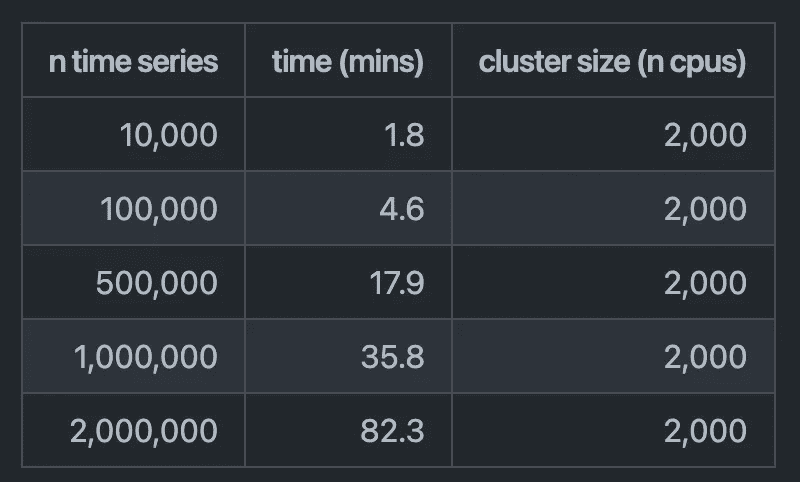
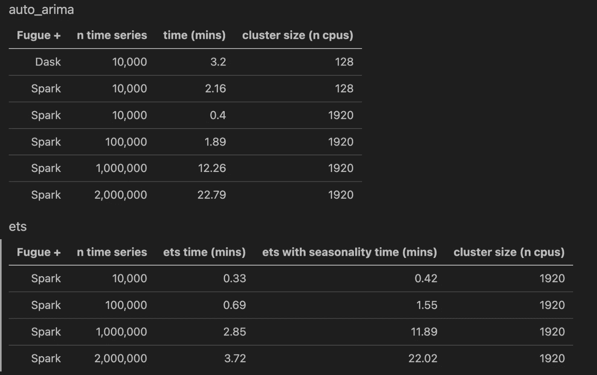

# 利用 Spark、Nixtla 和 Fugue 对 15 分钟以内的 1M 时间序列进行分布式预测

> 原文：<https://towardsdatascience.com/distributed-forecast-of-1m-time-series-in-under-15-minutes-with-spark-nixtla-and-fugue-e9892da6fd5c>

## 使用开源项目 StatsForecast、Fugue 和 Spark 进行可扩展的时间序列建模

由凯文·科、[汪涵](https://medium.com/u/6926bdc4ca1e?source=post_page-----e9892da6fd5c--------------------------------)、[马克斯·梅根塔尔](https://medium.com/u/76b639655285?source=post_page-----e9892da6fd5c--------------------------------)和[费德里科·加尔萨·拉米雷斯](https://medium.com/u/2855bd3e0293?source=post_page-----e9892da6fd5c--------------------------------)主演。

**TL:DR 我们将展示如何利用 Spark 的分布式能力和 StatsForecast 的高效代码在几分钟内拟合数百万个模型。**

对一段时间内收集的数据进行趋势和季节性的时间序列建模、分析和预测是一种快速增长的软件应用。

从电力和经济到医疗保健分析，企业每天都在收集时间序列数据，以预测模式并构建更好的数据驱动型产品体验。例如，温度和湿度预测用于制造以防止缺陷，流指标预测有助于识别音乐的流行艺术家，对供应链中不同位置的数千个 SKU 的销售预测用于优化库存成本。随着数据生成量的增加，预测的必要性已经从模拟几个时间序列发展到预测数百万个时间序列。

# 动机

[Nixtla](https://github.com/Nixtla) 是一个开源项目，专注于最先进的时间序列预测。他们有几个库，例如用于统计模型的 [StatsForecast](https://github.com/Nixtla/statsforecast) ，用于深度学习的 [NeuralForecast](https://github.com/Nixtla/neuralforecast) ，以及用于预测不同层级的聚合的 [HierarchicalForecast](https://github.com/Nixtla/hierarchicalforecast) 。这些是面向生产的时间序列库，侧重于不同的建模技术。

本文着眼于 [StatsForecast](https://github.com/Nixtla/statsforecast) ，这是一个拥有统计和计量经济学模型的快速预测库。Nixtla 的 AutoARIMA 模型比[的 pmdarima](http://alkaline-ml.com/pmdarima/) 快 20 倍，ETS(误差、趋势、季节)模型比[的 statsmodels](https://github.com/statsmodels/statsmodels) 快 4 倍，而且更稳健。要复制的基准和代码可以在[这里](https://github.com/Nixtla/statsforecast#-accuracy---speed)找到。性能提升的很大一部分是由于使用了名为 [numba](https://numba.pydata.org/) 的 JIT 编译器来实现高速度。

更快的迭代时间意味着数据科学家可以运行更多的实验，并更快地收敛到更准确的模型。这也意味着大规模运行基准测试变得更加容易。

在本文中，我们对 StatsForecast 库在使用[赋格](https://github.com/fugue-project/fugue/)库拟合 [Spark](https://spark.apache.org/docs/latest/api/python/index.html) 或 [Dask](https://github.com/dask/dask) 模型时的可伸缩性感兴趣。这种结合将允许我们在一个临时集群上快速地分布训练大量的模型。

# 实验设置

当处理大型时间序列数据时，用户通常必须处理数千个逻辑上独立的时间序列(想想不同用户或不同产品销售的遥测数据)。在这种情况下，我们可以在所有系列上训练一个大模型，或者我们可以为每个系列创建一个模型。这两种方法都是有效的，因为较大的模型将获得整个群体的趋势，而训练数千个模型可能更好地拟合单个系列数据。

*注意:要在一个模型中获得时间序列人口的微观和宏观趋势，请检查 Nixtla*[*hierarchical forecast*](https://github.com/Nixtla/hierarchicalforecast)*库，但这也是计算成本更高、规模更棘手的方法。*

本文将讨论我们为每个单变量时间序列训练几个模型(AutoARIMA 或 ETS)的场景。对于此设置，我们按时间序列对完整数据进行分组，然后为每个组训练每个模型。下图说明了这一点。分布式数据帧可以是 Spark 或 Dask 数据帧。


按分区自动排序—按作者排序的图像

Nixtla 之前发布了关于在 Ray 上分发这个模型训练的基准测试。设置和结果可以在这个博客中找到[。结果也如下所示。在 35 分钟内运行一百万个 AutoARIMA 模型需要 2000 个 CPU。我们将把它与在 Spark 上运行进行比较。](https://www.anyscale.com/blog/how-nixtla-uses-ray-to-accurately-predict-more-than-a-million-time-series)



光线结果的统计预测—图片由作者提供

# 统计预测代码

首先，我们将查看用于在[射线](https://docs.ray.io/en/latest/index.html)上分布式运行 AutoARIMA 的 StatsForecast 代码。这是运行一百万时间序列场景的简化版本。它还为最近的 StatsForecast v1.0.0 版本进行了更新，因此它看起来可能与以前基准测试中的代码有点不同。

射线上分布式运行状态预测

StatsForecast 的界面非常小。它已经被设计为对每组数据执行 AutoARIMA。只需提供`ray_address`就可以让这个代码片段分布式运行。如果没有它，`n_jobs`将指示用于预测的并行流程的数量。`model.forecast()`将在一个步骤中完成拟合和预测，并在时间范围内输入到该方法中进行预测。

# 用神游在 Spark 和 Dask 上运行

[Fugue](https://github.com/fugue-project/fugue) 是一个抽象层，将 Python、Pandas 和 SQL 代码移植到 Spark 和 Dask。最少的接口是`transform()`函数。这个函数接收一个函数和数据帧，并把它送到 Spark 或 Dask。我们可以使用`transform()`函数来激活 StatsForecast 的执行。

下面的代码有两个部分。首先，我们在`forecast_series`函数中定义了预测逻辑。为了简单起见，一些参数是硬编码的。最重要的是那个`n_jobs=1`。这是因为 Spark 或 Dask 已经充当了并行化层，拥有两级并行会导致资源死锁。

运行状态预测与神游火花

其次，`transform()`函数用于在 Spark 上应用`forecast_series()`函数。前两个参数是要应用的数据帧和函数。输出模式是 Spark 的一个需求，所以我们需要将它传入，分区参数将负责通过`unique_id`分割时间序列建模。

这段代码已经运行并返回一个 Spark DataFrame 输出。

# 尼克斯特拉氏河豚

上面的`transform()`是大致看看神游能做什么。实际上，Fugue 和 Nixtla 团队合作向 StatsForecast 库中添加了一个更加本地化的`FugueBackend`。伴随它的是一个实用的`forecast()`功能，用于简化预测界面。下面是对一百万个时间序列运行 StatsForecast 的端到端示例。

我们只需要创建 FugueBackend，它接收一个 SparkSession 并将其传递给`forecast()`。该函数可以采用数据帧或数据的文件路径。如果提供了文件路径，它将与并行后端一起加载。在上面的例子中，我们在每次运行实验来生成基准时都替换了这个文件。

同样重要的是要注意，我们可以在对完整数据运行`forecast()`之前进行本地测试。我们所要做的就是不为平行论证提供任何东西；一切都将在熊猫身上按顺序运行。

# 基准测试结果

基准测试结果如下所示。在撰写本文时，Dask 和 Ray 发布了最新版本，所以只有 Spark 指标是最新的。在用更新运行这些实验之后，我们将发表一篇后续文章。



Spark 和 Dask stats 基准测试大规模预测

*注意:我们试图使用 2000 个 CPU，但是受到 AWS 上可用计算实例的限制。*

这里重要的部分是 AutoARIMA 在不到 15 分钟的时间内训练了一百万个时间序列模型。集群配置附在附录中。用很少的几行代码，我们就能够分布式地编排这些时间序列模型的训练。

# 结论

分散地训练数千个时间序列模型通常需要使用 Spark 和 Dask 进行大量编码，但是我们能够用很少几行代码运行这些实验。Nixtla 的 StatsForecast 能够快速利用所有可用的计算资源，为每个时间序列找到最佳模型。所有用户需要做的就是提供一个相关的并行后端(Ray 或 Fugue)在集群上运行。

在一百万时间序列的规模上，我们对 AutoARIMA 的总训练时间为 12 分钟。这相当于我们立即运行了近 400 个 cpu 小时，允许数据科学家快速大规模迭代，而无需编写显式的并行化代码。因为我们使用了一个短暂的集群，所以成本实际上与在 EC2 实例上顺序运行这个集群(在所有内核上并行化)是一样的。

# 资源

1.  [Nixtla StatsForecast 回购](https://github.com/Nixtla/statsforecast)
2.  [统计预测文档](https://nixtla.github.io/statsforecast/)
3.  [赋格回购](https://github.com/fugue-project/fugue/)
4.  [赋格教程](https://fugue-tutorials.readthedocs.io/)

要与我们聊天:

1.  [赋格松弛](http://slack.fugue.ai/)
2.  [尼克斯特拉松驰](https://join.slack.com/t/nixtlaworkspace/shared_invite/zt-135dssye9-fWTzMpv2WBthq8NK0Yvu6A)

# 附录

对任何人来说。对集群配置感兴趣，可以看下面。这将启动 Databricks 集群。重要的是使用机器的`node_type_id`。

```
{
    "num_workers": 20,
    "cluster_name": "fugue-nixtla-2",
    "spark_version": "10.4.x-scala2.12",
    "spark_conf": {
        "spark.speculation": "true",
        "spark.sql.shuffle.partitions": "8000",
        "spark.sql.adaptive.enabled": "false",
        "spark.task.cpus": "1"
    },
    "aws_attributes": {
        "first_on_demand": 1,
        "availability": "SPOT_WITH_FALLBACK",
        "zone_id": "us-west-2c",
        "spot_bid_price_percent": 100,
        "ebs_volume_type": "GENERAL_PURPOSE_SSD",
        "ebs_volume_count": 1,
        "ebs_volume_size": 32
    },
    "node_type_id": "m5.24xlarge",
    "driver_node_type_id": "m5.2xlarge",
    "ssh_public_keys": [],
    "custom_tags": {},
    "spark_env_vars": {
        "MKL_NUM_THREADS": "1",
        "OPENBLAS_NUM_THREADS": "1",
        "VECLIB_MAXIMUM_THREADS": "1",
        "OMP_NUM_THREADS": "1",
        "NUMEXPR_NUM_THREADS": "1"
    },
    "autotermination_minutes": 20,
    "enable_elastic_disk": false,
    "cluster_source": "UI",
    "init_scripts": [],
    "runtime_engine": "STANDARD",
    "cluster_id": "0728-004950-oefym0ss"
}
```