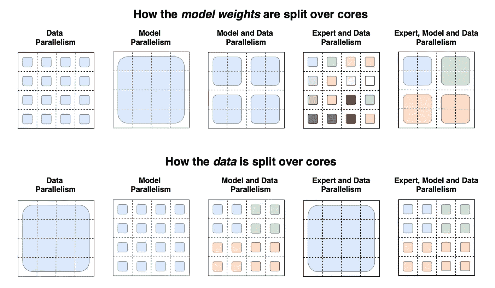

# 分布式并行训练:数据并行和模型并行

> 原文：<https://towardsdatascience.com/distributed-parallel-training-data-parallelism-and-model-parallelism-ec2d234e3214>

## 深度学习的分布式训练

## 如何在 PyTorch 中扩展培训大型模型，如 GPT-3 和达尔-E 2


马克·哈普尔在 [Unsplash](https://unsplash.com?utm_source=medium&utm_medium=referral) 上拍摄的照片

近年来，分布式并行训练的规模和深度学习模型的规模呈指数级增长。特别是，基于 Transformer 的语言模型已经抢尽了风头。臭名昭著的 GPT-3 爆发了 1750 亿个参数和 96 个关注层，批量大小为 3.2 米，单词为 4990 亿个。整整半年后，谷歌发布了拥有 1.6 万亿参数的[开关变压器](https://arxiv.org/abs/2101.03961)。同一天(2021 年 1 月 11 日)，北京人工智能研究院(BAAI)发布了初始的[悟道](https://en.wikipedia.org/wiki/Wu_Dao) 1.0。不久，悟道 2.0 于 2021 年 5 月 31 日首次亮相，成为最大的语言模型，拥有 1.75 万亿个参数，是 GPT-3 参数的十倍。

假设我们在亚马逊 SageMaker 训练平台的 **240** ml.p4d.24xlarge 实例上训练 GPT-3，整个模型将需要 [25 天](/distributed-parallel-training-model-parallel-training-a768058aa02a)来训练。挑战不仅仅是处理，还有记忆。吴涛 2.0 似乎需要超过 [1000 个 GPU 来存储它的参数。](https://youtu.be/tgB671SFS4w?t=418)

对于像 GPT-3 和 DALL-E 2 这样的深度学习大型模型，采用分布式并行训练势在必行。有两种主要类型的分布式并行训练:数据并行和模型并行。我们进一步将后者分为两个子类型:流水线并行和张量并行。我们将在这里涵盖所有分布式并行培训，并演示如何在 PyTorch 中开发。

## 了解分布式并行培训

分布式并行训练有两个高级概念:并行和分布。

> 并行是一种解决大型模型规模或提高训练效率的框架策略，分布式是一种向外扩展的基础架构。

除了这两种基本类型的并行，还有更多的变体，比如[专家并行](https://arxiv.org/pdf/2101.03961.pdf)。此外，它们可以混合两种或全部，如数据和模型混合并行。对于大规模模型，混合模型和数据并行是很常见的。例如，最大的 [T5](https://arxiv.org/abs/1910.10683) 型号和 [GPT-3](https://arxiv.org/abs/2005.14165) 采用模型和数据相结合的并行方式。然而，所有这些都应该是 DL 建模框架策略的一部分。

另一方面，分布最终会在云或集群中扩展并行性。容器化使扩展节点变得容易，Kubernetes 或云解决方案可以有效地编排它们。每个节点可以有多个 GPU(或 TPU 和其他设备)和容器群集中的各种容器。在云原生解决方案中，节点可以对用户隐藏。一个容器管理一个或多个 GPU。并行性可以跨分布式 GPU 容器集群进行调度。所以分布是基础架构的实现。



Google Switch Transformers 的数据和权重划分策略(来源: [Fedus 等人，2021](https://arxiv.org/pdf/2101.03961.pdf)

以上说明了 Google Switch 传输中的数据和权重划分策略。每个 4×4 虚线网格代表 16 个内核，阴影方块是该内核上的数据(模型权重或一批令牌)。它演示了如何为每个策略拆分模型权重和数据张量。**第一行**展示了模型权重如何在内核间分配。该行中不同大小的形状表示前馈网络(FFN)层中较大的权重矩阵(例如，较大的 dff 大小)。阴影方块的每种颜色标识一个唯一的权重矩阵。每个内核的参数数量是固定的，但是更大的权重矩阵将对每个令牌应用更多的计算。**第二行**展示了如何在内核间分割数据批次。每个内核持有相同数量的令牌，在所有策略中保持固定的内存使用量。分区策略具有不同的属性，允许每个内核在不同颜色的内核之间具有相同或不同的令牌。

## PyTorch 中的数据并行性

数据并行性使用相同的模型在所有内核之间分割数据。PyTorch 分布式数据并行、SageMaker 分布式和 Horovod 等数据并行框架主要完成以下三项任务:

1.  首先，它创建并分发模型的副本，每个加速器一个副本。
2.  它对数据进行分片，然后将其分发给相应的设备。
3.  它最终在反向传播步骤中将所有结果聚集在一起。

因此我们可以看到，第一个任务应该在每次训练中出现一次，但最后两个任务应该在每次迭代中出现。

PyTorch [分布式数据并行](https://pytorch.org/tutorials/intermediate/ddp_tutorial.html) (DDP)实现了模块级的数据并行，可以跨多台机器运行。它可以与 PyTorch 模型并行工作。DDP 应用程序应该生成多个进程，并为每个进程创建一个 DDP 实例。DDP 使用`torch.distributed`包中的集体通信来同步梯度和缓冲区。此外，DDP 为来自`model.parameters()`的每个参数注册了一个*自动签名的*钩子，当在向后传递中计算出相应的梯度时，它将触发。然后，DDP 使用该信号触发过程间的梯度同步。

因此，在 PyTorch 中设置和运行 DDP 有三个主要步骤:

1.  通过`torch.distributed`建立分布式系统。
2.  通过`torch.nn.parallel`定义 DDP 建模。
3.  产卵贯穿`torch.multiprocessing`。

请参见下面的示例代码。

```
**import** **torch
import** **torch.nn** **as** **nn
import** **torch.distributed** **as** **dist**
**import** **torch.multiprocessing** **as** **mp****from** **torch.nn.parallel** **import** **DistributedDataParallel** **as** **DDP** ### ***Step 1***: *setup and cleanup setups*
**def** **setup(rank,** **world_size):
    ...** *# initialize the process group*
    **dist.init_process_group(**"tst"**, rank=rank, world_size=world_size)**

**def** **cleanup():**
    **dist.destroy_process_group()** ### ***Step 2***: *define DDP modeling*
**def** **dummy_init(rank,** **world_size):**
    **setup(rank,** **world_size)**
    **model** **=** **DummyModel().to(rank)**
    **ddp_model** **=** **DDP(model,** **device_ids=[rank])** **...** **cleanup()** ### ***Step 3***: *Spawn to run*
**def** **run_dummy(dummy_fn,** **world_size):**
    **mp.spawn(dummy_fn,**
             **args=(world_size,),**
             **nprocs=world_size,**
             **join=True)**
```

## PyTorch 中的模型并行性

与数据并行不同，模型并行将模型(即其层或张量)分割到多个内核，为所有训练内核复制相同的模型。PyTorch 减轻了并行实现的负担，并对其进行了最小的修改。

简而言之，在调用损失函数时，您需要通过三个相应的区域中的“`to(device)`”来指定神经网络层和到所需内核的即时输出:建模定义，“`forward`”方法和“`backward`”方法。PyTorch 将在幕后处理所有其他的事情。请在此处查看示例代码[。](/distributed-parallel-training-model-parallel-training-a768058aa02a)

在大模型并行的现实世界中，这可能并不简单。它通常需要额外的努力来提高培训效率和资源利用率。以流水线并行为例， [PipeDream](https://dl.acm.org/doi/10.1145/3341301.3359646) 通过牺牲内存来存储权重的多个副本，提高了流水线效率。 [TeraPipe](https://arxiv.org/abs/2102.07988) 引入了另一种特定于单变压器架构的流水线技术，这种流水线技术是跨令牌而不是微批处理进行的。此外， [Mesh-TensorFlow](https://arxiv.org/abs/1811.02084) 和 [Megatron-LM](https://arxiv.org/abs/1909.08053) 分别基于 TensorFlow 和 PyTorch 创建了用于优化训练十亿参数模型的张量并行框架。

Amazon sage maker[model parallelism](https://arxiv.org/pdf/2111.05972.pdf)是 PyTorch 之上的一个软件库。它是一个通用而灵活的框架，支持流水线和张量并行，具有节省内存的特性。其流水线并行引擎支持基于*模块-服务器*设计的任意模型架构的负载平衡自动分区和流水线运行时。与流水线并行一样，张量并行的基本计算单位是`nn.Module`。本质上，张量并行性在于遍历模型并用它们的分布式实现替换模型的特定子模块。

## 外卖

分布式并行训练有并行和分布两个高级概念。**并行是框架策略，分发是基础架构。**分布式并行培训至关重要，但在行业和研究中仍处于萌芽状态。我们可以期待未来会出现三个创新领域。

1.  并行性分割数据、模型或混合数据，以进行大型模型训练。随着数据和模型呈指数级增长，**优化内存使用和处理效率**变得至关重要。
2.  训练一个大模特很贵。**复用训练层的迁移学习**将改变大规模分布式并行训练的游戏。
3.  ML 生命周期涉及多个分布式系统，从数据收集到处理、模型训练和服务。ML 平台经常受到复杂性、数据通信成本和系统不稳定性的阻碍。统一 ML 的所有分布式系统意义重大。

## 参考

1.  亚马逊 SageMaker 模型并行性:大型模型训练的通用灵活框架:[https://arxiv.org/abs/2111.05972](https://arxiv.org/abs/2111.05972)
2.  开关变压器:用简单有效的稀疏性扩展到万亿参数模型:【https://arxiv.org/abs/2101.03961 
3.  语言模型是很少出手的学习者:【https://arxiv.org/abs/2005.14165 