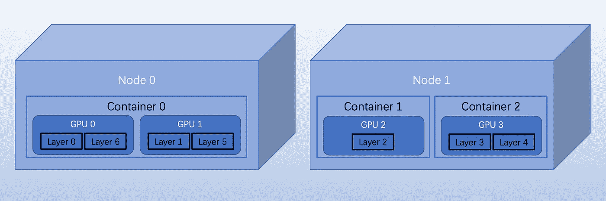

# 分布式并行训练—模型并行训练

> 原文：<https://towardsdatascience.com/distributed-parallel-training-model-parallel-training-a768058aa02a>

## 分布式培训

## PyTorch 中大模型的分布式模型并行训练


丹妮拉·奎瓦斯在 [Unsplash](https://unsplash.com/s/photos/landscape?utm_source=unsplash&utm_medium=referral&utm_content=creditCopyText) 上的照片

近年来，深度学习模型的规模和分布式并行训练的挑战呈指数级增长。例如，著名的 GPT-3 有 1750 亿个参数和 96 个关注层，批量大小为 3.2 M，字数为 4990 亿。亚马逊 SageMaker 训练平台在 120ml . p4d . 24x 大型实例和 1750 亿个参数上可以达到每秒 32 个样本的吞吐率。如果我们将此增加到 240 个实例，完整的模型将需要 25 天来训练。

对于大型模型，在 GPU 上训练并行性变得非常必要。有三种典型的分布式并行训练类型:分布式数据并行、模型并行和张量并行。我们常常把后两种归为一类:模型并行，再分为流水线并行和张量并行两个亚型。我们将在这里重点介绍分布式模型并行训练，并演示如何在 PyTorch 中进行开发。

## 了解分布式模型并行训练

模型并行性在多个 GPU 之间分割模型，这与数据并行性为所有训练 GPU 复制同一模型不同。模型并行训练有三个关键点:1 .如何有效地分割模型的层；2.如何并行而不是顺序地训练分片层；3.如何设计优秀的节点间吞吐量？如果我们不能平衡碎片或者并行运行它们，我们就不能实现模型并行的目标。

分布式训练是一种在集群或资源池中具有多个节点的训练并行性。容器化使得扩展节点变得容易，Kubernetes 很好地协调了它们。每个节点可以有多个 GPU 和多个容器。一个容器可以控制一个或多个 GPU。模型并行性可以跨分布式 GPU 节点集群分派模型的各层。这种方法可以有效地扩展培训。

我们可以在下面举例说明分布式模型并行训练。



模型并行性解释(作者)

在上面的示例中，集群中有两个节点。每个节点有一个或两个容器，每个容器也有一个或两个 GPU。模型的七层分布在这些 GPU 上。

每个 GPU 或节点都有资源限制。模型并行性使培训能够并行化，而分布式培训最终可以横向扩展。

## PyTorch 中的模型并行性

上面的描述表明，分布式模型并行训练有两个主要部分。为了实现这一点，有必要在多个 GPU 中设计模型并行性。PyTorch 对此进行了包装并减轻了实现负担。PyTorch 只有三个小变化。

1.  使用“`to(device)`”来标识模型的特定层(或子网)的特定设备(或 GPU)。
2.  相应地添加一个“`forward`”方法，在设备间移动中间输出。
3.  调用损失函数时，指定同一设备上的标签输出。而“`backward()`”和“`torch.optim`”会像在单个 GPU 上运行一样自动处理渐变。

让我们写一些伪代码来说明它。假设在两个 GPU 上运行一个简单的两层模型，将每个线性层放在每个 GPU 上，并将输入和中间输出相应地移动到相关层 GPU 上。我们可以如下定义虚拟模型:

```
**import** **torch**
**import** **torch.nn** **as** **nn****class** **DummyModel(nn.Module):**
    **def** __init__**(**self**):**
        super**(DummyModel,** self**).**__init__**()**
        self**.net0** **=** **nn.Linear(**20**,** 10**).to(**'cuda:0'**)**
        self**.relu** **=** **nn.ReLU()**
        self**.net1** **=** **nn.Linear(**10**,** 10**).to(**'cuda:1'**)**

    **def** **forward(**self**,** **x):**
        **x** **=** self**.relu(**self**.net0(x.to(**'cuda:0'**)))**
        **return** self**.net1(x.to(**'cuda:1'**))**
```

现在我们可以用下面的损失函数添加训练代码:

```
**import** **torch**
**import** **torch.nn** **as** **nn
import** **torch.optim** **as** **optim
import** **DummyModel****model** **=** **DummyModel()**
**loss_fn** **=** **nn.MSELoss()**
**optimizer** **=** **optim.SGD(model.parameters(),** **lr=**0.001**)**

**optimizer.zero_grad()**
**outputs** **=** **model(torch.randn(**30**,** 10**))**
**labels** **=** **torch.randn(**30**,** 10**).to(**'cuda:1'**)**
**loss_fn(outputs,** **labels).backward()**
**optimizer.step()**
```

同样的想法可以很快扩展到更复杂的模型。我们可以在一个`Sequential`中分组多个层，通过`to(device).`分配到一个特定的 GPU 上，当然还有更多优化并行效率的改进，这里就不赘述了。

## TL；速度三角形定位法(dead reckoning)

分布式模型并行训练有两个主要概念。模型并行实现了训练无法在单个 GPU 或设备上运行的大型模型。分布式培训可以通过在分布式设备之间划分模型来有效地向外扩展。PyTorch 和其他库(如 SakeMaker)通过最小的修改使生活变得更容易，尽管它在内部实现起来很复杂。

## 参考

<https://arxiv.org/abs/2111.05972>    <https://aws.amazon.com/blogs/machine-learning/deploy-large-models-on-amazon-sagemaker-using-djlserving-and-deepspeed-model-parallel-inference/>    <https://aws.amazon.com/blogs/machine-learning/train-175-billion-parameter-nlp-models-with-model-parallel-additions-and-hugging-face-on-amazon-sagemaker/> 