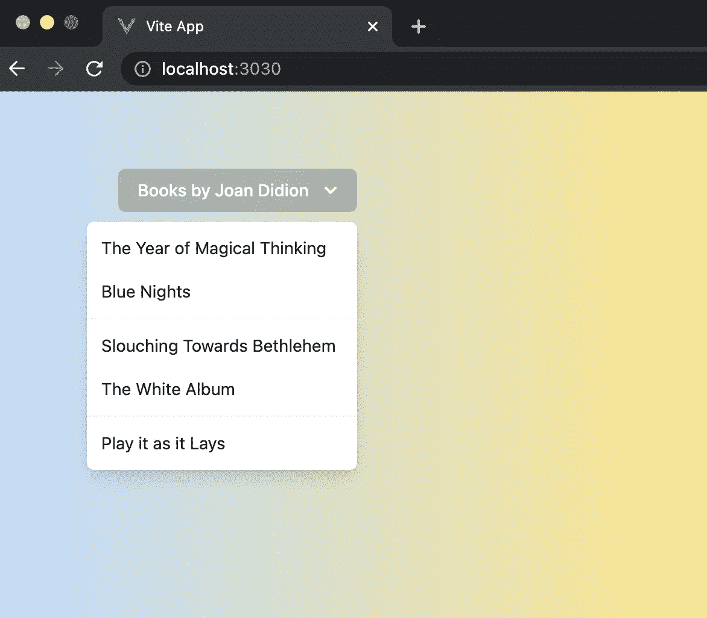

# 深入现代 Web 部署:构建动态应用程序快速入门指南

> 原文：<https://towardsdatascience.com/dive-into-modern-web-deployment-quickstart-guide-on-building-dynamic-applications-9e1eb2979f1e>

## 用顺风 CSS 创建 Vue 应用


马克·哈普尔在 [Unsplash](https://unsplash.com?utm_source=medium&utm_medium=referral) 上拍摄的照片

对于构建动态应用程序的工具和工作流有足够的选择。经过一段时间的研究，你可能会同意我的观点，Vue 和 Tailwind CSS 在列表中名列前茅。对我来说，合乎逻辑的下一步是在做出承诺之前尝试一下。写这篇文章的目的是让你不用花太多时间就能体验一下这个设置，这样你就可以自己做决定了。

# 概观

Vue 是一个渐进式的 JavaScript 框架，这意味着你可以在了解整体之前就开始使用它。

Vue 的目标是构建用户界面，但要有风格。换句话说，Vue 需要使用 CSS 框架。Tailwind 是 CSS 领域的一颗新星，如果你耐心地给 Tailwind 一个机会，它会越来越吸引你。我喜欢顺风顺水的时尚和清新，相比之下，Bootstrap 的商业证明，但往往很无聊。

将 Vue 与 Tailwind CSS 集成的两种显而易见的方法是:1)用 Tailwind 初始化项目，然后添加 Vue，或者 2)在 Vue 中初始化，然后添加 Tailwind

我的经验表明，后者效果更好。来自顺风网站的文档比来自 Vue 网站的文档更准确。让我们通过以下步骤开始集成:

*   创建 Vue 应用程序
*   将 Tailwind 安装到应用程序中

# 在 Vue 中创建应用程序

要创建您的项目，请运行`npm init vite project-name`。您应该看到这个:

```
% **npm init vite v901**Need to install the following packages:
create-vite
Ok to proceed? (y)✔ **Select a framework:** › vue
✔ **Select a variant:** › vueScaffolding project in /Users/seanzhai/www/v901...
Done. Now run:cd v901
npm install
npm run dev
```

最后一个命令`npm run dev`现在不需要。不过测试一下也无妨。它在端口 3000 上创建一个本地 web 服务器。您可以在任何浏览器中验证这一点。

## 配置开发服务器

您可能注意到了 *vite* 开发服务器运行在本地主机的端口 3000 上。如果你想让你的开发服务器可以被其他机器访问，你可以通过改变`vite.config.js`文件来实现。

```
export default defineConfig({
  plugins: [vue()],
  server: {
 **port: '3030',
    host: '0.0.0.0'**
  }
})
```

通过如上所示的设置，当你做`npm run dev`时，你可以看到你在 3030 端口上服务于世界。你可能知道你可能需要注意你的防火墙设置来使它工作。

# 安装顺风 CSS

安装 Tailwind 并创建其初始配置。

```
npm install -D tailwindcss@latest postcss@latest autoprefixer@latest
npx tailwindcss init -p
```

第二个命令生成了文件`tailwind.config.js`。编辑行`content`，使文件如下所示。

```
module.exports = {
 **content: [
    "./vitesrc/index.html",
    "./vitesrc/**/*.{vue,js,ts,jsx,tsx}",
  ],**
  theme: {
    extend: {},
  },
  variants: {
    extend: {},
  },
  plugins: [],
}
```

然后，在`src`文件夹下创建`index.css`。

```
/* ./src/index.css */
@tailwind base;
@tailwind components;
@tailwind utilities;
```

`src`用于所有源代码，下面有一个文件夹`components`用于存放 Vue 组件。我们需要将 index.css 文件导入 main.js，这是所有 app 的入口。

```
// src/main.js
import { createApp } from 'vue'
import App from './App.vue'
**import './index.css'**createApp(App).mount('#app')
```

到目前为止，您应该有一个支持 Tailwind CSS 的功能性 Vue 应用程序。祝贺您成功整合。

# 顺风美丽的 Vue

对 Tailwind 最常见的批评是缺乏预建组件，这可能是有 bootstrap 背景的人拒绝 Tailwind 的主要原因。

顺风的补救措施是推广 tailwindui.com 的付费服务。如果预算不是问题，你当然可以试一试；它展示了许多布局和小工具，但它们不容易用作模板。您需要花费一些努力来适应 tailwindui 提供的组件。

我发现最有用的是 Headless UI，它是专门为使用 Tailwind 而设计的。是 tailwindui 背后的同一批人开发的。

## 安装和第一步

无头 UI 安装非常容易。

```
npm install @headlessui/vue @heroicons/vue -D
```

看一下它的官方网站。

[](https://headlessui.dev/) [## 无头用户界面

### 完全非风格化的、完全可访问的 UI 组件，旨在与 Tailwind CSS 完美集成。

headlessui.dev](https://headlessui.dev/) 

注意它的组件支持 *React* 和 *Vue* 。默认设置是 React，请在进入特定组件前点击 *Vue* 。我曾经忘记了这一点，无意中进入 React 部分，我发现代码有点奇怪。出于比较的好奇，要达到相同的结果，Vue 中需要的行数几乎总是比 React 中少。

## 使用无头用户界面风格化

花一点时间剖析一个组件可以学到很多东西。菜单(下拉菜单)就是一个很好的例子。让我们一起使用 Visual Studio 代码来完成这项工作。

用 VS 代码打开项目根文件夹，定位`src`。创建了一个名为`components`的文件夹，然后添加了一个文件`Dropdown.vue`。让我们用琼·狄迪恩最著名的书来填充菜单。该文件如下。它基于 HeadlessUI 网站上的示例。我把它简化了一点，使它成为一个独立的页面，这样更容易理解。

要使用这个组件，我们只需要从主应用程序中引用它。我添加了一些基本样式，使组件易于查看。

结果看起来像这样:



带有顺风 CSS 的 Vue 中的 HeadlessUI 组件示例|来源:Sean Zhai

# 收场白

Vue 和 Tailwind 都是很神奇的工具。我最喜欢使用 Vue 和 Tailwind 的地方是，它让你大部分时间都呆在同一个上下文中，没有在 JavaScript、CSS 和 HTML 文件之间跳跃；开发服务器的自动重新加载也节省了时间。这是一个让你进步的工作流程，你会发现自己变得更有效率，压力更小。

它既有趣又美丽。