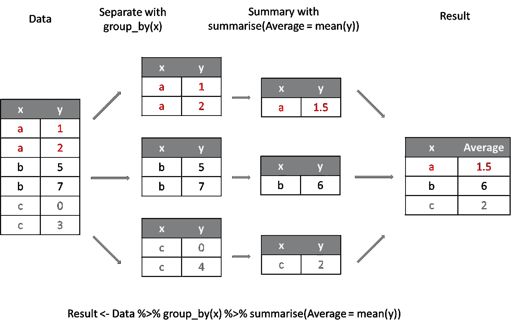
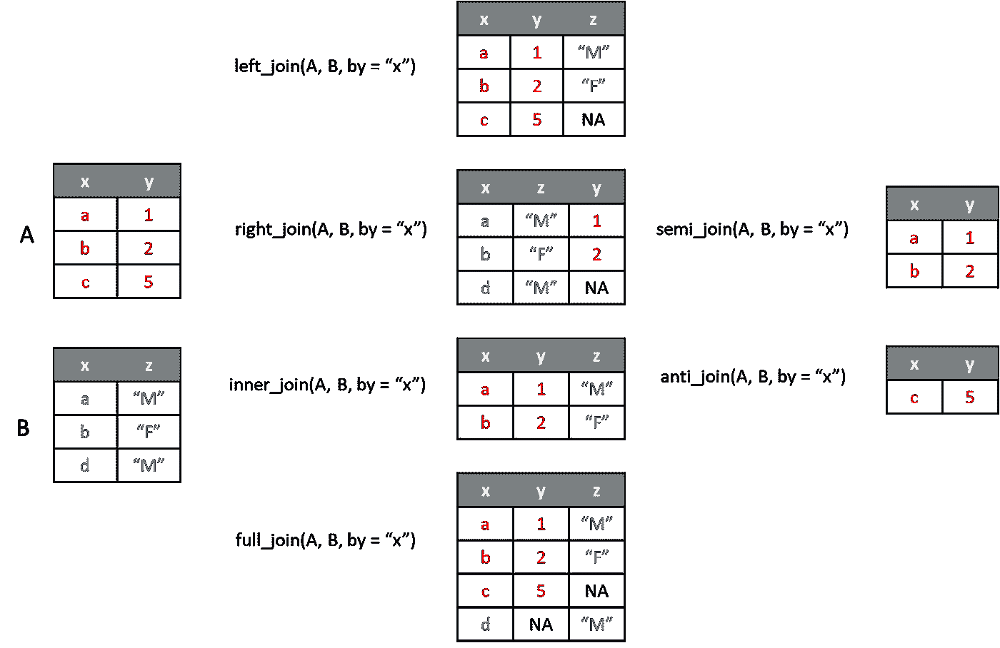
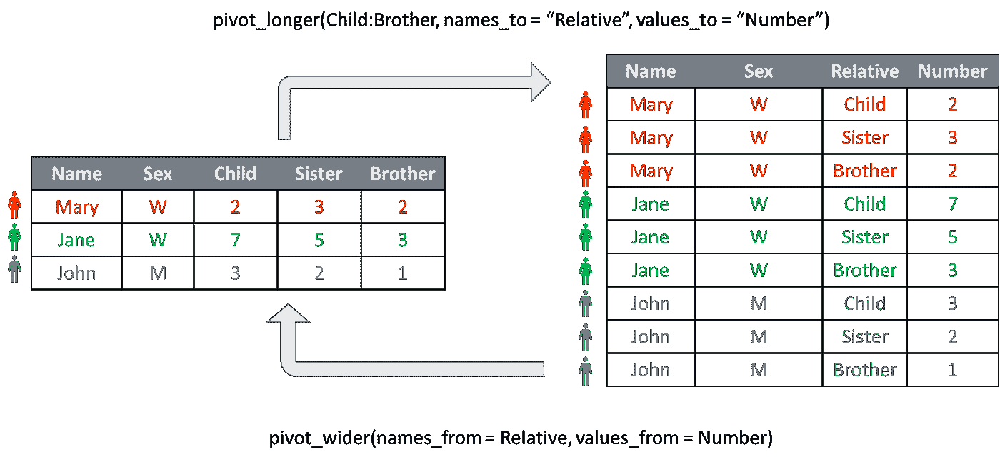

# 利用泰坦尼克号的数据潜入潮汐湖

> 原文：<https://towardsdatascience.com/diving-into-the-tidyverse-using-the-titanic-data-83f54295d5df>

## 使用 R 的 dplyr 和 tidyr 软件包提取见解

Max van den Oetelaar 在 [Unsplash](https://unsplash.com/s/photos/organized?utm_source=unsplash&utm_medium=referral&utm_content=creditCopyText) 上拍摄的照片

如今，数据比以往任何时候都更容易获得。我们可以很容易地通过互联网上的许多资源找到我们感兴趣的东西。然而，当试图从数据中得出结论时，我们很快意识到，尽管这些数据很容易找到，但其格式并不能用于更详细的分析。当几个人试图合作进行某项研究时，也会出现同样的问题。如果他们之前没有就如何标记和输入数据达成一致，每个人很可能会提出自己的系统。这最终会导致共享和分析数据时的混乱。这些问题产生了对独特的数据组织系统的需求。

列夫·托尔斯泰在他的作品《安娜·卡列尼娜》中表达了这样的思想:

> 所有幸福的家庭都是相似的；每个不幸的家庭各有各的不幸。

引用这句话，R 中编程的远见者之一 Hadley Wickham 用下面的话解决了数据组织的问题:

> 整洁的数据集都是相似的，但每一个杂乱的数据集都有自己的杂乱之处。

有了整齐的数据，每一行就是一个观察值，每一列就是一个变量。假设我们按马力和重量列出汽车的类型。有序组织的数据将包含三列:汽车类型、马力和质量。因此，通过查看一行数据，我们将获得一种类型汽车的所有信息。聚焦于一个数据列将提供关于所有类型汽车的单个属性(例如质量)的信息。

为了将数据转换成一种整洁的格式，Hadley Wickham 开发了`tidyverse`——一套软件包，包括以下软件包:`dplyr`、`tidyr`、`ggplot2`、`purrr`、`readr`和`tibble`。在下面的文本中，我们将重点关注用于数据争论的这些包的子集- `dplyr`、`tidyr`和`tibble`。

尽管`tidyverse`提出了一套一致且有效的方法来转换和可视化数据，但强调两点还是很重要的:

*   使用基本的 R 函数可以获得使用`tidyverse`函数获得的结果(尽管通常以更复杂/更不直观的方式)
*   r 是一种编程语言，`tidyverse`是一组旨在促进数据转换和可视化的包。换句话说，`tidyverse`包不能解决我们可能遇到的所有问题，所以了解 R 编程的基础也很重要。

# 泰坦尼克号数据集

NOAA 在 [Unsplash](https://unsplash.com/s/photos/titanic?utm_source=unsplash&utm_medium=referral&utm_content=creditCopyText) 上拍摄的照片

在下文中，我将介绍`dplyr`、`tidyr`和`tibble`软件包最重要的功能。我将展示如何使用这些函数来执行数据清理和探索性数据分析中涉及的各种常见任务。我将使用最著名的船只之一泰坦尼克号的乘客数据。

作为第一步，我们必须加载必要的包，并研究我们将使用的数据的结构。除了数据争论包，我们还必须加载包含所需数据的`titanic`包。

Titanic 数据集是一个`data.frame`类型的对象。因此，如果我们打印 Titanic 数据集，将返回全部 891 行。由于这样的布局既笨拙又麻烦，所以我使用 base R `head`函数只打印了前十行。为了绕过这个问题，`tibble`包引入了一个`tibble`数据类型。这种类型对`data.frame`类进行了改进，在显示数据集时只打印前十行。它还打印出数据集的行数和列数以及每列的数据类型。

甚至`head`函数也可以改进，因为它不指示列数据类型，并且当有许多变量(许多列)时，它不显示所有变量，而是只显示屏幕上能容纳的数量。相反，我们可以使用`glimpse`命令显示打印输出的转置版本，以获得更完整的数据概览。

我们可以看到，数据包含 12 个变量:乘客序列号(PassengerId)、二进制乘客生存变量(Survived)、乘客类别(Pclass)、姓名(name)、性别(sex)、年龄(age)、机上兄弟姐妹和配偶人数(Sibsp)、机上子女/父母人数(Parch)、票号(ticket)、已付车费(fare)、客舱号(cabin)和乘客的登机地点(Embarked)。

# 管道%>%运算符

照片由[西格蒙德](https://unsplash.com/@sigmund?utm_source=unsplash&utm_medium=referral&utm_content=creditCopyText)在 [Unsplash](https://unsplash.com/s/photos/pipe?utm_source=unsplash&utm_medium=referral&utm_content=creditCopyText) 上拍摄

在继续分析之前，我想介绍一下管道操作符。管道操作符的优点是能够绑定函数。更准确地说，它将一个函数的结果作为第一个参数传递给序列中的下一个函数。乍一看，这似乎不是很有用，但是当使用许多函数的组合时，它极大地增加了代码的清晰度。让我们看一个例子。

管道运算符使我们能够从左到右阅读作文，就像我们在阅读一本书一样！一旦你习惯使用它，我保证你永远不会回头。这就是为什么，即使没有它所有的 R 函数都可以使用，我将在这篇文章的剩余部分使用管道。

# 使用 dplyr 包提取信息

`dplyr`包包含的函数有助于数据操作以提取有意义的见解。它在一定程度上受到 SQL(结构化查询语言)的启发，所以那些有 SQL 背景的人可能会发现它们非常直观。

## 重命名列

我们将从使用`rename`重命名列开始，以便使它们更容易理解。

通过使用`rename_with`函数将一个函数应用于多个列，也可以进行重命名。例如，我们可能更喜欢所有变量名都用小写字母书写的约定:

## 根据名称选择列

我们通常对所有的数据集变量都不感兴趣。`select`函数允许我们对感兴趣的列进行子集划分。

如果所需的列在初始数据框中相邻放置，还有一种更简单的方法来选择它们:

如果我们只想选择姓名和与船上亲属数量相关的变量，该怎么办？当然，我们可以再次使用第一个例子中的技术。然而，`select`也可以与大量的帮助功能结合，使这些任务更快更容易执行。例如，`contains`助手允许我们通过部分列名进行搜索。如果我们注意到与亲戚数量相关的两个变量都包含下划线符号，我们就可以使用这个。

类似于`contains`功能，我们也可以使用`starts_with`和`ends_with`功能。要获得所有帮助函数的列表和解释，您可以通过在 R 控制台中键入`?select`来查阅帮助文件。

也可以通过指定我们想要从数据中删除的列来执行列选择。这是通过在不需要的列的名称前放置减号来实现的。

让我们通过删除机票、客舱号和与机上亲属/配偶人数相关的列来简化数据集:

## 基于值的列选择

如果我们只对包含数值的列感兴趣呢？我们可以手动查找变量类型，然后按照上一小节中的步骤操作。

幸运的是，这个繁琐的任务可以自动化，因为通过将`select`和`where`函数组合起来，也可以基于存储在其中的值来执行列选择。

## 使用 mutate 转换现有列或添加新列

`mutate`功能允许我们使用外部数据或数据框中已有的数据转换现有列或创建新列。

r 有一个方便的内置`factor`类，当分类变量的可能值(级别)有限时，应该使用这个类。我们可以看到性别变量有这样的性质。`mutate`使我们能够改变列数据类型:

你们中的一些人可能也想缩写性别值。这可以使用`case_when`功能来完成:

## 一次转换多列

你们中的一些人可能已经注意到，将 Survived 和 also 列的数据类型从字符转换为因子也不错。

我们可以通过应用`mutate` + `across`组合来同时转换多个列，而不是通过逐个指定列来实现。`across`函数指定要转换的列和要应用的函数。

在讨论`select`函数的应用时，也可以使用提到的辅助函数来选择`across`函数中的列。

## `Filter`数据框行

`filter`函数用于从数据中提取观察值的子集。因此，它可以用来回答关于机上不同乘客群体的问题。

坠机事件中幸存的乘客比例是多少？

只有三分之一多一点的乘客幸免于难。乘客性别对存活率有影响吗？

乘客中女性的比例是多少？

坠机事件中幸存的女性乘客比例是多少？

因此，尽管女性乘客人数较少，但她们的生还几率大约是男性的两倍。当然，这是意料之中的，因为妇女和儿童在救援任务中享有优先权。

接下来，我们将检查存活率如何根据乘客等级而变化。

如果你在下层阶级旅行，生还的机会会更低。这可能是由于富裕乘客的影响，也可能是由于头等舱更靠近救援船停靠的甲板。

还有`filter`帮助函数`if_any`和`if_all`，允许我们一次过滤多个列。这些可用于执行移除具有缺失值的观测值的常见任务。

## `Arrange`基于列值的行

照片由[托尔加·乌尔坎](https://unsplash.com/@tolga__?utm_source=unsplash&utm_medium=referral&utm_content=creditCopyText)在 [Unsplash](https://unsplash.com/s/photos/order?utm_source=unsplash&utm_medium=referral&utm_content=creditCopyText) 上拍摄

通常，我们希望根据感兴趣的特定标准对数据进行排序。这是使用`arrange`通过`dplyr`完成的。我们先按年龄升序对乘客进行排序，然后按姓名字母顺序对同龄乘客进行排序。默认情况下，排序是升序，但是可以使用`desc`命令来进行降序排序。

从这个输出，我们可以假设老年乘客更可能是男性而不是女性。此外，年龄较大的乘客似乎是等级较高的乘客。对我来说，这是一个看似合理的说法，因为我知道泰坦尼克号从英国驶向美国，载着许多人寻找新的机会和更好的生活。我认为这样的人会更年轻，因为年纪大的人没有动力搬走。我们将能够用下面两个小节中介绍的工具回答所有这些问题。

## 用`summarise`获取列汇总统计

安妮·尼加德在 [Unsplash](https://unsplash.com/s/photos/numeric-summary?utm_source=unsplash&utm_medium=referral&utm_content=creditCopyText) 上拍摄的照片

当我们对单个值不感兴趣，而是对数据集的汇总统计数据感兴趣时，这个命令非常有用。让我们计算一下乘客的平均年龄。

我们得到了意想不到的结果。这是因为数据中的“漏洞”已被替换为 NA(“不可用”，缺少数据)。我们可以通过在计算汇总统计数据之前过滤数据帧以排除年龄未知的乘客来解决这个问题。在过滤时，我们使用一个特殊的命令来测试数据是否属于`NA` - `is.na`类型。

就像使用`mutate`，`summarise`也可以与`across`结合使用，以便一次获得多个列的摘要。

为了回答年龄差异取决于性别和乘客等级的问题，我们可以首先过滤感兴趣的人群，然后计算所需的汇总。然而，这种方法要求我们每次都要写一份新的总结，类似于我们根据乘客等级计算存活率的方法。为了避免这种情况，我们将使用下一小节中介绍的`group_by`函数。

## 使用`group_by`根据分类属性对观察值进行分组

就其本身而言，`summarise`函数并不那么有用，但是与`group_by`函数配合使用，它可以快速汇总所有级别的分类变量的信息。`group_by`函数根据某个变量的类别将数据分组。然后使用`summarise`将感兴趣的函数分别应用于这些组中的每一组，并将结果组合回单个数据帧。

group_by 如何在幕后工作。图片作者。

这种结合最终使我们能够优雅地回答早先提出的假设。

船上 55 岁以上的男性比我们多三倍，所以看来我们的第一个假设是正确的。

让我们也检查一下关于阶级相关的年龄差异的第二个假设:

我们的预感似乎得到了数据的支持，因为乘客等级和年龄之间确实存在关联。

请注意，这种方法也使我们能够更容易地找出基于乘客等级的生存差异，这在`filter`小节中讨论过。

与`summarise`功能类似，`group by`命令可以与`mutate`和`filter`命令结合使用。

让我们创建一个变量，根据性别按年龄对乘客进行排名。`rank`命令将帮助我们从最小到最大为一组值分配一个序数。与`arrange`命令一样，使用`desc`可以颠倒默认顺序。

例如，将`group_by`与`filter`结合起来，我们可以得到每种性别的三名最年长乘客的列表。

结果与我们之前的结论一致，因为年龄最大的女性乘客比年龄最大的男性年轻 17 岁。

事实证明，还有一个方便的`slice_max`函数可以达到同样的目的，所以上面的片段应该只是作为一个教育的例子。

要取消分组，我们使用`ungroup`功能。建议在任何涉及分组的转换结束时这样做。这是因为忘记我们已经根据一些变量对数据进行了分组，可能会在进一步的分析中导致意想不到的结果。

## 组合/匹配数据帧的功能

联接函数的工作原理。图片作者。

此前，在计算平均年龄时，我们注意到泰坦尼克号的数据是不完整的。让我们看看这些乘客是谁:

幸运的是，泰坦尼克号的失事如此著名，以至于有许多网页专门列出乘客及其背景。因此，我们可以创建一个新的数据框，其中包含一些数据缺失的乘客的姓名和年龄。

由于丢失的数据分散在 Titanic 数据集中(看看 PassengerId 值，它实际上只是行号)，很难手工追加额外的信息。这些类型的问题可以通过`left_join`来解决，这是一种基于公共标识变量将数据从一个数据帧添加到另一个数据帧的功能。

请注意，我们有 Age.x 和 Age.y，而不是单个年龄变量。这是为了让我们能够辨别年龄变量来自哪个数据框。我们可以使用`mutate`和`case_when`将两个年龄列合并成一个。

# 与 tidyr 一起整理

顾名思义，`tidyr`包包含将数据帧转换成整齐格式的命令。泰坦尼克号的数据框架已经很整洁了，因为每一行代表一个乘客，每一列代表一个独立的乘客特征。然而，数据集通常不是这样。此外，在某些情况下，如绘图，可能需要“不整洁”的格式。下一小节将说明这样一个例子。

## 使用 pivot_wider 和 pivot_longer 进行宽长格式转换

这些可能是`tidyr`包中最有价值的功能。当我们想要将多个列转换成具有多个子组的单个列时,`pivot_longer`函数非常有用。下图说明了这是如何工作的。

枢纽函数的工作原理。图片作者。

左边的表格包含三个相关的列，它们都代表一种相对类型。知道了这一点，我们可能希望将它们分组到一个“相对”列中。这使得数据更长(因此函数名也更长)。此外，它变得凌乱，因为同一个人是由三个独立的行代表。我们为什么要这么做？

如果我们想做一个条形图，在水平轴上显示相对类型，我们必须提供一个变量。我们可以用右边的格式做到这一点，但不能用左边的格式。

现在让我们展示如何将这些转换应用到泰坦尼克号数据上。为了便于理解转换，我们将只选择 Titanic 数据帧的前三行:

通过应用`pivot_longer`，我们可以使用更少的列显示相同的数据。例如，我们可以有一个乘客姓名列和两个包含乘客属性所有信息的列(乘客级别、年龄、性别、生存)。为什么属性有两列而不是一列？因为一列必须包含有关所讨论的属性的信息，另一列必须包含该属性的值。因为我们要组合数字和字符值，所以我们必须首先将所有值转换为相同的类型(字符)。

正如所料，行数增加了 7 倍，因为现在我们必须重复每个乘客的姓名 7 次——对 Parameter_name 列中的每个参数重复一次。当然，与上图中的例子相反，以这种方式对参数进行分组是没有意义的，因为它们是不相关的。但是，如果您经常处理数据，这些类型的问题将是最不重要的，因为输入至少是一致的。您可能永远也不会自己创建这样的数据，但是我在这里这样做是为了向您展示当有人把它带过来时，如何摆脱这种混乱(相信我，最终会有人这样做……)。

作为`pivot_longer`函数的逆函数，`pivot_wider`就是答案。

当然，我们还应该将列值转换回它们正确的类型。

## 分离()和联合()

威尔·弗朗西斯在 [Unsplash](https://unsplash.com/s/photos/separate?utm_source=unsplash&utm_medium=referral&utm_content=creditCopyText) 上拍摄的照片

和前面提到的`pivot_longer`和`pivot_wider`一样，这两个函数也是互逆的。使用`separate`功能的最简单的例子是分隔日期记录。假设我们有一列日 _ 月 _ 年格式的奥运奖牌获得者的生日，我们想计算获奖者的平均年龄。这意味着我们必须从日期中提取年份。使我们能够做到这一点，例如，从一个日期变量生成三个变量:日、月和年。`unite`函数的工作方式正好相反，将多个变量连接成一个变量(例如，将日、月、年转换成格式为日 _ 月 _ 年的日期变量)。本质上，它只是一个带有一些附加参数的`paste`函数，比如允许从数据框中自动删除输入列。

看看乘客的名字，我们可以看出他们可以分成几组。逗号前的第一个字是姓，后面是头衔和名。将这些组分开是有用的，因为我们可以获得额外的信息。例如，乘客头衔中的婚姻状况信息—已婚乘客的先生/夫人，单身乘客的主人/小姐。

对于那些不熟悉正则表达式的人来说，表达式`[,\\.]`可以翻译为:每当遇到逗号或点时，就将字符串分解。为什么我们需要点前面的反斜杠？因为点本身在正则表达式中有特殊的含义，所以这是告诉 R 我们感兴趣的是点字符本身，而不是它的特殊功能。

这些标题让我们对乘客群体的社会结构有了深入的了解，否则我们很难了解。

## 结论

我希望这篇文章对你有用，并且你学到了一些新东西。我试图涵盖尽可能多的常见任务和问题。然而，没有一个单独的(非模拟的)数据集包含您在数据分析中可能遇到的所有问题，因此还有许多问题和场景没有涉及。此外，没有可视化的数据，任何探索性的数据分析都是不完整的。因为加上这个会让这篇文章太长，所以我把它留到以后的故事里。然而，如果您有任何问题或遇到一个复杂的问题(包括可视化)想要使用`tidyverse`工具箱解决，请随时发表评论！

附言:要快速浏览/提醒`dplyr`和`tidyr`封装中的功能及其用法，您可以使用 RStudio 提供的便捷的[备忘单](https://www.rstudio.com/wp-content%2Fuploads%2F2015%2F02%2Fdata-wrangling-cheatsheet.pdf%2F)。