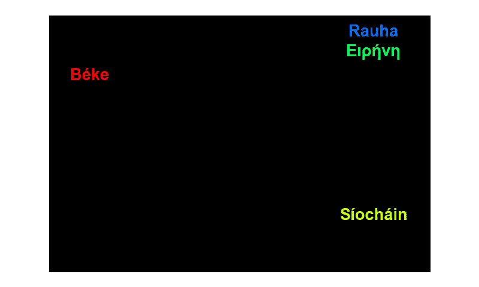
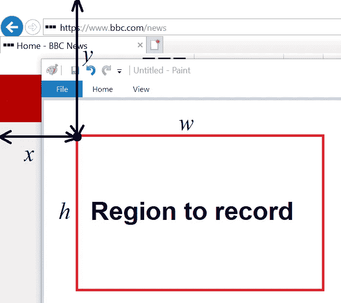
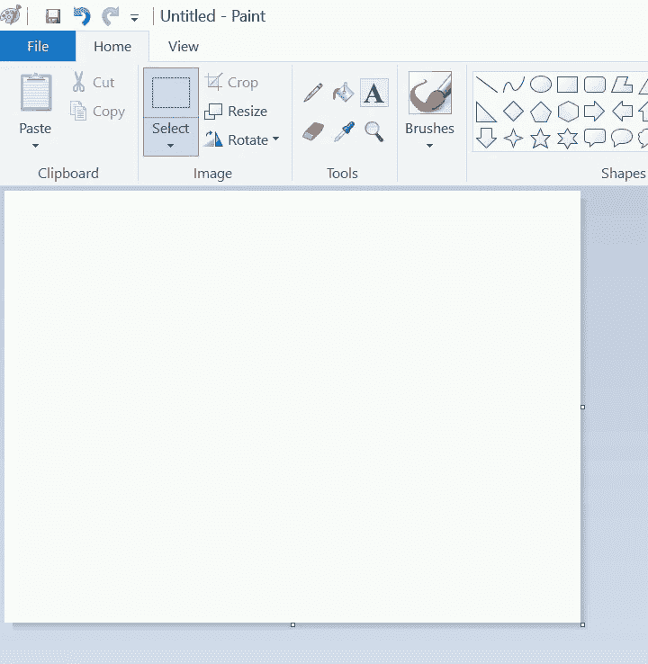

# 用屏幕录制 DIY 你自己的视频编辑器

> 原文：<https://towardsdatascience.com/diy-your-own-video-editor-with-screen-recording-eb6046f5cea7>

## 简化屏幕录制、视频编辑和格式转换的简单 Python 解决方案

我们中的许多人使用记录器软件来捕捉屏幕活动作为视频文件。不同的录像机可能支持不同的视频格式，如 *AVI* 、 *MP4* 、 *GIF* 等。输出的视频通常不是我们想要的。也许我们需要另一个编辑器来裁剪和修剪视频，或者将它们转换成我们需要的格式。



和平:作者的形象

为了简化这个过程，本文介绍了一个简单的 Python 解决方案，它是一个高度可定制的 DIY 工具，具有所有这些功能，即屏幕录制、简单的视频编辑和格式转换。

在接下来的几节中，作者将带您了解如何创建这样的工具。本文中的所有代码都可以在我的 [git 库](https://github.com/steveyx/screengrab-video)中找到。

# 屏幕录制

python 库，即 *Pynput* 、 *PyAutoGUI* 和 *OpenCV* 用于记录屏幕活动。

## 选择要录制的区域

这里使用的 *Pynput* 是帮助用户通过鼠标点击(左键)选择屏幕上的一个区域。它记录鼠标点击事件中的鼠标位置。

可以使用左上角点( *x* 、 *y* )、宽度 *w* 和高度 *h、*定义一个选中的矩形区域，如下图所示。



选定的矩形区域(图片由作者提供)

给定按下和释放事件上的鼠标位置，下面的函数返回所选区域的参数，即 *x* 、 *y* 、 *w* 和 *h* 。

如果您需要捕获整个屏幕，您可以使用下面的 PyAutoGui 命令来获取该区域。

```
wh = pyautogui.size()
region = [0, 0, wh.width, wh.height]
```

## 记录该地区的屏幕活动

[*PyAutoGUI*](https://pyautogui.readthedocs.io/en/latest/roadmap.html) 是一个跨平台的鼠标键盘控件和一个简单的 API。PyAutoGUI 获取单独的截图或帧，其中区域是上面选择的矩形。

*然后用 OpenCV* 将连续截图保存为视频。它支持不同的视频格式，如 *AVI* 和 *MP4。*也可以设置其他参数，例如每秒帧数(fps)。在 OpenCV 中，将图像从 BRG(蓝红绿)转换到 RGB(红绿蓝)颜色模型也是必要的。

该屏幕录制功能的代码如下:

下面显示了一个录制视频的示例。这个视频包含了该地区所有的荧屏活动。有必要移除不需要的片段。以下部分将介绍如何编辑该视频，即视频修剪和裁剪。



录制屏幕的示例视频

# 视频编辑

*MoviePy* 是一个流行的视频编辑 Python 模块。它支持基本操作(如修剪、裁剪、连接、标题插入)、视频处理或创建高级效果。它可以读写最常见的视频格式，包括 *GIF* 。

*   视频修剪

我们可以使用以下命令来修剪上面视频中不想要的片段:

```
clips = [
    [(0, 2), (0, 8)], 
    [(0, 24), (0, 32)]
]
video = VideoFileClip("test_recording.mp4")
clipped = [video.subclip(*clip) for clip in clips]
final_clip = concatenate_videoclips(clipped)
```

其中 clips 是要保留在视频中的两个视频片段(0m2s-0m8s)和(0m24s，0m32s)。运行完这几行代码后，这两段之外的其他剪辑将被删除。

*   视频裁剪

给定一个具有两个对角位置(即左上角和右下角)的矩形，可以使用下面的 MoviePy 命令来完成对视频的裁剪。

```
x1, y1 = (10, 240)
x2, y2 = (610, 680) 
cropped = vfx.crop(video, x1=x1, y1=y1, x2=x2, y2=y2)
```

*   格式转换

*MoviePy* 可以将视频导出为 *GIF* 图片或 *MP4* 等文件格式，如下所示:

```
video.write_gif("saved.gif", fps=10)
video.write_videofile("saved.mp4", fps=10)
```

最后，经过修剪和裁剪后，视频如下图所示:


编辑后的视频:作者提供的图片

## 从图像创建视频

使用 MoviePy，我们还可以为一系列图像创建一个视频。

这里我们有 30 张同样大小的图片，名字分别是 *img_0.png* 、 *img_1.png* 、…、 *img_29.png* 。要将这些图像连接成标题为 Peace 的顶部 GIF 图片，我们只需运行下面这段代码。

```
images = ["images/img_{}.png".format(i) for i in range(30)]
clips = [ImageClip(m).set_duration(1) for m in images]
concat_clip = concatenate_videoclips(clips, method="compose")
concat_clip.write_gif(out_filename, fps=1)
```

在上面的代码中，每个图像剪辑的持续时间设置为 1 秒，对应的 fps=1。

# 结论

本文介绍了一个简单的 DIY 视频编辑工具的解决方案，带有额外的屏幕录制功能。该工具基于开源 Python 库 Pynput、PyAutoGui、OpenCV 和 MoviePy 构建。你可以在方便的时候使用它。

为了进一步定制您的工具，更多的 MoviePy 或 OpenCV 功能，如对象检测和跟踪等。可能会添加。

感谢您的阅读。请随意发表评论。如果你喜欢这篇文章或这个 DIY 工具，请分享给你的朋友，并关注我。

# 参考

1.  [https://pynput.readthedocs.io/en/latest/](https://pynput.readthedocs.io/en/latest/)
2.  [https://pyautogui.readthedocs.io/en/latest/](https://pyautogui.readthedocs.io/en/latest/)
3.  [https://opencv.org/](https://opencv.org/)
4.  [https://zulko.github.io/moviepy/](https://zulko.github.io/moviepy/)