# Django 完全初学者的第一步:快速教程

> 原文：<https://towardsdatascience.com/django-first-steps-for-the-total-beginners-a-quick-tutorial-5f1e5e7e9a8c>

## 了解如何在 Django 应用程序中嵌入 Plotly 图形，以及其他主题


[费萨尔](https://unsplash.com/@faisaldada?utm_source=unsplash&utm_medium=referral&utm_content=creditCopyText)在 [Unsplash](https://unsplash.com/s/photos/django?utm_source=unsplash&utm_medium=referral&utm_content=creditCopyText) 上的照片

如果你喜欢用 Python 编程，并且想第一次进入 web 开发领域，我认为 Django 可能非常适合你。Django 是最受欢迎的 Python 框架之一，它为 web 开发中非常常见的任务提供了出色的内置解决方案，使快速高效地实现项目和编写代码成为可能。此外，Django 也被大公司用于制作，比如 [Instagram 和 Spotify](https://trio.dev/blog/django-applications) 。因此，这一出色的 Python 框架也很有可能满足您的项目需求。

我最近从 Coursera 的[Django for Everybody Specialization](https://www.coursera.org/specializations/django)毕业，我惊讶于使用 Django 内置视图类构建一个具有用户认证和登录功能的完整 CRUD 应用程序是如此的快速和简单。我将永远感谢来自密歇根大学的 Charles Severance 教授，因为他组织了这样一个令人惊叹和兴奋的课程，将我的 Django 技能提升到了一个完全不同的水平。

因此，我决定通过创建一个简单的 CRUD 应用程序来管理和显示我喜欢的电影中的数据，来实践我从这门课程中学到的东西。然而，在以后的文章中展示这种 CRUD 的代码之前，我想收集一些关于 Django 入门的介绍性信息。因此有了这个教程。

我希望这份材料能帮助一些人。至少，它帮助了我，因为这是一个回顾 Django 中一些基本概念和实践的机会。

我使用 Python 3.10.2 和 Django 4.0.2 开发了本教程。我还使用 Git Bash 作为我的终端，这是在 Windows 操作系统中运行 Linux 命令的好方法。

**第 1 部分:第一步**

1.  创建一个名为`films_project`的项目文件夹并进入其中。

```
mkdir films_project
cd films_project
```

如果没有另外提到，本教程中的所有终端命令都应该在`films_project`目录中运行。

2.使用`venv` Python 模块创建一个新的虚拟环境。我将我的虚拟环境命名为`.myenv`，但是如果您愿意，也可以使用其他名称。

```
python -m venv .myenv
```

3.通过针对您选择的终端和操作系统运行正确的命令来激活虚拟环境。下面的命令在我的 Git Bash for Windows 中有效。如果你对用`venv`激活虚拟环境有疑问，请查阅 [Python 文档](https://docs.python.org/3/library/venv.html)。

```
source .myenv/Scripts/activate
```

激活它之后，您应该会在终端中看到您的虚拟环境名称，如下例所示:

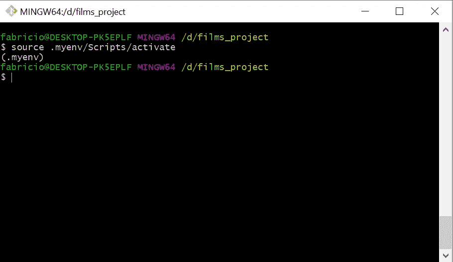

作者图片

从现在开始，所有命令都必须在激活虚拟环境的情况下运行。

4.用 PIP 安装 Django:

```
pip install django
```

5.自己开始一个叫`project`的 Django 项目。

重要提示:不要忘记这个命令末尾的点。

```
django-admin startproject project .
```

运行这个命令将创建一个`manage.py`文件和一个名为`project`的文件夹，里面有五个文件(算上`__init__.py`一个)。因此，您的`films_project`目录树现在应该是这样的:

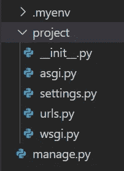

作者图片

请记住`.myenv`是我选择命名我的虚拟环境文件夹的方式，它在上面的图像中是折叠的(里面有一堆文件夹和文件，与我们的教程无关)。

6.启动名为`films`的 Django 应用程序:

```
python manage.py startapp films
```

Django 项目可以有一个或多个应用程序。您可以将 Django 中的应用程序视为在不同项目之间重用代码的一种方式。

这个命令`python manage.py`将在您的 Django 项目中频繁使用，所以请习惯它。另外，在终端中只运行`python manage.py`，不使用任何其他参数，将会显示所有可用选项的列表。

上面的`startapp`命令创建了一个名为`films`的新文件夹，里面有一些文件和一个文件夹。查看它们:

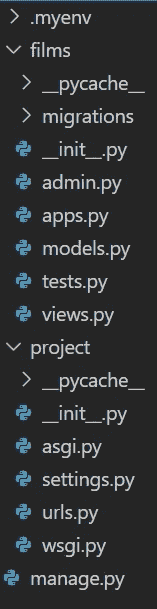

作者图片

`films_project/films/migrations`中唯一的文件是一个`__init__.py`文件，表明这个迁移目录将来应该作为一个模块使用。

7.每当我们创建一个新的应用程序时，我们必须将它添加到`settings.py`文件中的已安装应用程序列表中。我们现在就开始吧。打开`project/settings.py`，在`INSTALLED_APPS`变量中保存的列表末尾添加一个带有`films`应用的字符串。不要删除或更改列表中已有的任何其他字符串:

```
# inside project/settings.pyINSTALLED_APPS = [ 'django.contrib.admin',
    'django.contrib.auth',
    'django.contrib.contenttypes',
    'django.contrib.sessions',
    'django.contrib.messages',
    'django.contrib.staticfiles', #new value below:
    'films.apps.FilmsConfig',
]
```

当`settings.py`仍然打开时，您可以在`LANGUAGE_CODE`和`TIME_ZONE`变量中更改整个应用程序的默认语言和时区。

8.运行以下代码检查错误:

```
python manage.py check
```

如果您收到消息'*系统检查未发现问题(0 沉默)'*，这意味着您的申请是好的。我们现在准备启动本地服务器，并第一次检查我们的 Django 网站。

9.运行以下命令，在默认端口(8000)启动本地服务器

```
python manage.py runserver
```

如果 8000 端口已被计算机中的另一个应用程序占用，请更改端口。只需在命令中添加新的端口号(例如 8050 ):

```
python manage.py runserver 8050
```

10.打开浏览器并转到以下地址之一:

```
[http://127.0.0.1:8000/](http://127.0.0.1:8000/)
```

或者

```
[http://localhost:8000/](http://localhost:8000/)
```

如有必要，用您的新端口号替换`8000`。

通过访问这个运行在本地机器上的服务器，您将看到一个新项目的 Django 默认主页。

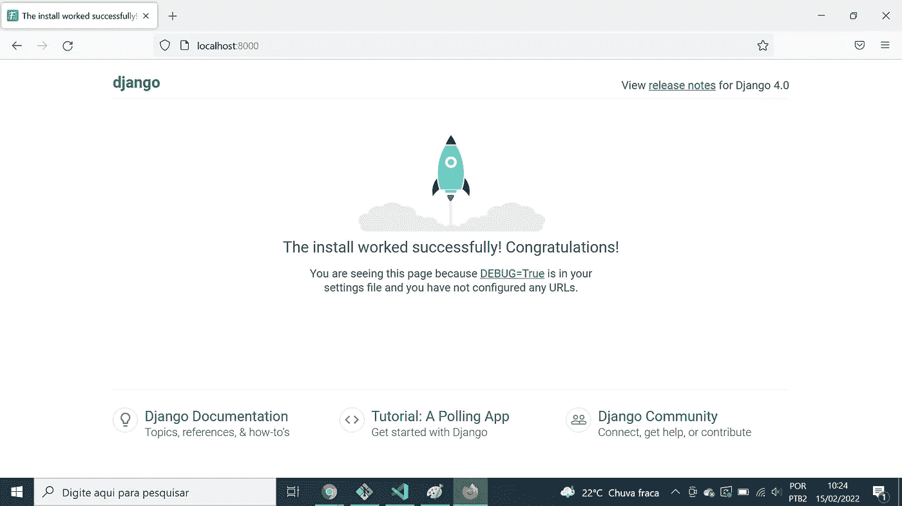

作者图片

11.注意，在`films_project`文件夹中创建了一个名为`db.sqlite3`的新文件。这是因为 sqlite3 是在`project/settings.py`文件中配置的默认数据库。然而，Django 允许与许多其他数据库连接；您只需要进行正确的配置。我们现在不会谈论这个话题，因为这个话题已经超出了我们当前基础教程的范围。

12.Django 已经为您创建了另一条路线。首先，确保您的本地服务器正在运行(也就是说，您在终端中执行了`python manage.py runserver`，并且那里没有错误消息)。然后转到管理页面查看:

```
[http://localhost:8000/admin/](http://localhost:8000/admin/)
```

当您尝试访问下面的链接时，您可能会看到一条非常难看的错误消息，在*异常值*字段中显示信息“*no this table:django _ session*”。我想让你看看那一页，因为我们可以从编程过程中出现的错误信息中学到很多。对此有一个非常简单的解决方法:我们只需要运行命令在数据库中创建管理应用程序使用的表。所以:

13.运行以下命令创建数据库表。

```
python manage.py migrate
```

大约十几条消息将显示在终端控制台中，表示迁移已被应用。这意味着 Django 为数据库中的默认应用程序创建了必要的表，比如 admin。实际上，如果您使用一个 sqlite3 服务连接到数据库并列出它的所有表，您将会看到这些由您刚才运行的`migrate`命令创建的新表。

14.您还需要创建一个超级用户来登录管理区。使用以下终端命令完成此操作:

```
python manage.py createsuperuser
```

告知用户名、电子邮件和密码。然后，使用`python manage.py runserver`重启服务器，并使用您的信息登录到管理区域。您将看到以下页面:

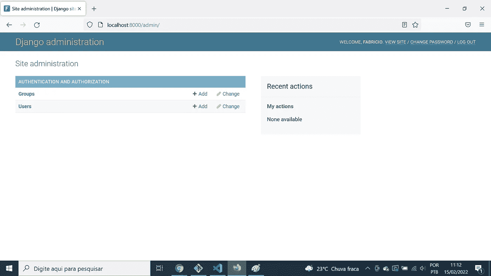

作者图片

这是 Django 从一开始就提供给开发人员的许多内置资源之一，我想让您知道它的存在，尽管我们现在不会在本教程中探究它。管理区是 Django 的强大特性之一，因此值得花时间学习如何使用它。

第二部分:我们的第一条路线和风景。

15.让我们创建我们的第一个新路由，它将替换我们刚刚访问的 Django 默认页面。我们将通过修改`project/urls.py`文件来实现。注意，我们还向它添加了一个新的 import 语句。

```
# inside project/urls.pyfrom django.contrib import admin
from django.urls import path
from films import views    # added 
urlpatterns = [
    path('', views.home, name='home'),    # added
    path('admin/', admin.site.urls),  
]
```

16.如果我们现在运行`python manage.py check`，它将返回一个错误，因为你的`films/views.py`是空的。让我们通过向该文件添加以下函数来纠正这一点:

```
# inside films/views.pyfrom django.shortcuts import render
from django.http import HttpResponse   # added def home(request):
    return HttpResponse('This is the home page.')
```

现在，再次访问`http://localhost:8000`,检查新修改的页面如何显示我们在`home`视图功能中设置的信息:

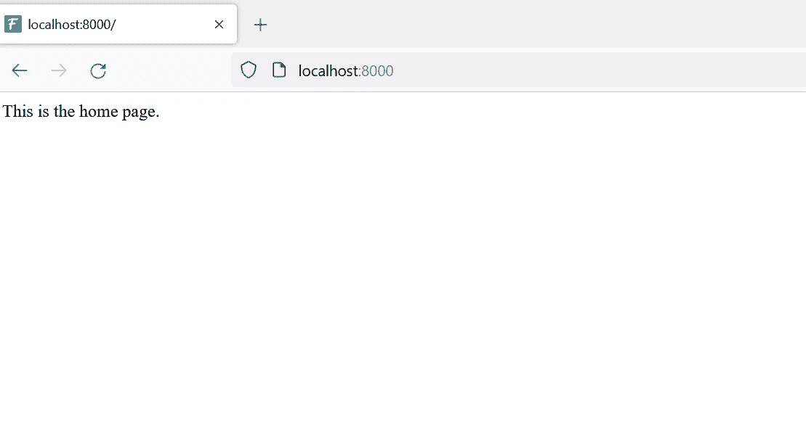

作者图片

干得好！它看起来一点也不花哨，但我们需要欣赏我们在这里取得的成就:我们使用 Django 和 Python 创建了我们的第一个网页，所有这些只需编写几行代码并在终端中运行几个命令。此外，所有这些知识将有助于我们在未来创建更加复杂和令人兴奋的网站，这一点可以肯定。如果我们现在建立了足够好的基础，将来我们可以成为非常熟练的 Django 开发人员，制作伟大而有用的 web 应用程序，同时享受用 Python 编程的乐趣。

在这一点上，对 Django 所认为的视图做一些简单的考虑是很有趣的。与大多数 MVC(模型-视图-控制器)框架不同，在 MVC 框架中，视图指的是应用程序的前端部分，Django 将视图称为配置应用程序逻辑和规则的代码。Django 中的接口部分被称为模板，这使得 Django 成为一个 MVT(模型-视图-模板)框架。

我再说一遍:Django 中的视图是我们创建控制器和应用程序逻辑的地方；不是前端的部分(这些在 Django 里叫模板)。我在这里提到它是因为这一点让许多人感到困惑，尤其是那些来自经典 MVC 模式的人。

从我们目前所做的可以看出，`films/views.py`中的`home`函数简洁明了；它只接受一个请求对象作为其参数，并返回一个响应对象，该对象在 DOM 中写入一个短语，并在所选的 URL 中显示它。但是我们也可以在视图函数中将 HTML 元素传递给响应对象，这样浏览器就可以用不同的字体大小和格式显示它们。

17.然后让我们修改`films/views.py`中的`home`函数如下:

```
# inside films/views.pyfrom django.shortcuts import render
from django.http import HttpResponse def home(request):
    # remove these print statements later
    print('\n\nRequest object:', request)
    print('Request object type:', type(request), '\n\n')

    html_tags = '''
    <h1>This is the Home Page</h1>
    <h3>Thanks for visiting us</h3>
    <p>MVT means:</p>
    <ul>
      <li>Model</li>
      <li>View</li>
      <li>Template</li>
    </ul>'''

    response = HttpResponse(html_tags) # remove these print statements later
    print('Response object:', response)
    print('Response object type:', type(response))
    print('\n\nUser-agent info :', end='')
    print(request.META['HTTP_USER_AGENT'], '\n\n')

    return response
```

如果你的 Django 本地服务器正在运行，用`CTRL + C`停止它，运行`python manage.py check`查看是否有错误，然后用`python manage.py runserver`再次启动服务器。接下来，进入`http://localhost:8000`查看新网页。每次刷新这个页面，都会向 Django 服务器发送一个 GET 请求，并执行`home`函数视图。您可以检查一些关于请求和响应对象的信息，我们要求在终端控制台中打印这些信息。

这里有一个重要的警告:我们永远不会在 Django 产品代码中使用带有 HTML 标签的字符串。否则，我们将把我们的申请提交给 XSS 恶意攻击。因此，在第一个例子中，我们将在 Django 视图中使用 HTML。稍后我将向您展示如何在 Django 中使用模板来呈现 HTML 页面。

我们现在将创建新的路线来巩固我们到目前为止所学的内容。

18.创建文件`films/urls.py`。

```
touch films/urls.py
```

19.在`project/urls.py`中添加新路线。它将作为我们稍后为`films`应用创建的路线的入口点。

```
# inside projects/urls.pyfrom django.contrib import admin
from django.urls import path, include
from films import views urlpatterns = [
    path('', views.home, name='home'),
    path('admin/', admin.site.urls),
    path('films/', include('films.urls')),   # added
]
```

20.用新的路线信息填充`films/urls.py`文件。

```
# films/urls.pyfrom django.urls import path
from . import views app_name = 'films'urlpatterns = [
    path('', views.main, name='main'),
    path('user_info/', views.user_info, name='user_info'),
]
```

21.在`films/views.py`末尾增加新的视图功能:

```
# films/views.py(...)def main(request):
    message = '<h1>This is the films MAIN page.</h1>'
    return HttpResponse(message)def user_info(request):
    message = '<h1>This is the films USER_INFO page.</h1>'
    return HttpResponse(message)
```

22.现在访问创建的路由，检查它们是否显示正确的消息:

```
http://localhost:8000/films/
http://localhost:8000/films/user_info
```

**第 3 部分:让视图呈现 HTML 模板文件**

现在是时候开始使用 Django 模板了。现在，它们将是由视图函数呈现的简单 HTML 文件。

23.创建保存 HTML 文件的必要文件夹。

重要提示:请注意，这些新文件夹中有两个被命名为`templates`:一个在`films`中，另一个直接位于`films_project`的项目根目录中，与`films`处于同一层级。

```
mkdir templates
mkdir films/templates
mkdir films/templates/films
```

24.创建以下 HTML 文件:

```
touch templates/home.html
touch films/templates/films/main.html
touch films/templates/films/user_info.html
```

25.打开`project/settings.py`，导入`os`模块，在变量`TEMPLATES`中，用以下信息填充`TEMPLATES['DIR']`键中的空列表(只改变这一行，保留其他行):

```
TEMPLATES = [
{(...) 'DIRS': [os.path.join(BASE_DIR, 'templates')],(...)}
]
```

26.将以下信息放入相应的 HTML 文件中:

*   `templates/home.html`:

```
<h1>This is the Home Page</h1>
<h3>Thanks for visiting us</h3>
<p>MVT means:</p>
<ul>
  <li>Model</li>
  <li>View</li>
  <li>Template</li>
</ul>
<h3>Link to the website pages:</h3>
<ul>
  <li><a href="">Home Page</a></li>
  <li><a href="">Films Main Page</a></li>
  <li><a href="">Films User_Info Page</a></li>
</ul>
```

*   `films/templates/films/main.html`

```
<h1>This is the films MAIN page.</h1>
<h3>Link to the website pages:</h3>
<ul>
  <li><a href="">Home Page</a></li>
  <li><a href="">Films Main Page</a></li>
  <li><a href="">Films User_Info Page</a></li>
</ul>
```

*   `films/templates/films/user_info.html`

```
<h1>This is the films USER_INFO page.</h1>
<p>Username: Fabrício</p>
<h3>Link to the website pages:</h3>
<ul>
  <li><a href="">Home Page</a></li>
  <li><a href="">Films Main Page</a></li>
  <li><a href="">Films User_Info Page</a></li>
</ul>
```

这里有一个重要的提示:如果你现在访问这些页面，你会发现什么都没有改变。这是因为我们没有在视图中进行任何更新。我们需要让每一个视图呈现正确的模板。

27.因此，将`films/views.py`中的所有内容替换为下面的新代码:

```
from django.shortcuts import render def home(request):
    return render(request, 'home.html')def main(request):
    return render(request, 'films/main.html')def user_info(request):
    return render(request, 'films/user_info.html')
```

现在访问网址并注意不同之处。浏览链接，在页面间快速移动。

**第 4 部分:使用基础模板避免代码重复**

我不知道你是否注意到了，HTML 文件中的代码有许多重复的行。这一点都不可取，因为它违反了 DRY ( *不要重复自己*)原则，我们需要修正这一点。Django 允许使用模板标签，以一种非常简单的方式，将应该出现在多个页面中的 HTML 代码编写在一个 HTML 文件中。

28.创建一个`templates/base.html`文件。

```
touch templates/base.html 
```

我们现在将在我们的项目中使用一些来自 Bootstrap web 设计框架的代码。不幸的是，我不能在这里解释基本的 HTML、CSS 和引导代码是如何工作的。否则，本教程将会比现在更加广泛。然而，如果你想从事 web 开发，即使是在后端，这些都是很好的学习技巧。在我看来，新知识从来没有坏处。

所以，如果你想知道更多关于如何创建漂亮的网页界面，我建议你去看看丹尼尔·沃尔特·斯科特的名为[响应式网页设计基础——html 5 CSS3 引导](https://www.udemy.com/course/responsive-web-design-tutorial-course-html5-css3-bootstrap/)的伟大课程。这些视频信息量很大，练习也很棒，丹尼尔设法以一种非常有效和有趣的方式传播他的知识。

29.用下面的代码填充`templates/base.html`文件。这将是将在其他 HTML 页面中扩展的代码:

请注意`base.html`中出现的以下新结构:

*   ``和``；
*   ``和``；
*   ``和``和``；
*   `{{title}}`。

符号``在 Django 模板语言中被广泛使用。使用基本模板，``和``标签用于标记我们应用程序中每个页面的特定代码块的插入点。

Django 模板语言使用了很多过滤器，这些过滤器允许它在模板中执行函数和方法。例如，我们已经看到了在我们代码的早期阶段使用的``过滤器:它接收一个字符串作为它的参数，以`'app_name:route_name'`的形式，并且它返回一个 web 资源的绝对路径。例如:``将获得名为`user_info`的路线，在`films`应用程序中，它将以字符串形式返回其路径，并将其呈现在 HTML 页面上。

我们还可以注意到，Django 允许在模板中使用条件语句。正如我们将在后面看到的，循环的*在这里也是可能的，这有助于创建更易维护的代码。*

最后，注意`{{title}}`中的双花括号。这是 Django 呈现视图传递给模板的 Python 变量的方式。我们还没有做到这一点，但我们以后会的。

30.替换 HTML 文件的内容，如下所示:

*   `templates/home.html`:

```
<h1>This is the Home Page</h1>
<br>
<h3>Thanks for visiting us</h3>
<br>
<p>MVT means:</p>
<ul>
  <li>Model</li>
  <li>View</li>
  <li>Template</li>
</ul>
```

*   `films/templates/films/main.html`:

```
<h1>This is the films MAIN page</h1>
<br>
<h4>Some Pixar Movies:</h4><ul>
  
    <li>Toy Story {{forloop.counter}}</li>
  
</ul>
```

*   `films/templates/films/user_info.html`:

```
<h1>This is the films USER_INFO page</h1>
<br>
  <h4>username: {{userinfo.username}}</h4>
  <h4>country: {{userinfo.country}}</h4>

  <h4>username: not informed</h4>
  <h4>country: not informed</h4>

```

注意这最后三个 HTML 文件是如何以``开始的，这表明我们正在扩展来自`base.html`文件的模板信息。而且我们希望每个页面显示的 HTML 在``……``标签之间，显示我们希望它从`base.html`插入到这些标签所在的地方。

现在用`python manage.py check`查找错误，然后用`python manage.py runserver`运行服务器。看看我们的页面现在有多像样。

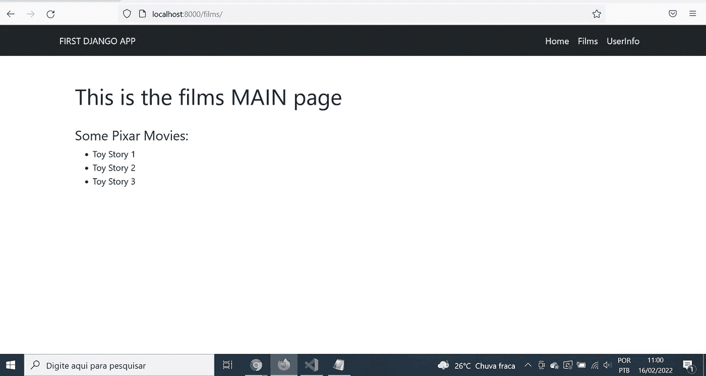

作者图片

**第 5 部分:将 PYTHON 变量传递给模板**

31.现在打开`films/views.py`，为这个新版本替换旧代码。然后运行服务器，注意这一变化如何影响页面标题中显示的信息(浏览器选项卡中显示的文本元信息)和`user_info`页面中显示的用户信息。

正如我们所看到的，`render()`函数可以接收一个字典(通常命名为`context`或`ctx`)作为它的第三个参数。然后，我们可以通过使用不带引号的键来访问这些字典值。

例如，注意`title`变量及其值如何出现在视图和`base.html`模板条件结构中。`home`视图函数不传递标题信息，因此`title`值将为`None`，并且将执行`else`子句，在主页上显示默认标题。另一方面，`main`和`user_info`视图函数在上下文字典中都有一个键`'title'`，所以它的值将是‘truthy’，并且将执行`if`子句，在呈现模板时在标签浏览器中显示`title`值。

类似的事情发生在由`user_info`视图函数传递给`user_info.html`模板的`userinfo`变量上。还要注意，我们将使用点符号来访问嵌套值，类似于 Javascript 对象中使用的符号。如果您尝试从 Python 中使用`context[key]`结构访问嵌套字典中的值，将无法工作，并且会出现错误。

**第 6 部分:使用 DJANGO 模型创建自己的数据库表**

32.打开`films/models.py`，插入下面的代码。我们将创建我们的第一个 Django 模型。

注意，Django 模型是作为继承自`models.Model` Django 类的类创建的。我们在这里创建两个表:`genre`和`film`，实际上分别有 2 和 4 列。我们不必在代码中为每个模型添加`id`列，因为在`project/settings.py`文件中，变量`DEFAULT_AUTO_FIELD`被配置为为每个模型表创建一个具有自动递增整数值的`id`列。

还要注意的是，`Film`模型有一个名为`genre`的外键列，具有一对多关系。这两张表之间的关系并不完美。不过，出于教学目的，我们在这里使用一个更简化的模型，因为多对多模型更复杂，应该马上学习。

32.运行`python manage.py makemigrations`来创建迁移文件，这些文件将设置 Django 必须如何创建这两个新表`film`和`genre`。

33.现在运行`python manage.py migrate`命令，按照上次迁移中创建的指令，在`db.sqlite3`数据库中实际创建两个表。它们在数据库中的名称前面会有应用程序名称，所以实际的表名将是`films_film`和`films_genre`，如果您想运行一些 SQL 代码来检查它们的话。

现在，我们准备填充我们创建的这些新表。我将在这里展示两种不同的方法:

*   使用管理区
*   使用 Django shell

34.打开`films/admin.py`，添加以下代码:

```
from django.contrib import admin
from .models import Film, Genre admin.site.register(Film)
admin.site.register(Genre)
```

通过这样做，我们使得管理应用程序可以访问`Film`和`Genre`模型。

35.现在转到`http://localhost:8000/admin/`，输入你创建的超级用户的登录信息，检查两个新模型是如何出现在屏幕上的:

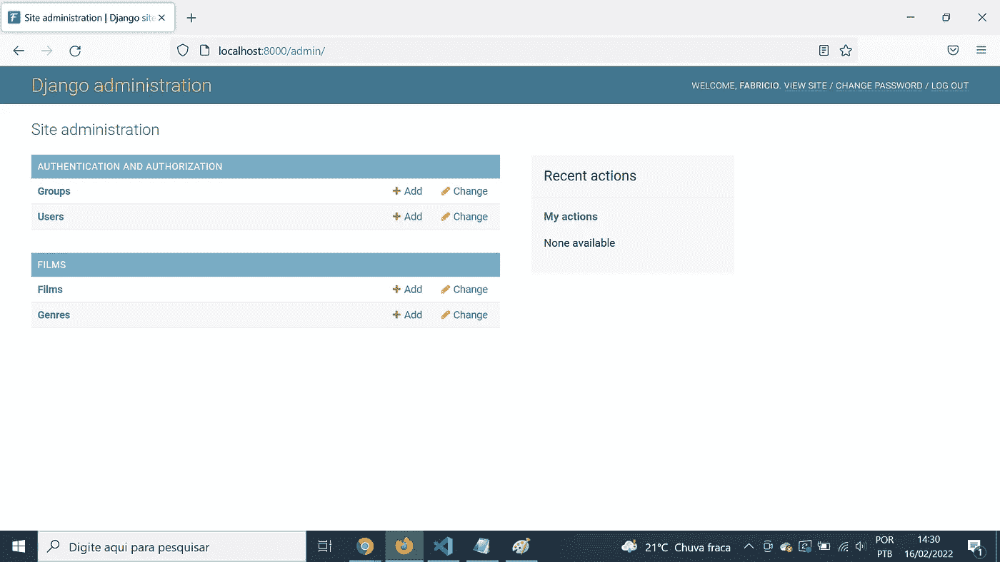

作者图片

36.点击`Films`链接，找到`Add Film`按钮，填写字段并保存信息。你可以点击旁边的绿色加号在这个页面上添加一个新的流派。这将在`genre`表中插入一个新行。至少保存三部新电影。我保存了四部《黑客帝国》电影，你可以看到它们的名字被很好地列在管理区。我可以点击他们中的任何一个，对他们的数据进行更改，然后按保存按钮。所有这些更改都会自动保存在 Django 应用程序的 sqlite3 数据库中。

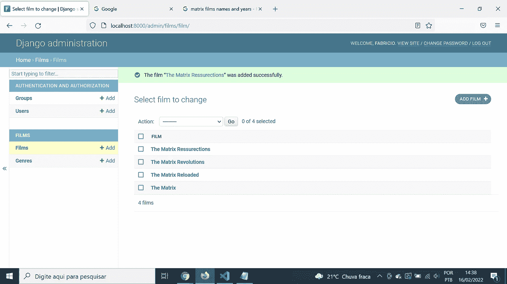

作者图片

37.现在停止服务器并在终端中运行`python manage.py shell`。Django 解释器将会打开。这是另一个非常酷的特性:它不仅允许你用解释器运行 Python 代码，还可以加载你所有的项目文件。因此，您可以使用您的项目文件在这里运行 Django 命令，比如我们刚刚创建的模型。

我将使用 Django ORM 中的一些命令。它允许我们编写在数据库中运行查询的 Python 代码。使用 ORM 的优势在于，如果我们想要将数据库连接更改为 MySQL 或 PostgreSQL，我们只需要在`project/settings.py`中设置正确的数据库配置。所有使用 Django ORM(带有 Python 代码)的查询都将保持不变，这在我看来很棒。

38.在我们刚刚初始化的 Django shell 中键入以下命令。这将创建新的`Film`和`Genre`对象，将它们保存到各自的表中，并显示一个针对`films_film`表中所有电影的选择查询的快速示例。

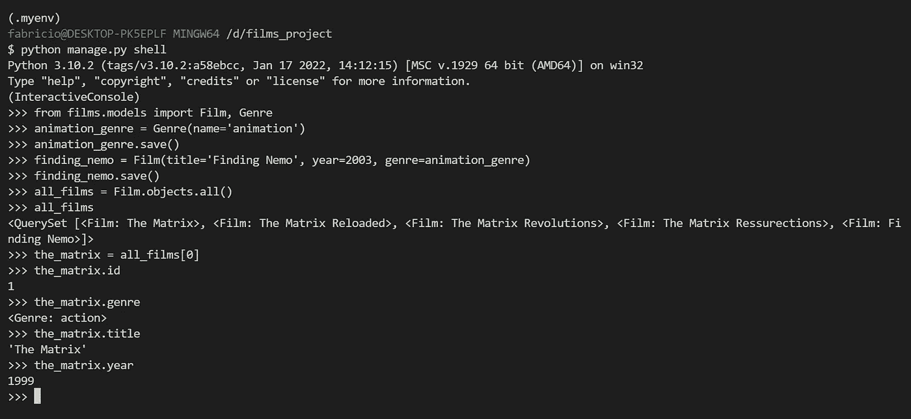

作者图片

现在，我们将使用我们创建的这些新模型，并将它们连接到我们的视图，以便数据库数据可以从`films`应用程序显示在我们的主网页上。

39.在`films/views.py`内部，导入`Film`模型，改变`main`视图功能。保持其他视图不变:

40.打开`films/main.html`并将其内容更改为以下代码。请注意我们如何使用 for 循环来显示保存在数据库中的所有电影信息。

```
<h1>This is the films MAIN page</h1>
<br>
<h4>Films saved in our database:</h4><ul>


  <li>{{film.title}} ({{film.year}}, genre: "{{film.genre}}")</li>
</ul>
```

下面是我接入`[http://localhost:8000/films](http://localhost:8000/main.)`后的画面。它显示了我保存在数据库中的所有五部电影(四部黑客帝国电影和海底总动员)。

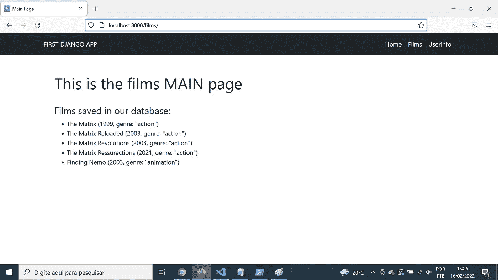

作者图片

这只是一个简单的例子，展示了我们如何显示数据库中的信息，并将其发送到我们的页面之一。实际上，Django 有一些定制的视图，以类的形式构建，我们可以用它们来完成一些最常见的任务，比如在网页上列出所有的观察结果(或者部分观察结果)。这是由`**django.views.generic.list.ListView**`类完成的。

在这个介绍性教程中，我们不会讨论更多关于视图类的内容。如果你想了解更多信息，请查看 Django 文档页面。

**第 7 部分:查询参数**

到目前为止，我们只处理了 GET 请求。当我们用 GET 方法发出请求时，我们可以传递直接附加到 URL 的参数，称为查询参数。我们将修改`user_info`视图函数，使用这些参数作为模板的输入。

41.在`films/views.py`的`user_info`函数中进行以下修改，保留文件中的其他行。

在这个新版本中，我们使用了一个`if` / `elif`结构来检查请求方法。我们还不会访问`elif`部分，但是我已经选择将它写在代码中，这样您就可以看到我们如何根据请求方法是 GET 还是 POST 来让视图函数运行代码。例如，如果我们使用基于类的视图，我们将有两个类方法(`.get()`和`.post()`)，每个方法处理各自的请求类型。

我还想提醒您注意重要的`request.GET`属性，它使用 URL 中使用的所有查询参数来访问字典。

42.现在，访问`user_info` URL 并添加必要的查询参数，如下例所示:

```
[http://localhost:8000/films/user_info/?username=Neo&country=USA](http://localhost:8000/films/user_info/?username=Novo&country=Sui%C3%A7a)
```

请注意问号是如何用于开始编写查询参数的。这里我们有两个(用户名和国家)，值分别为“Neo”和“USA”。此外，我们可以观察到查询参数名称/值由等号分隔，而&符号用于分隔不同的参数。

继续更改参数值，按 enter 键，并查看页面上的值将如何变化。还可以查看控制台，了解查询参数字典的结构。您可以使用`request.GET.get(KEY)`代码获得它的任何值。

**第 8 部分:** **HTML 表单和帖子请求**

现在让我们用 POST 方法构建一个 HTML 表单。

43.创建`films/templates/films/user_form.html`文件，并将以下 HTML 代码放入其中:

44.在`templates/base.html`导航栏中做一个小改动，添加一个链接到新的`user_form`页面。我不会在这里重复所有的`base.html`代码；我将在结束的`</ul>`标签之前添加额外的`<li>`标签:

```
<li class="nav-item active">
  <a class="nav-link active" href="">UserForm</a>
</li>
```

45.向`films/urls.py`添加新路线。

```
from django.urls import path
from . import viewsapp_name = 'films'urlpatterns = [
    path('', views.main, name='main'),
    path('user_info/', views.user_info, name='user_info'),

    ## new route below ##
    path('user_form/', views.user_form, name= 'user_form'),
]
```

46.在`films/views.py`中，一方面修改 imports 和`user_info`视图，另一方面创建`user_form`视图。由于这里做了很多修改，所以我给出了所有修改过的文件代码:

让我们更详细地评论一下这个新的`films/views.py`代码。当我们第一次访问`http://localhost:8000/films/user_form`时，这将是一个 GET 请求，因此视图中的`if`子句将被执行，只是加载各自的模板。但是当我们填写表单字段并按下 submit 按钮时，POST 方法被激活，并且运行`elif`子句中的代码。

正如我在 Charles Severance 教授的课程中所学到的，将 POST 请求中的数据发送到不同于表单所在的 URL 是一个很好的做法。当我们这样做时，一个 GET 请求将被调用到新的 URL，并且 POST 数据将会丢失。

因此，在我们进入下一页之前，我们需要保存表单中传递的数据。我们通过对每个输入字段使用`request.POST.get(KEY)`来做到这一点，其中`KEY`是来自相应的`<input>` HTML 标签的 name 属性的值，所以我们不能忘记设置它们。然后我们可以将这些值传递给位于`request.session`的另一个字典，这非常有帮助。它允许将数据存储在当前浏览器会话中，并在不同时刻由我们的代码检索。这就是为什么我们可以在`user_info`视图中使用保存在会话字典中的信息并显示它们。

第 9 部分:路线参数和详细页面

47.在`films/urls.py`创建新路线。我们将只在下面显示这一行，但是您已经知道如何将它插入到文件中。

```
(...)path('<int:id>/details', views.details, name='details')(...)
```

注意新的符号`<int:id>`。这里的`< >`符号显示我们正在处理一个新的参数类型，称为路由参数。`int`显示它是来自`int`类的一个对象，并且`id`告诉 Django 这里需要一个主键。

48.用以下内容创建`films/templates/films/details.html`模板。我们现在将使用一个带有一些引导类的 HTML 表结构。

```
<h1>Film details:</h1>
<br><table class="table" style="width: 30%">
  <thead>
    <tr>
      <th scope="col">Attribute</th>
      <th scope="col">Value</th>
    </tr>
  </thead>
  <tbody>
    <tr>
      <td scope="row">Title:</td>
      <td class="text-dark">{{film.title}}</td>
    </tr>
    <tr>
      <td scope="row">Year:</td>
      <td>{{film.year}}</td>
    </tr>
    <tr>
      <td>Genre:</td>
      <td>{{film.genre}}</td>
    </tr>
  </tbody>
</table>
```

49.在`films/views.py`中添加新的`details`视图。我注释掉了一行代码，它也可以用于通过 id 查询单个元素。注意电影 id 是如何作为一个额外的参数传递给视图的。

```
def details(request, id):
    film = Film.objects.get(id=id)
    # other query option:
    # film = Film.objects.filter(id=id)[0]
    context = {'film': film}
    return render(request, 'films/details.html', context)
```

50.现在选择一条类似`http://localhost:8000/films/1/details`的路线，并查看这部电影的详细信息。手动更改 id 号，以便您可以查看其他影片的详细信息。如果选择了一个不存在的 id 号，视图将会产生一个错误，因为它没有针对这种情况的错误处理代码。所以，如果你觉得有趣，就去搜索处理这类问题的方法。

第 10 部分:在 DJANGO 中使用 PLOTLY 图

这一部分可能对那些想把这两个惊人的资源放在一起的人有用:Plotly graphs 和 Django。这里需要注意的最重要的事情如下:

*   从一个 Plotly 图形对象使用`.to_html()`方法，并将其保存在一个上下文字典中，名称如`fig`。
*   在 Django 模板中，使用标签`{{fig | safe}}`来呈现图形。

我将在这里使用 Gapminder 数据集来加快速度。因为它与电影无关，所以创建另一个 Django 应用程序是正确的程序。但我不会那么做。相反，我将在`films`路径之外放置一条新路径，并借用`films/views.py`来存储显示图表所需的视图和辅助功能。我还将使用路线参数按年份过滤图表。

51.打开`project/urls.py`并添加新的 Gapminder 路线:

```
from django.contrib import admin
from django.urls import path, include
from films import views urlpatterns = [
    path('', views.home, name='home'),
    path('admin/', admin.site.urls),
    path('films/', include('films.urls')), # new route: 
    path('gapminder/<int:year>', views.gapminder, name='gapminder'),
]
```

在`films/views.py`中，我们将添加两个不是 Django 视图的函数，因为它们不会处理 HTTP 请求。函数`get_data()`只从`plotly.express`获取 Gapminder 数据集作为 Pandas 数据帧。并且`create_plot()`会生成著名的 Gapminder 气泡图。这些函数在`gapminder`函数视图中被调用，year route 参数在这里用于在生成图表之前过滤数据集。

52.用 PIP 安装 Pandas 和 Plotly:

```
pip install pandas plotly
```

53.打开`films/views.py`，导入 Plotly Express，在最后一次导入后，定义`get_data()`和`create_plot()`功能:

```
import plotly.express as px# keep the other imports(...)def get_data():
    df = px.data.gapminder()
    return dfdef create_plot(df, year):
    fig = px.scatter(
      data_frame = df.query(f'year=={year}'),
      x = 'gdpPercap',
      y = 'lifeExp',
      color = 'continent',
      size = 'pop',
      height = 500,
      log_x=True,
      size_max=60,
      hover_name="country")

    fig =  fig.to_html()
    return fig
```

54.在`films/views.py`结束时，创建`gapminder`视图:

```
def gapminder(request, year):
    df = get_data()
    fig = create_plot(df, year)
    context = {"plot": fig, "year": year}
    template = 'gapminder.html'
    return render(request, template, context)
```

55.创建文件`templates/gapminder.html`并在其中写入以下代码:

```
<h1 class="text-center">GAPMINDER (YEAR {{year}})</h1>
<div class="container-fluid d-flex justify-content-center">
  {{plot | safe}}
</div>
```

56.访问 Gapminder 数据集中的一个带有年份的 URL(比如`http://localhost:8000/gapminder/2007`)并播放您的网页及其漂亮的交互式图表。

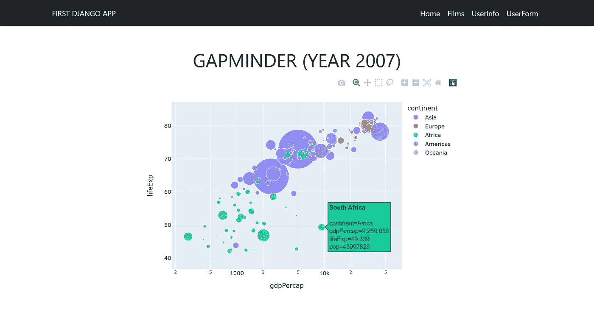

作者图片

**遗言**

如果你到达这里并征服了这个教程，你就是一个真正的战士。恭喜你！Django 是一个完整的世界，还有很多需要了解的；只要坚持学习和练习，成功就会到来。

亲爱的读者，非常感谢你花时间和精力阅读我的文章。

*快乐编码！*