# 计算机如何看深度:基于深度学习的方法的最新进展

> 原文：<https://towardsdatascience.com/dl-for-depth-estimation-p2-7cb2c9ff325d>

## 第 2 部分:基于图像的立体视觉

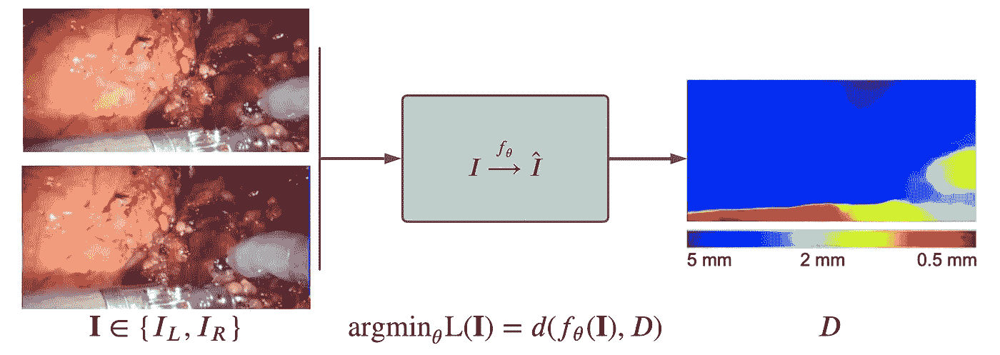

**立体** **视觉** **跟** **深度** **学习。** *输入*是*一个立体图像对(即从左右摄像机捕捉的图像)；输出是左图和两张照片中所有可见像素的深度图。*因此，现代端到端解决方案学会将两张 RGB 照片映射到深度图。目标是使用监督来最小化预测与实际之间的距离(或最大化相似性)。立体对(上面最左侧)是深度网络(中间)的输入，该深度网络将图像转换为相应的深度预测(右侧)。*注意，物体离相机越近，视差越显著(即，深度越小)。输出是显示在右侧的密集视差图，暖色代表较大的深度值(和较小的视差)。作者创造了可视化。*

我们对深度的感知对于创造我们周围的 3D 世界至关重要。这种知识已经流行了几个世纪，其中一个人就是列奥纳多·达·芬奇。他利用自己的专业知识帮助自己创作了一些艺术作品，这些作品将会名闻遐迩，如《最后的晚餐》或《萨尔瓦托勒·希泽拉》。从技术上讲，对双筒望远镜的理解可以追溯到公元 280 年，当时欧几里德意识到我们的深度知觉是人类用两只眼睛聚焦于同一物体。尽管如此，今天，立体视觉仍然是一个非常有趣的问题。随着我对话题的熟悉，一路上做的笔记，现在正在转化为一系列的博客，供其他人参考。

立体视觉是其他信息和多模态知识可以获得的基本任务。因此，立体视觉技术在现实世界的应用中有着广泛的实际用途，如机器人、自动驾驶汽车和大多数依赖于感知深度作为先验知识的任务！不足为奇的是，在过去的几十年里，这个话题已经被许多人所激发。有了现代的监督深度学习，问题的高度复杂性与高度复杂的网络更好地匹配。现在的需求很大，标记数据以适应这些受监督的深层网络的容量，这在获取和缓解条件以满足对数据的大量需求方面仍然是一个挑战。总之，我们正处于或接近深度感知可以在实践中自信地部署的边缘。但是，由于需要如此多的数据来训练深度网络，部署的模型需要大量的数据来学习将左/右对转换为其视差图的映射函数，如上图所示。

在本系列的第 2 部分中，我们将介绍几种基于图像的立体视觉监控方法。提供了动机、策略、结果(如在原始论文中发表的)、摘要、文档链接和源代码。这里的目的不是提供传统意义上的文献综述，而是充当监督立体视觉的深层方法的百科全书。该系列的未来部分将涵盖视频数据、自我监督和非监督、多任务学习，以及数据集和基准的更多细节和分析(即，比上一篇文章 [*第 1 部分*](/depth-from-disparity-via-deep-learning-part-0-458827141b23) 提供的更深入)。现在让我们回顾一下从 2015 年到 2020 年的几个 SOA 方法。未来的博客将涵盖最新的方法。然而，这里介绍的大部分材料都是初步的。

享受:)

# 目录

[简介](#80f6)
[背景信息](#c45f)
∘ [立体视觉](#dcb0)
∘ [深度监督学习](#8c29)
∘ [深度监督学习用于立体视觉](#1fe4)
[MC-CNN](#ce08)
∘[简介](#6ff4)
∘ [方法](#4c42)
∘ [结果](#fdf8)
∘ [总之【T28](#6e7a)
∘ [总结](#e1ee)
∘ [论文与代码](#805e)
[iresnet](#89f5)
∘[动机](#65c0)
∘ [方法](#99c8)
∘ [结果](#8bf2)
∘ [总结](#d48a)
∘ [论文与代码](#121c)

[金字塔立体匹配网络(PSMN)](#9c59)
∘ [动机](#6ede)
∘ [方法](#2db6)
∘ [结果](#03a7)
∘ [结果](#0041)
∘ [总结](#a6fe)
∘ [论文及代码](#3ce9)
[modulenet](#53b3)
∘[动机](#d4db)
[结果](#2c0c)
∘ [总结](#d06b)
∘ [论文与代码](#42a4)
[讨论](#139c)
∘ [总结](#787d)
∘ [未来工作](#fcb0)
∘ [结论](#006f)
[附加资源](#5a8d)

# 介绍

在立体视觉中，人类的大脑有一种奇妙的能力去看深度。我们使用我们的两只眼睛，它们彼此分开，位于头部的两侧，这使我们能够以三维方式感知世界:高度、宽度和深度(即，相对于周围环境的前后位置)。这项技能并不是人类独有的——正如在 [*第一部分*](/depth-from-disparity-via-deep-learning-part-0-458827141b23) 中强调和举例说明的那样；许多动物以各种方式使用立体声！尽管如此，建模立体计算已被证明是一个具有挑战性的壮举。从监督建模的角度来看，困难在于所需的数据集，这些数据集必须包含表示目标场景和组成深度网络的各种对象的信息。我们探讨了这些挑战以及研究人员旨在克服的基于深度学习的方法的最新进展。

从[第 1 部分](http://QR&YG&6@FHi7$A6$1)，让我们回忆一下极线假设:场景包含两个已知内在属性(即镜头的焦距 *f* 和外在属性(即左右摄像机的光学中心之间的距离称为基线 *b* )的摄像机。提供了预测的视差 *D* ，简单的几何图形被用来重建在捕获图像时丢失的深度尺寸(即 *z* )。

在这一部分(即*第二部分*)中，我们回顾了 2015-2020 年间基于深度学习的深度估计方法的进展。未来的部分(即 3、4 和 5)将涵盖最新和最大的(即 2021–2022)，基于视频的深度立体方法(即多视图立体(MVS))，并在子像素级别产生相应的置信度。

# 背景资料

## 立体视觉

立体的基础——极线几何中更深的深度、图像校正和其他对初学者来说不太重要的数学细节(即，主题本身，如果需要，稍后再返回)将在本系列的第 1 部分中讨论。如果不理解下面的陈述，鼓励读者阅读前面的部分:

*深度知觉的重要性及其古老起源*；*视差的定义*；*深度线索的概念以及人类如何自然感知* ( ***提示:*** 两只【立体】眼睛)；*视差和深度之间的关系，以及如何从一个空间变换到另一个空间在两个*(即，左和右)*图像中提供了相应的像素；在*之前假设了什么参数和条件(即，获得内部和外部参数，以及校正的立体图像对)。

</how-computers-see-depth-deep-learning-based-methods-368581b244ed>  

## 深度监督学习

*端到端*有监督的深度学习在很多年前就已经成为主流*。它以之前无法想象的方式登上排行榜榜首。问题类型(即任务评估)的增长源于深度学习的成功，因此也是*大数据时代*的启动。也就是说，基于梯度的端到端深度学习概念可以追溯到 20 多年前[1]。然后，在 2012 年，辍学的概念遇到了大数据，缓解了过度拟合的问题，*通用 GPU* (GPGPU)的计算能力，允许矩阵数学在数千个内核上并行执行，为我们许多人在 2012 年提到的开创性工作铺平了道路[2]。然而，deep nets 又花了三年时间才在 2015 年提出用于补丁级别的深度重建[3]，又花了一年时间提出图像级别的端到端系统[4]。*

在开始有监督的深度学习方法的旅程之前，让我们先定义一些重要的概念。*非端到端*和*端到端*描述了最高级别的学习方法:*端到端*意味着输入直接映射到最终输出，这是一个通过反向传播从一个信号学习的权重函数，该信号从*端到端*回溯。*端到端*是当今首选的培训方式，因为目标指标中最令人兴奋的特性是通过优化获得的。相反，*非端到端*不学习从输入空间到输出的映射，而是依赖于中间步骤，这些中间步骤通常由人工设计来调整，因此可能不是最佳的。下图列出了两者的特征。

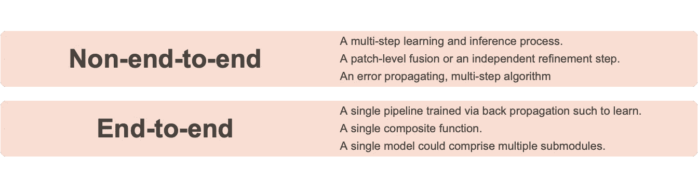

传统非端到端方法和现代端到端学习方法的特点。作者创造了可视化。

除了我们复习的第一种方法(即 *MC CNN* )之外，这部分涵盖的方法都是监督式*端到端*深度学习方法。尽管 *MC CNN* 是一个深度神经网络，我们很快就会知道，该模型将面片级输入对映射到视差空间，这意味着将视差面片估计融合到图像所需的额外步骤是不可学习的。因此， *MC CNN* 不是一个*端到端*方法。

**注意。**假设读者对深度学习概念有基本了解，主要是监督方法。最后的[补充](#39db)部分提供了由三部分组成的介绍性系列的链接。

## 立体视觉的深度监督学习

当设计用于深度估计的深度网络时，遵循两种一般的拓扑监督方法:编码器-解码器架构(**图 1** )和在连体 CNN 之上使用成本体积正则化的方法(**图 2** )。无论如何，输入空间是立体对(即，左和右 RGB 图像)，并且输出是由最小和最大视差限定的相应视差 ***D*** :除非另有说明，否则视差等级的数量是离散的并且是已知的，因为假设图像对被校正。目标是最小化实际和预测视差映射之间的差异。

上面列出的假设应该是有意义的:视差***D****serves 是在其 ***D*** 的空间中学习的(即，封闭形式的分类)，而离散特征代表点从左到右沿水平方向移动的像素数量(即，整数个像素)。如何在亚像素级别获得鲁棒性:敬请关注，在本博客结束之前你将会有答案:)*

*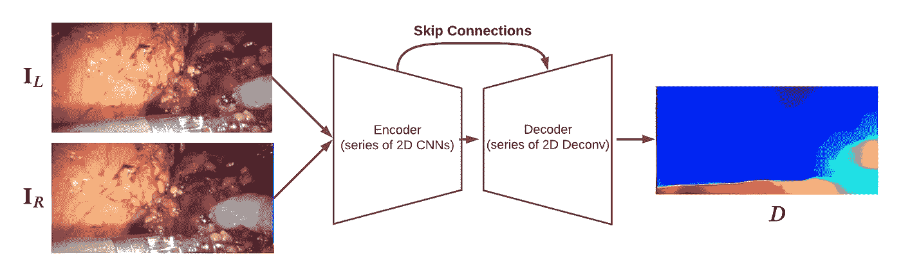*

***图一。**编码器-解码器拓扑的高级示意图，其中模型学习将立体对映射到相应的视差图。*作者创造的人物。**

*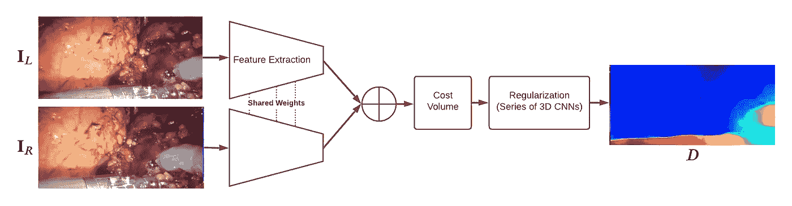*

***图二。**模型的典型视图的高级表示，通过融合左右图像的特征来调整以产生最佳视差图，从而形成成本体。*作者创造的人物。**

*现在让我们开始具体方法的回顾。从 *Zbontar 和 Lecun* (2016)开始，我们将涵盖方法。*

# *MC-CNN*

> *Jure Zbontar 和 Yann LeCun。*“通过训练卷积神经网络来比较图像块的立体匹配。”* J .马赫。学习。第 17.1 号决议 *(2016 年)*。*

## *介绍*

*第一个为深度估计提出的监督深度学习框架是 *MC CNN* 。由于学习从立体对到视差空间的逐像素(即密集)映射的巨大复杂性，作者使用了图像补片。尽管如此，MC CNN*的概念对于后面介绍的端到端方法是必不可少的。换句话说， *Jure Zbontar 和 Yann LeCun* 推出了 *MC CNN* ，开始了我们即将走的路。很明显，MC CNN* 的部分内容启发了我们接下来的工作。*

*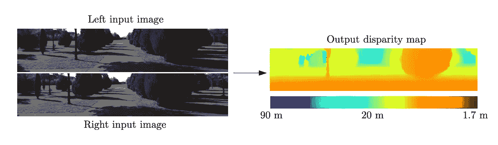*

*学习从立体对到视差图的映射。请注意，最靠近相机的物体具有更大的差异:暖色的差异更大，因此深度更小——来源:[原文](https://arxiv.org/abs/1510.05970)。*

## *方法*

**MC CNN* 是将立体图像对映射到相应视差的面片级方案。如下图所示，该系统模拟了传统立体视觉技术的典型步骤。*

*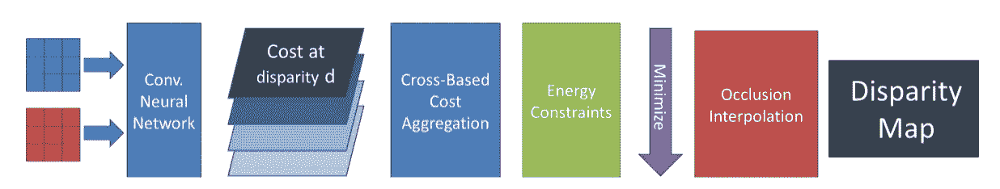*

*用于生成视差图的管道。来自左和右图像的标记为红色和蓝色输入(最左侧)的小块被馈送到 CNN，为此产生具有**通道(每个视差值一个)的特征，表示在小块的相应位置处* ***d*** *的成本。*来源:[原创论文](https://arxiv.org/abs/1510.05970)。**

**目标是为考虑中的所有差异 *d* 计算每个位置**p的匹配成本。这样的成本可以简单地确定为关于点 ***p*** 的补片之间的绝对差。****

****

**𝐼ᴸ和𝐼ᴿ是位置 ***p*** 处的图像强度。𝓝 **ₚ** 是固定窗口中以***p***—也就是***p***=(*x*， *y* )，然后***p****d*=(*x*-【t70)因此，下图描述了修补程序级别的连体网络。**

**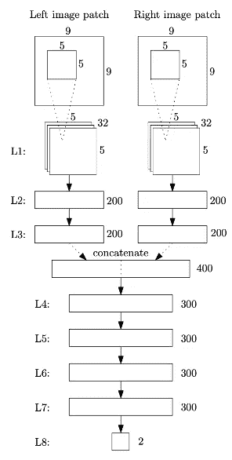**

**MC CNN 的连体架构(快)。注意，对于每个具有共享权重的相似性分数，处理一对 9x9 的面片(即，暹罗网络)。作者创造了可视化。**

**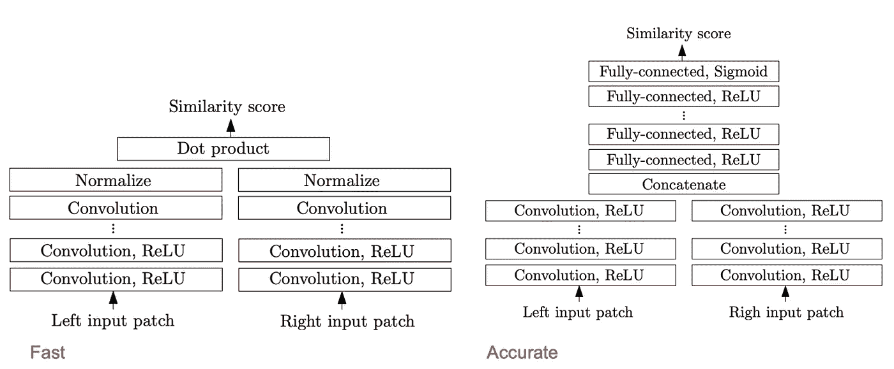**

**作者提出了快速(左)和精确(右)的变体。**

***MC CNN* 的作者提出了两个变量，一个是速度(即**快**)，另一个是准确性(即**准**):对于任何一个，网络拓扑都会产生相似性得分。**快速**变体完全独立地从左侧和右侧提取特征，允许一个面片的表示被转换一次，然后与其他面片比较几次以生成分数。同时，**精确**模型在共享分支之前融合特征，通过一系列附加层从连接的特征中学习度量。因此，**精确**方法必须在每次生成分数时处理两个补丁，而更快的版本可以存储补丁的特征，例如只需在补丁对之间进行点积。**

**作者还表明，像传统的立体匹配方案一样，最大化相关性是最佳的。**此外，相关性计算(即层)在模型的存储和速度方面花费较少。**下图从不同的角度显示了管道。**

**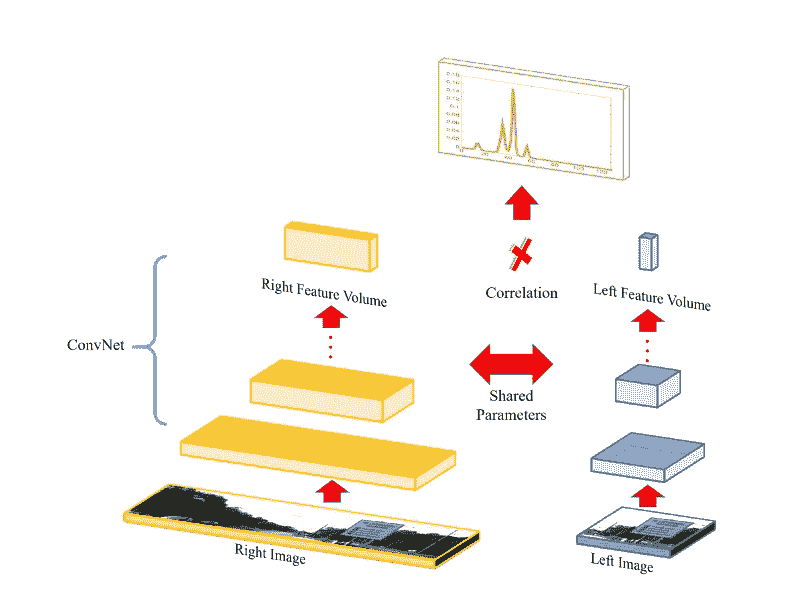**

**他们采用了一个连体网络，提取每个像素所有可能差异的边缘分布，以学习信息丰富的图像补丁表示。**

## **结果**

**在 KITTI 2012、KITTI 2015 和 Middlebury 数据集上，精确变体比其所有前辈产生了更低的错误率；快速版本的运行速度比精确架构快 90 倍，误差增加很少。**

**这些结果表明，CNN 在确定立体声对的匹配成本方面工作良好，甚至在需要实时性能的应用中也是如此。**

**因此，这个相对简单的 CNN 声称是最先进的(SOA)，展示了现代深度学习方法解决经典立体视觉计算机视觉问题的巨大潜力。**

## **概括起来**

**为了完整起见， *MC CNN* 被包含在这一部分中，关于用于立体视觉的第一批深度学习方法，因为它是一个开创性的解决方案。但是，它不是一个端到端的解决方案，因为它处理补丁，而不是在映像级别。因此，这种方法的覆盖面被设计得很小。更深入地讨论了处理方法。**

**赞成的意见**

*   **首次尝试使用深度特征学习来解决立体深度估计**
*   **一项广泛的研究显示了一种**快速**和一种**精确**变体**
*   **补丁提供了大量的训练数据**

**骗局**

*   **不是端到端的解决方案**
*   **许多手工设计的步骤**
*   **无法捕捉全局上下文，因此仍然无法捕捉不均匀和高度纹理化的区域。**

## **纸张和代码**

**[https://arxiv.org/abs/1510.05970](https://arxiv.org/abs/1510.05970)**

**<https://github.com/jzbontar/mc-cnn>  

# 流动网络

> *Dosovitskiy，Alexey，等人《流网:用卷积网络学习光流》*IEEE 计算机视觉国际会议 *(2015)。*

## 动机

当以端到端的方式训练时，深度神经网络学习感兴趣的任务知识的能力处于其最高潜力。虽然最初提出 FlowNet 是为了解决光流(即，本质上类似于根据视差进行深度估计的任务)，但它是第一个端到端解决方案。因此，这里的许多概念将在以后直接应用于视差估计。

**注意:**光流是一个视频相邻帧中对应点之间的差值。正如我们所了解的，立体视觉中经常做出的一个假设是输入图像是经过校正的。差异是水平位移的函数。另一方面，光流考虑水平和垂直方向上像素位置的差异。因此，可以在描述由一对立体摄像机提供的场景流的两种类型的知识之间推断几何相似性。关于光流的细节超出了本博客的范围。感兴趣的读者可以在[5]中看到更多关于光流的内容，在[6]中可以看到更具描述性的场景流。最近，一项关于这两个主题的调查发表了[7]。

FlowNet 在空间上和网络的收缩部分压缩信息(即特征)，然后在扩展部分细化这些特征。因此，将图像对直接映射到目标输出空间。论文中的下图描述了 FlowNet 的高级概念。

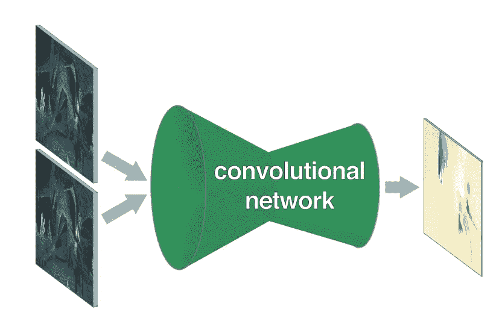

FlowNet 的结构类似于编码器-解码器网络。U-Net [4]计算大小为(1， *nrows* ， *ncolumns* )的正则化视差 d⋆。这种方法的主要缺点是归一化互相关层的计算成本。而且还会产生模糊的视差图:**来源—** [论文](https://arxiv.org/pdf/1504.06852.pdf)。

## 方法

如下图所示，Flownet 包括两种网络架构:FlowNetSimple (FlowNetS)和 FlowNetCorr (FlowNetC)。

**FlowNetS** 将两幅图像连接起来，并将其输入网络。

**FlowNetC** 是一种不太通用的网络结构，其中每个图像都被送入一个连体网络，其工作方式如下:

*   分别学习有意义的表示(如边)。
*   然后，各个分量在相关层中经历乘法面片比较(即，类似于矩阵乘法)。
*   两个都是乘法面片比较和类似的细化过程的结果。

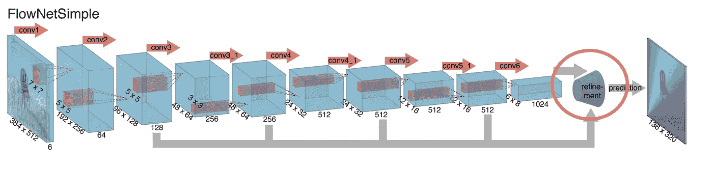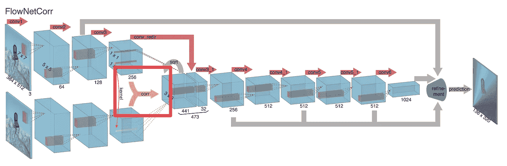

两种网络架构:FlowNetSimple(顶部)和 FlowNetCorr(底部)。绿色漏斗是图 3 中显示的扩展细化部分的占位符。网络包括细化部分都是端到端训练的—来源 ***:*** *原论文*并由作者修改。

两个特征图之间的乘法块比较由相关层进行。给定𝖿₂𝖿₁的两幅多通道特征图，宽度 *W* ，高度 *H* ，通道数 *C，*第一幅图中以 x₁为中心，第二幅图中以 x₂为中心的两个面片的*相关性*数学表达式如下。⋆

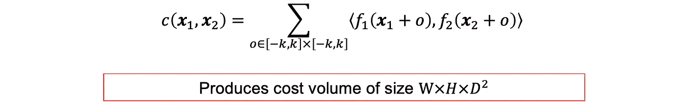

正方形空间补片的大小为`*K* = 2*k*+1`。

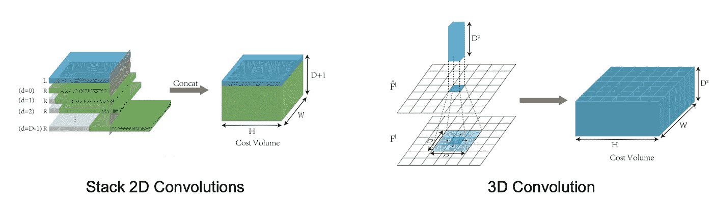

它仍然是许多系统的基本部分:形成成本体积的最佳熔丝信号。

使用输出的卷积图层连接并提取 f₁的要素地图。

*   他们通过一系列 *conv* 和合并图层降低分辨率。
*   作者通过*上进化*层的*解池*和*上进化*来细化粗池表示。
*   将*上变换的*和相应的特征图连接起来，并进行上采样的粗流量预测。

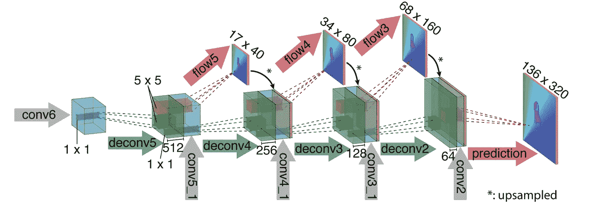

细化粗特征映射到高分辨率预测—来源 ***:*** *原始论文。*

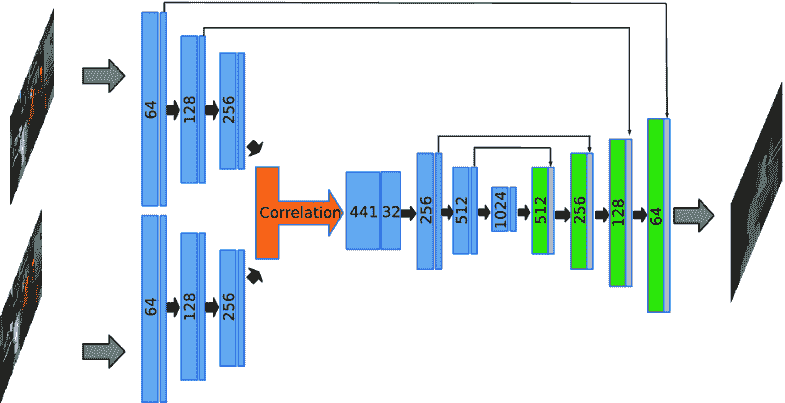

*FlowNet 架构。*

## 结果

## 摘要

FlowNet 是第一个用于立体深度估计的端到端深度特征学习解决方案(虽然最初是针对光流提出的，但过渡是微不足道的，因为视差是光流的子集)。换句话说，因为视差表示像素沿水平方向的移动，所以光流是帧 *t* 和 *t+* 1 之间在所有方向上的位置变化(即，实数的 2D 矢量表示，与整数值 1D 视差张量相反)。因此，在立体视觉系统中，假设提供了校正的立体对，找到视差的问题需要在相邻对的对中找到光流的子集解决方案。事实上，给定带有摄像机的立体视觉设置，视差张量和光流张量描述了场景流[5]，这是对前方场景的更多了解。

FlowNet 的缺点包括:

*   归一化互相关层的高计算成本。
*   产生模糊的视差图。

尽管如此，深度学习、端到端、监督学习范式中差异模型的演变，FlowNet 引入了将启发其他人的概念(如本博客结尾所示)。

## 纸张和代码

<https://github.com/ClementPinard/FlowNetTorch>  

# iResNet

> 通过特征恒常性学习视差估计。 *IEEE 计算机视觉和模式识别会议论文集*。2018.

## 动机

梁等人考虑立体视觉系统的传统步骤，如本系列的第 0 部分中所介绍，并在上面列出([立体方法学](#31ca))。网络架构包括对应于立体匹配的每个步骤的模块。下图显示*特征提取*、*视差估计*和*细化*模仿传统方法。

## 方法

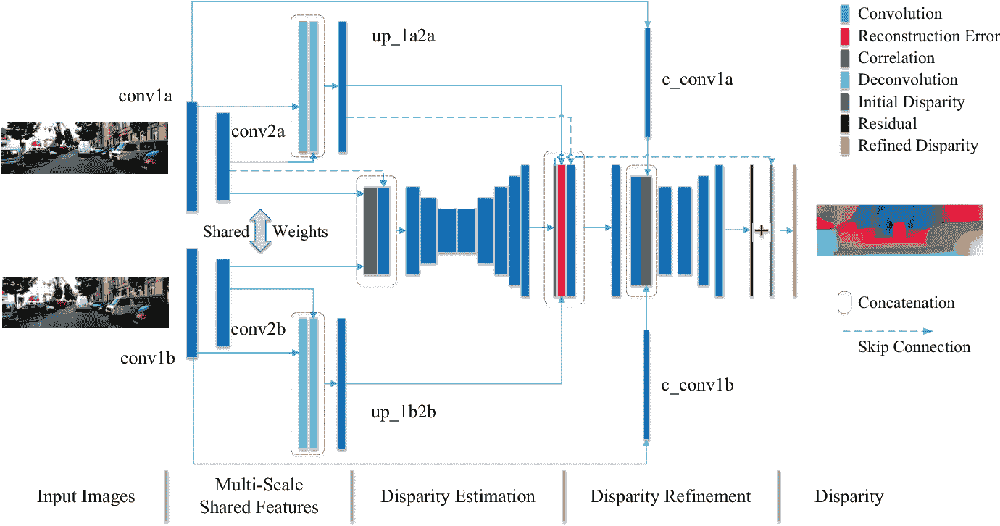

*建议网络的架构将立体匹配的所有四个步骤整合到一个网络中。为了更好的可视化，他们省略了编码器和解码器在不同尺度上的跳跃连接——来源* ***:*** *原文。*

*特征恒常性*是指特征空间中两个像素的对应关系。

跳过连接允许推断视差图的约束解。

*   当对匹配成本执行视差估计时，子网捕获低级语义信息。

*f* ꜀充当特征间的相关性， *re* 重建误差，产生第一视差 *disp* ，而 *disp* ᵣ 为细化视差。

**迭代网络。**视差细化阶段的输出可以是第一视差预测，并且因此直接回到视差细化模块中。作者发现 2-3 次迭代可以改善结果，这会影响最后的地图。

**它是如何工作的？**如上面的数学公式所表达的，精确的视差*显示* ᵣ.

关系左侧三项的结果。具体来说，第一个*特征恒定性*项、 *f* 、是左右特征图之间的相关性:度量两个特征图在所有视差级别上的对应性。因此，第一项越大，特征越相似。第二项 *re* 是多尺度融合特征之间的绝对差值。他们发现了特征空间中的重建误差，而不是像素，这是这项工作之前的惯例(例如，CRL)。最后，我们有第三项，初始视差估计，*显示* ᵢ或者仅仅是*显示*。

## 结果

系统和子系统变体的现场流量结果如下表所示。

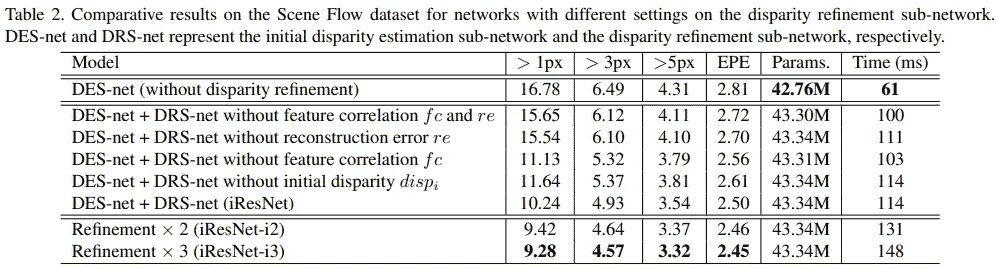

**来源:**原论文。

接下来是单尺度和多尺度的比较。

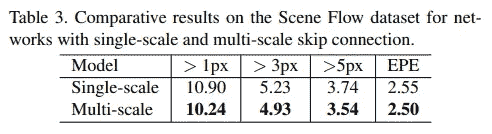

**来源:**原文。

最后，在场景流的错误、大小和运行时方面与 SOA 进行比较。

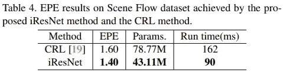

**来源:**原论文。

我们可以在从称为视差估计子网络(DES-Net)的第一模块提取的特征中看到 *re* 的有效性，与像素相反。DES-Net 学习一种表示以传递给第二模块，称为差异细化子网(DRS-Net)。因此，可以假设从 DES-net(向下)传播的误差是由于重建误差和初始差异(见上面绿色和红色矩形中间并排的绿色和红色矩形，分隔 DES-Net 和 DRS-Net)。他们将 *disp* 输入到 DRS-net，通过细化进行改进: *disp* 是第一个首字母，然后通过 DRS-net 创建 *disp'* ，通过以下方式确定残差

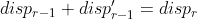

其中迭代次数(即细化步骤):

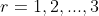

作者发现，2–3 会挤压所有潜在的性能(即最适合设计的性能)。

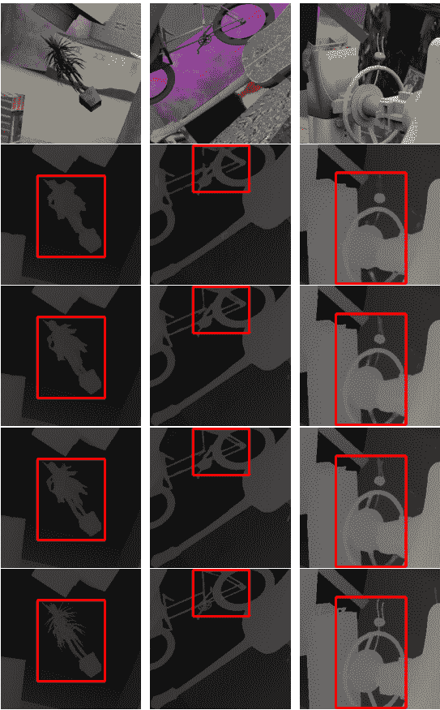

*在不同迭代的场景流测试集上进行视差细化。第一行是输入图像，第二行示出了没有改善的初始视差，第三和第四行示出了在 1 次和 2 次迭代之后的精细视差。第 5 行给出了地面实况的悬殊——来源* ***:*** *原创论文。*

下表中使用 KITTI 2012 和 2015 数据集进行的比较说明了 KITTI 的定性比较。

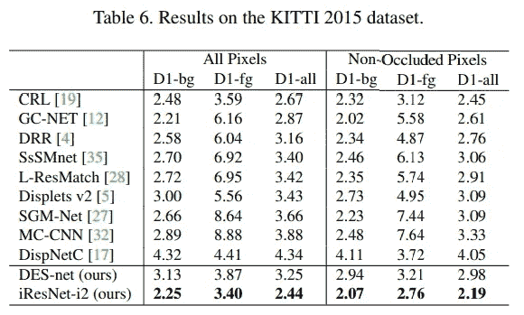

**来源:**原论文。

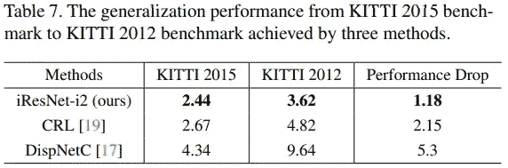

**来源:**原文。

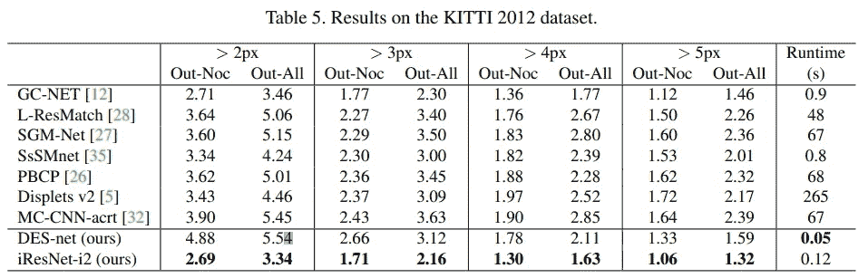

**来源:**原论文。

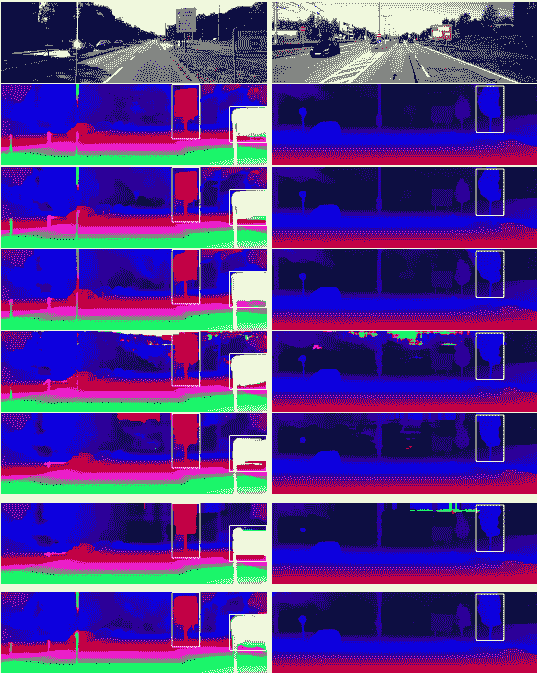

*KITTI 2015 上与 SOA 的比较。第一行中的图像是来自 KITTI 2015 的输入图像。我们的 iResNet-i2 细化结果(第 3 行)可以显著改善初始视差(第 2 行)，并给出比其他方法更好的可视化效果，尤其是在图像的上部，在该区域没有地面真实—来源* ***:*** *原文。*

## 摘要

## 纸张和代码

<https://github.com/leonzfa/iResNet>  

# 几何和上下文网络

深度立体回归的几何与情境的端对端学习。IEEE 计算机视觉国际会议论文集。 2017。​

## 动机

*   据观察，立体算法的几个挑战将受益于知道全局语义上下文而不是局部几何。
*   目的是学习端到端的立体回归模型，以理解更广泛的上下文信息。​

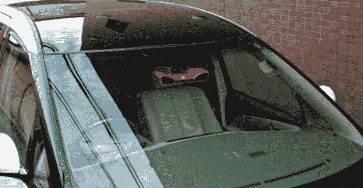

理解全局语义和几何将减轻问题，因为更广泛的上下文将受益于像反射这样的障碍。

## 方法

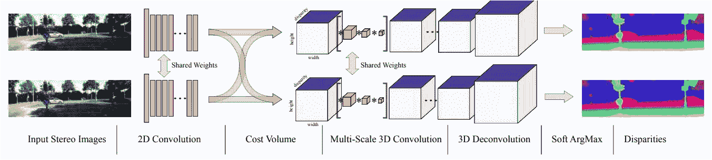

**来源:**原创论文。

*   从校正的立体对进行端到端学习以估计亚像素视差。
*   它形成了利用问题几何的可区分成本量。
*   通过跨成本体的多尺度三维卷积学习上下文。
*   评价视差曲线的可微软 ArgMax。

接下来，我们将逐步完成构成 GC-Net 的模块，上图与 stereo methods 的原始算法(即工作流)相关。

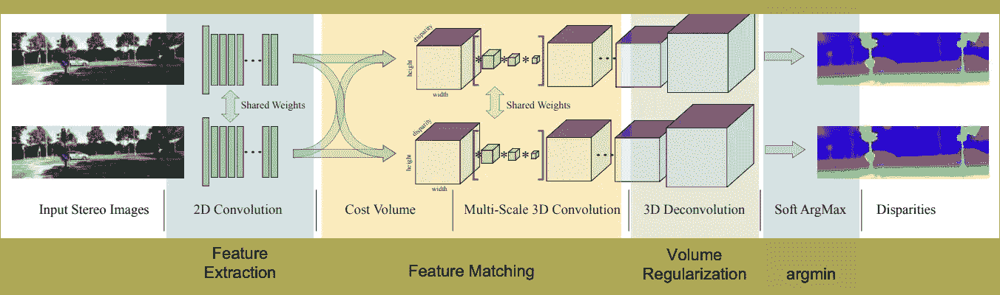

用突出显示的模块描绘原始图[图来自作者修改的论文]。

**特征提取:**

如今，我们使用特征表示，而不是从原始像素强度计算成本。然后，比较对光度外观中的模糊性稳健的描述符，并捕获局部上下文。作者将这些特征称为一元特征。利用的优势

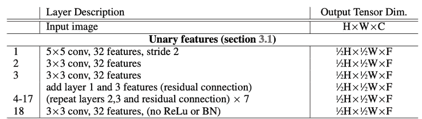

原始论文中的表格。

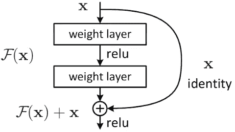

*   步长为 2 的卷积滤波器对输入进行二次采样，以减少计算需求。
*   之后，八个残差块由两个`3×3`卷积滤波器串联而成。
*   在左右网络之间共享参数以学习相应的特征。

**成本量**

*   成本体积的大小`H×W×(Dmax + 1)×F`
*   这是通过将每个一元特征与它们在每个视差级别上来自相对立体图像的对应一元特征连接起来并将其打包到 4D 体积中来实现的
*   它赋予网络学习语义的能力。

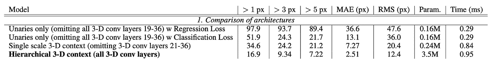

场景流数据集包含来自一系列合成场景的 960 × 540px 的 35，454 幅训练图像和 4，370 幅测试图像。我们比较不同的架构变体来证明我们的设计选择。结果强调了原始论文的 3-D 卷积架构来源的重要性。

**软 Argmin**

立体算法从一元的匹配成本中产生最终成本量。体积通过最小化成本来估计差异，例如在成本体积差异维度上的 argmin 运算。但是，使用标准的 argmin 操作有两个问题。

1.  它是离散的，并且不能产生子像素视差估计。
2.  因此，该模型是不可微的，并且不能使用反向传播来训练。

作者引入了操作的软版本来缓解这些问题。我们称之为*软 argmin* ，数学定义如下。

其中*d*ₘₐₓ*t14】是最大差异 *d，*和期望值(即 sigma)是*

这种损失类似于 bahda nau*et al**soft attention*【1】，一种*soft arg max*【2】的否定变体。后者扩展了[3]中使用的操作，通过高阶统计扩展损失(即，最小化预测和预期之间的差异，并优化置信度)。从统计学上讲，基于一阶矩(即预期值)的损失通过二阶矩(即方差)获得信息。旁注:对上述内容的深入探究在未来博客想法的列表中，所以请继续关注；)

*   为了克服这些限制，我们定义了一个软 argmin，它是完全可微的，并且能够回归一个平滑的视差估计。
*   首先，我们通过取每个值的负值，将预测成本 cd(对于每个差异 *d* )从成本量转换为概率量。我们使用 softmax 运算σ()对视差维上的概率体进行归一化。然后，我们对 *D* 进行求和，并按其归一化概率进行加权。

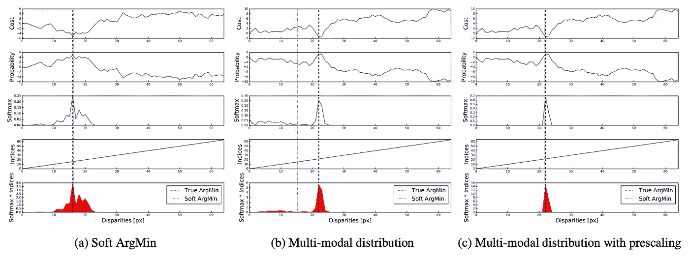

**软参数操作的图形描述。**它沿着每条视差线获取一条成本曲线，并通过对每个视差的 softmax 概率与其视差指数的乘积求和来输出 argmin 的估计值。( **a** )表明，当曲线为单峰时，这准确地捕捉了真实的 argmin。( **b** )示出了当数据是具有一个峰值和一个平坦区域的双峰时的故障情况。( **c** )如果网络学会预缩放成本曲线，则可以避免这种失败，因为 softmax 概率会更极端，产生单峰结果。

*   然而，与 argmin 操作相比，它的输出受所有值的影响，这意味着它容易受到多峰分布的影响，因为最不可能得到支持。相反，它将估计所有模式的加权平均值。为了克服这个限制，网络进行调整以产生单峰差异概率分布。
*   网络还可以预先调整匹配成本，以控制归一化后的 softmax 峰值(有时称为温度)。

**损失函数**

*   使用 GT 视差 dₙ和像素 *n* 的预测视差 *dHat* ₙ之间的 L₁训练模型

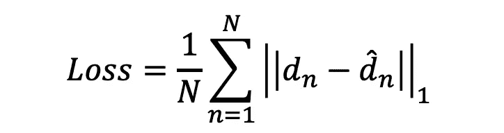

*   回归模型允许基于光度重投影误差的无监督学习损失。

## 结果

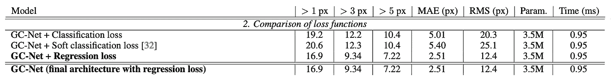

**定量结果**

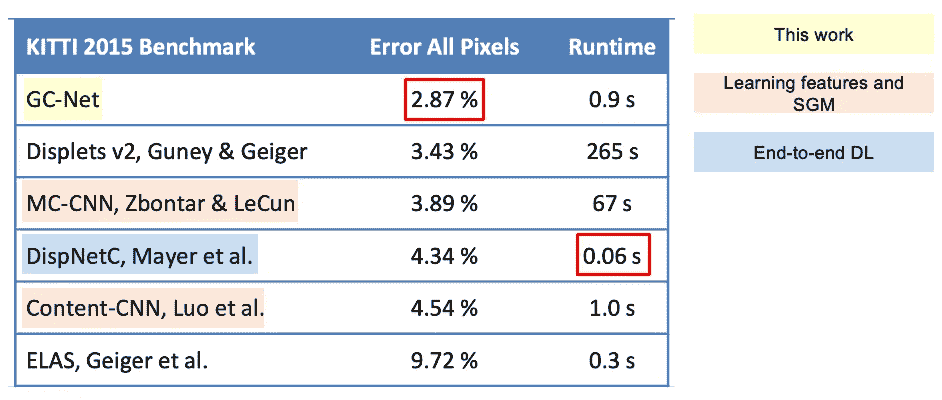

**定性结果**

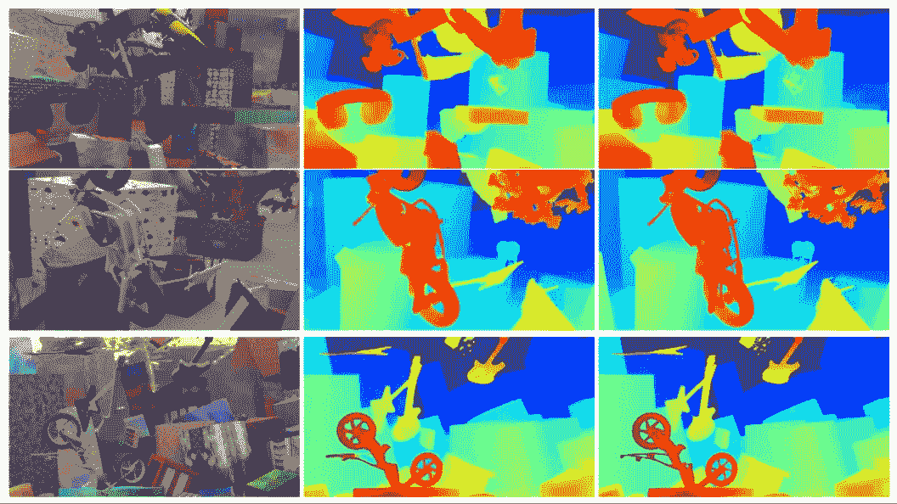

## 摘要

*   根据合成数据进行预训练(即 SceneFlow [5])。
*   回归通过分类差异获得 SOA。
*   学习的端到端优于学习的一元特征+半全局匹配(即 MC-CNN [1])。
*   使用几何图形学习成本卷明显优于其他端到端(即 DispNetC)。
*   该模型的推理速度相对较快。

## 纸张和代码

链接到论文[ [arXiv](https://arxiv.org/abs/1703.04309) ]。

<https://github.com/zyf12389/GC-Net>  

# 金字塔立体匹配网络(PSMN)

常、贾仁和。"金字塔立体匹配网络."IEEE 计算机视觉和模式识别会议录。2018.

## 动机

深层神经网络中的经验感受野远小于理论感受野。其他方法依赖于基于补丁的连体网络，缺乏利用上下文信息在不适定区域中寻找对应的手段(见下图)。

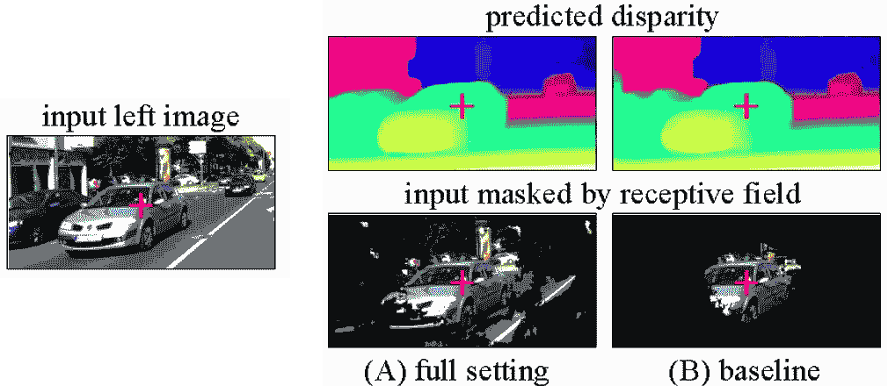

红色十字表示图像中心像素的感受野。基线:没有扩张的 conv，没有 SPP，没有堆积的沙漏。完整设置:扩张 conv，SPP，堆叠沙漏。该图是从原始论文中复制的，并由作者进行了修改。

## 方法

*   引入了金字塔池模块，用于将全局上下文信息合并到图像特征中。
*   堆叠沙漏 3D CNN 扩展了成本体积中上下文信息的区域支持。

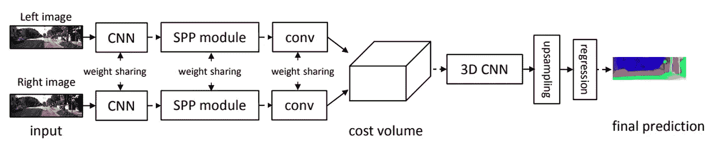

提议的 PSMN 框架。这张图是从原图上复制和修改的。

左和右输入立体图像是由四部分组成的两个权重共享管道的输入:(1)特征映射函数(即 CNN)；(SPP 模块，用于通过连接不同大小的子区域来获取特征；(3)用于特征融合的卷积层；以及(4)左和右图像特征用于形成 4D 成本体，该成本体传递到 3D CNN 用于成本体规则化和视差回归。最终输出是预测的视差图。下图描述了完整的系统。

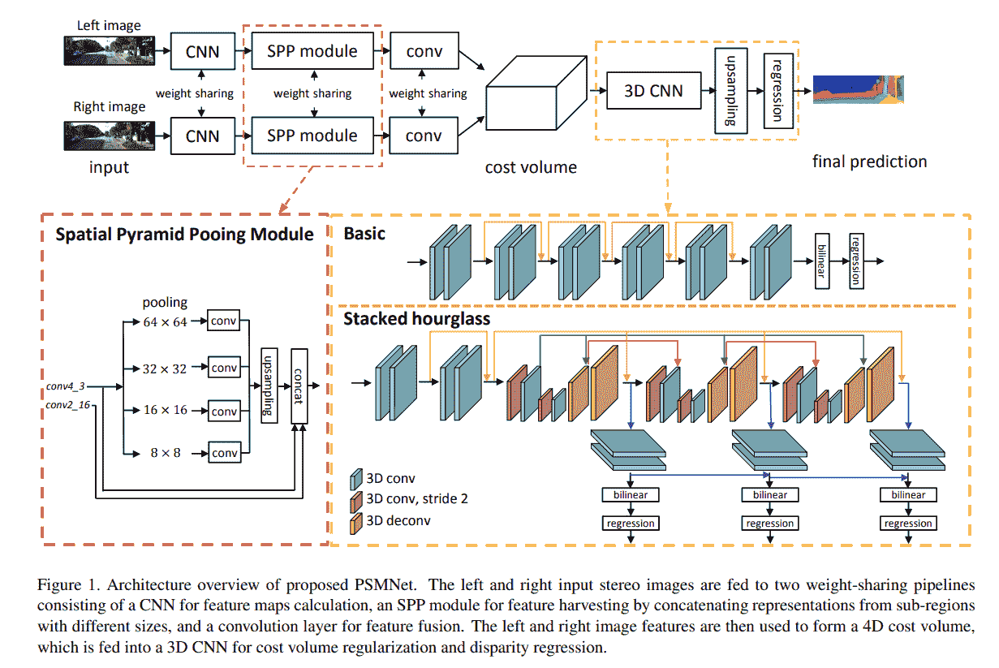

图来自原论文。

因此，有两个主要模块:空间金字塔池和 3D CNN:

1.  空间金字塔汇集模块通过聚合不同比例和位置的环境来形成成本量，从而利用全球环境信息的容量。
2.  3D CNN 学习使用有中间监督的堆叠沙漏网络来调整成本量。

现在，让我们仔细看看这两个。

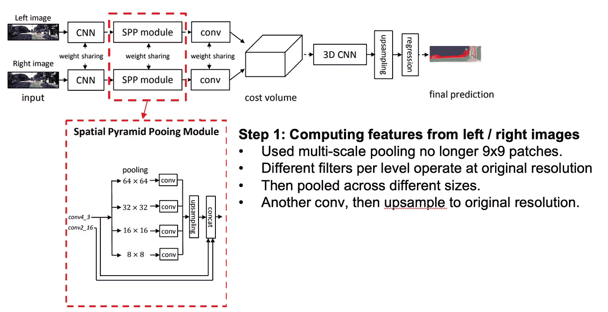

**步骤 1:从左/右图像计算特征**

*   使用多尺度池不再 9✕9 补丁。
*   每个级别的不同滤镜以原始分辨率工作。
*   然后，每一个都被汇集成不同的大小。
*   另一个 *conv* 然后向上采样到原始分辨率。

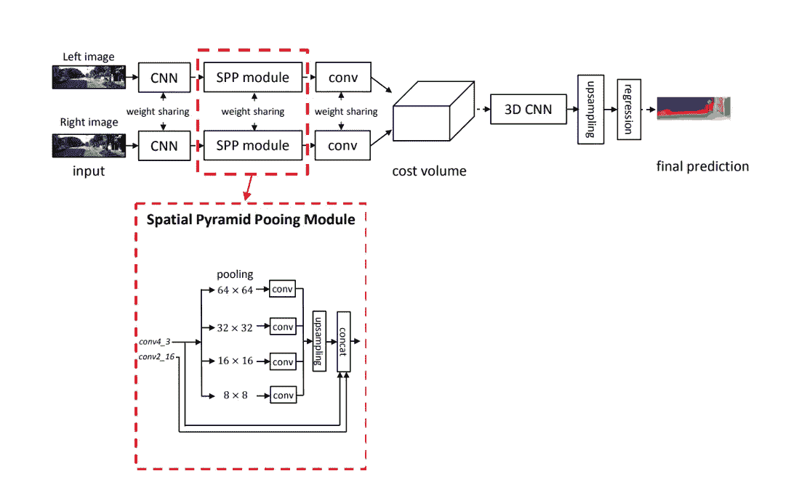

特征向量结合了具有不同感受野的过滤器，但是增加感受野的空间汇集减少了可学习的参数。

获得左右图像的每个像素的特征向量。

**第二步:构建成本量**

*   然后，我们对每个左右图像都有大小为`*H*✕*W*✕*F*`的特征张量。
*   构建一个大小为`*H*✕*W*✕*D*✕2*F*`的成本卷

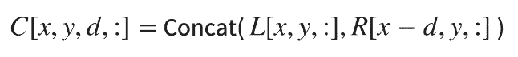

*   在这一点上，这个网络与 MC-CNN 的不同之处仅在于它如何获得这些功能。
*   他们的方法相当于为每个成本体积应用一堆完全连接的层，从特征到单个分数，即`*H*✕*W*✕*D*✕2*F H*✕*W*✕*D*✕1`。

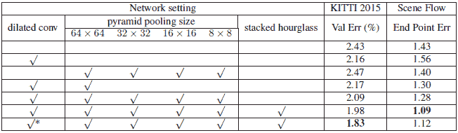

**第三步:流程成本量**

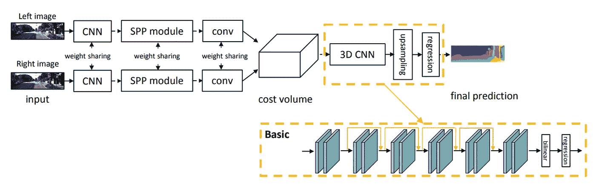

3D 卷积层与剩余连接串联。

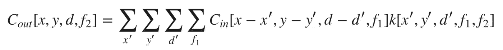

*   5D 核而不是 4D 喜欢正则卷积。视差空间中的平移不变量: *d* 、 *d* +1 之间的关系与`*ď*, *ď*+1`之间的关系相同。

**第四步:成本量对差异**

*   他们将最终的`*H*✕*W*✕*D*(×1)`张量视为前 softmax 分数。
*   因此，进行软最大值给出了可能的视差值的概率分布。
*   但是他们不会用分类损失来训练这个:因为一些错误分类比其他的更糟糕！(d=5 而不是 4 比 d=25 而不是 4 要好)。

所以，他们对这个分布有期望！

**损失函数**

*   使用 *soft argmin* 获得 GC-Net 中提到的所有好处
*   GC-Net 使用 L₁作为惩罚指标

○ L₁损失对异常值不太敏感

○通过回归学习无界目标，L₂必须仔细调整

*   类似于快速 R-CNN(即 BB 回归)，SPP 使用以下平滑 L₁变量

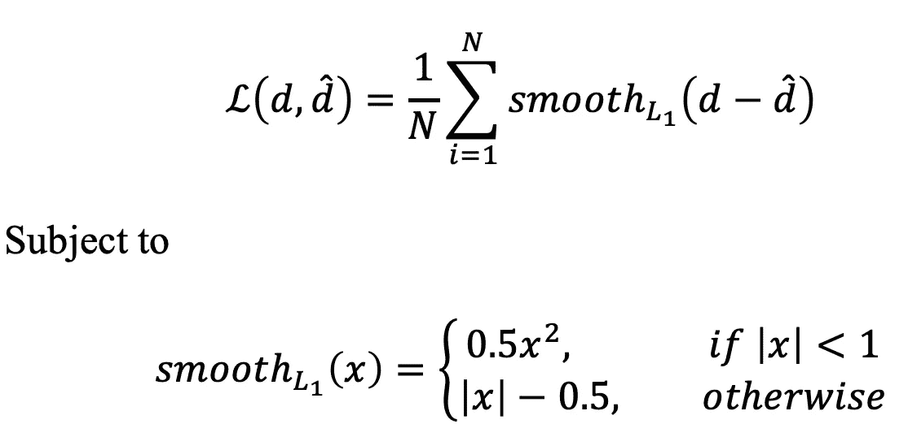

*   使用类似 GC-Net 的视差回归来估计连续视差图。

○通过 softmax 运算σ()从预测成本 *c* ₔ计算每个差异 *d* 的概率。

预测视差ᶺ *d-hat* 计算为每个视差 *d* 的概率加权总和(2)

○上述视差回归比基于分类的立体匹配方法更鲁棒。

●与 R-CNN 和 SPPnet 中使用的 L₂损失相比，稳健的 L₁损失对异常值不太敏感。当回归目标无界时，使用 L₂损失的训练可能需要小心的学习率以防止爆炸梯度。情商。3 结束这种敏感性。

## **结果**

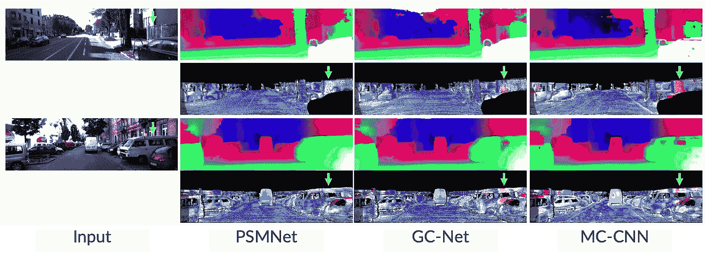

“KITTI 2012 测试图像”的视差估计结果左图显示了立体图像对的左输入图像。PSMNet、GC-Net 和 MC-CNN 获得的每个输入图像的视差显示在其误差图上方。

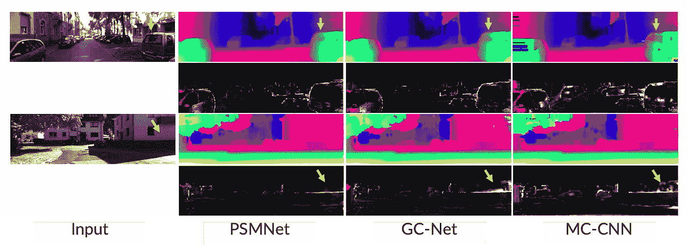

为 GC-Net 及其前身显示的 KITTI 2012 测试图像的视差估计结果。左侧面板显示立体图像对的左侧输入图像。以下是 PSMNet、GC-Net 和 MC-CNN 针对每个输入图像获得的视差以及相应的误差图。

## 结果

## 摘要

**优点**

先前的 DL 立体匹配方法的一个问题是上下文信息。GC-Net 是一个用于立体匹配的端到端学习框架，无需后处理，它采用编码器-解码器来合并多尺度特征以实现成本体积正则化。

引入了金字塔池模块，用于将全局上下文信息合并到图像特征中

一个堆叠沙漏 3D 有线电视新闻网，用于成本卷中上下文信息的扩展区域支持。

**缺点**

大量足迹和耗时的推断

## 纸张和代码

<https://github.com/JiaRenChang/PSMNet>  

# ModuleNet

伦特里亚，奥克塔维奥&奎瓦斯-泰洛，胡安-卡洛斯&雷耶斯-菲格罗亚，阿兰&里维拉，马里亚诺。ModuleNet:用于立体视觉的卷积神经网络。10.1007/978–3–030–49076–8_21.(2020).

## 动机

1.  受 FlowNet & U-Net 的启发，一个衡量任何范围内差异的模型。
2.  使用低计算时间算法来测量成本图。
3.  架构很简单，因为它不需要任何额外的专门网络作为不同的 FlowNet 的变体进行优化。
4.  它改进了基线模型 ELAS [3]和 FlowNet c([FlowNet](https://docs.google.com/document/d/1JcVa8AdmkE4U_07HQSr4R7K8uZ7NBVOJwz2F2ofQVIc/edit#heading=h.j2jcyz2h0mcs)的相关版本)，具有大约 80%的非偏倚误差。

U-Net 块由函数 F₁: F₁表示，对噪声普查距离图进行正则化。

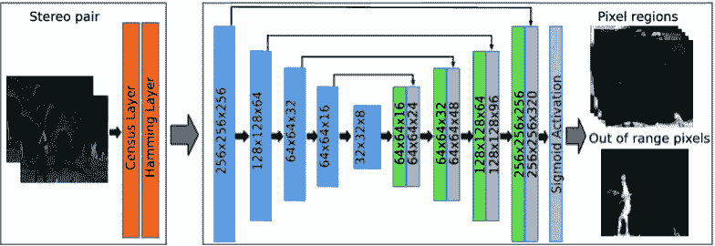

*一般块(U-Net)捐赠为 F* ₁ *接受距离张量* ***D*** *映射自* *图像对* ***I*** *然后转换为概率* ***P*** *。*

## 方法

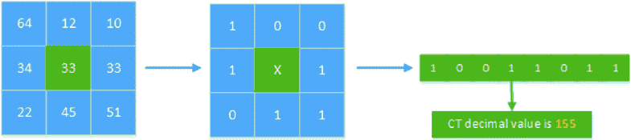

*普查转换*

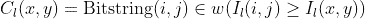

对于左图*我*ₗ；类似的， *C* ᵣ为右像 *I* ᵣ.汉明距离(H)计算两个普查签名之间的不同位数:

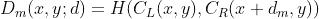

让我们举例说明具有代表性的₁. u-net

数学上:

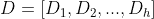

距离张量中的信息。

***D*** 通过 *F* ₁.映射到概率 ***P***

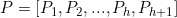

概率张量(模型输出)

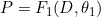

𝜃₁代表训练期间学到的重量。

第二个 U-Net 可以改进主要(训练的)模块的输出。函数*f*₂*t53】也使用距离张量 *D* 作为输入来提炼概率张量 p:*

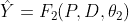

𝜃₂学会了举重。

因此，

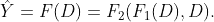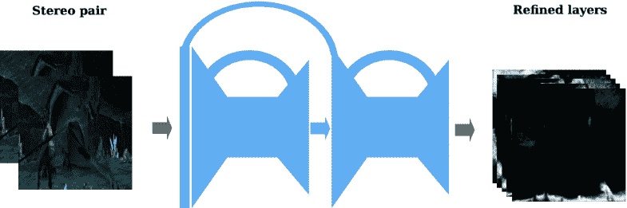

*基本块由两个 U 型网级联而成。*

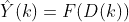

请注意，网络 *F i* s 重新用于处理 *K* 模块。

最后是视差估计。

通过在差异图**ŷ**中应用 WTA 程序来计算 d⋆。

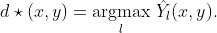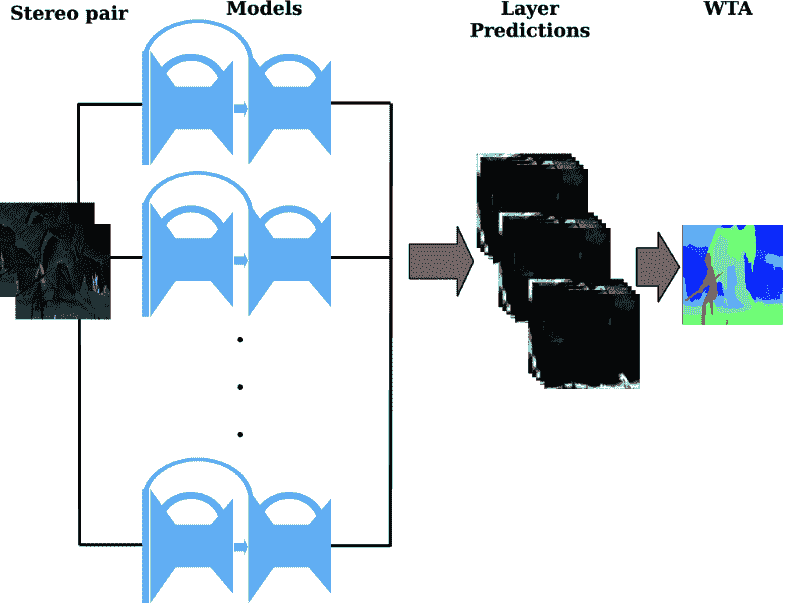

*ModuleNet:模块化 CNN 模型。* ***来源:*** *原创论文。*

## 结果

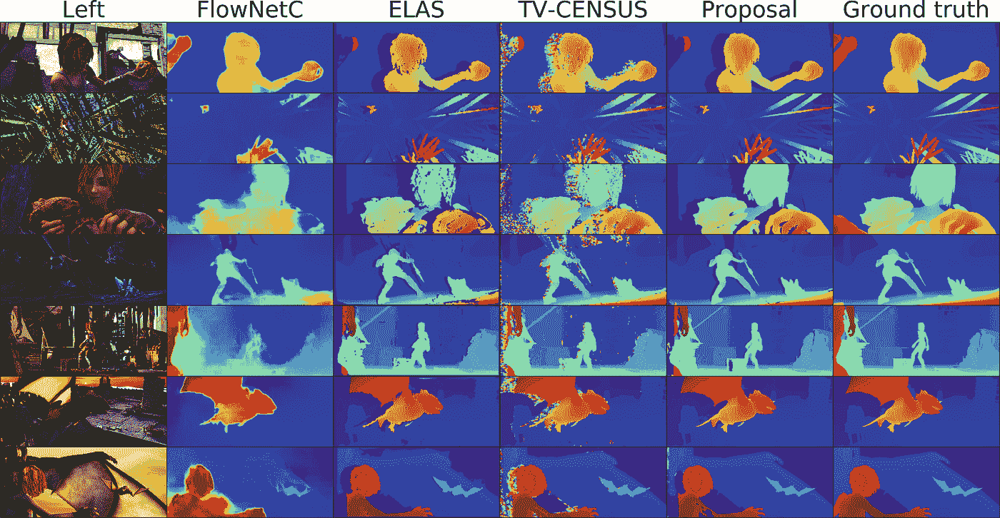

所选场景的 MPI Sintel 数据集的结果。 ***来源:*** *原创论文。*

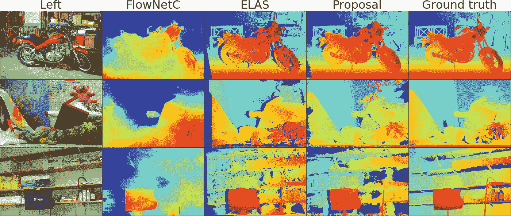

所选立体像对上的 Middlebury 数据集的结果。 ***来源:*** *原创论文。*

**注意:**用于检测范围外差异的额外层有助于对添加噪声的像素进行分类，因为这些像素在工作范围之外或者是被遮挡的区域。

## 摘要

## 纸张和代码

**代码不可用！:(**

如果有，请分享！

# GA 网

## 动机

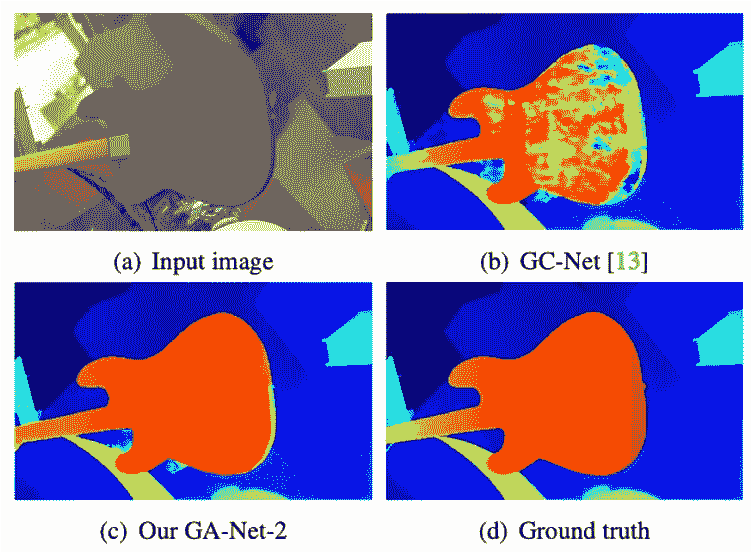

性能插图。(a)具有挑战性的输入图像。(b) GC-Net [13]有 19 个 3D 卷积层用于匹配成本聚集。(c)GA-Net 的结果仅使用两个建议的 GA 层和两个 3D 卷积层。它将匹配信息聚集到相当大的无纹理区域，并且比 GC-Net 更快。(d)基本事实。 ***来源:*** *原创论文。*

## 方法

(a)架构概述。左和右图像输入通过权重共享特征提取管道。它由层叠的沙漏 CNN 通过级联连接而成。所提取的左和右图像特征形成了 4D 成本体，该成本体被馈送到成本聚集块，用于正则化、细化和视差回归。制导子网(绿色)为制导成本汇总(SGA 和 LGA)生成权重矩阵。(b) SGA 层在四个方向上半全局地合计成本量。在视差回归之前使用 LGA 层，并且局部细化 4D 成本量若干次。 ***来源:*** *原创论文。*

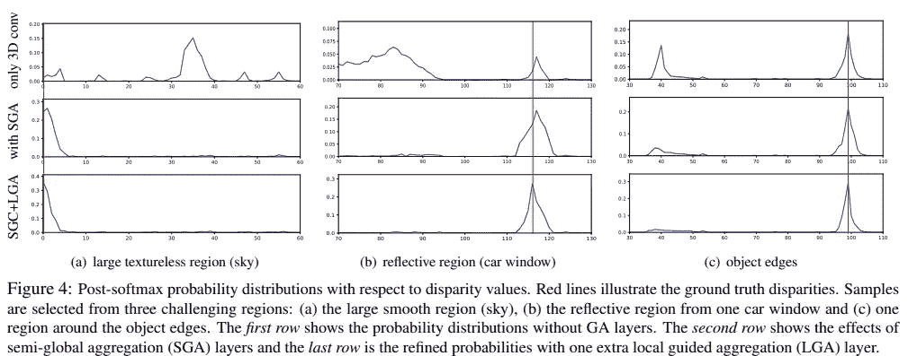

## 结果

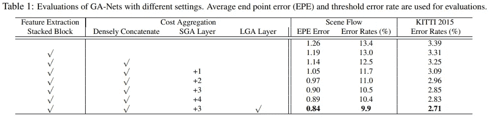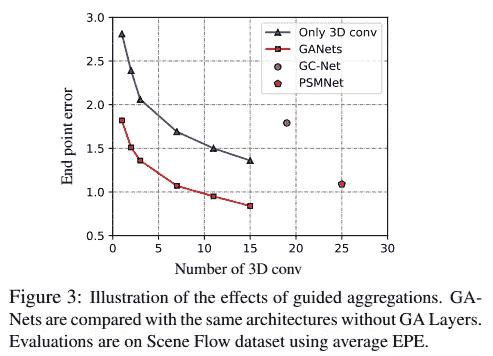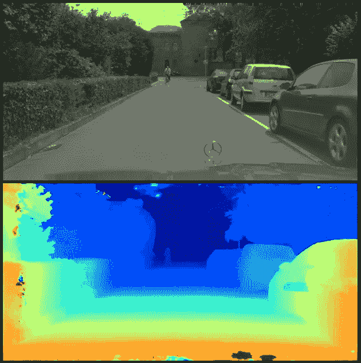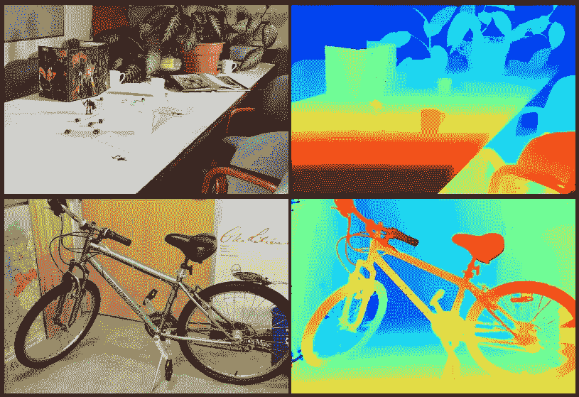

城市景观(上)和米德尔伯里(下)的样本结果。**来源:**[https://github.com/feihuzhang/GANet/](https://github.com/feihuzhang/GANet/)。

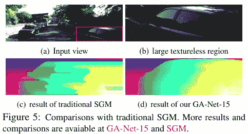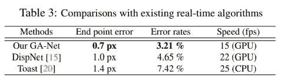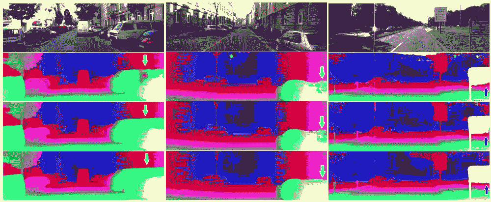

结果可视化和比较。第一行:输入图像。第二行:GC-Net 的结果[13]。第三行:PSMNet [3]的结果。最后一行:我们遗传网络的结果。蓝色箭头指出了显著的改进。引导聚合可以有效地将视差信息聚合到大的无纹理区域(例如，汽车和窗户)并给出精确的估计。它还可以聚合对象知识并保留深度结构(最后一列)。

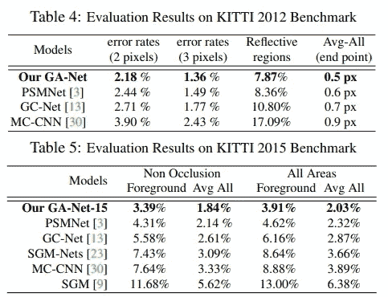

## 摘要

## 纸张和代码

<https://github.com/feihuzhang/GANet>  

# 讨论

## 摘要

我们看了深度学习时代立体视觉进步的几种基本方法。每种技术都有动机，技术上的审查，以及原始论文和官方源代码。

不同于传统的调查，在传统的调查中，专家正确地写下了一个特定的主题，这里提供的是来自学习立体视觉的人的基于方法的概述。换句话说，这并不是要以任何方式取代同行评审调查，而是在一个不太正式的会议上提供一个更容易阅读的、针对具体方法的概述。如果你想查看我们发表的关于另一个计算机视觉主题的文献，请查看我们的 [IEEE PAMI](https://www.computer.org/csdl/journal/tp) 调查。

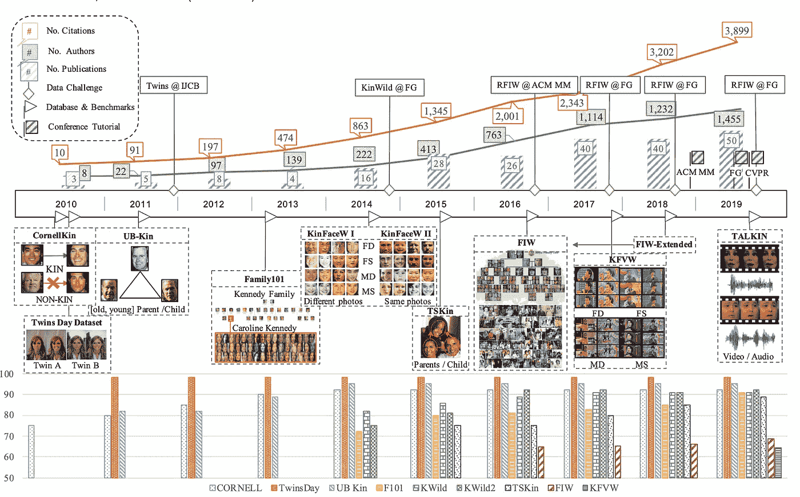

资料来源:[视觉亲属关系分析和建模调查:酝酿中的十年](https://arxiv.org/pdf/2006.16033.pdf)。由作者创作。

## 未来的工作

我们讨论了使用监控的基于图像的立体方法。本系列的后续部分将涵盖基于视频的(即多视图立体视觉)、多任务、自我监督、公共数据集、基准和基准，以及关于生成相应置信度映射的最后一部分。敬请期待！

## 结论

我们讨论的深度学习方法只是解决计算机视觉问题的许多新方法中的几个。如果你不了解深度学习基础，这篇博文可能不适合你。另一方面，如果您正在寻找将立体图像映射到深度图的端到端解决方案，无论是为了工作、个人项目还是研究，本博客系列可能是您的起点。无论如何，考虑在你的产品或服务中采用深度学习技术可能是值得的。上面讨论的哪个模型对你最有意义，或者是你的首选？您希望我在未来的部分中包含哪些方法？你喜欢什么，不喜欢什么？任何反馈、问题、请求等。，将不胜感激。

# 补充资源

PSM 网络是使用 PyTorch Lightning 实现的。

<https://pythonrepo.com/repo/xtliu97-PSMNet_PytorchLightning-python-deep-learning>  

查看 FlowNet 上的深度博客:

</a-brief-review-of-flownet-dca6bd574de0>  

GA-Net:Youtube 上端到端立体匹配的引导聚合网络。

# 补充的

1.  [Dhanoop Karunakaran](https://medium.com/u/9d9e487d186?source=post_page-----7cb2c9ff325d--------------------------------) aran 编写了一个由 3 部分组成的博客系列，内容是使用深度学习([第 1 部分](https://medium.com/intro-to-artificial-intelligence/deep-learning-series-1-intro-to-deep-learning-abb1780ee20))进行图像分类([第 2 部分](https://medium.com/intro-to-artificial-intelligence/simple-image-classification-using-deep-learning-deep-learning-series-2-5e5b89e97926?source=user_profile---------30-------------------------------))和检测/定位图像中的交通标志([第 3 部分](https://medium.com/intro-to-artificial-intelligence/traffic-sign-detection-selefdriving-car-deep-learning-series-3-1db4eda67979))。有大量具有足够深度和广度的资源，即使是忙于学习 SOA 的专家也能深入理解。因此，博客系列在相对较短的系列中提供了动机、视觉、数学和概念观点的良好平衡。张量流用于在证明和概念之间架起理解的桥梁。

# 参考

1.  Y.LeCun、L. Bottou、Y. Bengio 和 P. Haffner。"基于梯度的学习应用于文档识别."IEEE 会议录，86(11):2278–2324，1998 年 11 月。
2.  Alex Krizhevsky，Ilya Sutskever 和 Geoffrey E. Hinton“使用深度卷积神经网络的图像网络分类”在*神经信息处理系统进展* (2012)。
3.  Bahdanau、Dzmitry、Kyunghyun Cho 和 Yoshua Bengio。"通过联合学习对齐和翻译的神经机器翻译."在 *ICLR* (2015)。
4.  盖革、安德烈亚斯、马丁·罗瑟和拉克尔·乌尔塔森。“高效的大规模立体匹配。”亚洲计算机视觉会议。施普林格，柏林，海德堡，2010。
5.  将立体视差和光流结合起来用于基本场景流。*商用车技术 2018* 。斯普林格，2018。90–101.
6.  门兹、莫里茨和安德烈亚斯·盖格。"自动驾驶车辆的物体场景流."*IEEE 计算机视觉和模式识别会议论文集*。2015.
7.  翟，，等，“光流和场景流估计:综述”模式识别 114 (2021): 107861。
8.  罗恩伯格，奥拉夫，菲利普费舍尔和托马斯布罗克斯。" U-net:生物医学图像分割的卷积网络."*医学图像计算和计算机辅助介入国际会议*。施普林格，查姆，2015。**