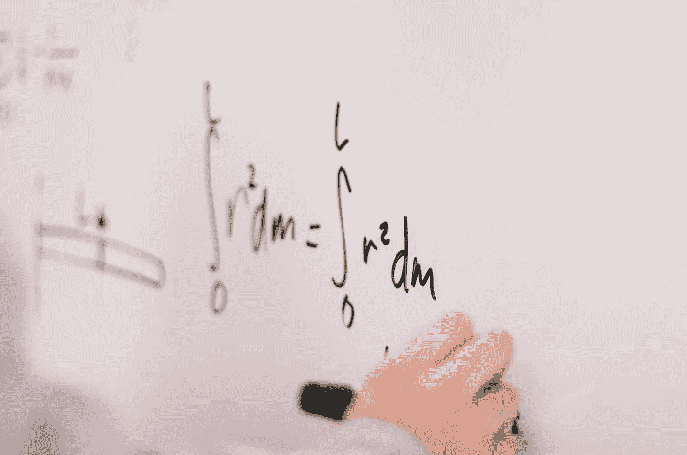

# 我必须懂数学才能进入数据科学世界吗？

> 原文：<https://towardsdatascience.com/do-i-have-to-know-math-to-enter-the-data-science-world-89a92bd800a2>

## 我个人对这个 FAQ 的回答。

杰斯温·托马斯在 [Unsplash](https://unsplash.com/s/photos/mathematics?utm_source=unsplash&utm_medium=referral&utm_content=creditCopyText) 上的照片

我开始学习数据科学已经一年多了。这一切都是因为好奇而开始的，但后来我获得了一种快感，这种快感让我为了职业的飞跃而学习(尚未完成)。

当我几乎每天都在学习和实践时，我对这个领域的热爱让我分享我获得的知识(当然，我这样做甚至是为了分享的快乐)。

在 Linkedin 上分享信息让我收到了连接请求，大多来自那些想了解更多数据科学的人，因为他们很好奇，想知道这个领域是否适合他们。人们问我的典型问题是:“我必须懂数学才能进入数据科学吗？”或者:“我需要知道多少数学知识？”

我知道这个问题很常见，想给刚开始学习的人一个我个人的回答。

# 1.学习编程不需要懂数学

一开始的一个大惊喜是:如果你想学习数据科学，你首先需要学习编程。

**选了一门课就开始编程**。什么课程什么编程语言都无所谓(我建议 Python，因为它甚至大多用于非 DS 的东西，你可能只是喜欢 Python 而不喜欢 DS)。

但是事情是这样的:**学习编程不需要懂数学。**编程只是……编程！不是“在数学上做操”。当然，如果你有解决逻辑问题的习惯，你将处于优势；但是，你知道，解决问题的能力是一种普遍的能力，你可以通过实践来学习。

我的具体建议是从头开始。从 0 开始学习编程。学习函数，列表，元组，ad 等等。在几个星期内完成基础部分，当你有一点满意的时候，继续。

当然，如果你像我一样，你可能会有一点困难；事实上，当我接近一个新的领域并发现我喜欢它时，我每天都想知道更多；我对知识如饥似渴，我必须尽快满足它。在这种情况下，要玩的游戏非常简单:在解决自己的实际问题的同时，学习自己需要的东西。

DS(更一般地说，编程)的魅力在于你可以创造自己的问题并解决它们，从而获得经验。

所以:从 0 开始编程，然后“自己创造问题去解决”。您是否需要进行一些计算并报告结果，将它们附加到 excel 文件中？好:学会怎么做！这是一个获得经验的很好的练习；相信我。

# 2.开始分析一些数据

学习编程几周后，开始分析一些数据。你有一堆可能性去做:上一些课程，继续 Kaggle，等等。

即使在这里，你决定如何开始并不重要:**开始**！如果你不喜欢这门课，或者觉得它对你来说太复杂(或太简单)，你可以改变它。

这里的问题是:你需要懂点数学。是的，我的朋友，我必须告诉你:要分析数据，你需要懂数学；不要相信任何与你相反的人。但是有一个好消息:如果你不懂数学，你可以在需要的时候学！

在这个阶段，你将需要统计学的基础知识:均值、中值、正态分布等等。如果你不知道它们，当你需要它们的时候，自己去学吧。网上有一堆资料(还有上千的数学课程):需要的时候学，做项目的时候练，理论联系实际掌握。

如果你感到不知所措，不要害怕:你不需要知道一切。

告诉你一个秘密:**没有人什么都知道**！

跟我重复一遍:没有人知道一切。这必须是你的口头禅，否则你会迷失在这个领域。

外面有很多懂很多数学和统计的人(很多数据科学家都是数学/统计出身)；事实是:这些人中有很多来自研究领域(通常，他们有博士学位)，但是“日常现实”很简单，你不需要知道统计学家知道的数据科学中的数学！

所以，从简单开始，每天坚持练习，在你需要的时候研究你需要什么，几个月后你会看到结果；相信我。

是的，我有工程背景，但我在工程学习期间从未上过统计学课程:我是在学习数据科学的同时自学的，在需要的时候研究题目。这很有效，相信我；你也不会有那种什么都要知道的感觉，那种感觉可能会让你停滞不前，让你放弃学业。

**3。机器学习**

我想从一开始就明确:要实践机器学习，你必须知道很多数学知识。机器学习“做事情”，“在这些事情背后”有大量的数学。

你不能将算法应用于数据集，然后祈祷结果是好的；这样不行。记住:垃圾进，垃圾出(你的第二个口头禅！).

机器学习算法不能成为你的黑匣子:你必须明白你在做什么！但是有一个好消息:你可以在学习机器学习的同时学习需要的数学。

我举的一个典型例子是梯度下降。如果你学过微积分，当你听到“梯度”这个词时，你就知道我们要讨论导数、切线和最大/最小点。但就是这样！如果你不知道什么是导数，你不需要解决 876 个关于导数的练习(就像我在高中和大学做的那样):只要理解你需要的题目并继续下去。然后，练习，练习，还有……练习掌握算法。

# 结论

如果你想进入数据科学领域，你会问自己“要进入这个领域，我需要懂数学吗？”我的回答是:没有，但是有。

不，你不需要知道**和**所有你需要的数学知识。

但是，是的，在一定程度上，你需要学习数学，你需要理解与数据科学相关的主题。

从学习编程开始，然后每天继续学习你需要的东西(关于编程和数学)。不要害怕你不知道的事情:没有人知道所有的事情。开始吧，看看进展如何……[享受你的学习之路](https://medium.com/mlearning-ai/why-and-how-enjoying-the-learning-path-in-data-science-fe98642cb512)！

我知道你可能会感到不知所措:从机器学习课程开始，获得代数课程，返回到机器学习，学习微积分课程，等等……但请记住:学习过程就像建造房子:一砖一瓦，从基础开始，你会到达屋顶。日复一日，没有匆忙，没有喘息。没有别的办法。

*让我们连在一起！*

[***中等***](https://federicotrotta.medium.com/)

[***LINKEDIN***](https://www.linkedin.com/in/federico-trotta/)*(向我发送连接请求)*

*如果你愿意，你可以* [***订阅我的邮件列表***](https://federicotrotta.medium.com/subscribe)**这样你就可以一直保持更新了！**

*考虑成为会员:你可以免费支持我和其他像我一样的作家。点击 [***这里***](https://federicotrotta.medium.com/membership)**成为会员。***