# 神经网络会梦到落雪吗？

> 原文：<https://towardsdatascience.com/do-neural-networks-dream-of-falling-snow-89b5036ae324>

## 发展基于深度学习雷达的降水反演

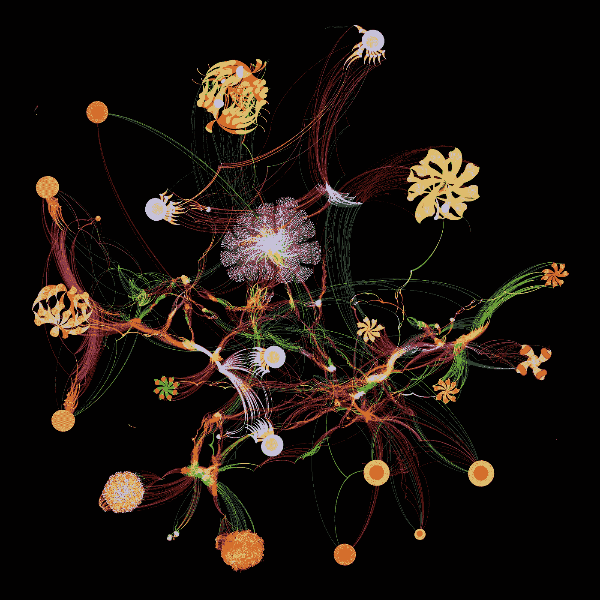

DeepPrecip 网络计算机图形渲染 Graphcore 和 Author 提供的图像

机器学习(ML)在地球科学中的应用并不是一个新概念。自 20 世纪 60 年代中期以来，k-means 聚类、马尔可夫链和决策树的早期示例已经在多个地理环境中得到积极应用( *Preston 等人，1964*；*克鲁姆宾等人，1969*；*纽恩多普，1976 年*。

然而，来自 [Graphcore](https://www.graphcore.ai) 、 [Amazon](https://aws.amazon.com/?nc2=h_lg) 和 [Google](https://cloud.google.com) 等公司的云计算资源的进步，加上对强大的 ML 库(例如 [Tensorflow](https://www.tensorflow.org) 、 [Keras](https://keras.io) 、 [PyTorch](https://pytorch.org) )和蓬勃发展的开发人员社区的轻松访问，使得这一新兴领域近年来大受欢迎( *Dramsch，2020* )。

现在，最大似然模型不仅经常用于地球科学中的业务预测(Ashouri 等人，2021 年)，还用于统计推断；没有与自然过程的物理模型模拟相关的传统不确定性( *King 等人，2022* )。

## 问题是

降雪是全球水循环和能量循环不可或缺的组成部分，对区域淡水可用性有重大影响( *Musselman 等人，2021*； *Gray 和 Landine，2011 年*。事实上，每年有超过 20 亿人(全球人口的六分之一)依赖融雪产生的淡水供人类消费和农业用途( *Sturm 等人，2017* )。随着全球平均气温持续上升，预计降雪频率和强度也将发生变化，从而导致全球范围内新的水资源管理挑战( *IPCC，2019* )。

然而，传统的降雪模型在估计中有很大的不确定性，因此应该研究新的算法来促进我们对全球降雪模式变化的理解。


智利托雷斯海峡上空可见复杂的降雪——图片由作者提供

因此，让我们探索一下 **ML 是如何被用于推进降雪预测领域的，以及这些技术在未来可能会走向何方。**

## 我们的解决方案

这篇帖子顶部的插图是 [DeepPrecip](https://github.com/frasertheking/DeepPrecip) 。或者更准确地说，是 DeepPrecip 计算图的渲染，它构成了模型决策过程的基础。

DeepPrecip 是一个深度卷积神经网络(CNN ),由滑铁卢[大学](https://uwaterloo.ca)开发，由**400 万**可训练模型参数组成！我们使用该模型的目的是评估在不同的地区气候下，我们如何利用地面雷达数据输入来预测地表降雨量( *King 等人，2022–2*)。这种类型的模型被称为“降水”*反演*，因为该模型的输入是大气雷达观测值(即从下落的水凝物反向散射的能量)，它输出关于地面雨雪的预测。

**但是如何利用大气雷达后向散射强度来推断地面降水量呢？**

我们必须找到一种方法，从感兴趣的部分相关的大气变量(在这种情况下是雷达反向散射强度)中提取非常具体的降水信息。这可以通过两种方式实现:

1.  通过一个基于物理的模型，模拟大气中发生的导致冰晶形成和最终降雪的物理过程。
2.  经验统计过程(如 ML 模型),可以发现不同变量之间的模式，通过正向模型显示彼此之间的一些敏感性。

虽然这两种技术都有各自的优缺点，我们*可以*用整篇博文来讨论，但在本文中，我们将重点讨论第二种方法。但首先，什么是正向模型*？*斯蒂芬斯于 1994 年提供了一个经典的例证:

> “假设你想要描述一条龙，但你只观察到龙在沙地上留下的脚印。现在，如果你已经了解龙，你可以很容易地描述它可能在沙子上留下的痕迹；也就是说，你可以开发一个正向模型。但是如果你只观察沙地上的痕迹，那么描述龙的任何细节都会困难得多。你可能能够分辨出它是龙而不是鹿，但是有些方面你无法辨别:龙的颜色，它是否有翅膀，等等。检索可以将观察结果(大脚印)与先验信息(大多数龙有翅膀，留下大脚印的龙是绿色的)结合起来，以获得最可能的状态(它是一条有翅膀的绿色龙)。”

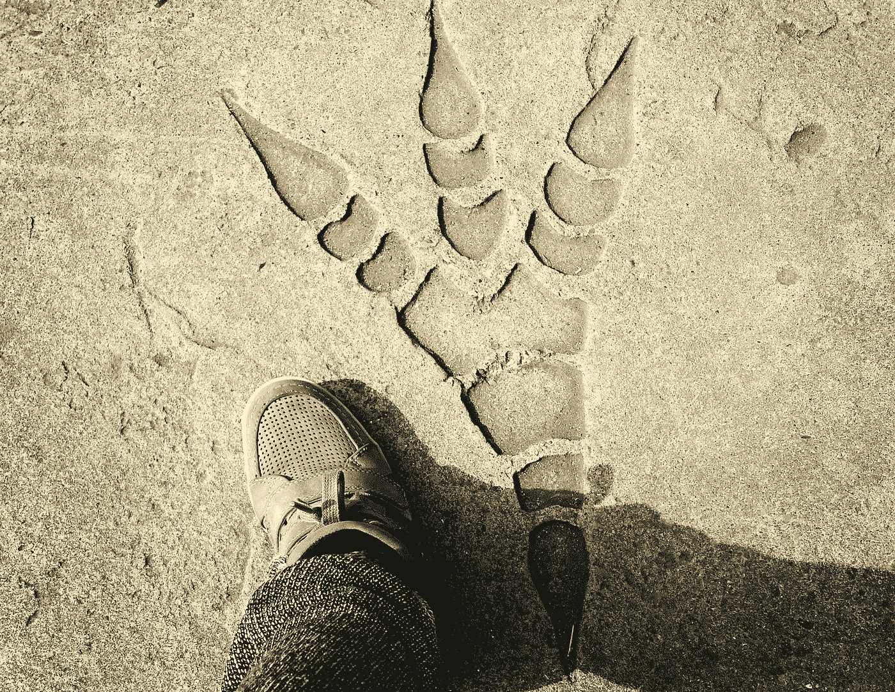

沙滩上的龙脚印——由[盖蒂图片社](https://www.gettyimages.ca/photos/dinosaur-footprint)的 [Vishy Patel](https://www.gettyimages.ca/search/photographer?photographer=Vishy%20Patel%20%2F%20EyeEm) 拍摄

我们可以利用这个想法将垂直雷达剖面图中的信息与地面降雪量联系起来！由于雷达数据输入有一个物理结构(剖面从地表延伸到大约 3 公里)，DeepPrecip 使用了多个卷积层来提取可能的水凝物活动的不同部分之间的特征。这些信息有助于我们的模型理解不同的风暴事件类型和结构，从而提高网络的全连接前馈回归组件中降水率估计强度的准确性。

更正式地说，DeepPrecip 的模型架构如下所示。您能否将此图中的不同模型架构层与之前显示的计算图匹配起来？

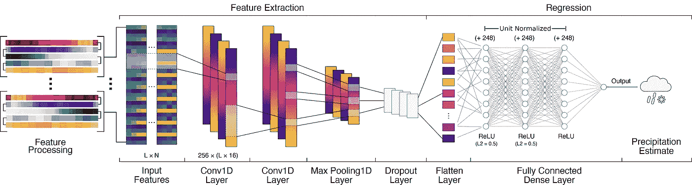

DeepPrecip 模型架构图—图片由作者提供

## 模特培训

为了开发一个稳健的模型，我们首先需要收集雷达数据和同位原位降水测量观测值的代表性训练数据集。请注意，这是一个监督学习问题，因此需要参考数据。

由于地球科学中的问题总是具有挑战性，因此在数据选择阶段必须小心选择有代表性的样本。每个站点还必须配备以相同方式校准的类似仪器。在这项工作中，我们选择了北半球的 9 个站点，用 8 年的时间从微雨雷达(MRR)系统和雨量计收集数据。这些工具的示例如下所示。

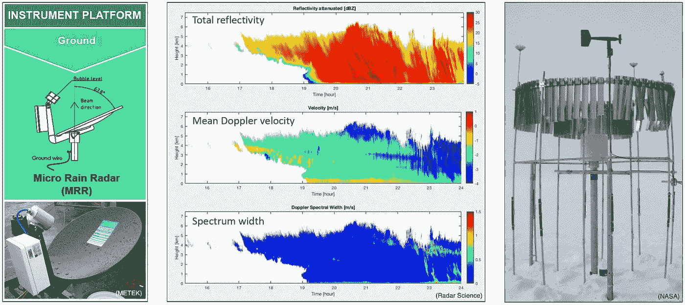

MRR 和 Pluvio2 仪器及反射率剖面示例—图片由作者提供

由于我们管理的训练数据集的规模很大(数百万个训练样本)，加上模型架构的一般复杂性，超参数优化在开发过程的早期成为我们的瓶颈。在尝试了各种不同的云计算选项后， [**Graphcore**](https://www.graphcore.ai) 的系统脱颖而出，成为大幅缩短我们培训时间的绝佳选择。

Graphcore 加速训练的关键是使用了他们专门的[情报处理单元(IPUs)](https://www.graphcore.ai/products/ipu) 。IPU 是一种全新的大规模并行处理器，用于加速机器智能。计算和内存架构是为人工智能横向扩展而设计的。请注意 IPUs 和传统处理器之间的差异如下:

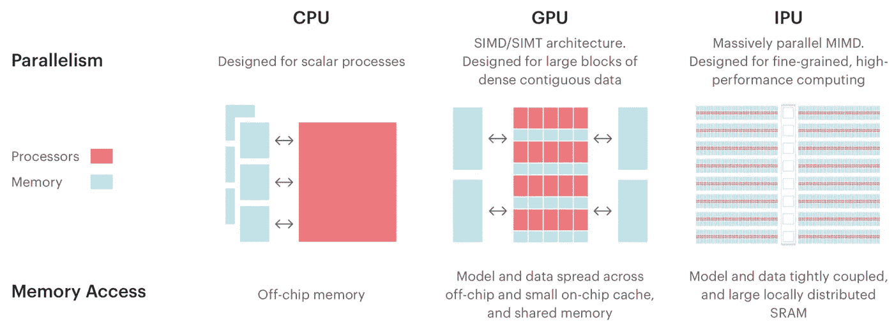

IPU 架构与其他处理器设计的差异—图片由 [Graphcore](https://www.graphcore.ai) 提供

硬件与软件一起开发，提供了一个易于使用且擅长实际应用的平台。使用 Graphcore MK2 经典 IPU-POD4(注意，第二代 IPU 现已上市)，我们能够**将 DeepPrecip 的训练时间比其他最先进的系统(如 Tesla V100s)加快** **6** 倍。如果你想为你的项目测试 IPU 系统，看看他们的[云平台](https://www.graphcore.ai/ipus-in-the-cloud)。

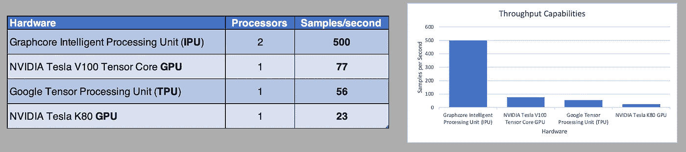

DeepPrecip 培训的硬件吞吐量比较—图片由作者提供

选定硬件后，我们需要选择一个优化范例。为了确定 DeepPrecip 的最佳超参数值，我们决定使用一种称为[超波段优化](https://jmlr.org/papers/volume18/16-558/16-558.pdf)的自适应优化形式。这种方法是贝叶斯优化(即自适应搜索)的一种变体，它专注于使用自适应资源分配和早期停止来加速随机搜索过程(*李等人，2018* )。这使我们能够测试一个巨大的超参数空间，并快速确定模型参数的正确值。


不同的超参数优化技术—图片由 *Talaat 等人提供，2022*

使用单个 IPU 对 DeepPrecip 的 14 个不同参数和 68 个不同的总价值选项(即数万亿种可能的组合)进行超波段优化大约需要两周时间。均方误差(MSE)指标(如下)显示了该过程如何智能地选择更好的超参数组合，同时缓慢增加每个周期的周期数。

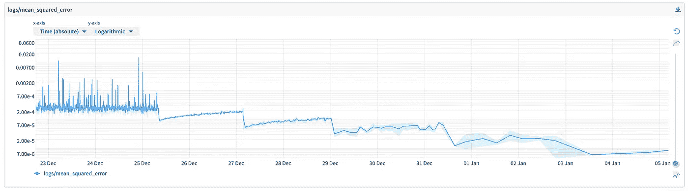

通过连续的超波段优化步骤改进了模型技巧-图片由作者提供

对于超波段优化过程的每次迭代(或索引)，可以使用平行坐标图来呈现这些参数关系的高维可视化(如下所示)。这允许我们在模型架构的复杂性和性能之间找到一个平衡，以产生一个既高效又有技巧的模型。有关此过程以及最终超参数值的更多详细信息，请参见 *King 等人，2022–2*。

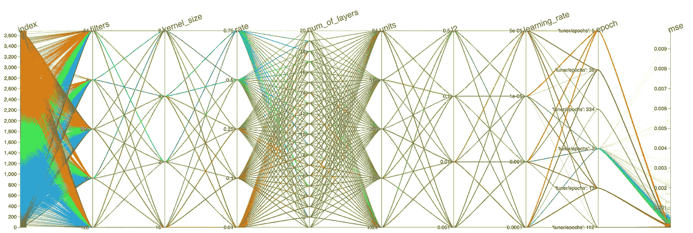

每个超参数组合的平行坐标图—图片由作者提供

虽然花费在收集、预处理和正确采样数据上的时间以及 2 周的超参数化过程可能看起来有些多余，但正确执行这些步骤是非常重要的，因为它可以显著降低未来过度拟合问题的可能性。

## 性能和耐用性

有了一个训练有素的模型，我们能够评估它相对于其他 ML 模型和传统经验关系的一般性能。

总的来说，DeepPrecip 被发现优于其他传统的检索方法，其 MSE 值比其他方法低 40%，T2 比其他方法高 40%。我们还注意到，与其他测试模型相比，DeepPrecip 似乎更有能力正确估计高强度降水的波峰和波谷。使用交叉验证方法，我们发现 **DeepPrecip 展示了稳健性**，提高了准确预测区域气候站点降雨量的能力，而这些区域气候是该模型以前未见过的。

关于健壮性的最后一点是关键。以前的经验方法的一个主要限制是，每个模型都是为其衍生的气候定制的( *Wood 等人，2014* )。因此，虽然一种模式在美国北部可能行得通，但在瑞典或韩国却未必行得通。

基于最大似然的方法的一个实质性好处是，它可以以不受粒子微观物理学的物理假设约束的方式对来自各种不同位置的数据进行训练。我们从该项目中发现，基于最大似然法的地表降雪解决方案显示出低误差和高概化，并且有充分的理由相信，全球最大似然法反演算法可以帮助增强当前基于卫星的产品，这些产品提供了对世界各地降雪量的估计。

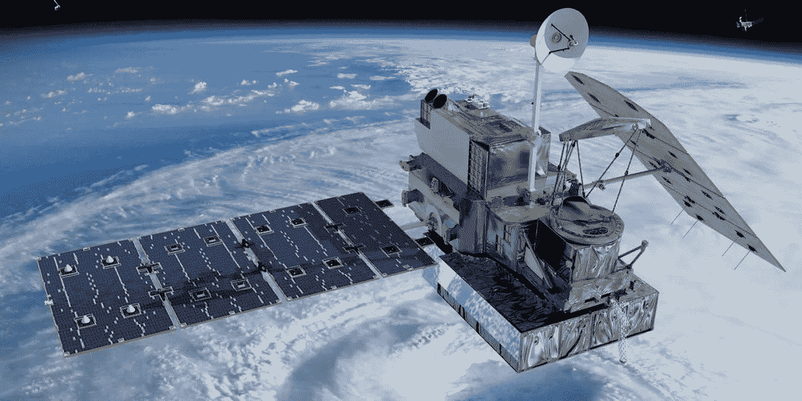

飓风上方的全球降水测量(GPM)核心卫星——由 [NASA](https://gpm.nasa.gov/missions/GPM/core-observatory) 拍摄

## 推理

这个项目开始时的目标不仅是开发一个操作模型，而且要解释所述模型，以识别垂直雷达剖面图中对高模型技能贡献最大的区域。

DL 模型通常被认为是“*黑盒*”算法，其中一些输入被输入到模型中，一些输出出来；不知道这两个阶段之间发生了什么。一些 ML 模型，如随机森林，提供了一个基于每个决策树做出决策的方式的特征重要性排名，但是我们如何为像 DeepPrecip 这样的 DL 模型提取类似的东西呢？

回车， [**沙普利值**](https://christophm.github.io/interpretable-ml-book/shapley.html) 。

由 Lloyd Shapley **于 1951 年提出(并以其命名)，Shapley 值是合作博弈理论中的一个解概念。这个值代表个人参与者对游戏中某个共同目标的贡献。对于多个参与者，它允许我们测量每个参与者对最终结果的边际贡献。例如，如果多人出去吃饭，每个人点了不同的主菜，如果我们决定分摊晚餐账单，每个人支付的百分比可以根据 Shapley 值分摊。**

下面是死亡率风险评估的直观图表，描述了来自大量观察样本的局部解释如何使用 Shapley 值提供关于全局模型行为的见解:

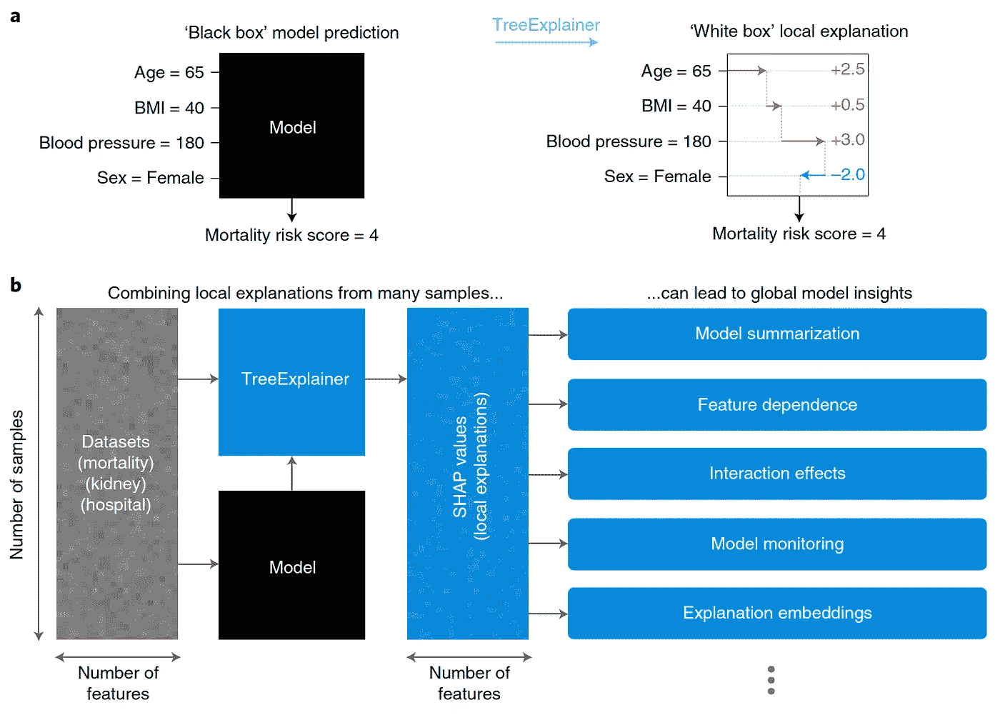

*局部解释提供了多种理解全局模型结构的新方法——图片由* Lundberg 等人提供，2020 年

使用上面显示的方法和 Lundberg 等人在*2020*中更详细地概述的方法，测量局部和全局对某个目标的贡献的过程可以与 DL 相关。我们可以检查模型输入的不同组合(即雷达数据子集，或大气变量组合)，以查看模型精度如何变化。然后，这可以用来确定哪些变量，以及在我们的情况下，大气中的哪些位置，为主动检索降雪提供了最重要的信息。请注意，这是一个计算量非常大的分析。

将我们的数据集分成不同强度的降水事件类型，并对每个子集进行 Shapley 分析，揭示了最重要的变量和区域(如下所示；较暗的阴影区域表示较高的重要性)。

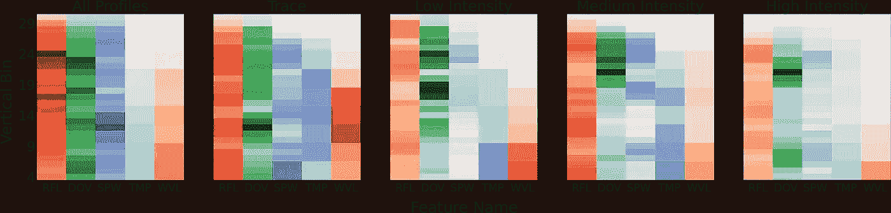

表面上方每个垂直条柱的每个模型预测值的 Shapley 值的热图-图片由作者提供

有趣的是，也许出乎意料的是，我们发现 DeepPrecip 认为大气中上部区域(接近 2 公里)是最重要的贡献者。不仅仅是在垃圾箱附近。通常，基于雷达的降雪量反演依赖于来自单个(或少数几个)近地表面元的信息，但在这里似乎不是这样。此外，反射率(RFL)通常被认为是基于雷达的反演中最重要的变量，然而多普勒速度(DOV)对于高强度降水事件的重要性实际上超过了 RLF。请注意，SPW 是光谱宽度，TMP 是温度，WVL 是风速。

理解我们的 DL 模型如何做出决策是进一步优化其性能并在未来迭代中提高其技能的重要一步。此外，这一分析揭示的信息有助于为下一代降水任务的当前和未来降雪反演提供信息。如果您正在用 DL 执行类似的实验，我强烈推荐在您自己的模型上测试这个过程，因为这些输出可能非常有启发性！

## 总结和结论

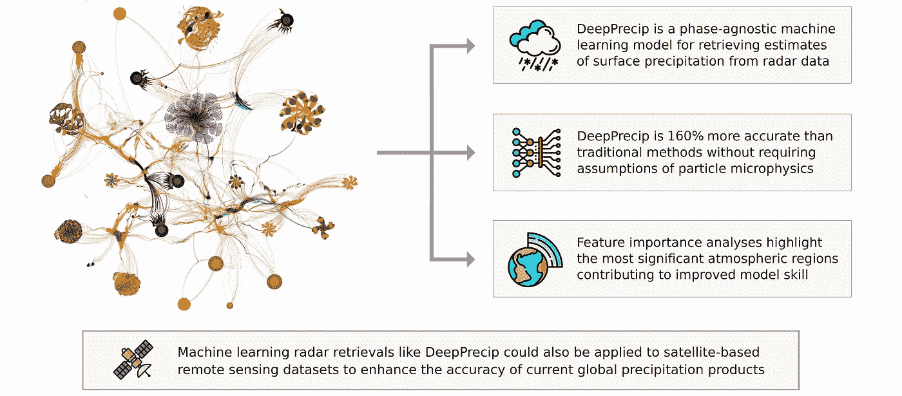

DeepPrecip 项目总结和后续步骤—图片由作者提供

在这项工作中，我们简要描述了 DeepPrecip 的发展过程:一种新的利用垂直反射率剖面的深度学习降雪反演算法。虽然我们在这里不讨论 DeepPrecip 的代码，但是这个模型是开源的，可以在 GitHub 上使用。它是使用 [scikit-learn](https://scikit-learn.org/stable/) 、 [Tensorflow](https://www.tensorflow.org) 和 [Keras](https://keras.io) 用 Python 开发的。

<https://github.com/frasertheking/DeepPrecip>  

如果您对测试感兴趣，可以使用以下命令构建并运行模型:

```
git clone [https://github.com/frasertheking/DeepPrecip.git](https://github.com/frasertheking/DeepPrecip.git)
conda env create -f req.yml
conda activate deep_precip
python deep_precip.py
```

我们还包括一个 [deep_precip_ipu.py](https://github.com/frasertheking/DeepPrecip/blob/main/deep_precip_ipu.py) 模块，用于在 [Graphcore IPUs](https://www.graphcore.ai/graphcloud) 上运行这个模型。请注意，您将需要 MRR 培训数据作为模型的输入。

我将在这篇文章的结尾说，我不期望 DL 模型完全取代物理模型或传统的降雪反演经验方法。然而，DL 方法的高准确性和稳健性，结合全球模型行为分析提供的见解，有助于**增强和通知未来地面和星载雷达任务的降雪反演方法**。

关于这个项目的更多细节，请阅读我们目前在大气测量技术(AMT)上发表的论文([https://eg sphere . Copernicus . org/preprints/2022/eg sphere-2022-497/](https://egusphere.copernicus.org/preprints/2022/egusphere-2022-497/))。

此外，如果您愿意支持我们的工作，我们是 NSERC 科学曝光大赛的决赛选手，我们将通过 [**为我们的形象**](http://www.nserc-crsng.gc.ca/ScienceExposed-PreuveParLimage/past_winners-images_des_gagnants_eng.asp?year=2022#img-7) 投票来感谢您的支持。

## 承认

我要感谢为这项工作贡献了多年观测数据的许多数据提供商、我的合著者、滑铁卢大学以及 Graphcore 团队，感谢他们对计算系统的持续支持和访问。

我还要感谢加拿大自然科学和工程研究委员会(NSERC)对这个项目的资助。

## 参考资料:

Ashouri、Hamed、Gehne、Maria 和国家大气研究中心工作人员(Eds)。2021 年 10 月 31 日最后修改。"气候数据指南:PERSIANN-CDR:使用人工神经网络从遥感信息进行降水估算-气候数据记录."

德拉姆施，J. S. (2020)。地球科学中的机器学习 70 年回顾。*地球物理学进展*， *61* ，1–55。[https://doi.org/10.1016/bs.agph.2020.08.002](https://doi.org/10.1016/bs.agph.2020.08.002)

格雷，医学博士，男性，教育学博士。(1981).*雪手册:原理、流程、管理&使用*。佩加蒙出版社。[https://snia . mop . gob . cl/repository odga/handle/20 . 500 . 13000/2981](https://snia.mop.gob.cl/repositoriodga/handle/20.500.13000/2981)

IPCC，2019: IPCC 关于气候变化中的海洋和冰冻圈的特别报告[h .-o . p rtner，D.C. Roberts，v . Masson-德尔莫特，P. Zhai，M. Tignor，E. Poloczanska，K. Mintenbeck，A. Alegría，M. Nicolai，A. Okem，J. Petzold，B. Rama，N.M. Weyer(编。)].剑桥大学出版社，英国剑桥，美国纽约，755 页 h[ttps://doi . org/10.1017/9781009157964。](https://doi.org/10.1017/9781009157964.)

f .金、g .达菲和 C. G .弗莱彻(2022)。基于机器学习的厘米波长降雪反演算法。*应用气象学与气候学杂志*， *1* (aop)。[https://doi.org/10.1175/JAMC-D-22-0036.1](https://doi.org/10.1175/JAMC-D-22-0036.1)

金，f .，达菲，g .，米兰尼，l .，弗莱彻，C. G .，彼得森，c .，&埃贝尔，K. (2022)。DeepPrecip:降水反演的深度神经网络。*平衡球*，1–24。[https://doi.org/10.5194/egusphere-2022-497](https://doi.org/10.5194/egusphere-2022-497)

Krumbein，W. C .，& Dacey，M. F. (1969 年)。地质学中的马尔可夫链和嵌入马尔可夫链。*国际数学地质协会杂志*， *1* (1)，79-96。[https://doi.org/10.1007/BF02047072](https://doi.org/10.1007/BF02047072)

Li，l .，Jamieson，k .，DeSalvo，g .，Rostamizadeh，a .，& Talwalkar，A. (2018)。 *Hyperband:一种新的基于 Bandit 的超参数优化方法* (arXiv:1603.06560)。arXiv。[https://doi.org/10.48550/arXiv.1603.06560](https://doi.org/10.48550/arXiv.1603.06560)

Lundberg，S. M .、Erion、g .、Chen、h .、DeGrave、a .、Prutkin、J. M .、Nair、b .、Katz、r .、Himmelfarb、j .、Bansal、n .、和 Lee，s-I .(2020)。从局部解释到对树的可解释人工智能的全局理解。*自然机器智能*， *2* (1)，56-67。[https://doi.org/10.1038/s42256-019-0138-9](https://doi.org/10.1038/s42256-019-0138-9)

Musselman，K. N .，Addor，n .，Vano，J. A .，& Molotch，N. P. (2021)。冬季融化趋势预示着雪水资源的广泛减少。*自然气候变化*， *11* (5)，418-424。[https://doi.org/10.1038/s41558-021-01014-9](https://doi.org/10.1038/s41558-021-01014-9)

Newendorp，P. D. (1976 年)。*石油勘探决策分析*。[https://www.osti.gov/biblio/6406439](https://www.osti.gov/biblio/6406439)

普雷斯顿，弗洛伊德 w，和詹姆斯亨德森。*地层对比用旋回沉积物的傅里叶级数表征*。堪萨斯地质调查局，1964 年。

Stephens，G. L .，1994: *低层大气的遥感:导论。*牛津大学出版社，562 页

Sturm，m .，Goldstein，M. A .，& Parr，C. (2017)。来自雪的水和生命:一个万亿美元的科学问题。*水资源研究*， *53* (5)，3534-3544。[https://doi.org/10.1002/2017WR020840](https://doi.org/10.1002/2017WR020840)

Talaat，F. M .，& Gamel，S. A. (2022)。基于 RL 的卷积神经网络超参数优化算法。*环境智能与人性化计算杂志*。[https://doi.org/10.1007/s12652-022-03788-y](https://doi.org/10.1007/s12652-022-03788-y)

Wood，N. B .，L'Ecuyer，T. S .，Heymsfield，A. J .，Stephens，G. L .，Hudak，D. R .，& Rodriguez，P. (2014)。使用同位多传感器观测估算雪微物理特性。地球物理研究杂志:大气， *119* (14)，8941–8961。【https://doi.org/10.1002/2013JD021303 