# 不要将不寻常的数据点视为异常值

> 原文：<https://towardsdatascience.com/do-not-dismiss-unusual-data-points-as-outliers-5132380f2e67>

## 一些可疑点往往被错误地简化为异常值。其他类型及其检测工具也值得关注。

[davisuko](https://unsplash.com/@davisuko?utm_source=unsplash&utm_medium=referral&utm_content=creditCopyText) 在 [Unsplash](https://unsplash.com/s/photos/unique?utm_source=unsplash&utm_medium=referral&utm_content=creditCopyText) 上拍摄的照片

# 定义

## 语境

> 垃圾进，垃圾出

这句话概括了**中等**数据对模型结果的影响。在一个项目中，一个不可或缺的步骤是执行 **EDA** (解释性数据分析)来检查数据的“清洁度”等。如果没有这一步，有人可能会使结果无效，并要求进行稳健的分析，即处理异常观察的分析。

通常采用的方法是通过箱线图和散点图调查每个变量的单变量分布**。除了给出明显的结论之外，这些技术在多变量环境中可能**没有意义**，并且不能告诉我们这个异常数据子集如何影响估计模型。**

此外，涵盖术语“异常值”中的所有异常点**是不合适的。**事实上，不同种类的点可能以它们自己的方式影响估计的模型。

为此，除了“**异常值**，还将引入另外两个术语:**高杠杆，以及影响**。下一部分，每个术语都将通过例子来阐明。

## 术语

在回归分析中，这些术语是相关的，除了它们有不同的含义:

*   **影响点:**对估计模型有影响的数据子集。移除它似乎**显著修改了**估计系数的结果。
*   **异常值:**超出其余数据一般模式的观察值。在回归分析中，由于高残差，这些点保持**在置信带**之外。
*   **高杠杆:**具有**潜在影响**预测响应的观察结果。如果我们稍微改变观察到的反应，就可以通过∂y_hat/∂y:评估预测的反应有多大的不同。一般都是极限 x 值。

在深入探讨之前，我们先举一些琐碎的例子来获取要点。

## 例子

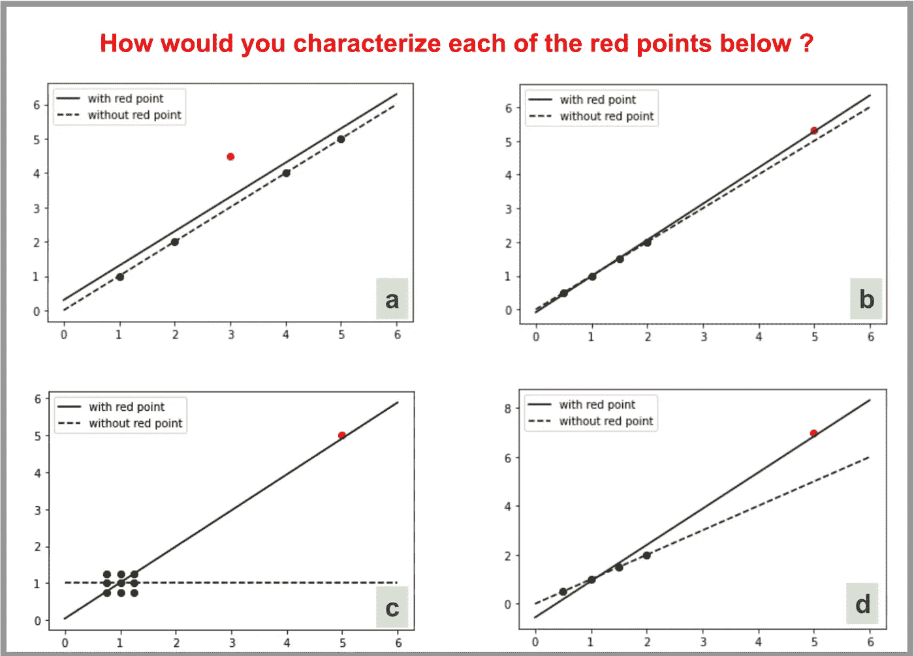

***备注:*** 即使一致性分析需要统计结论(R、p 值、标准差)，也将以图形方式进行证明

> ***一.***

**影响**:两条回归线差别不大，估计斜率相似，估计截距比较接近 **= >否**

**异常值**:红点似乎有很高的残差吗？是的，而且肯定是脱离了线性模式 **= >是的**

**高杠杆:**是极限 x 值吗？如果我们沿着 y 轴稍微移动红点，预测的响应会有很大的变化吗？该点接近平均 x 值，并且 y 变化不会严重修改预测响应 **= >否**

> ***b.***

**流入:**两条回归线几乎重叠 **= >否**

**异常值:**红点服从线性模式，具有低残差 **= >否**

**高杠杆:**有了这个高 x 值，红点可能在分布的长尾中。此外，如下图所示，当该点稍微向上移动时，预测响应完全变化 **= >是**

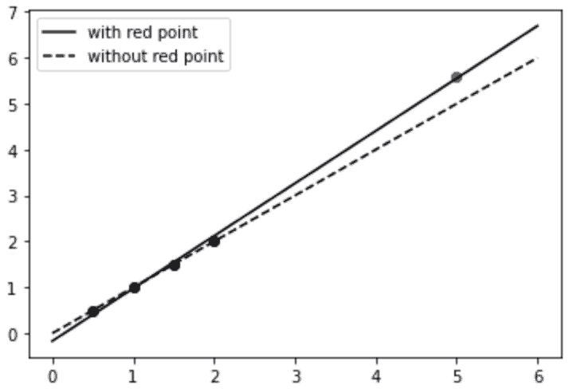

情况 b)在 x = 5 时具有相对小的观测扰动

> ***c.***

**影响:**由于红点完全决定了回归线，所以明显有影响 **= >是**

**异常值:**其余数据不遵循一般模式，因此，在这种配置下，我们无法推断出潜在的异常值 **= >？**

**高杠杆:**作为主要影响点，观测响应的变化极大地影响预测响应 **= >是**

由于这一点是有影响的，你应该**深深怀疑**的估计。

> ***d.***

这是实例 a)和 b)的组合。是一个**高杠杆的离群值**。此外，与前两种情况相反，两条回归线距离更远。是一个**影响点**。

我们能从这些例子中学到什么？

实际上，影响点是至关重要的，因为它们似乎对估计模型有**不成比例的影响**。一个有影响的点看起来既是一个离群点，也是一个高杠杆点。也就是说，x 值(高杠杆)和 y 值(异常值)的子空间中的非分布样本将显著影响估计模型。

去除这些可疑点并分析统计结果，结果发现这些有影响的点。

然而，一切都是在只有一个变量的完美世界中描述的，但实际问题包括多个变量**。**例如，高杠杆点不仅仅是极限 x 值，还可能是 x 值的**奇异组合**，使得这些点远离解释变量子空间中的其他观察值。

下一部分是上一部分的一般化，包含多个预测值。我将提供统计工具来有效地检测这些点并描述它们的特征。

# 侦查

## “帽子”矩阵

在多元线性回归中，该理论指出预测的响应可以与观察到的响应直接相关:

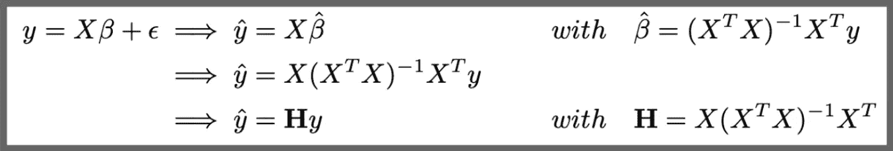

“帽子”矩阵如何定义的证明

矩阵 h，也称为**“帽子矩阵”(**因为它将“^”赋予了 *y* )，是****检测可疑点的中心概念。简单地用这个矩阵乘以 y，我们就可以立即得到预测的响应，而 H 只是 x 的函数。****

****为了更好地理解，最后的等式可以写成以下等式:****

****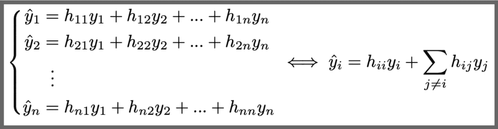****

****矩阵系数的先前等式(其中 **n =观察数量)******

****在这个阶段，我们已经勾勒出一个不可或缺的元素: **h_ii。**后面我们会看到，这个元素存在于每一个与异常点检测相关的公式中。更准确的说，它有一个名字:**杠杆！**的确，如果你回想一下前面的定义，杠杆可以通过∂y_hat/∂y 来估算，也就是 h_ii。****

****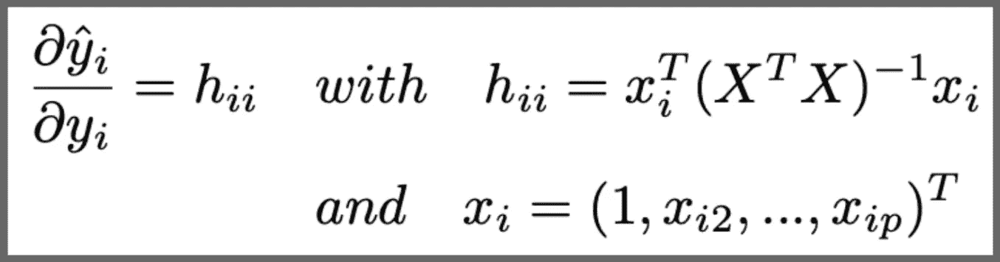****

****h_ii，第 I 次观察的杠杆，取决于 X(其中 **p =解释变量的数量******

****现在我也来介绍一下**残**的概念。正如你所想象的，残差——预测响应和观察响应之间的差异——在检测异常值**时起着决定性的作用。我们可以证明以下结果:******

********

****残差向量是服从期望为 0 的正态分布的随机变量。****

****从这个结果中可以得出三个有用的结论:****

****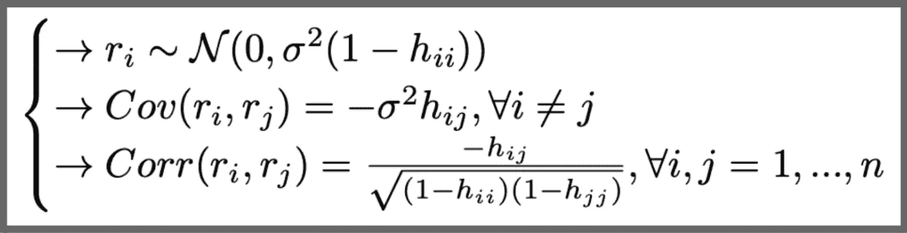****

******备注:**每个残差都有一个不同的方差，它们是相互关联的。****

****既然我们已经为理论奠定了基础，那么让我们来介绍一下描述可疑点的工具。****

## ****高杠杆****

****正如我已经提到的，杠杆是值 h _ ii**T5，它定义了在计算第 I 个预测响应时乘以第 I 个观察响应的系数。由此可见，按理说**高杠杆=高 h_ii** ，对吗？但是什么样的**阈值**与认为 h_ii 高相关呢？******

**所选择的临界值基于一个**经验法则**:如果 h_ii 大于 h_ii 平均值的 2 倍，第 I 次观察被视为高杠杆。该含义可以改写如下:**

**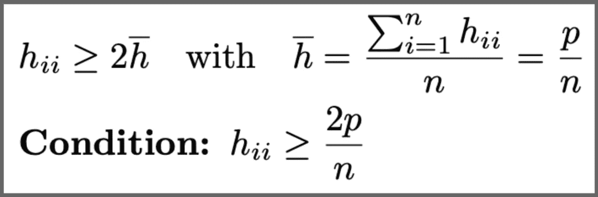**

**简化条件以检测高杠杆点(p =解释变量的数量，n =观察值的数量)**

**值得一提的是，这个条件是一个**经验法则**，没什么严谨的。您可能会在其他地方遇到另一个阈值(如果 n 相对较大，有时是平均值的 3 倍)**

## **异常值的学生化残差**

**根据定义，异常值是**高残差点**。然而，每个残差都有不同的方差。因此，为了进行严格的分析，必须实现残差的标准化。这样，残差可以用标准单位偏差量化，然后进行比较。因此有如下关系:**

**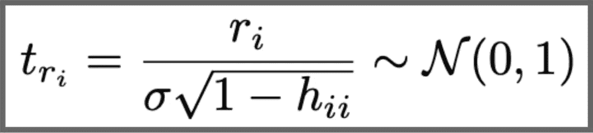**

****标准化**残差的理论定义**

**然而，回归分析中一个反复出现的问题是****σ**的存在。这个量在模型的定义中被引入作为误差项的标准偏差。然而，由于其值很少可用，因此需要一个估计量。****

****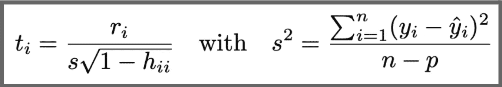****

******学生化**残差的理论估计****

****s 是σ的无偏估计量。但是，借助数学工具，我们可以证明 t_i 确实**不**遵循 t-student 分布。为了获得这种分布，我们只需**移除估计器中的第 I 个观察值**，从而:****

****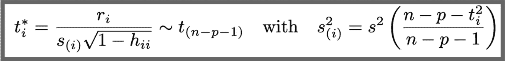****

****遵循 T32(n-p-1)自由度的 T32 学生分布的学生化残差的理论估计(在正态假设下)****

****s_i 表示没有第 I 次观测的模型的均方误差。如果我们打算为每一个 I 计算 s_i，我们必须每次都**改装**模型。幸运的是，上面的等式解决了这个问题，因为 s_i 是变量的函数，不需要删除第 I 个观察值。****

****得到所有这些学生化残差后，我们如何评估异常值？****

****绘图通常是理解和直观表示异常值的最佳方式:****

*   ******学生化残差与预测观测值**，阈值为 2 或 3(绝对值)以标记异常值(此外，我们应该看到均匀分布，因为理论上残差和预测响应向量之间的协方差为**零)******
*   ******学生化残差与观察 Id** 的对比，阈值也为 2 或 3。此图对于时间序列数据非常有用。事实上，它可以导致与时间成分相关的异常值检测。****

## ****库克距离和影响点的定义****

****根据定义，影响点显著影响**估计模型和相关结果。一个简单的想法是**移除**每个点，**重新装配**模型，并且**分析“完整”模型和没有移除点的模型之间的**差异。像往常一样，我们需要定义一个度量来告知这个点有多大的影响力。******

****在本文中，我将介绍两个指标:**Cook Distance 和 DFFITS。******

****根据定义，库克距离由第一等式定义。第二个等式源于第一个等式，通常更实用:****

****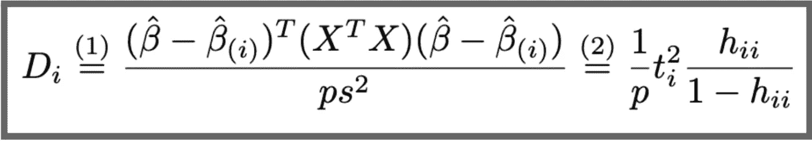****

****(1):库克距离的理论定义/ (2):实际相等。(β(I)是没有第 I 个观测值时的 OLS 估计)****

****等式(2)直接显示了影响点、高杠杆点和异常值之间的**链接**。****

****事实上，D_i 是 t_i 和 h_ii/(1-h_ii)的函数。这两个术语分别量化了异常值和高杠杆点。此外，h_ii/(1-h_ii)是 h_ii 的增函数。因此，**t _ I |和/或 h_ii 越高，烹饪距离越高。**它证实了我们之前所说的:如果一个观察是一个高杠杆的异常值，它当然也是一个有影响的点。****

****一个**统计阈值**用于确定该点是否有影响:****

****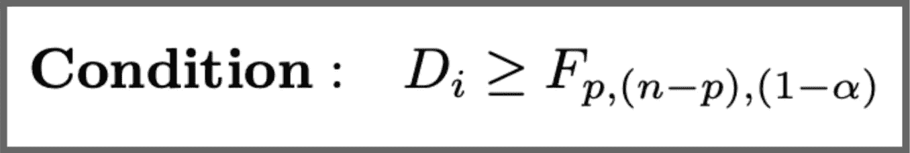****

****将第 I 次观察视为有影响的条件，其中 F 表示具有 p 和 n-p 自由度的 F 分布的 1-alpha 百分位。****

****DFFITS 和 Cook Distance 几乎相同:****

****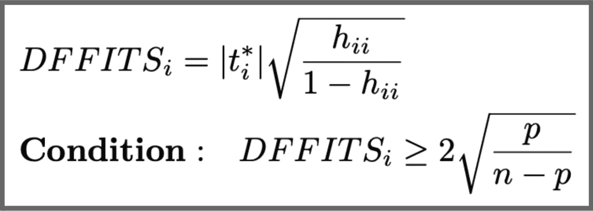****

****确定条件以识别影响点****

# ****结论****

****对于你的回归分析来说，这些棘手的数据点可能是一个噩梦。在项目中，您应该:****

*   ******评估线性模型所做假设的准确性**(独立性、标准化、同方差性、线性…)****
*   ****执行前面的措施**以确保数据一致性******

****但是，可疑点是**有价值的**。你应该经常问自己这些点是如何产生的(不正确记录的数据，数据中固有的，分布不均匀…) 只有在你有正当理由的情况下才删除它们。****

> ****“由于数据可能是由非指定的模型生成的，诊断可能揭示暗示这些替代方案的模式”[1]****

****在这篇文章中，我没有给出真实的例子，因为我希望**把重点放在理论和工具的展示上。**在 R [5]中进行分析更容易，但是 Statsmodel 也提供了一些在 Python 中完成这项工作的方法。****

> *******注:*** *所有人物和关系都是我做的。*****

# ****来源****

*   ****地方检察官贝尔斯利。Kuh，E. e Welsch，R. E. (1980 年)。回归诊断:识别有影响的数据和共线性来源。纽约:威利**【1】******
*   ****蒙哥马利特区；佩克，E. A. e .维宁，G. G. (2021)。*线性回归分析导论，第六版*。霍博肯:威利**【2】******
*   ****吉尔伯托·保拉。巴西 IME-南太平洋大学统计局。***【3】*******
*   *****[**https://online.stat.psu.edu/stat462/node/87/**](https://online.stat.psu.edu/stat462/node/87/)**【4】*******
*   *****[**https://cran . r-project . org/web/packages/ol SRR/vignettes/influence _ measures . html**](https://cran.r-project.org/web/packages/olsrr/vignettes/influence_measures.html)**【5】*******