# 不要再使用 If-Else 来验证 Python 中的数据对象

> 原文：<https://towardsdatascience.com/do-not-use-if-else-for-validating-data-objects-in-python-anymore-17203e1d65fe>


图片由[sneakeyelbow](https://pixabay.com/users/sneakyelbow-373923/?utm_source=link-attribution&utm_medium=referral&utm_campaign=image&utm_content=2498921)发自 [Pixabay](https://pixabay.com/?utm_source=link-attribution&utm_medium=referral&utm_campaign=image&utm_content=2498921)

## Cerberus——一种简洁易读的验证字典属性的方法

在我们的 Python 程序中使用大量字典来保存带有属性的数据对象并不常见。一个典型的例子是 Web 开发。假设我们正在使用 Python 开发后端 web 服务，验证从前端接收的 JSON 有效负载将是非常重要的。此外，数据科学在某些情况下也可能需要验证数据条目。

最直观但可能是最糟糕的解决方案是使用大量 if-else 条件。如果我们只验证一个或两个简单需求的属性，这可能是好的，但是根本不可伸缩。面向对象的方法被认为是更先进的。然而，有时，我们可能不想过度设计我们的应用程序。

在本文中，我将介绍一个令人惊叹的第三方库— Cerberus。它将在很大程度上简化代码验证。它还使验证规则变得可重用和灵活。它也支持许多复杂的场景。

# 1.从典型示例快速开始


图片来自 [Pixabay](https://pixabay.com/?utm_source=link-attribution&utm_medium=referral&utm_campaign=image&utm_content=1785760) 的 [kim_hester](https://pixabay.com/users/kim_hester-3648659/?utm_source=link-attribution&utm_medium=referral&utm_campaign=image&utm_content=1785760)

## 1.1 安装

像往常一样，Python 使得安装第三方库变得非常容易。我们只需要运行`pip`命令来安装它。

```
pip install cerberus
```

然后，我们就可以开始使用它了。对于第一个例子，让我把它分成几个部分来阐明术语。

## 1.2 基本用法

首先，我们需要从刚刚安装的`cerberus`模块中导入`Validator`类。

```
from cerberus import Validator
```

然后，我们可以定义一个“模式”。这个模式将包含我们想要用来验证我们的数据字典的所有规则。这个模式也是一个字典。

```
schema = {
    'name': {
        'type': 'string'
    },
    'age': {
        'type': 'integer'
    }
}
```

上面的模式告诉 Cerberus，我们的字典中有两个字段。“姓名”字段应为字符串，“年龄”字段应为整数。

然后，我们可以使用这个模式初始化我们的“验证器”。我们的验证器将是一个 Cerberus `Validator`类的实例。

```
profile_validator = Validator(schema)
```

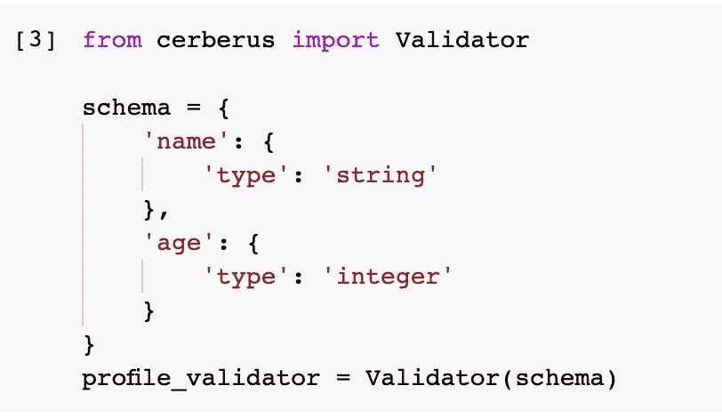

现在，让我们创建一个样本字典来测试这个验证器。对于任何“验证器”实例，我们可以调用它的`validate()`方法来验证数据字典。

```
my_profile = {'name': 'Christopher Tao', 'age': 34}
profile_validator.validate(my_profile)
```

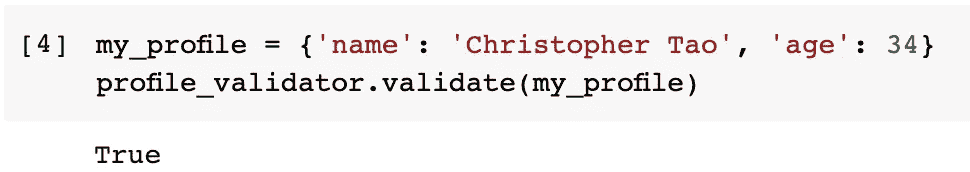

它返回`True`,所以这意味着字典通过了验证。在下一个示例中，如果我们将年龄值更改为字符串，将会失败。

```
my_profile = {'name': 'Christopher Tao', 'age': '34'}
profile_validator.validate(my_profile)
```

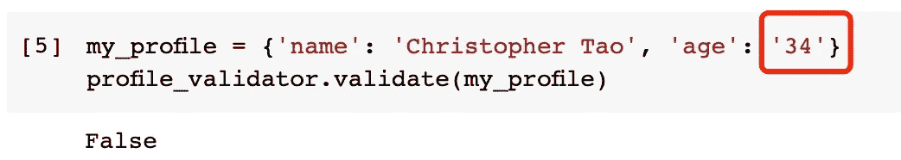

你一定在问我们怎么能不知道失败的原因。它将被存储在验证器中。通过调用验证器的属性`errors`，我们可以从验证器中得到所有的错误(如果不是只有一个的话)。

```
profile_validator.errors
```

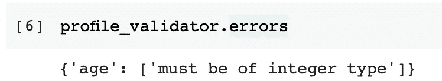

## 1.3 更复杂的验证规则

当然，我们可以有更复杂的规则，而不仅仅是一种数据类型。例如，我们希望我们的用户至少 18 岁，那么我们可以将`min`规则添加到模式中。

```
profile_validator = Validator()
my_profile = {'name': 'Alice', 'age': 16}
profile_validator.validate(document=my_profile, schema={
    'name': {
        'type': 'string'
    },
    'age': {
        'type': 'integer',
        'min': 18
    }
})
```

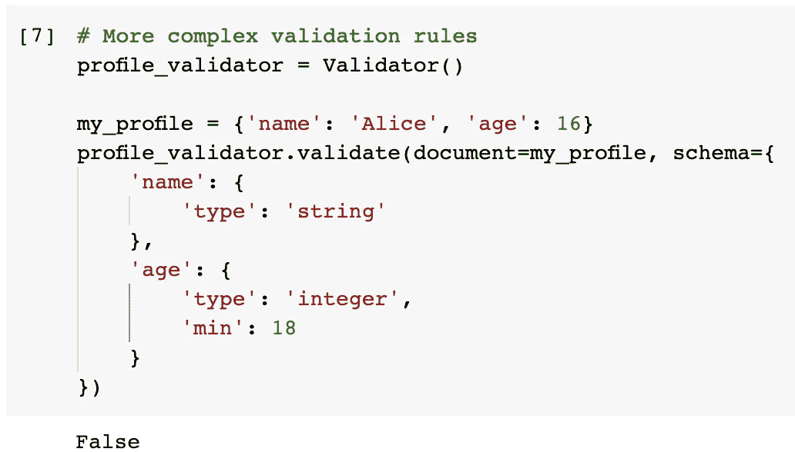

在上面的例子中，验证器是在没有模式的情况下初始化的。然后，可以在`validate()`方法中动态地给它分配一个模式。这只是一种更灵活的方式。万一我们的模式规则在它的生命周期中可以被改变，这将是非常方便的。

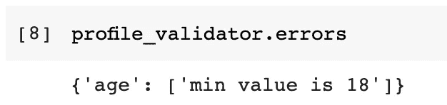

错误显示了失败的原因，没有任何额外的努力，这是我喜欢这个库的原因之一。

## 1.4 验证嵌套字典

如果我们的字典是嵌套的呢？换句话说，JSON 文档中有子文档。别担心，它是由地狱犬支持的。

假设我们需要在配置文件字典中有一个包含街道号和街道名的地址字典，我们可以如下定义模式。

```
profile_validator = Validator()
profile_validator.validate({
    'name': 'Chris',
    'address': {
        'street_no': '1',
        'street_name': 'One St'
    }
}, {
    'name': {'type': 'string'},
    'address': {
        'type': 'dict',
        'schema': {
            'street_no': {'type': 'integer'},
            'street_name': {'type': 'string'}
        }
    }
})
```

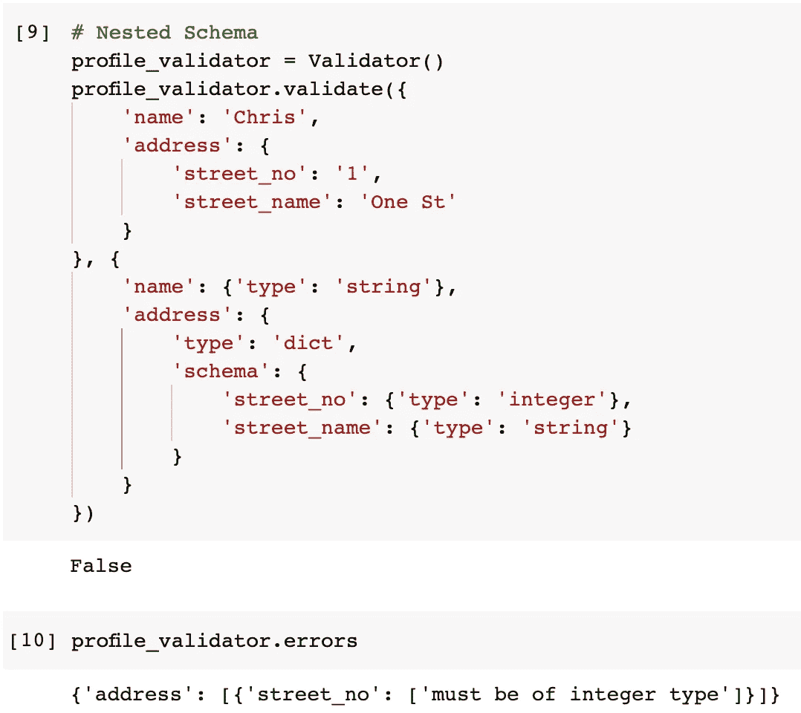

对于“address”子文档，我们只需要告诉模式它是一个`dict`类型，并在其中定义一个子模式。然后，它就会工作。该错误还包括层次关系，以便我们可以轻松地排除故障。

# 2.走向未知


图片来自 [Pixabay](https://pixabay.com/?utm_source=link-attribution&utm_medium=referral&utm_campaign=image&utm_content=4988985) 的 [Lucio Liu](https://pixabay.com/users/lucioliu-4032922/?utm_source=link-attribution&utm_medium=referral&utm_campaign=image&utm_content=4988985)

常见的情况是，我们无法预测实际可能得到的字段，因此我们需要处理未知字段的验证。我想用这个功能来展示地狱犬是多么灵活。所以，让我们深入了解未知的细节:)

## 2.1 默认情况下，未知不可接受

例如，我们的验证器只知道我们将有一个“name”字段。

```
profile_validator = Validator({'name': {'type': 'string'}})
```

但是，我们的字典有一个未知的字段“年龄”。

```
profile_validator.validate({'name':'Chris', 'age': 34})
```

如果我们置之不理，这将导致验证失败。

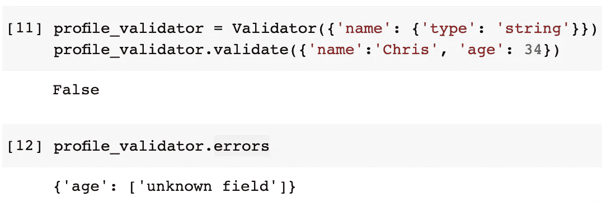

不要担心，Cerberus 有一个非常全面的解决方案来处理未知领域。

## 2.2 允许未知

一个非常常见的需求是，我们希望忽略未知字段，让它们通过。在这种情况下，我们需要将验证器的`allow_unknown`属性设置为`True`。

```
profile_validator.allow_unknown = True
```

之后，作为未知字段的`age`字段将不会被验证，而是被忽略。

```
profile_validator.validate({'name':'Chris', 'age': 34})
```

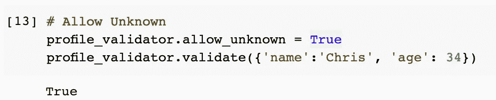

## 2.3 允许特定数据类型未知

另一个常见的需求是，我们可能希望忽略某些数据类型。例如，字符串字段是非常自由的样式，我们想忽略它，但是我们不允许任何其他数据类型，比如整数是未知的。

在这种情况下，我们可以确保`allow_unknown`为 False，并为其指定特定的数据类型。

```
profile_validator.allow_unknown = False
profile_validator.allow_unknown = {'type': 'string'}
```

验证器模式没有改变，但是让我们用模式中不存在的`firstname`和`lastname`创建一个字典。

```
profile_validator.validate({'firstname':'Chris', 'lastname': 'Tao'})
```

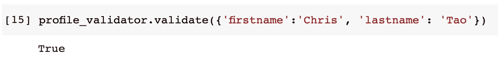

它通过了验证，因为它允许任何字符串类型的未知字段。但是，如果我们添加一个整数字段，它将失败。

```
profile_validator.validate({
    'firstname':'Chris', 
    'lastname': 'Tao',
    'age': 34
})
profile_validator.validate(my_profile)
```

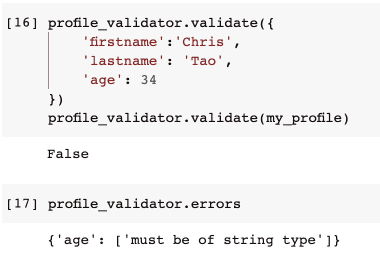

## 2.4 初始化时允许未知

如果我们知道我们需要接受未知字段，我们也可以在实例化验证器时添加这个标志，如下所示。

```
profile_validator = Validator({}, allow_unknown=True)
```

如上图，方案为空，但`allow_unknown`被设置为`True`。因此，它将接受任何字段。

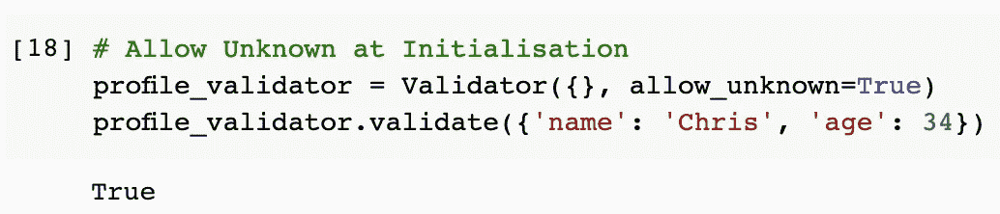

## 2.5 允许在特定级别未知

我们甚至可以在子文档级别设置`allow_unknown`。例如，我们仍然希望字典在根级别得到严格的验证，但是对于`address`对象，我们不希望添加太多的约束来允许一些不确定性。

我们可以将模式定义如下。

```
profile_validator = Validator({
    'name': {'type': 'string'},
    'address': {
        'type': 'dict',
        'allow_unknown': True
    }
})
```

请注意`allow_unknown`被设置为`address`级别下的`True`。所以，无论我们在`address`子文档中定义什么，都没问题。

```
profile_validator.validate({
    'name': 'Chris',
    'address': {
        'street_no': 1,
        'street_name': 'One St'
    }
})
```

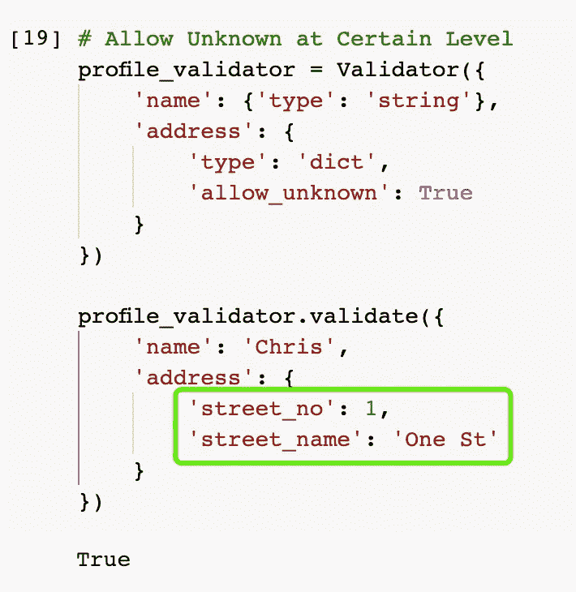

但是，如果我们在根级别添加一个未知字段`age`，它将会失败。

```
profile_validator.validate({
    'name': 'Chris',
    'age': 34,
    'address': {
        'street_no': 1,
        'street_name': 'One St'
    }
})
```

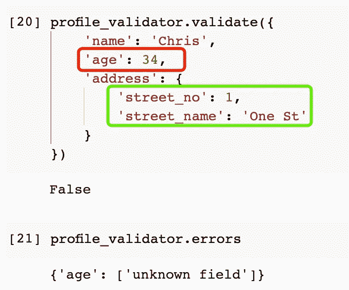

# 3.必填字段


图片来自 [Pixabay](https://pixabay.com/?utm_source=link-attribution&utm_medium=referral&utm_campaign=image&utm_content=4390885) 的 [minka2507](https://pixabay.com/users/minka2507-3728206/?utm_source=link-attribution&utm_medium=referral&utm_campaign=image&utm_content=4390885)

我们知道我们可以使用地狱犬来处理未知领域。不如我们把一些字段强制设置为必填字段？

默认情况下，如果字典遗漏了模式中定义的一些字段，将不会捕获任何错误。

```
profile_validator = Validator({
    'name': {'type': 'string'},
    'age': {'type': 'integer'}
})
profile_validator.validate({'name': 'Chris'})
```

在上面的代码中，模式定义了`age`字段，但是字典没有它。验证结果仍然是好的。

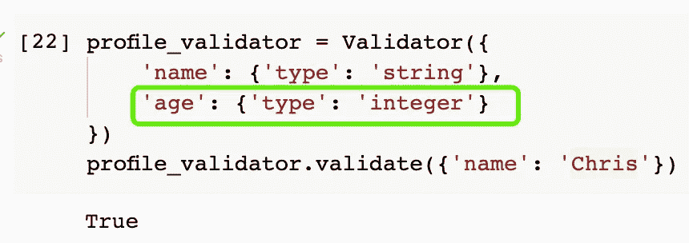

如果我们想让所有的字段都是强制性的，我们可以添加一个标志`require_all`并将其设置为`True`。

```
profile_validator = Validator({
    'name': {'type': 'string'},
    'age': {'type': 'integer'}
}, require_all=True)
profile_validator.validate({'name': 'Chris'})
```

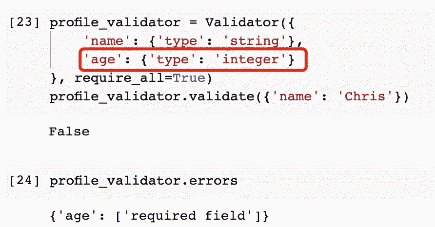

当然，我们也可以将某些字段设置为必填字段。这可以通过特定的规则`required`来完成。可以将其添加到模式定义的字段中。

```
profile_validator = Validator({
    'name': {'type': 'string', 'required': True},
    'age': {'type': 'integer'}
})
profile_validator.validate({'age': 34})
```

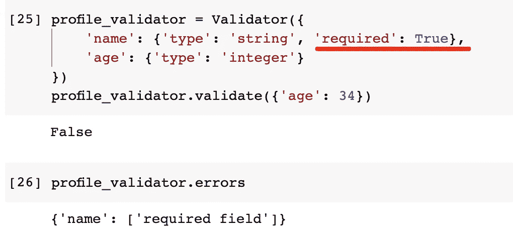

# 4.标准化字典


图片来自 [huoadg5888](https://pixabay.com/users/huoadg5888-8934889/?utm_source=link-attribution&utm_medium=referral&utm_campaign=image&utm_content=4415649) 来自 [Pixabay](https://pixabay.com/?utm_source=link-attribution&utm_medium=referral&utm_campaign=image&utm_content=4415649)

令我惊讶和印象深刻的是，Cerberus 不仅可以验证字典，还可以纠正它们。这在保证数据质量的应用中可能非常有用。

例如，我们可能有来自不同数据源的用户配置文件。当我们想把它们组合成一个单一的真实来源时，我们发现年龄在一个数据库中以整数的形式出现，而在另一个数据库中却是字符串类型。在这种情况下，Cerberus 提供了一个名为`normalize()`的函数，它可以统一数据类型以确保数据的一致性。

为了实现这一点，我们需要指定字段的类型。例如，我们希望将`age`字段统一为整数类型。代码如下。

```
profile_validator = Validator({
    'name': {'type': 'string'},
    'age': {'coerce': int}
})
```

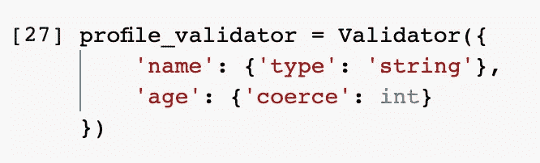

`coerce`告诉验证器我们想要的数据类型是什么。请注意，这不会用于验证目的。因此，如果我们有一个带有字符串类型的`age`字段的字典，它仍然可以通过。

```
my_profile = {'name': 'Chris', 'age': '34'}
profile_validator.validate(my_profile)
```

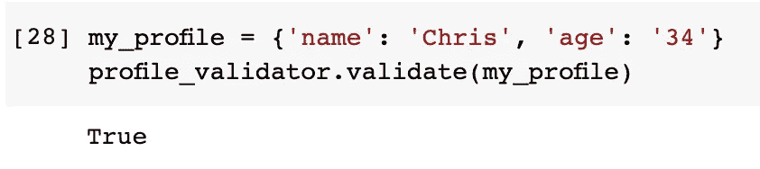

如果我们想要“规范化”字典，我们可以如下调用验证器的`normalize`方法。

```
my_profile_normalized = profile_validator.normalized(my_profile)
```

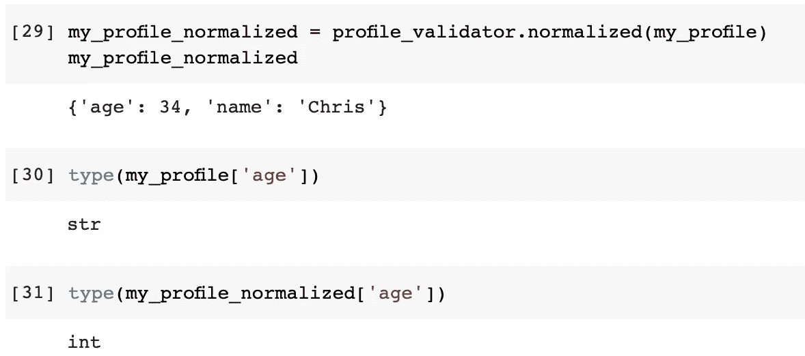

我们可以看到`age`值在规格化后被转换为整数。

# 5.其他规则和定制规则


图片由[spiritize](https://pixabay.com/users/spiritze-3079232/?utm_source=link-attribution&utm_medium=referral&utm_campaign=image&utm_content=2208371)从 [Pixabay](https://pixabay.com/?utm_source=link-attribution&utm_medium=referral&utm_campaign=image&utm_content=2208371) 获得

## 5.1 支持的规则

到目前为止，我没有介绍太多类型的验证规则。这是因为在 Cerberus 中大约有 30 种不同类型的现成规则。以下是一些例子:

*   列表包含一个特定的项目
*   `dependencies`一个字段的规则只有在另一个字段出现时才会生效
*   `empty`字符串值不能为空
*   `nullable`允许为`None`类型的值
*   `forbidden`该值不得在预定义列表中
*   `excludes`如果出现另一个字段，则该字段不能存在
*   `regex`字符串值必须与正则表达式匹配
*   `allof/anyof/noneof/oneof`定义多个规则，并且值必须满足所有规则、任何规则、不满足任何规则或至少满足其中一个规则。

我不能介绍 Cerberus 中的每一个规则，但是你可以从文档中查看所有的规则。

[https://docs . python-Cerberus . org/en/stable/validation-rules . html](https://docs.python-cerberus.org/en/stable/validation-rules.html#of-rules)

## 5.2 定制规则

如果 Cerberus 提供的 30 条规则都不符合我们的要求，该怎么办？为了最大限度地提高灵活性，Cerberus 还允许我们定义定制的规则。

定制规则需要被定义为具有如下三个参数的函数。

```
def my_rule(field, value, error):
    if value % 2 != 0:
        error(field, "Must be an even number")
```

`field`是字段的名称，`value`将是我们想要验证的值，`error`是一个函数，它将定义存储在验证器的`errors`属性中的错误消息。

我刚才定义的`my_rule`就是简单的检查一个数是否是偶数。一旦定义了它，我们就可以用关键字`check_with`在模式中使用它。

```
my_validator = Validator({
    'my_number': {'check_with': my_rule}
})
my_validator.validate({'my_number': 10})
```

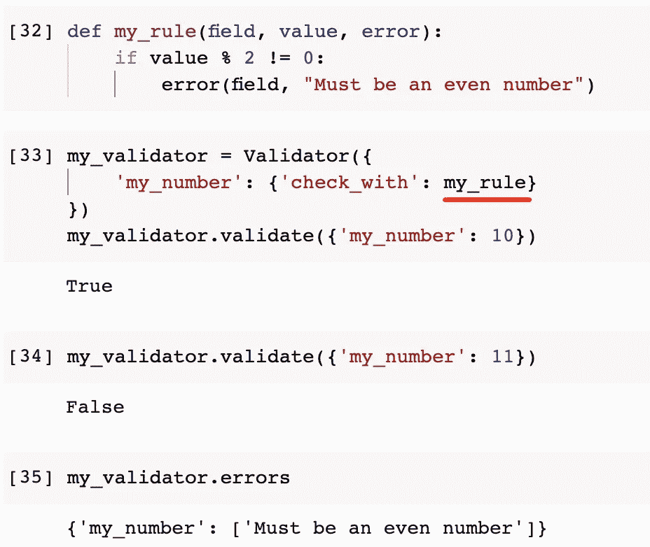

# 摘要


图片来自 [Pixabay](https://pixabay.com/?utm_source=link-attribution&utm_medium=referral&utm_campaign=image&utm_content=3042751) 的 [Sven Lachmann](https://pixabay.com/users/seaq68-4191072/?utm_source=link-attribution&utm_medium=referral&utm_campaign=image&utm_content=3042751)

在本文中，我介绍了 Python 中的第三方库 Cerberus。它为我们验证字典提供了一个非常好的解决方案。它非常灵活，这可以从处理未知字段和定义必填字段的例子中看出。此外，它支持大约 30 个现成的规则，以及我们自己定制的验证规则。

<https://medium.com/@qiuyujx/membership>  

如果你觉得我的文章有帮助，请考虑加入 Medium 会员来支持我和成千上万的其他作者！(点击上面的链接)

> 除非另有说明，所有图片都是作者的