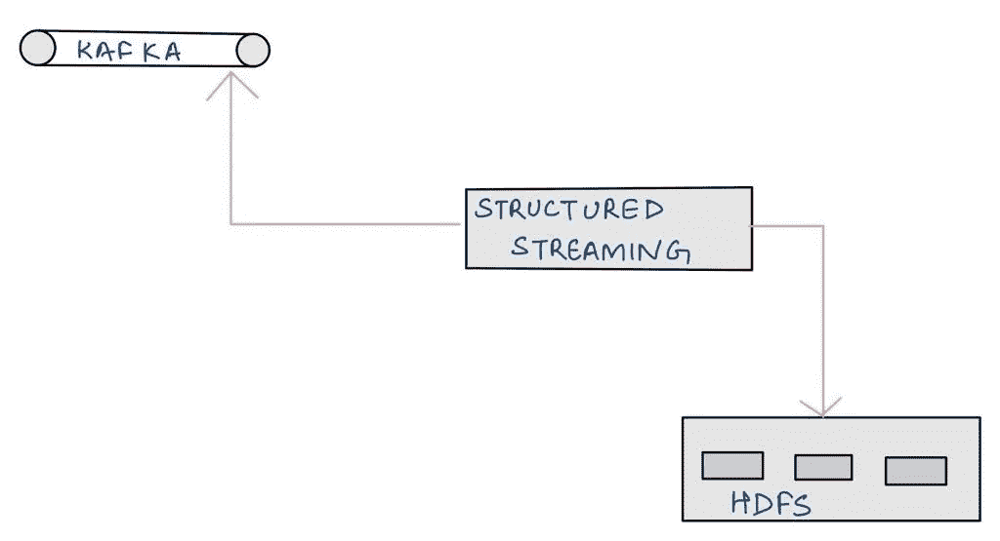

# 实时数据管道存在吗？

> 原文：<https://towardsdatascience.com/do-real-time-data-pipelines-even-exist-76830a52f67c>

## 分享实时数据管道的新视角

由 [Djim Loic](https://unsplash.com/@loic?utm_source=unsplash&utm_medium=referral&utm_content=creditCopyText) 在 [Unsplash](https://unsplash.com/s/photos/time?utm_source=unsplash&utm_medium=referral&utm_content=creditCopyText) 上拍摄的照片

您多长时间听到过这些术语——实时数据管道、实时数据处理、实时分析或仅仅是实时数据？这些经常被讨论来解决一些非常有趣和关键的用例，比如故障检测、异常检测等等。

在本文中，我们将了解一些常用的实时流程和技术，以及实时到底意味着什么？

不，这不是一个哲学问题，而是一个技术问题。我希望这篇文章能帮助你开发实时数据处理的新视角(*或者改变我的观点？:))*

让我们开始吧。

典型的实时数据流如下所示

作者图片

**来源:**数据生产者，Ex: Kafka/Kinesis/Solace/API 等。
**消费者:**数据消费者可以是消费来自源的数据，然后对其进行处理的东西(*如果需要的话*)，这可能是一些定制实现或一些技术，例如:结构化流、Flink、Samza 等。

例如，我所从事的最常见的实时基础设施之一就是结构化的流式消费者从某个主题读取数据并保存这些数据:

作者图片

**结构化流**，微批量处理数据(阅读[本](https://medium.com/towards-data-science/spark-structured-streaming-simplified-9455947674b9)了解诀窍)，批量频率低，可提供低处理延迟。

实时生态系统中其他一些常用的技术有:

## 弗林克

现在，spark 结构化流可以被 Flink 之类的东西取代，Flink 具有对流的原生支持，并提供极低的延迟( [link](https://flink.apache.org/usecases.html) )，并且在某些用例中比结构化流更快。此处列出了一些可以使用 Flink 的示例

## 卡夫卡

我们现在都知道卡夫卡有多棒了！*(我的意思是让我们花点时间来欣赏这项美丽的技术)*它提供了无与伦比的持久性/吞吐量和低延迟。[这里的](https://medium.com/walmartglobaltech/real-time-data-processing-for-monitoring-and-reporting-a-practical-use-case-of-spark-structured-8e4f91f6f3a7)是沃尔玛用卡夫卡建造的实时管道的例子。

## 发布/订阅

这些通常用于数据流或消息传递用例，并提供极低的延迟，它们不能为您提供持久性，但这取决于用例。

看了一些例子和技术后，我的问题是，*真的是实时的吗？*

关键词是*低延迟*，我这里的论点是低延迟应该被认为是实时的吗？

> 低延迟==实时？

例如，现在只要涉及到结构化流，数据就在[微批处理](https://medium.com/towards-data-science/spark-structured-streaming-simplified-9455947674b9)中处理，批处理频率可能非常小，但仍然是某种级别的批处理，数据*实际上不是实时处理*而是接近实时处理*。*类似地，对于其他提供极低延迟的解决方案，我们应该何时开始称之为*实时*而不是*近实时*？

一种方法可能是，对于您设计的管道，如果它提供的延迟足够低，以至于对于我们这些凡人来说，它被认为是实时发生的，那么它可以被认为是实时的(*想想 Instagram live、Youtube live 或 Live matche* s)。对于其他情况，如果配置/设计或支持的延迟不够低，以至于它实际上是可察觉的，则解决方案变得接近实时而不是实时。

因此，这不仅仅取决于您用于设计的技术，还取决于您如何使用它，它如何帮助设计以及负载了解其延迟。

我的意思是，事情可以像你希望的那样快，但最终，你必须考虑网络和跳跃的延迟。这就是为什么我们总是认为真理的来源是`event created timestamp`而不是`arrival timestamp`，因为可能有延迟或潜伏。([这里](https://medium.com/expedia-group-tech/be-vigilant-about-time-order-in-event-based-data-processing-cbfde600dd7d)是一篇关于时间排序的有趣文章)

现在，我来这里并不是要抛弃实时基础设施，而是仅仅抛弃术语和概念，由于上述原因，我在使用术语`real-time`时非常小心，如果我不知道细节，我更喜欢使用`near real-time`。

那么，你有什么想法？

> 什么都不是实时的还是什么都是？

我将很高兴被证明是错误的，或者讨论其他观点，随时留下评论或在 [Linkedin](https://www.linkedin.com/in/jyotidhiman/) 上与我联系。

如果你喜欢这篇文章，请鼓掌，它让我在 ***近实时*** :)

下次见，
JD