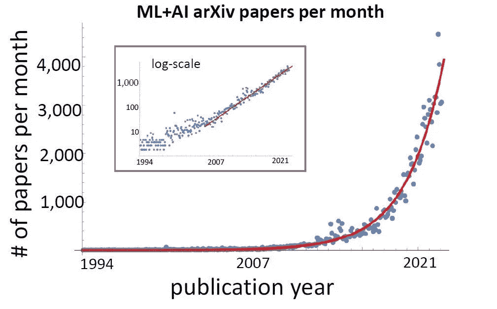

# 你是不是也觉得 AI 走的太快了？

> 原文：<https://towardsdatascience.com/do-you-also-feel-ai-is-going-too-fast-56bf56ab43b3>

## 意见

## 我有一种共同的兴奋感，夹杂着本能的匆忙，以避免错过，纯粹的信息淹没

闪电侠。鸣谢:作者 via midway

我怀疑我不是唯一一个觉得 AI 发展太快的人。

我在论坛和社交媒体上看到了很多关于这一点的评论，我得出的结论是，内部人士和目击者都有这种感觉:人工智能显然发展得如此之快，我们无法跟上——即使是我们这些以此为生的人也无法跟上。

这不是第一次出现这种想法(自 2010 年代初以来，人工智能一直在加速)，但这是我第一次看到这种感觉变得如此普遍，如此明显，以至于它是有形的——就像暴风雨前的突然平静。

安德烈·卡帕西的推特

在我们继续之前，让我设定一个可能对也可能不对的前提:让我们假设人工智能领域确实在以我们认为的速度前进。

这可能是“外表是骗人的”——发表论文的数量不一定与有意义的进展相关。我不太关心第一部分。我关注的是感觉，而不是潜在的现实。

然而，在最后一节中，我涵盖了给你工具和发人深省的论点的可能性，以便你可以重新评估你对人工智能知识的立场和方法。你知道我喜欢细致入微的镜头。

也就是说，我可以从一百个不同的角度来探讨这个话题。先说清楚这篇文章是什么，不是什么。

## 这篇文章是什么

这是我的主要目的:捕捉那种分享兴奋的感觉，混合着本能的匆忙，以避免错过，以及纯粹的信息淹没。这种感觉在人工智能领域是独一无二的。

如果你关注《新闻与趋势周刊》,你就会知道我在说什么:在一个日益复杂的世界中迷失的恐惧感从你的指缝间溜走(请不要将这与 AGI 或奇点混淆)。

这篇文章也是关于如何处理这种感觉及其后果(它可能不像你想的那样与现实相关)。成为一个有知识的人有其好处，但也有其危险。

过于接近人工智能的进步迫使你学习这些:如何避免跳进时髦的潮流，如何抛开错过的恐惧(FOMO)，如何将你的炒作保持在健康的水平，以及如何保持你的批判性思维敏锐。

## 这篇文章不是什么

本文并不是对“人工智能发展太快”这句话的真实性的彻底评估，尽管第二部分涵盖了您自己评估它所需的工具。

这不是关于这种不受约束的进步在让我们更接近目标方面是否有价值。人工智能的人们有不同的理由推动这个领域向前发展:从制造有用的产品使世界更具创造性，到理解人类的思维，到构建超级智能。

然而，这种明显的进步也可能只是为了赞美特定公司的公关噱头。我不会在这里讨论这个问题。

它不是关于使人工智能发展如此之快的原因，特别是现在，而不是 5 年前。

这也不是关于如何减缓进展——尽管有些人一再争辩说这应该被考虑，而不是被拒绝。

[艾米丽·m·本德的推特](https://twitter.com/emilymbender/status/1571914263475920898)

既然我们都清楚了，让我们进行第一部分。

> 本文选自[**The algorithm Bridge**](https://thealgorithmicbridge.substack.com/subscribe?)，这是一份教育通讯，其目的是在算法和人之间架起一座桥梁。它将帮助你理解人工智能对你生活的影响，并开发工具来更好地导航未来。

<https://thealgorithmicbridge.substack.com/subscribe>  

# 如果你感到不知所措，你并不孤单

寒武纪人工智能爆发是在 2012 年基于深度学习的计算机视觉算法在 ImageNet 挑战赛中充分击败竞争对手之后开始的。

从那以后，人工智能一直在快速发展。进步不是一成不变的，但*加速了*。如果我们着眼于 2012—2022 年这十年，下半年比上半年取得了更多进步。

致谢:[克伦等人](https://arxiv.org/abs/2210.00881)

(发表论文的数量不是衡量这一点的好指标，但可以作为证明我观点的代理。)

然而，这在不断发展的科学领域是很自然的。进步推动更多的进步。我们已经习惯了。人工智能的不同之处在于，不仅进步，而且进步的速度似乎也在加快。

这种现象的一种常见形式是人们所说的指数增长(尽管正如物理学家西奥多·莫迪斯(Theodore Modis)所说，“自然界中没有什么是纯指数增长的”)。

为什么人们会对 AI 有这种感觉？我能找到很多原因:AI 越来越受欢迎。投资者和企业正投入更多资源进行研发。论文和出版物受到更多的关注。概念验证越来越多地被用于产品和服务中。人们可以接触到最新的款式。每一次突破都会带来后续的突破。

为了说明这一点，让我用一段话简单介绍一下过去五年的语言研究:

谷歌在 2017 年发布的 transformer 架构引发了人们对语言建模的兴趣。这使得 OpenAI 能够为大型模型设计缩放法则，从而建造了 GPT 3 号。这促使其他大型科技公司和大学开发自己的模型并发表更多论文，这每月都成为各地的新闻。这产生了新的市场机会，激励人们建立新的公司，从而导致更多的竞争。反过来，这又激发了开源计划，以应用程序和网站的形式促进了人们对最新研究的访问。

所有这一切仅仅发生在 4 年内。疯狂的快。

但是今年呢？可以说，今年是人工智能历史上最疯狂的一年。就新的研究论文、新的应用、新的模式、新的公司而言……最重要的是，就正在发生的发现的潜在社会和经济影响而言。

2022 年的进展速度已经加快到连内部人士都感到不知所措的地步。我说的不是一般的工程师。你刚刚看到了 Andrej Karpathy 的推文——他是目前人工智能领域最有才华的年轻头脑之一(现已独立，之前为@ Tesla，OpenAI)。

2022 年已经(并且正在)成为生成性人工智能和扩散模型的一年(尽管我试图捕捉的感觉很容易推断到其他分支，如以生物学为重点的人工智能研究或著名的语言理解子领域)。

关于生殖人工智能的最新消息——这促使我写这篇文章——是公司已经在创建文本到视频的模型([制作视频](https://makeavideo.studio/)和 [Phenaki](https://phenaki.video/) )。我们仍在消化 DALL E 和 Stable Diffusion 等图像生成模型的快速发展，各公司已经开始进入下一个重大突破。

请看[这段 2 分钟的视频](https://phenaki.video/stories/2_minute_movie.webp)，它是由一系列连续的提示生成的。

而且不仅仅是卡帕西。密切关注这些进展的人普遍有这种失控的感觉。他们不知所措。我说的是那些知道一个模型或论文在发表的同一天就出来的人。你不可能比那更接近了。正是这些人“敲响了警钟”

我指的不是“哇，这进展得多快啊”这样的评论。不，我们正处于人们开始说:“嘿，这太快了，也许我们应该慢下来，”或者“即使我尽了最大努力，我还是跟不上。”请看这里的引用推文:

[Meta AI 的推文](https://twitter.com/MetaAI/status/1575495462894723072)

或者这里:

[AK 的推特](https://twitter.com/_akhaliq/status/1575546841533497344)

当然，并不是每个人都认为这种感觉是一个有问题的迹象。一些人比以往更加兴奋。

这就是指数增长的感觉(即使它实际上不是指数增长)。

以下是当有人问他 30 年后 AI 会是什么样子时，卡帕西的回答:

[安德烈·卡帕西的推特](https://twitter.com/karpathy/status/1575928090663866368)

一件事是理性地知道——作为一个遥远的想法——在未来，人工智能将从根本上改变世界，我们将无法再跟上进步。另一件非常不同的事情是，已经在内心感受到了。

这并不是说当前的人工智能加速正在引领我们走向 AGI 或有感知能力的机器——我不这么认为——但对我们许多人来说，加速进步、压倒性信息和强大 FOMO 的感觉是非常真实的。

# 对人工智能进步感到不知所措的 3 个后果

正是因为这种无处不在的感觉，这第二部分才如此重要。

让我这样开始:即使你觉得人工智能发展得太快，你也可能是错的。人工智能在现实世界中的效果可能没有从近距离角度看起来那么令人印象深刻。这是一个自然的暗示，即没有足够频繁地从发展中抽离出来去观察真实的世界。

谷歌和 OpenAI 的进步速度可能是超音速的，与此同时，世界上 80%的人(虚构的)甚至没有听说过 GPT-3。我的意思是，几乎 40%的全球人口没有互联网接入。

然而，这可能有一部分是真实的:由于开源趋势，在创建模型并将其转换为即用型应用程序时，生成式人工智能尤其享受着高自由度和低摩擦的结合。这是几周甚至几天的事。

当有形的现实与进步的表象融合在一起时，就很难消除这种失去控制的感觉。

也就是说，我不会在这里争论人工智能的真实进度。

我不会试图让你相信它比你想象的要慢。我也不会试图让你相信，即使它在进步，你所预见的未来也不是我们前进的方向。

我在这一节关心的是给你我的论点，当我们被信息、急于知道更多和 FOMO 所淹没时会发生什么。以及如何应对这些感觉及其后果。

## “抱歉，没有时间创造有意义的评价。必须跟上 arXiv！”

语言学家艾米丽·m·本德的这条推特完美地抓住了第一个想法:

[艾米丽·m·本德的推特](https://twitter.com/emilymbender/status/1527274163844460544)

她尖刻的讽刺切中要害。我同意她的观点，觉得自己跟不上人工智能进步的直接后果是投入所有资源去尝试——忽略其他方面。

这种匆忙促使我们放弃处理看似不重要的任务，如反思、分析和评估人工智能研究和发展的影响和反响。

可悲的是，这似乎不是孤立的证人，像我或你。我们只是*相信* AI 可能走得太快了。构建这些系统的人也面临这个问题。而他们不相信，他们*知道*。

即使进展不像感觉的那样显著，他们也必须继续写论文和建立模型(不管目的是什么)。这使得他们无法花足够的时间评估人工智能的社会影响——其中一些并不完全是好的。

人工智能安全和人工智能伦理的人(听起来他们在解决类似的问题，但没有进一步远离事实)是唯一试图补偿该领域加速发展本质的人。

但是它并不像他们希望的那样有效。前者过度关注对齐问题(在我看来，这不如此时此地发生的社会和文化问题紧迫)，而后者——以及那些将肆无忌惮的热情视为炒作的人——被许多人称为“人工智能批评者”或“人工智能否认者”。

[梅勒妮·米切尔的推特](https://twitter.com/MelMitchell1/status/1572601669187424256)

撇开这两个群体不谈，人们现在感受到的是强大的 FOMO。害怕错过下一件大事，不断出现的低挂机会，或者为即将到来的人工智能驱动的未来做准备的能力。

这是什么配方？你猜对了，AI 炒作。

## 多 FOMO →少反思→多炒作→多 FOMO → …

因感觉自己错过了什么而产生的恶性循环很难打破。

你投入了更多的资源来跟上进展，这减少了你思考表面进展的价值、真相或目标的能力和时间。

这导致你对人工智能发展周围的阴影不太了解，这使你成为夸大的标题和毫无歉意的公关噱头所诱导的炒作的受害者。

这个超级常见。

解决这个问题的唯一方法是对你遇到的任何新论文或新进展保持持续的、无条件的健康的怀疑态度。我试着将这一点运用到我的阅读和写作中。

## 面对铺天盖地的信息，批判性思维停止了

这是当今时代最独特的问题之一。远远超出了人工智能。它发生在 COVID 身上。俄罗斯和乌克兰的战争就是如此。而且还会继续发生。我们被灌输了太多太多我们无法消化的信息。

消化信息和思考信息共享相同的心理资源。如果我们需要消化的信息量超过了某个阈值，人们就会停止批判性思维。原因似乎是这比简单地吞下任何向你袭来的消息要花费更多的努力。

没有时间思考，人们只是[相信他们读到的](https://pubmed.ncbi.nlm.nih.gov/8366418/)。

打 AI 炒作的人就不够了。[Twitter 上的帖子](https://twitter.com/emilymbender/status/1576717946210357249)或 Substack 上的帖子[也是不够的。在不断增长的炒作影响下的人们将成为诸如“奇点临近”、“AGI 就在拐角处”或有感知能力的人工智能等想法的主要受害者。](https://garymarcus.substack.com/p/form-function-and-the-giant-gulf)

为了结束这篇文章，我将与你分享一些推文，这些推文强调了在信息过载、未披露的利益以及共同的迫切乐观情绪时批判性思维的重要性:

[坦特的推特](https://twitter.com/tante/status/1575843789041704960)

[塔莉亚·林格的推特](https://twitter.com/TaliaRinger/status/1575647993667076096)

[加里·马库斯的推文](https://twitter.com/GaryMarcus/status/1576946457600749569)

[艾米莉·m·本德的推特](https://twitter.com/emilymbender/status/1534986608591532032)

我预测，像这样的文章(我可能有偏见)——试图在人工智能创新的兴奋和它们的缺点之间找到平衡——只会变得更加必要，如果我们继续目前的道路。

*订阅* [**算法桥**](https://thealgorithmicbridge.substack.com/) *。弥合算法和人之间的鸿沟。关于与你生活相关的人工智能的时事通讯。*

*您也可以直接支持我在 Medium 上的工作，并通过使用我的推荐链接* [**这里**](https://albertoromgar.medium.com/membership) 成为会员来获得无限制的访问权限！ *:)*