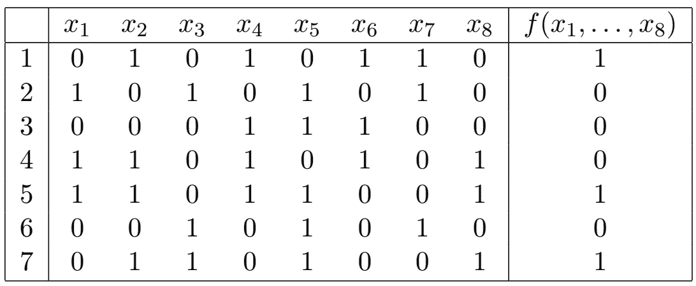
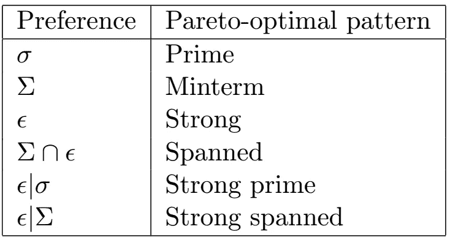
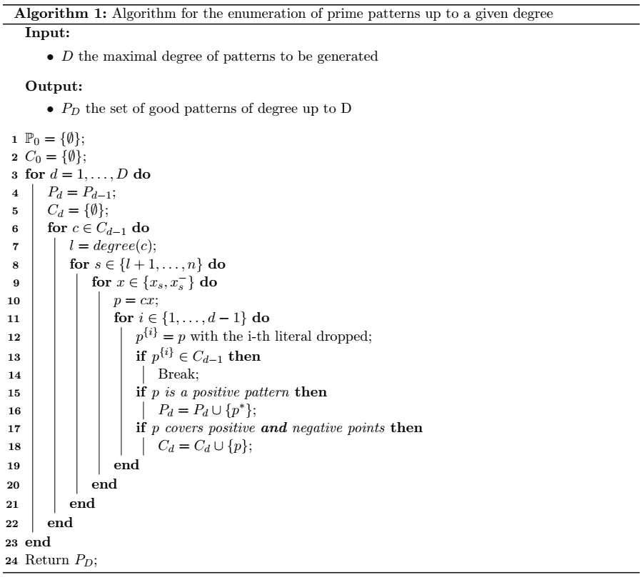
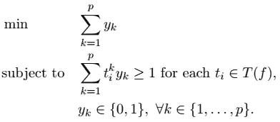

# 你知道数据方法论的逻辑分析(LAD)吗？

> 原文：<https://towardsdatascience.com/do-you-know-the-logical-analysis-of-data-methodology-lad-76365b33bc63>

## 让我们快速浏览一下

图片来自 [geralt](https://pixabay.com/fr/users/geralt-9301/) 来自 [pixabay](https://pixabay.com/fr/) 。

我最近发现了一个数据分析领域，这个领域始于 1986 年彼得·l·哈默的工作，叫做*数据的逻辑分析* (LAD)。我问了一圈，没人听说过。所以我决定写一篇关于这种原始的数据分析方法的简介。本文是基于[1]的第三章和[2]的文章。

LAD 是一种二元可解释分类方法，基于最优化、布尔函数和组合理论的混合。但是请放心，理解这个理论的基础不需要任何先决条件。这是一种具有竞争力的分类方法，用于分析由二元观测值组成的数据集，通过其*模式*的概念提供清晰的解释。

LAD 从数据集中提取大量的模式集合，其中一些是具有肯定分类的观察结果的特征，而另一些是具有否定分类的观察结果的特征。然后对该集合进行过滤，以提取更小的、非冗余的模式集合。这种简化允许为每个分类提供可理解的解释。

# 介绍

要理解什么是童子，我举个常见的例子。一位医生想找出哪些食物会导致他的病人头痛。为此，他的病人记录了一周的饮食，如下表所示。

饮食记录。作者的表格。

快速分析让医生得出两个结论。首先，他注意到病人在不头痛的日子里从不吃没有食物 n 1 的食物 n 2，但是在他确实头痛的日子里吃了食物 N2。他注意到没有食物 n 6 的食物 n 4 也有同样的模式。因此，他得出结论，他的病人的头痛可以用这两种模式来解释。

在不知情的情况下，医生对饮食记录数据集执行了 LAD。事实上，在他的分析过程中，他不得不回答以下三个问题:
**【1】**如何提取一个短的特征列表(即食物项目)足以对数据进行分类(即解释头痛的发生)？
**(2)** 如何检测导致头痛的模式(即食物项目的组合)？
**(3)** 如何建立解释每一次观察的理论(即模式集合)？
这些问题总结了 LAD 方法。

# 符号和定义。

数据的逻辑分析基于部分定义的布尔函数 (pdBf)和模式***的概念。***

我们设置 *B = {0，1}* 。集合 *Bⁿ* ，通常被命名为维数为 *n* 的布尔超立方体，由所有可能的长度为 *n* 的二进制序列组成。我们对 *Bⁿ* 上的一个偏序 *≤* 定义如下:*一个=(a₁，…，aₙ) ≤ b=(b₁，…，bₙ)* 当且仅当 *aᵢ ≤ bᵢ* 对于每个 *i=1，…，n* 。

一个子集 S ⊆ *Bⁿ* 被称为 *Bⁿ* 的**子立方体当且仅当 *|S|=2ᵏ* for *k ≤ n* 并且存在 *n-k* 分量，其中 *S* 的所有序列重合。例如 *S={(0，0，0)，(0，0，1)，(0，1，0)，(0，1，1)}* 是 *B* 对于 *k=2* 的子码**

## 什么是 ***部分定义的布尔函数*** ？

一个 ***布尔函数*** ， *f* ，是从 *Bⁿ* 到 *B* 的映射。还有 2^(2ⁿ)可能的布尔函数。对于一个布尔函数 *f* ，我们设 *T=T(f)={a ∈ Bⁿ* 如 *f(a)=1}* 和 *F=F(f)={a ∈ Bⁿ* 如 *f(a)=0}* 为 *f* 的真点和的假点的集合一个 ***部分定义的布尔函数*** (pdBf)是一个布尔函数，使得 *T* 和 *F* 不相交，但是 *Bⁿ* 的一些元素既不属于 *T* 也不属于 *F* 。我们可以将饮食记录表重写为 pdBf，如下所示:

一种部分定义的布尔函数。作者的表格。

此表中 1、5、7 点属于 *T* (真点)，2、3、4、6 点属于 *F* (假点)。但是序列 *(1，1，1，1，1，1，1)* 既不属于 *T* 也不属于*f*能够预测它会很有趣。

## 什么是模式？

为了定义模式，我必须引入*术语*的概念。我们把 *x ∈ B 的 ***补语*** 定义为 x⁻= 1-x .*a****项*** 是 *B* 的元素及其补语的乘积。而一个项的 ***度*** 就是其中的元素个数，命名为 ***字面*** s，例如，设 *t* 为一个度为 *3* 的项使得 *t=x⁻₁x₂x₃，*则 *t(0，0，1)=(1–0)×0×1 = 0。*需要注意的是 *t(a)* 是为任何 *a ∈ Bⁿ* 定义的，即使 *t* 的次数小于 *n* ，忽略不在该项中的值即可。如果 *t=x₂x⁻₃* 那么 *t(0，0，1)= 0×(1–1)= 0。*如果 *t(a)=1* 我们说 *t* ***覆盖*** 点 *a* 。*

*模式是 LAD 的核心元素。一个术语 *t* 叫做一个 pdBf 的 ***正*** ( ***负*** ) ***模式*** ， *f，*当且仅当:
1-*t(x)= 0∀**x 871
例如，术语 *x⁻₁x₂* 等于 *1* 当且仅当 *x₁=0* 和 *x₂=1.*所以，在前面的例子中，这一项只涵盖了点 1 和点 7，它们在 *T(f)中。*这个术语叫做 f 的正型，可以注意到 *x₄x⁻₆* 也是 *f* 的正型。在医生的分析中发现了这两种模式。分别地， *F(f)* 中覆盖点的项称为 F 的否定模式。**

*为了比较模式，我们需要引入一些合理的适合性标准:*简单性*，*选择性*，以及*证据*。这些标准定义了模式的一个简单的部分前序，称为 ***偏好*** 。设 *P* 为模式， *f* 为 pdBf，则我们有:*

***简单性**:考虑到 *P* 的文字集，对 *P* 的简单性进行评估。这就是σ偏好，我们定义 *P₂ ≤_σ P₁* 当且仅当 *P₁* 的文字集是 *P₂* 的子集。*

***选择性:**考虑 p 的子立方体(即 *Bⁿ* 被*p】*覆盖的点的子集)来评估 *P* 的选择性。这是σ偏好，我们定义*p₂≤_σp₁*当且仅当 *P₁* 的子多维数据集是 *P₂* 的子多维数据集的子集。*

***证据:**考虑到 *P* 所覆盖的 *T(f)* 的集合，对 *P* 的证据进行评估。这是ϵ偏好，我们定义 *P₂ ≤_ϵ P₁* 当且仅当 *P₁* 覆盖的真点集是 *P₂* 覆盖的真点集的子集。*

*我们还可以使用交集∩和字典式细化|来组合偏好。设λ和γ是两个偏好，则我们有:*

*   **P₁* ≤_(λ ∩ γ) *P₂* 当且仅当 *P₁* ≤_λ *P₂* **和** *P₁* ≤_γ *P₂* 。*
*   **P₁* ≤_(λ | γ) *P₂* 当且仅当 *P₁ < _λ P₂* 或 *(P₁ ≈_λ P₂* **和** *P₁ ≤_γ P₂)* 。*

*设λ为偏好，一个模式 *P* 称为 ***帕累托最优模式*** 当且仅当不存在模式*P’≠P*使得*P ≤_λP’。*不幸的是，*最优*模式的概念没有唯一的定义。我们总结了关于偏好和偏好组合的帕累托最优模式的性质。*

**

*帕累托最优的类型。作者的表格。*

*在头痛的例子中，术语 x₂x₅x₈是 *f* 的正模式(它涵盖了第 5 点和第 7 点)。但不是 ***小项*** 。事实上，x₂x₅也是一个阳性模式，x₂x₅x₈的亚立方体也包括在 x₂x₅.的亚立方体中在这里，x₂x₅是一个短期的积极模式。*

*考虑到正模式 *x₂x₅x⁻₆x⁻₇x₈* ，我们可以说不存在 *i ∈ {1，3，4}* 这样的 *x₂x₅x⁻₆x⁻₇x₈xᵢ* 是一个模式。由此可见，*是一个 ***质数*** 的正模式。**

**而且，x₂x₅和 *x₂x₅x⁻₆x⁻₇x₈* 都是 ***强*** 正格局*。*这是因为，没有模式覆盖的真点的例子。于是，x₂x₅是一个 ***跨区*** 的正格局(mintern and strong)*是一个 ***强素数*** 的正格局。***

# **法律援助署的方法**

**现在，我们已经准备好采用 LAD 的方法。LAD 的主要目的是找到 pdBF 的扩展(如前所述)。但是有许多方法可以扩展这个功能。难点在于找到了*好的一个*，称之为 ***论*** 。为此，LAD 分三个主要步骤进行处理:
1-将数据集转化为 pdBf。它被称为 ***二值化*** 过程。
2-检测医生在介绍中提出的合适模式。
3-成型理论。这意味着提取关于所有检测模式的 pdBf 的最佳扩展。**

## **二值化。**

**第一步是数据的 ***二值化*** 。许多真实数据集包含数值数据和名义数据。将标称数据二进制化的一种简单方法是使用一键编码技术。这是一种非常快速的技术，数据会按照预期进行转换。数字数据的二进制化稍微复杂一些。一种常见的方法是选择临界值或分界点，并使用指标特征。要么该特征的性质表明了切割点的选择(如医学中的身体质量指数)，要么它更复杂，仍有待改进。不幸的是，二值化过程通过添加许多特征增加了数据集的维度。因此，通过特征选择来减小尺寸是很重要的。**

## **检测模式。**

**可以想象，这部分过程仍然是一个开放的研究领域，选择什么样的算法来生成模式取决于你想找到什么样的模式。在这里，我将给出一个在[4]中介绍的算法，用于提取正的 ***素数模式*** 。对于负图案，算法是相似的。**

****

**这个伪代码背后的想法很简单。目标是测试从 1 度到 D 度的术语，并且只保留那些具有正模式的术语。不考虑否定模式，包含正负两点的术语将作为下一个学位的候选项。**

**有几种算法可以生成不同类型的合适模式。如果你想了解他们的情况，我建议你参考[2]和[3]。**

## **形成理论。**

**在这个阶段，我们有很多模式。当然太多了，无法创建一个可解释的模型，这是 LAD 的优势。因此，我们需要从生成的模式集中选择一组合适的模式。所选择的集合应该有合理数量的元素，但也有足够的元素来很好地区分积极和消极的观察。这个选择过程可以表示为一个优化问题。**

**对于每个积极的模式， *pₖ* ，我们分配一个二元变量 *yₖ* ，使得 *yₖ=1* 当且仅当 *pₖ* 被包括在最终模型中。并且对于每一个肯定的观察值 *tᵢ* ，我们定义一个二元向量 *(tᵢ，tᵢ，…，tᵢᵖ)* ，其中 *p* 是肯定模式的数量，并且 *tᵢᵏ=1* 当且仅当 *pₖ* 覆盖 *tᵢ* 。**

****

**这个优化问题可以很容易地适应你的需求，代价是小的变化。约束条件右侧的值 *1* 可以增加，以确保一个决策至少有两个(或更多)模式。我们还可以在总和 *∑ wₖyₖ.中的每个模式上添加一个权重 *wₖ** 例如，这些权重可以通过每个模式的程度来索引，以促进具有更容易被人类解释的少量文字的模式。**

# *结论*

*数据的逻辑分析是一种非常有趣的分类方法，仍然是一个活跃的研究领域。LAD 基于模式的概念，模式是对新观察结果进行分类的工具，并为每个分类提供可理解的解释。*

*LAD 在医学上有许多应用，如[乳腺癌预后](https://pubmed.ncbi.nlm.nih.gov/16859500/)、[卵巢癌检测](https://pubmed.ncbi.nlm.nih.gov/14997498/)、[生存数据分析](https://pubmed.ncbi.nlm.nih.gov/18689833/)等(概述见【2】)。我认为它也可以很容易地应用于许多其他领域。*

*不幸的是，LAD 似乎缺乏知名度，我希望这篇短文能激发您的兴趣。这是一种生成可解释的分类模型的优雅方式，不同于通常的基于树的算法和基于规则的算法。随后将有一篇关于 python 应用程序的文章。*

# *参考*

*[1]奇卡洛夫、洛津、洛兹纳、莫什科夫、阮、斯科龙和杰洛斯科。 [*数据分析的三种途径:测验理论、粗糙集和数据的逻辑分析*](https://link.springer.com/book/10.1007/978-3-642-28667-4) (2012)第 41 卷。施普林格科学&商业媒体。*

*[2]阿利克夏、阿利克夏、博纳特斯、科岗。 [*数据的逻辑分析——彼得·l·哈默的愿景。*](https://www.researchgate.net/profile/Gabriela-Alexe/publication/220642889_Logical_analysis_of_data_-_The_vision_of_Peter_L_Hammer/links/00b7d522251543608f000000/Logical-analysis-of-data-The-vision-of-Peter-L-Hammer.pdf) (2007)《数学与人工智能年鉴》49 卷，第 1 期:265–312 页。*

*[3] P.L .哈默、a .科岗、b .西默内、s .斯泽德马克 [*数据逻辑分析中的帕累托最优模式*](https://www.sciencedirect.com/science/article/pii/S0166218X04001878) 。(2004)离散应用数学 144，第 1–2 期:79–102。*

*[4]马约拉斯。*用于数据逻辑分析的 C++工具*。(1995)鲁特科尔研究报告:1–95。*

# *关于我们*

*[Advestis](https://www.advestis.com/) 是一家欧洲合同研究组织(CRO ),对统计学和可解释的机器学习技术有着深刻的理解和实践。Advestis 的专长包括复杂系统的建模和时间现象的预测分析。*

**领英*:[https://www.linkedin.com/company/advestis/](https://www.linkedin.com/company/advestis/)*