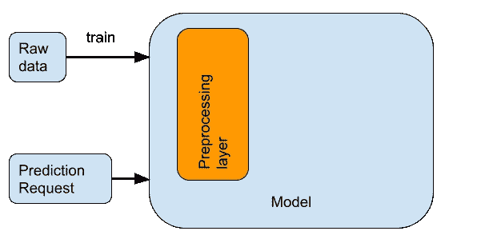
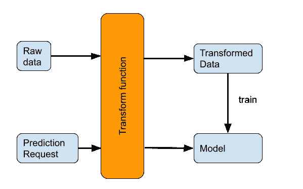
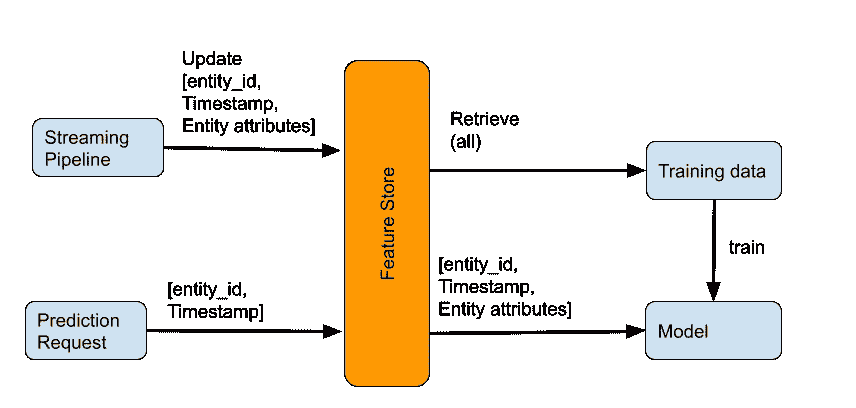
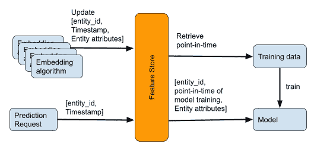
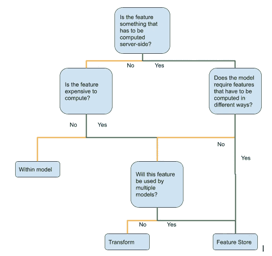

# 你真的需要一个功能商店吗？

> 原文：<https://towardsdatascience.com/do-you-really-need-a-feature-store-e59e3cc666d3>

## 在大多数情况下，功能商店是多余的

似乎每个成熟的 ML 团队都为他们的 ML 平台建立了一个特性库。优步建造了[调色板](https://www.infoq.com/presentations/michelangelo-palette-uber/)。Airbnb 建造了[滑索](https://databricks.com/session_eu19/zipline-airbnbs-declarative-feature-engineering-framework)。网飞建造了[时间旅行](https://netflixtechblog.com/distributed-time-travel-for-feature-generation-389cccdd3907)。Google Cloud 与我们的客户 GoJek 合作构建了[盛宴](https://feast.dev/)。

幸运的是，您不再需要构建或管理自己的系统。Google Cloud Vertex AI 提供了一个[完全管理的功能商店](https://cloud.google.com/vertex-ai/docs/featurestore)，就像 [Sagemaker](https://aws.amazon.com/sagemaker/feature-store/) 一样。甚至有像 [tecton.ai](http://tecton.ai) 这样的公司致力于构建云无关的功能商店。鉴于所有这些，看起来好像特征库是机器学习的数据仓库——你不仅应该使用特征库，而且应该围绕特征库集中你的 ML 平台。

不要。在大多数情况下，功能存储增加了不必要的复杂性。然而，在一些情况下，功能存储将是无价的。

***tldr:*** *如果需要在服务器端注入特性，特别是计算这些特性的方法会不断改进的情况下，使用特性库。否则就是矫枉过正。*

## 训练发球偏斜

首先，我们来看一下功能商店试图解决的问题。

机器学习中的一个主要挑战是训练服务偏差。当对预处理数据训练 ML 模型时，有必要对传入的预测请求执行相同的步骤。这是因为我们需要为模型数据提供与其接受训练的数据相同的特征。如果我们不这样做，我们就会在训练和服务之间产生偏差，模型预测也不会那么好。

有三种方法可以确保在训练期间完成的预处理在预测期间按原样重复:将预处理代码放入模型中、使用转换函数或使用特征存储。让我们逐一讨论。

## 1.在模型中

最简单的选择是将预处理步骤合并到模型函数本身中。例如，它可能在 Keras 的 Lambda 层中执行。Keras 还提供现成的预处理层。这样，当保存模型时，预处理步骤将自动成为模型的一部分。

**将预处理代码合并到模型函数中。作者图片**

这种方法的优点是简单。不需要额外的基础设施。预处理代码与模型一起被携带。因此，如果您需要在边缘上部署模型，或者在另一个云中部署模型，您没有什么特别要做的。SavedModel 格式包含所有必要的信息。

这种方法的缺点是预处理步骤将在训练数据集的每次迭代中被浪费地重复。计算越昂贵，累积起来就越多。

另一个缺点是，您必须在与 ML 模型相同的框架中实现预处理代码。因此，例如，如果模型是使用 Pytorch 编写的，那么预处理也必须使用 Pytorch 来完成。如果您的预处理代码使用自定义库，这可能会变得很困难。

## 2.转换函数

将预处理代码放在模型函数中的缺点是，在模型训练过程的每次迭代期间，需要使用该代码来转换原始数据。

如果我们在一个函数中捕获预处理步骤，并将该函数应用于原始数据，这可以得到优化。然后，可以对预处理后的数据进行模型训练，效率更高。当然，我们必须确保从训练和预测代码中调用该函数。或者，我们必须在一个容器中捕获预处理步骤，并将容器放在输入和模型之间。虽然这增加了效率，但是也增加了复杂性——我们必须确保将转换函数保存为与模型相关联的工件，并且知道要调用哪个转换函数。

**将预处理代码封装到一个转换函数中，该函数应用于原始数据集和预测请求。作者图片**

像 Tensorflow Extended (TFX)这样的框架提供了一种转换功能来简化簿记工作。一些基于 SQL 的 ML 框架如 BigQuery ML 也支持 TRANSFORM 子句。

如果额外的基础设施和簿记开销值得的话，我宁愿使用转换函数，而不是将转换代码放入模型中。如果该特征计算量很大，就会出现这种情况。

## **3。特色商店**

将预处理代码放在模型函数中，或者将其封装在转换函数(或者 SQL 子句或容器)中，对于绝大多数特性来说就足够了。

在两种情况下，这些还不够，您将需要一个功能库。特征库是用于存储和提供 ML 特征的存储库。特征存储本质上是一个键-值存储，其中键由一个实体(例如 hotel_id)和一个时间戳组成，而值由该实体的属性(例如价格、预订数量、过去一小时访问酒店列表的网站访问者数量等)组成。)截至该时间戳。

特征库是一个中央储存库，提供某一时刻的实体值。作者图片

需要要素存储的第一种情况是，请求预测的客户端不知道要素值，而是必须在服务器上进行计算。如果请求预测的客户端不知道特征值，那么我们需要一种机制将特征值注入到传入的预测请求中。功能商店扮演着这个角色。例如，动态定价模型的特征之一可以是在过去的一个小时内访问项目列表的网站访问者的数量。请求酒店价格的客户端(想象一个移动应用程序)不知道这个特性的价值。该信息必须在服务器上使用点击流数据的流式管道进行计算，并插入到功能存储中。

第二种情况是防止不必要的数据拷贝。例如，假设您有一个计算量很大的特征，并且在多个 ML 模型中使用。与使用变换函数并将变换后的特征存储在多个 ML 训练数据集中相比，将变换后的特征存储在一个集中的存储库中要高效得多，也更易于维护。对此要小心——增加的效率可能不值得增加的复杂性。

不要在这些场景中走极端。例如，如果需要在服务器端计算的模型的所有特性都是以相同的方式计算的(例如，它们是从关系数据库中检索的，或者是通过流管道计算的)，那么将检索代码放在转换函数或容器中是完全可以接受的。类似地，相对于用一个特性库使你的 ML 平台复杂化，重复一些特性处理几次是完全可以接受的。

## 功能存储的规范使用

特色商店最重要的用例是当情况#1 和#2 *都适用的时候。例如，假设您需要一个“时间点查找”来获取训练数据以训练模型。诸如过去一小时内网站访问者的数量或过去一小时内驾驶员的出行次数等特征。在多个模型中使用。但是它们非常简单，因为它们是由流管道计算的，所以它们的实时值可以是数据仓库的一部分。这些相对容易，并不总是需要一个功能商店。*

现在考虑另一种类型的功能，这种功能被许多型号使用，但也在不断改进，例如，我们可能在音乐流媒体服务中嵌入了歌曲、艺术家和用户。有一个团队每天更新用户和歌曲嵌入。每次重新训练使用该特征的模型时，高商业价值的用例将需要定期重新训练，训练代码将需要获取与训练标签和最新版本的嵌入算法一致的该特征的值。这必须在所有标签上高效、轻松地完成。这必须在模型使用的数十或数百个特征中完成。特征存储使得对难以计算的、经常改进的特征的定期模型重新训练特别有用。

特征库对于难以计算且频繁更新的特征特别有用，因为模型必须在“时间点”嵌入上进行训练。**作者图片**

## 决策图表

此处讨论的注意事项总结在此决策图中:

在不同的捕获预处理选项之间进行选择。**作者图片**

这不是一个决定您的组织是否需要功能存储的决策树-可能有一些您需要的功能(对于这些功能，如果您使用 Vertex AI 功能存储，我们会很高兴)。这是一个决策树，用于决定是否为您正在构建的特定特征/模型使用特征存储。

以下是一些不需要功能商店的具体情况。如果你的特征是

1.客户所知。
2。在数据仓库里。
3。不依赖于时间。
4。仅批量供应所需。
5。计算成本低

保持简单。

## 进一步阅读

1.  特征存储是我们在《机器学习设计模式》一书中讨论的设计模式之一。即使在那里，我们也警告过不要在这种模式上走极端，但是我担心功能商店正在变成“四人帮”书中的访问者模式——经常被不恰当地使用。
2.  使用 [Keras 预处理层](https://keras.io/guides/preprocessing_layers/)进行模型内预处理，使用 BigQuery ML 中的 TRANSFORM 子句进行转换。TFX 为张量流/Keras 模型提供变换功能。
3.  在 Google Cloud 上，如果需要功能商店，使用[全托管顶点 AI 功能商店](https://cloud.google.com/vertex-ai/docs/featurestore)。

*感谢我的同事 Anand Iyer 对这个话题的有益讨论。*