# doccano——一个注释文本数据以训练自定义 NLP 模型的工具

> 原文：<https://towardsdatascience.com/doccano-a-tool-to-annotate-text-data-to-train-custom-nlp-models-f4e34ad139c3>

## 垃圾输入，垃圾输出:高质量的数据是健壮的 ML 引擎的燃料


帕特里克·托马索在 [Unsplash](https://unsplash.com?utm_source=medium&utm_medium=referral) 上的照片

我最近不得不在一个非常技术性的领域为一个非常具体的任务建立一个 NLP 模型。

这很有挑战性，因为我对这个主题一无所知，也没有可用的培训数据。

作为一名数据科学家，我首先尝试研究开源数据集、预训练模型和科学文章，但我最终得出的结论是，没有任何东西真正符合我的目标，解决我的问题的唯一方法是从零开始建立一个训练数据集**。**

**→必须进行手动贴标🤷‍♂**

为此，我查看了多种文本标注工具，最终选择了 [Doccano](https://doccano.herokuapp.com/) 。

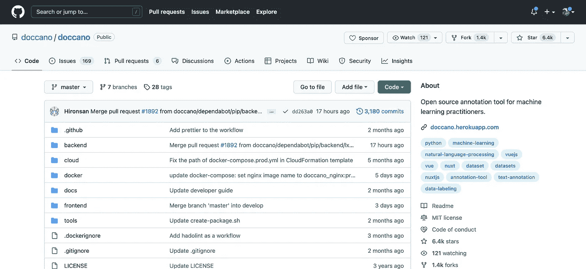

作者截图

> 在这篇文章中，我将告诉你更多关于这个工具的信息:我将首先介绍它的多种特性，并向你展示如何为你的团队安装和设置它。
> 然后，我将给出一个具体的例子，在这个例子中，Doccano 帮助为命名实体识别(NER)任务标注数据。

*本帖为个人评论。我并没有得到 Doccano 或其任何核心开发者的认可。*

事不宜迟，让我们来看看🔍

[](https://medium.com/membership/@ahmedbesbes)  

# 有时，您需要花费时间来构建标注数据集⏳

随着由大规模[变压器](https://en.wikipedia.org/wiki/Transformer_(machine_learning_model))供电的非常强大的模型的出现，我们倾向于认为今天的许多 NLP 任务已经解决了。

→如果您可以访问带标签的数据，在您的下游任务(分类、翻译、NER)上微调预训练的转换器可能会给您带来好的甚至是最先进的(SOTA)结果
→如果您没有带标签的数据，您可以加载一个已经在类似任务上进行过预训练的转换器并原样应用 *→如果您无法访问训练数据或预训练模型，您可以*有时*执行*零测试你加载一个转换器，指出你的类标签，并对它们进行预测。**

*尽管它们看起来像是纯粹的魔法，但预训练的模型(和变形金刚)并不能解决所有的 NLP 问题。*

*事实上，如果没有整合到数据中的正确领域知识，预训练的模型只能有一个宽泛的视图，特别是如果它们是在通用语料库(👋维基百科)*

*这就是为什么当你面临一个需要大量领域专业知识的问题时，注释数据和构建训练数据集可能是一个合理的解决方案。*

*一开始看起来确实很痛苦，但从长远来看是有价值的。*

*花时间标注数据的重要性*

# ***介绍 Doccano***

*在查看了 3 或 4 个文本注释工具(既有开源的也有专有的)之后，我最终决定在 doccano 上投入时间。*

*正如官方文档中所描述的，Doccano 是*

> *“一个面向人类的开源文本注释工具。为**文本分类**、**序列标注**和**序列任务**提供标注功能。（..)，可以创建标注数据用于情感分析、命名实体识别、文本摘要等等。只需创建一个项目，上传数据并开始注释。你可以在几个小时内建立一个数据集。”*

*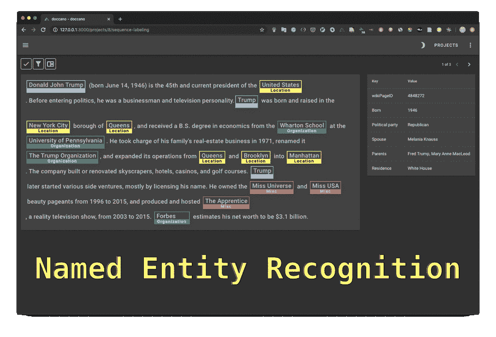*

*作者修改的 GIF*

*为了能够在本地使用 doccano，您有两种选择:*

## *1 —使用 pip 在本地安装*

*你可以在几秒钟内在电脑上把它旋转起来。*

*只需运行这个命令来安装它。*

```
***pip install doccano***
```

*由于 doccano 原生使用 SQLite 作为数据库，所以也可以用 PostgreSQL 安装。在这种情况下，您需要运行以下命令:*

```
***pip install 'doccano[postgresql]'***
```

*并将`DATABASE_URL`设置为环境变量。*

```
***DATABASE_URL="postgres://${POSTGRES_USER}:${POSTGRES_PASSWORD}@${POSTGRES_HOST}:${POSTGRES_PORT}/${POSTGRES_DB}?sslmode=disable"***
```

*安装 doccano 后，运行以下命令，以便:*

*   *初始化数据库:*

```
***doccano init***
```

*   *创建超级用户*

```
***doccano createuser --username admin --password pass***
```

*   *启动 web 服务器*

```
***doccano webserver --port 8000***
```

*这会在端口 8000 运行本地服务器列表。*

*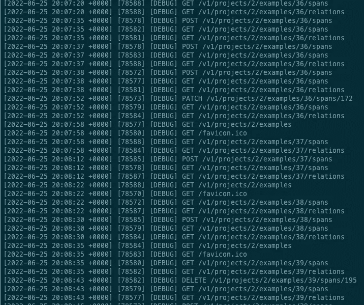*

*作者截图*

*现在，在另一个终端中，您需要启动一个队列来处理文件上传和下载。*

```
***doccano task***
```

*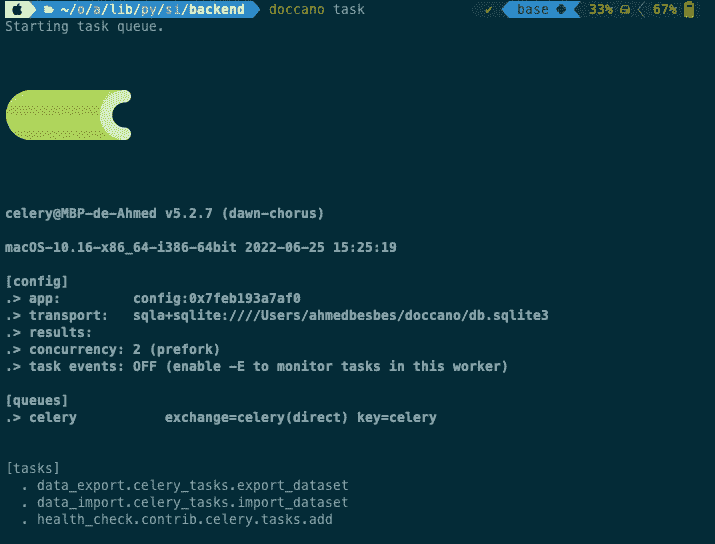*

*→通过访问 [http://127.0.0.1:8000](http://127.0.0.1:8000/) ，您现在可以在本地访问该工具。*

*只需输入您之前定义的用户名和密码，就可以开始了。*

*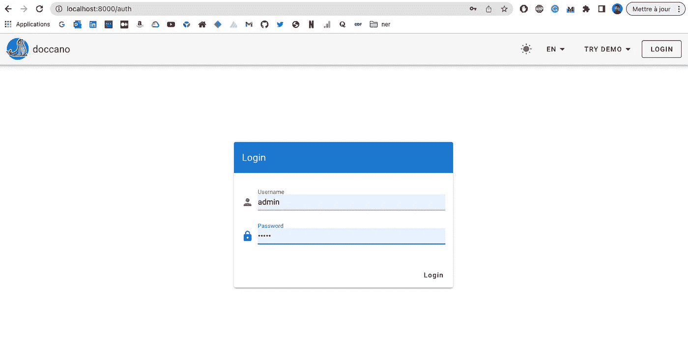*

*作者截图*

## *2-Docker 或 Docker 撰写*

*您还可以使用 Docker 启动 doccano，如果您想将它部署在云上，Docker 是一个不错的选择。*

*Docker 允许您将以前手动执行的不同步骤减少为几个命令，这些命令从 Dockerhub 中提取 doccano [图像](https://hub.docker.com/r/doccano/doccano)，在设置凭证、数据库和网络之后创建并启动容器。*

```
***docker pull doccano/doccano
docker container create --name doccano \
  -e "ADMIN_USERNAME=admin" \
  -e "ADMIN_EMAIL=admin@example.com" \
  -e "ADMIN_PASSWORD=password" \
  -v doccano-db:/data \
  -p 8000:8000 doccano/doccano****docker container start doccano***
```

*您还可以使用 docker-compose 将 doccano 作为多容器堆栈来执行。*

```
***docker-compose -f docker/docker-compose.prod.yml \
               --env-file .env up***
```

*你可以在这里查看`docker-compose.prod.yml`。*

# *特性和功能*

*Doccano 使贴标成为一个简单的过程。让我们创建一个标注项目并开始标注，而不是枚举它的功能。一路上我们会看到有趣的东西。*

***→每个任务的单独/独立项目***

*启动 Doccano 后，进入登录页面并输入您的凭证。登录后，您将看到您过去启动的不同注释项目的列表。*

*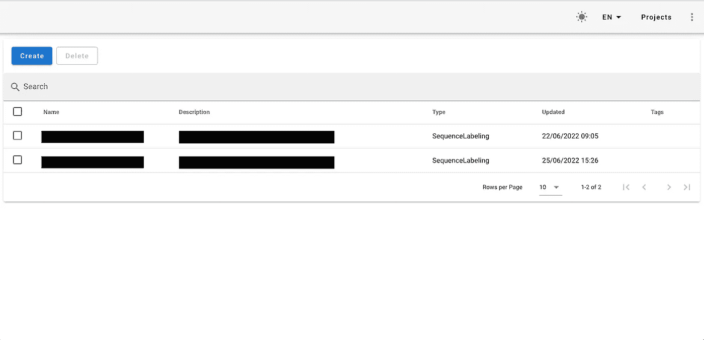*

*作者截图*

***→多种类型的注释***

*点击创建按钮启动一个新的项目，并选择适当的任务(文本分类，序列标签，序列等。)*

*让我们以选择 ***序列标注*** 任务为例。这适用于命名实体识别等任务。*

*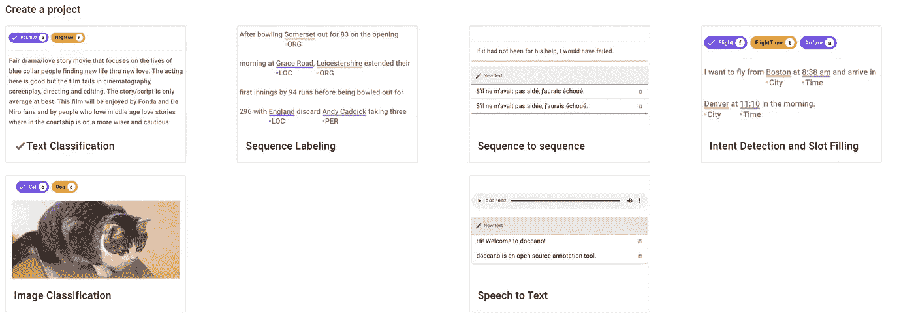*

***→简易项目设置***

*一旦您选择了一个任务，Doccano 将要求您定义一个项目名称、一个描述、一些标签、是否有重叠的实体、关系标签或用户之间共享的注释。*

*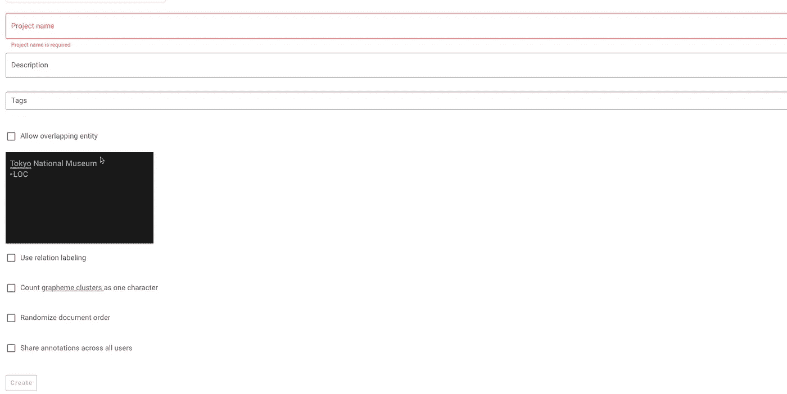*

*作者截图*

***→配置项目***

*在开始注释过程之前，应该先设置一些配置。*

*   *定义标签:例如，您有兴趣检测的实体。你也可以给它们中的每一个赋予一个颜色代码。*

*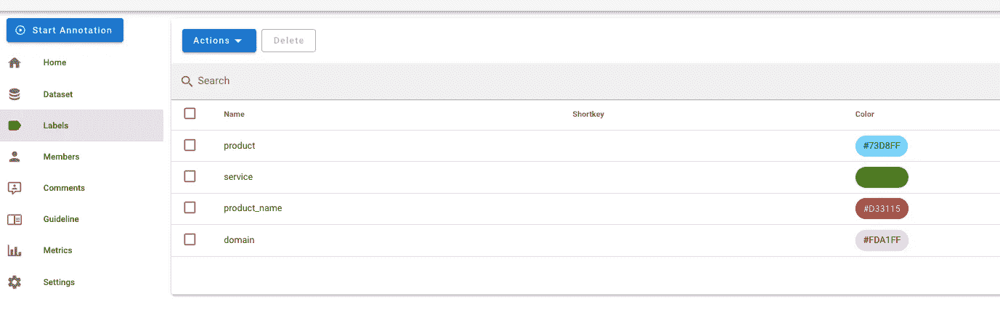*

*   *创建用户:Doccano 是一个协作工具，在这个工具中，多个用户可以在同一个项目上工作。*

*要管理用户，首先需要进入 Django 管理页面[http://localhost:8000/admin/](http://localhost:8000/admin/)*

*在“用户”下，您可以添加或删除用户。*

*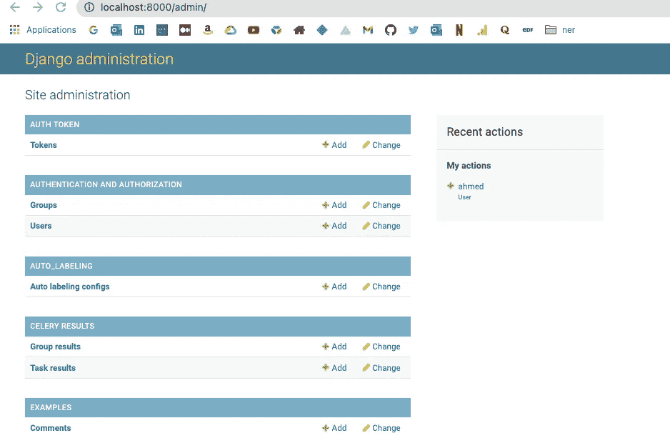*

*假设我创建了一个用户“ahmed”，我可以将它添加到项目中，并指定它的角色:项目管理员、注释者、注释批准者。*

**

*作者截图*

*   *为注释者添加注释指南*

*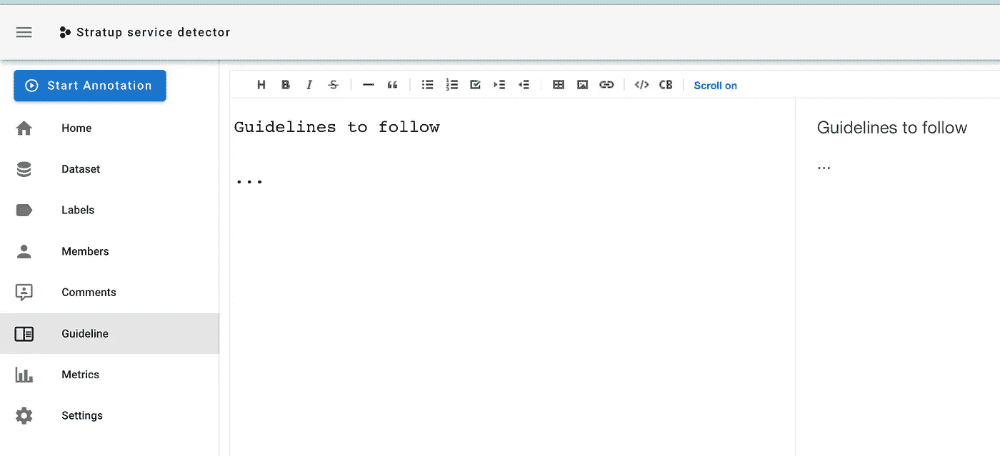*

*作者截图*

***→导入数据集***

*Doccano 支持多种格式作为输入。*

*   ***文本文件**:多个 TXT 文件，每个文件对应一个文档*

*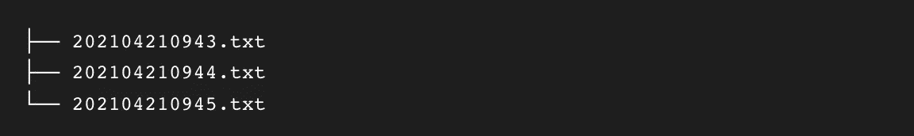*

*作者截图*

*   ***TextLine:** 一个单独的 TXT 文件，其中文档以行分隔*

**

*作者截图*

*   ***JSONL:** 其中提到了实体的位置*

*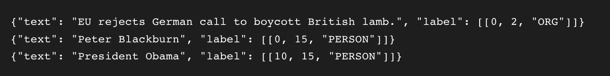*

*作者截图*

*   *[CONLL](https://conll.org/) 格式*

*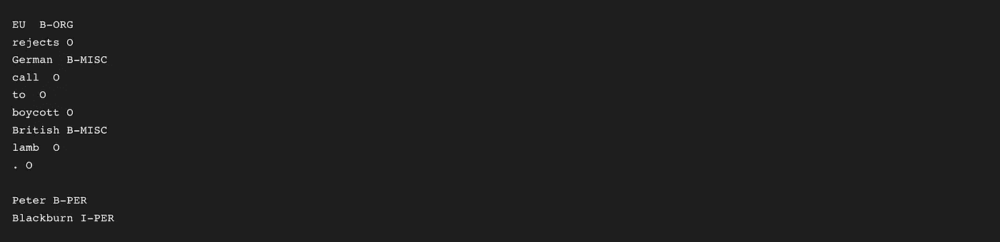*

*作者截图*

*数据上传后，您可以在表格上查看并开始注释。*

*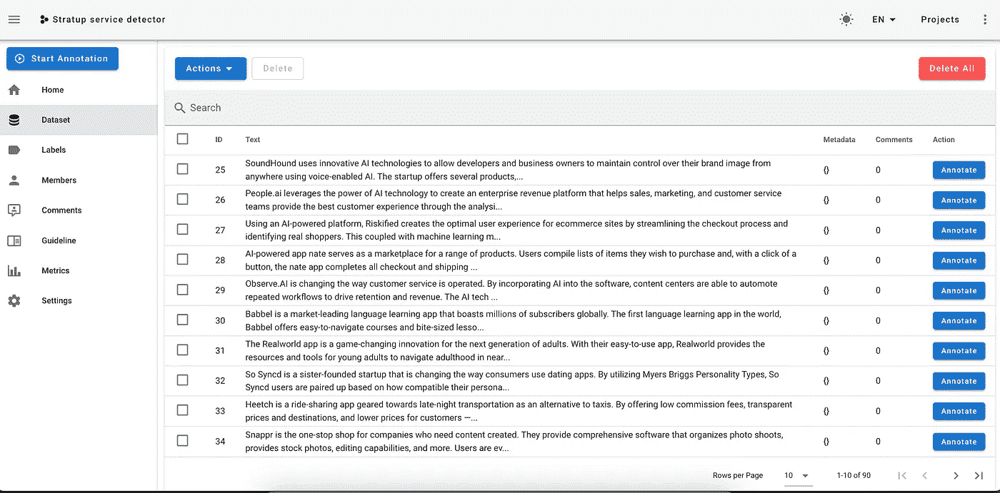*

***→开始注释过程***

*我喜欢 Doccano 的注释界面:它用户友好、简单，并能让您访问您需要的一切:*

*   *界面上的交互式标签*
*   *完成率*
*   *注释和元数据来丰富注释*

*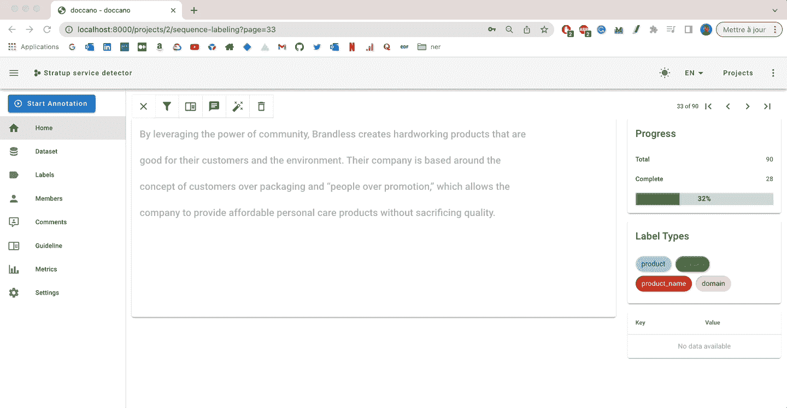*

*作者 GIF*

***→导出注释数据***

*完成后，您可以将注释导出为 JSONL 格式。*

*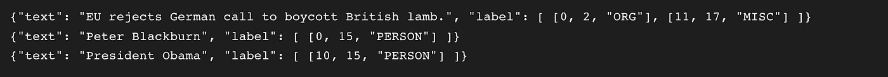*

*作者截图*

***→指标***

*Doccano 提供了一些关于您注释的实体的统计数据。这可能有助于发现类别不平衡*

*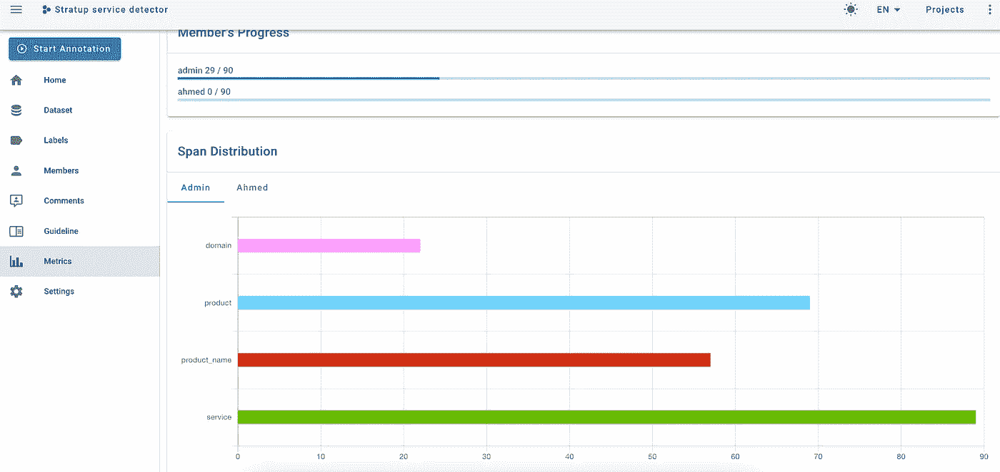*

*作者截图*

# *包裹*

*Doccano 是协作完成注释任务的一个很好的工具。如果你需要创建一个机器学习数据集，而你没有这方面的经验，你绝对应该尝试一下。*

*作为一个正在进行的开源项目，Doccano 并不包括我们在 Labelbox 等企业(且昂贵)解决方案中看到的所有闪亮功能。
例如，它没有为计算机视觉、SSO 或 API 集成提供专门的注释工具。*

*尽管如此，你仍然可以在不投入太多的情况下做很多事情。*

# *新到中？你可以每月订阅 5 美元，并解锁各种主题的无限文章(技术、设计、创业……)你可以通过点击我的推荐[链接](https://ahmedbesbes.medium.com/membership)来支持我*

*[](https://ahmedbesbes.medium.com/membership)  

由 [Oleksandra Bardash](https://unsplash.com/@bardashka?utm_source=medium&utm_medium=referral) 在 [Unsplash](https://unsplash.com?utm_source=medium&utm_medium=referral) 上拍摄的照片*