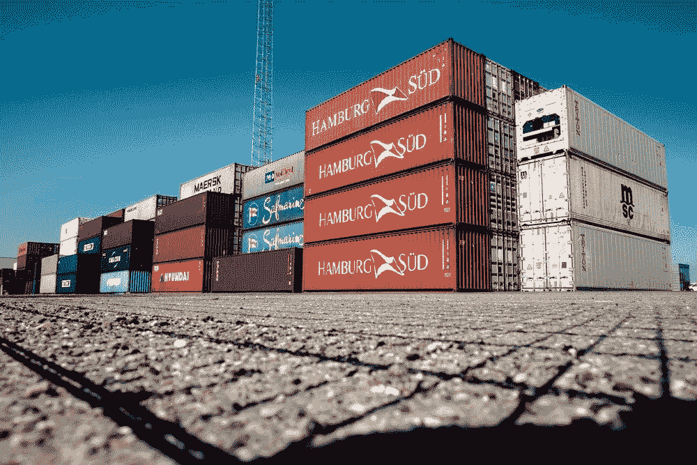
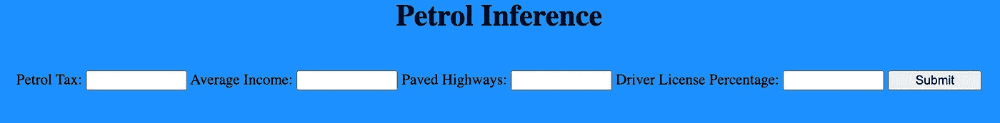
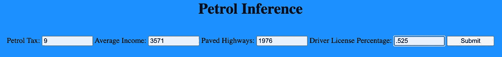
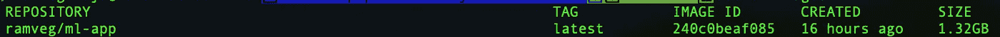
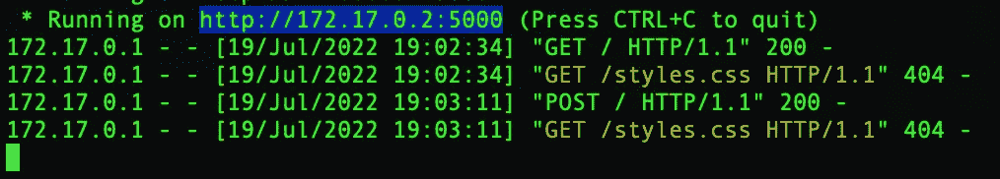
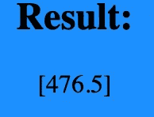

# 对接烧瓶 ML 应用

> 原文：<https://towardsdatascience.com/dockerizing-flask-ml-applications-3577b216dac0>

## 使用 Flask 部署 ML 模型和将您的工作容器化的指南

图片来自[乔纳斯·史密斯](https://unsplash.com/@jonassmith)的 [Unsplash](https://unsplash.com/photos/aL6tG-j-E4Y)

部署 ML 模型是 ML 生命周期中必不可少的一步，这一步经常被数据科学家所忽视。没有模型部署/托管，在现实世界的应用中就没有机器学习模型的使用。有很多种方法来保存你的 ML 模型，其中最简单也是最有效的是[烧瓶](https://flask.palletsprojects.com/en/2.1.x/)。

Flask 是一个用 Python 实现的微型网络框架。使用 Flask，我们将通过一个例子演示如何在本地为 ML 模型提供推理服务。如果你对 Flask 完全陌生，我建议你看一下这个[指南](https://www.digitalocean.com/community/tutorials/how-to-make-a-web-application-using-flask-in-python-3)，它会让你快速上手。

烧瓶只是我们要解决的首要问题的第一步。是的，我们可以找到一种方法来使用 Flask 托管我们的模型，但是我们如何在生产环境中维护这个环境呢？我们如何在实时应用程序中跟踪我们可能必须对软件进行的任何更改？

通过 Docker 容器，我们提供了一个轻量级的包装器，可以非常容易地复制您的环境和依赖关系。例如，如果我们有一个软件更新需要安装在我们的应用程序中，Docker 使实现和跟踪这个更新变得很简单。通过利用诸如 [Docker Registry](https://docs.docker.com/registry/) 之类的服务，您还可以跟踪不同的映像版本以进行部署。使用 Docker 容器来保存我们的环境和我们所做的任何更改，软件生命周期变得更加简单和高效。关于 Docker 的完整分类，请查看下面的[资源](https://medium.com/swlh/what-exactly-is-docker-1dd62e1fde38)。

在本文中，我们将通过一个我们训练过的 ML 模型来看一下这两个步骤。

**注意**:本文将假设您对 Python、Docker、Flask 和使用 CLI 有基本的了解。我们也将使用一些基本的 HTML/CSS，但是你可以原样复制模板。这篇文章也将使用一个 ML 模型来服务，但我们不会涵盖模型构建背后的任何理论，关于模型的具体信息，请参考这篇[文章](https://medium.com/analytics-vidhya/basic-ml-models-pros-cons-code-demos-66412eb98b6f)。

## 资料组

对于我们的例子，我们将使用来自 Kaggle 的[汽油消耗回归数据集](https://www.kaggle.com/datasets/harinir/petrol-consumption)。原始数据源在这里被许可[。](https://creativecommons.org/publicdomain/zero/1.0/)

## 模型结构

对于本文，我们不会在模型构建或从数据科学性能角度选择最准确的模型上花费太多时间。对于我们的回归问题，我将通过 Sklearn 框架利用一个 [RandomForest 回归](https://scikit-learn.org/stable/modules/generated/sklearn.ensemble.RandomForestRegressor.html)模型。一般来说，当我需要快速访问工作的 ML 模型示例时，我会尝试维护一个[模型工具箱](https://github.com/RamVegiraju/ML-ToolBox)，它会给我样板代码来加速这个过程。

准备数据

训练随机森林模型

我使用 [Joblib](https://joblib.readthedocs.io/en/latest/) 模块对模型进行序列化，为了验证它是否有效，我将快速预测一个样本数据点。

样本推断

确保保留生成的“model.pkl”文件(也可以创建 model.joblib)。这是我们将在 Flask 服务器上加载用于推理的模型工件。

## 在 Flask 上托管模型

我们的 Flask 应用程序有两个部分。首先，我们想使用一些基本的 HTML/CSS 为我们的前端构建一个模板。在这个模板中，我们所做的只是创建一个简单的表单，它将接受四个输入:汽油税、平均收入、铺设的公路和人口驾驶执照百分比。这是我们的模型在后端期望的四个参数，我们将通过这个表单捕获它们。

形式

其次，我们可以配置 Flask 应用程序来处理这些表单输入。让我们看看必要的导入并加载模型，这就是我们的 model.pkl 文件派上用场的地方。

负载模型

在配置处理表单之前，让我们用 Flask web 服务器测试一个 GET 请求。我们渲染自己创建的 index.html 页面(请原谅我糟糕的 HTML/CSS 技能)。

烧瓶应用程序设置

如果在 Flask 应用程序文件所在的目录中运行以下命令，则可以启动 Flask 服务器。

启动服务器

表单模板(作者截图)

现在我们可以处理表单的输入，并将它们提供给我们的模型。

流程表单输入

在 HTML 方面，我们希望反映模型返回的输出变量“res ”,所以我们在 index.html 代码中添加了这一部分。

反映结果

如果我们现在用一些虚拟值填写表单，我们应该能够在页面上看到推理输出。

提交表单(作者截图)

推理显示(作者截图)

太好了！我们有一个工作的 Flask 应用程序，现在让我们看看如何正确地将它容器化。

## 将烧瓶应用程序归档

在开始之前，确保 [Docker 已安装](https://docs.docker.com/get-docker/)并正常运行。

您需要知道两个主要的 Docker 实体: [Docker 图像](https://docs.docker.com/engine/reference/commandline/image/)和 [Docker 容器](https://www.docker.com/resources/what-container/)。Docker 映像包含我们的源代码、依赖项和环境。Docker 容器是 Docker 图像的一个实例。使用 Docker 图像作为模板，我们可以运行启动应用程序的容器。要进一步了解不同之处，请参考这篇[文章](https://phoenixnap.com/kb/docker-image-vs-container)。

为了建立我们的 Docker 映像，我们需要提供一个 Docker 文件，其中包含基本的设置说明。有了 Dockerfiles，我们可以使用[基础映像](https://docs.docker.com/docker-hub/official_images/)，这些映像已经预装了依赖项和代码。我们将从[基础 Python 映像](https://hub.docker.com/_/python)开始。

基础图像

接下来，我们使用 [WORKDIR](https://www.educative.io/answers/what-is-the-workdir-command-in-docker) 命令来设置容器内的工作目录。利用容器中的根目录不一定是最佳实践，因为它可能导致类似的文件名和类似的小问题。

工作目录

现在，为了设置我们的环境，我们需要提供安装所需的依赖项，我们可以通过 requirements.txt 文件来完成。

申请要求

然后，我们可以首先复制这个需求文件，然后将它安装在我们的容器环境中。

安装要求

接下来，我们可以将剩余的文件复制到工作目录中。

将剩余文件复制到工作目录

最后，利用 [CMD](https://phoenixnap.com/kb/docker-cmd-vs-entrypoint#:~:text=CMD%20is%20an%20instruction%20that,container%20with%20a%20specific%20executable.) 我们可以在启动容器时提供一个默认命令。

在容器中启动 Flask Web 服务器

现在我们有了 Docker 文件，我们可以通过在 Docker 文件所在的路径中运行以下命令来[构建](https://docs.docker.com/engine/reference/commandline/build/)我们的 Docker 映像。

构建 Docker 映像

这将创建一个标记为“ramveg/ml-app”的 Docker 图像，您可以随意重命名它。默认情况下，这也是“最新”的版本，如果你想改变，你可以做“ramveg/ml-app:dev”或类似的事情。

构建图像

我们可以通过运行下面的[命令](https://docs.docker.com/engine/reference/commandline/images/)来看到这个图像。

码头图片(作者截图)

或者，您也可以使用以下命令检查容器的内容。

检查码头集装箱

这应该会在您的容器中启动一个 shell，在这里您可以运行普通的 linux 命令来了解您的目录结构。这里我们看到了所有我们复制过来的文件。

容器结构(作者截图)

现在我们可以[启动](https://docs.docker.com/engine/reference/commandline/run/)容器，这里的关键部分是我们需要指定端口 5000，因为这是 Flask 运行的默认端口。

在容器上启动 Flask 服务器

如果我们转到“localhost:5000”，我们应该会看到与本地相同的 Flask 应用程序。只是为了验证我们也可以再次进行推理。

Flask 服务器(作者截图)

推论(作者截图)

## 其他资源和结论

  

您可以通过上面的链接访问示例的完整代码。我希望通过这篇文章，您对在生产类型环境中部署模型有了更深的理解。关于了解 ML 模型托管的更多内容，请查看我的 [MLFlow](/mlflow-model-serving-bcd936d59052) 和 [SageMaker](https://ram-vegiraju.medium.com/list/amazon-sagemaker-f1b06f720fba) 系列。如果你有兴趣学习更多关于容器的知识，Stephen Grider 在 Udemy 上有一个很棒的课程，可以帮助你从头开始。

*如果你喜欢这篇文章，请在* [*LinkedIn*](https://www.linkedin.com/in/ram-vegiraju-81272b162/) *上与我联系，并订阅我的媒体* [*简讯*](https://ram-vegiraju.medium.com/subscribe) *。如果你是新手，使用我的* [*会员推荐*](https://ram-vegiraju.medium.com/membership) *报名。*