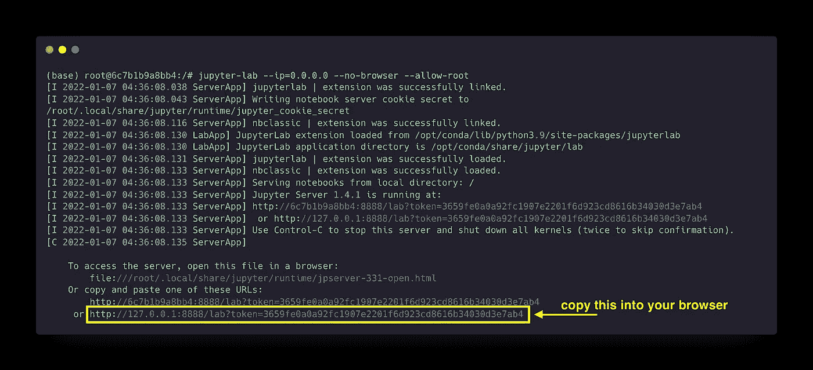
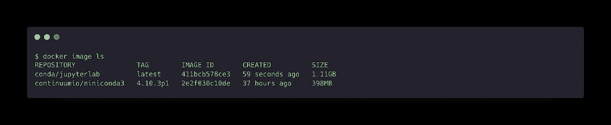
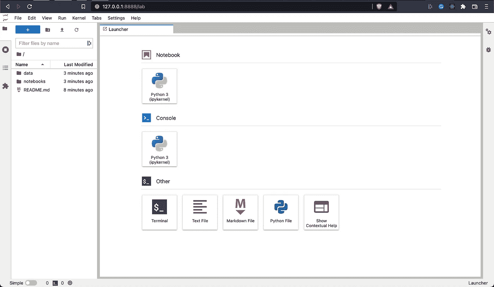
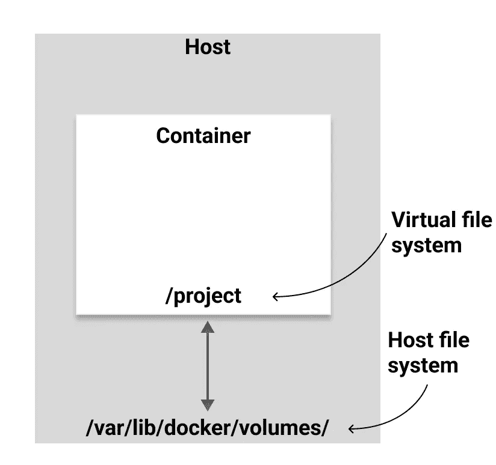

# 对接 Jupyter 项目

> 原文：<https://towardsdatascience.com/dockerizing-jupyter-projects-39aad547484a>

## 将您的项目和 conda 环境容器化的简单方法


[滕玉红](https://unsplash.com/@live_for_photo?utm_source=medium&utm_medium=referral)在 [Unsplash](https://unsplash.com?utm_source=medium&utm_medium=referral) 上的照片

Docker 是一个虚拟化工具，比[虚拟机](https://www.youtube.com/watch?v=5GanJdbHlAA)更精简。在本教程中，我将讨论在`conda`环境中容器化 Jupyter 笔记本。

这一切都源于我的研究和分析更加开放和透明的动机。我一直在尝试将我的脚本容器化，以便其他人更容易地重新创作我的作品。

当然，集装箱化并不是唯一的解决方案。人们可以用需求文件(`conda env -f requirements.yaml`)重建您的环境，然后下载您的脚本/数据来重建您的分析。集装箱化包装了一切。

在本教程中，我将解释适合我的方法，希望它能帮助你更深入地理解这种方法。

我将带您一步一步地从提取基础映像到将最终映像推送到存储库。我正在找出在这个工作流程中最有效的方法，欢迎并鼓励提出意见。

# 先决条件

如果您对 Docker 完全陌生，请按照这里的说明安装它

[](https://docs.docker.com/get-docker/) [## 获取码头工人

### 更新 Docker 桌面术语 Docker 桌面在大型组织中的专业使用(超过 250 名员工…

docs.docker.com](https://docs.docker.com/get-docker/) 

# 基本图像

最佳实践是从官方 Docker 基础映像开始。由于我使用的是 [miniconda](https://docs.conda.io/en/latest/miniconda.html) ，我将从 Dockerhub 上的 [Continuumio 基本图像开始。](https://hub.docker.com/r/continuumio/miniconda3/tags)

```
docker pull continuumio/miniconda3:4.10.3p1
```

*另一种方法是从 Linux OS 镜像开始，自己安装 miniconda。*

提取后，您可以在如下容器中运行映像:

```
docker run -it continuumio/miniconda3:4.10.3p1 /bin/bash
```

这是在一个带有 bash shell 的交互式终端中运行 Docker 映像。`-it`是`--interactive --tty`的简写，它告诉 Docker 在容器内分配一个交互式虚拟终端会话。我只是认为`-it`的意思是“我与 T21 的终端互动”

从这里，您可以访问基本 Unix 命令(`ls`、`pwd`、`mkdir`等)。)以及`conda`命令。

要验证是否安装了`conda`，您可以运行:

```
which conda
```

有了 conda，你可以安装所有你喜欢的软件包

```
conda install numpy pandas matplotlib jupyterlab
```

既然我们安装了 JupyterLab，我们可以启动一个服务器:

```
jupyter-lab --ip=0.0.0.0 --no-browser --allow-root
```

您可以通过将提示链接复制到浏览器中来访问 Jupyterlab。



朱庇特实验室输出。将黄色框中的链接复制到您的浏览器中，以访问 JupyterLab(图片由作者提供，使用 [carbon.now.sh](https://carbon.now.sh/) 创建)

完成后，按 Ctrl-c 停止服务器和`exit`容器。

这样做有一个陷阱，你做的任何事情都不会持久。一旦关闭容器，您创建的每个笔记本都将丢失。Docker volumes 将解决这个问题，我将很快讨论这个问题。

尽管容器中没有任何数据，但我们可以使用`wget`或`scp`来获取一些数据。例如，`wget [https://www.ncei.noaa.gov/pub/data/cmb/ersst/v5/netcdf/ersst.v5.185401.nc](https://www.ncei.noaa.gov/pub/data/cmb/ersst/v5/netcdf/ersst.v5.185401.nc)`将下载 1854 年 1 月的海面温度。同样，一旦关闭容器，这些数据将会丢失。

然而，预装一些数据或笔记本不是很好吗？我们也能做到！坚持住。

让我们从 miniconda 基础映像开始，并在它的基础上构建我们的映像。

# 创造你自己的形象

我们上面所做的一切都可以是一个映像，所以我们不必每次都安装软件包并输入 jupyterLab 的 run 命令。

为此，我们创建了一个`Dockerfile`，它是一个图像的蓝图，定义了如何创建我们的图像。

将以下内容复制到名为`Dockerfile` ( **不要添加扩展名**)的文件中

```
FROM continuumio/miniconda3:4.10.3p1RUN conda install \
    xarray \ 
    netCDF4 \ 
    bottleneck \
    numpy \
    pandas \
    matplotlib \
    jupyterlabCMD ["jupyter-lab","--ip=0.0.0.0","--no-browser","--allow-root"]
```

*   `FROM`表示我们正在构建的基础图像
*   `RUN`表示我们希望在基础映像中运行的命令
*   `CMD`表示容器启动时我们想要运行的命令

## 建立形象

然后我们可以建立我们自己的形象，并给它一个名字。(我把我的命名为`jupyterlab`，标记为`latest`)

```
docker build -t jupyterlab:latest .
```

在这种情况下，`-t`是`--tag`的简写。这使用了`name:tag`格式，其中 name 是您想要的图像标题，tag 提供任何附加信息(例如版本号)。`.`和 end 指定`dockerfile`在当前目录下。

在我的机器上，构建过程花了大约 2 分钟。构建完成后，您可以列出所有可用的图像以确保其可用。

```
docker image ls
```

如果我们想要删除该图像，这提供了诸如`IMAGE_ID`和图像的`SIZE`的信息。我们看到这张图片的大小略大于 1GB。



docker 图片 ls(图片由作者提供，使用 [carbon.now.sh](https://carbon.now.sh/) 创建)

## 运行映像

一旦构建了映像，我们可以像这样运行它:

```
docker run --rm -it -p 8888:8888 jupyterlab:latest
```

因为我们正在启动一个 Jupyerlab 服务器，所以我们必须告诉`docker`服务器正在哪个端口上运行，这就是`-p 8888:8888`所做的。

当您运行容器时，会提示一个 URL，您可以从 web 浏览器访问 JupyterLab。

在下一节中，我们将学习如何向图像添加数据。

# 用数据预装容器

如果您使用图像来共享您的分析，那么您将需要包括脚本和数据。让我们假设您有以下目录结构，包括一个笔记本、一个数据集和一个自述文件。

```
.
├── Dockerfile
├── README.md
├── data
│   └── dataset.txt
└── notebooks
    └── my_analysis.ipynb
```

让我们通过添加下面一行到我们的`Dockerfile`来添加一个`/project`目录到图像中

```
WORKDIR /project
```

如果这个目录还不存在的话，Docker 会很聪明地创建它。

`COPY`命令让我们(你猜对了)将数据复制到我们的映像中。

```
COPY ./README.md /project
COPY ./data /project/data
COPY ./notebooks /project/notebooks
```

这里的语法是:

```
COPY /path/on/host /path/in/container
```

我们改装的`Dockerfile`看起来是这样的:

```
FROM continuumio/miniconda3:4.10.3p1WORKDIR /projectRUN conda install \
    xarray \
    netCDF4 \
    bottleneck \
    numpy \
    pandas \
    matplotlib \
    jupyterlabCOPY ./README.md /project
COPY ./data /project/data
COPY ./notebooks /project/notebooksCMD ["jupyter-lab","--ip=0.0.0.0","--no-browser","--allow-root"]
```

现在，当我们构建并运行我们的容器时，我们启动`/project`目录。



jupyterlab 在容器中运行的截图(图片由作者提供)

厉害！现在，我们有了一种将数据从主机文件系统放入容器的方法。在这个阶段，我们可以将我们的图像推送到 Dockerhub 这样的存储库中，这样其他人就可以获取并运行它。这个我会在最后讨论。

现在，让我们想象有人拉我们的形象，他们做了一些改变。他们可能希望这些变化持续下去。码头工人卷来救援！

# Docker 卷(基础)

在我们开始将卷连接到我们的容器之前，了解什么是卷以及我们可以连接到卷的不同方式是很重要的。

卷有助于在容器重新启动时保存数据。因此，它们允许数据在容器关闭后继续存在。

这是将主机操作系统上的文件系统连接到容器中的虚拟文件系统。主机上的文件系统可以是已经存在的路径(例如`~/Documents`)或者是 Docker 创建的新路径。



将主机文件系统连接到虚拟文件系统的示意图(图片由作者提供)

有三种类型的卷:

1.  主机卷
2.  匿名卷
3.  命名(匿名)卷

我们连接卷的方式是在指定我们想要运行的映像之前使用`docker run` **中的`-v`标志**

## 主机卷

对于主机卷，我们将主机文件系统上的路径显式连接到容器中的路径。例如，这可能是您的`~/Documents`文件夹中的路径。

```
docker run -v /dir/on/host/data:/dir/in/container/data imageName
```

主机卷提供了主机和容器之间的简单连接。您在主机文件系统中所做的任何更改都会在容器中看到，反之亦然。这种类型的卷在主机和容器之间提供了一个通道，非常适合在两者之间移动数据。

但是，主机卷并不是数据持久性的最佳解决方案。为此，我建议匿名或命名卷

## 匿名卷

对于匿名卷，我们只需指定希望卷装载在容器上的位置，而它在主机上的位置由 Docker 负责。

```
docker run -v /dir/in/container/data imageName
```

在此示例中，在`/dir/in/container/data`时在容器中创建虚拟文件系统，而在`/var/lib/docker/volumes/`时在主机上自动创建文件系统。

这对于在容器关闭后保存您在容器中所做的更改非常有用，从而解决了数据持久性问题。

但是，对于从主机向容器中获取数据来说并不太好，并且不能像主机卷那样很好地发挥管道的作用。

## 命名(匿名)卷

匿名卷和命名卷之间的唯一区别是，对于命名卷，您可以指定一个唯一的名称供以后参考。

```
docker run -v name:/dir/in/container/data
```

唯一的名称使我们能够轻松地将该卷连接到其他容器。

## 列出您的卷

要列出您的卷，您可以使用`ls`

```
docker volume ls
```

## 创建命名卷

您可以在使用之前创建一个空的命名卷，如下所示:

```
docker volume create volume-name
```

## 主机上的匿名/命名卷数据在哪里？

您所有的卷宗都可以在`/var/bin/docker/volumes`查看

在 macOS 上，它存储在一个虚拟机中。将文件移动到主机操作系统的一种方法是通过 Docker 仪表板。从 Docker 控制面板中，您可以导航到卷→单击您的命名卷→数据→然后在最右侧单击“另存为”将文件复制到您的主机操作系统。我知道这很复杂。

查看这个[堆栈溢出线程](https://stackoverflow.com/questions/38532483/where-is-var-lib-docker-on-mac-os-x#:~:text=Once%20run%2C%20go%20to%20%2Fvar,you'll%20find%20your%20volumes.)了解更多细节，如果有更简单的方法，请告诉我。

想要查看 macOS 虚拟机上存储的`/var/bin/docker/volumes`吗？下面是步骤(谢谢[堆栈溢出](https://stackoverflow.com/questions/38532483/where-is-var-lib-docker-on-mac-os-x#:~:text=Once%20run,%20go%20to%20/var,you'll%20find%20your%20volumes.))

1.  运行以下容器

```
docker run -it --privileged --pid=host debian nsenter -t 1 -m -u -n -i sh
```

2.导航到卷目录

```
cd /var/lib/docker/volumes
```

3.`ls`此目录和列表导航到您的命名卷

# 将卷连接到容器

现在我们已经了解了卷以及主机卷和命名卷之间的权衡，让我们将卷连接到容器。

在本例中，我将使用一个命名卷，因为我想保留我在容器中所做的更改。

这将名为`my_volume`到`/project`的卷连接到运行`jupyterlab:latest`映像的容器。因为我们在`/project`目录中预装了数据，所以我们所做的任何更改都将保存在`my_volume`上，即使在容器关闭后，我们也可以从停止的地方继续。

我们甚至可以将该卷连接到运行不同映像的不同容器。还记得我们刚开始连接到我们的基础映像时，映像中什么也没有吗？现在尝试将`my_volume`连接到它:

现在我们可以从运行基本映像的容器中访问`my_volume`中的数据了！

# 使用 Docker compose 进一步简化

使用端口和卷键入运行容器的命令有点麻烦。我们可以做的一件事是在一个 `docker-compose.yaml`文件中定义所有的东西，这样我们所要做的就是用一个连接的卷启动预加载的 Jupyterlab 服务器

```
docker-compose up
```

为此，创建一个文件`docker-compose.yaml`并将以下内容复制到其中

```
version: "3"services:
  jupyter:
    image: jupyterlab:latest
    ports:
      - 8888:8888
    volumes:
      - my_volume:/projectvolumes:
  my_volume:
    external: true
```

## docker-compose 文件剖析

*   **版本:**定义 docker-compose 的版本
*   **服务:**这定义了容器。`jupyter`可以改名为任何东西。然后，我们提供映像名称、我们正在连接的端口和我们正在连接的卷
*   **卷:**我们所连接的卷的名称，并声明它是外部的

要启动我们的 jupyterLab 服务器，我们只需运行

```
docker-compose up
```

确保您与 docker-compose 文件在同一个目录中。

如果您收到一条错误消息，指出您的外部卷不存在，那么您需要首先创建一个命名卷。使用 docker-compose，您必须在连接之前确保该卷存在。

```
docker volume create conda-work
```

## 自定义 JupyterLab 令牌

要制作您自己的令牌，您只需将以下内容添加到`services:`

```
environment:
      JUPYTER_TOKEN: "docker"
```

现在从浏览器访问 JupyterLab 将永远是

```
localhost:8888/lab?token=docker
```

## 想了解更多？

这个视频帮助我理解 docker-compose

# 共享您的图像

在这里，我将展示如何将您的映像推送到 Docker Hub 存储库。

首先，在 Docker Hub 上创建一个帐户

 [## Docker Hub 容器图像库|应用容器化

### 编辑描述

hub.docker.com](https://hub.docker.com/) 

当您构建映像时，它必须符合以下命名约定，以便推送至 docker hub:

```
docker_ID/image_name:tag
```

*   `docker_ID`是您注册 Docker Hub 时选择的名称
*   `image_name`是您想要的图像名称吗
*   `tag` is 提供附加信息(新版本、不同架构等。)

现在从命令行登录 Docker Hub

```
docker login -u docker_ID docker.io
```

你将被提示输入密码(我强烈推荐[启用 2FA](https://docs.docker.com/docker-hub/2fa/#:~:text=To%20enable%20two%2Dfactor%20authentication,to%20download%20an%20authenticator%20app.) ，因为安全很重要)

登录后，只需将您的图像推送到回购

```
docker push docker_ID/image_name:tag
```

一旦完成，任何人都可以使用`docker pull`来拉你的图像并运行它！

# 最后的想法

我很喜欢 Docker，认为这是与同事分享数据分析和透明分析的好方法。因为运行脚本所需的一切都打包在一起，所以减少了提取脚本和运行脚本之间的摩擦。

当一个项目完成时，分析代码应该存储在一个代码库中，如 GitHub 或 GitLab，并且应该创建一个 Docker 映像来轻松地重新创建结果。通过这种方式，代码是开放的，可以免费获得，并且分析可以通过 Docker 映像重现。

我自己仍在学习这项技术，但我希望这篇文章能给你一些如何将自己的项目容器化的想法。一如既往，欢迎并鼓励提出意见和建议。

关于如何缩小你的 docker 图片尺寸的建议，请看这个[博客](https://jcristharif.com/conda-docker-tips.html)。一些 Docker 最佳实践可以在[这里](https://www.youtube.com/watch?v=8vXoMqWgbQQ&list=PLy7NrYWoggjwk5fAX1q8gBNYrisYeHRxz)找到。我在这篇文章中描述的类似解决方案可以在[这里](https://linuxhandbook.com/dockerize-python-apps/)找到

感谢您阅读和支持媒体作家

[](https://lukegloege.medium.com/membership) [## 通过我的推荐链接加入 Medium-Luke Gloege 博士

### 作为一个媒体会员，你的会员费的一部分会给你阅读的作家，你可以完全接触到每一个故事…

lukegloege.medium.com](https://lukegloege.medium.com/membership)