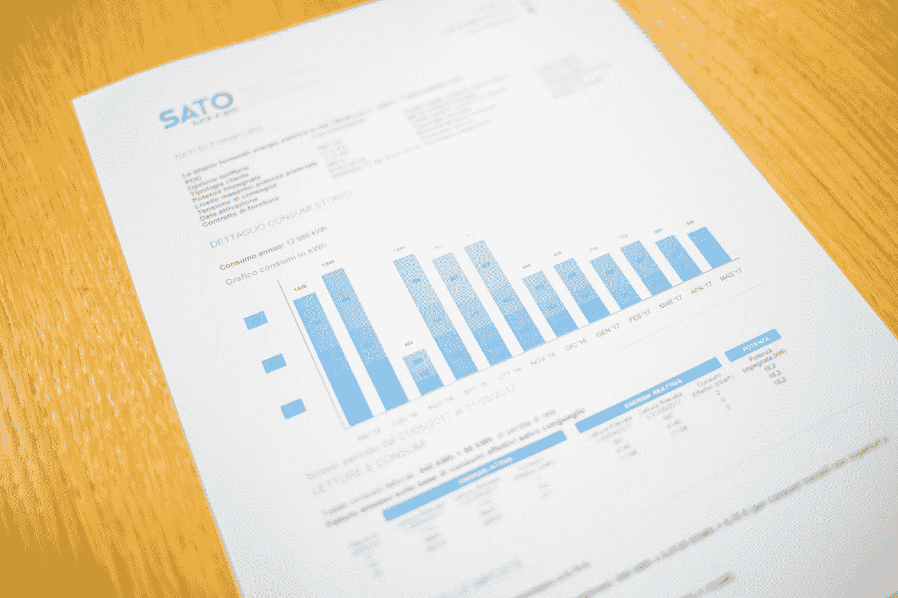
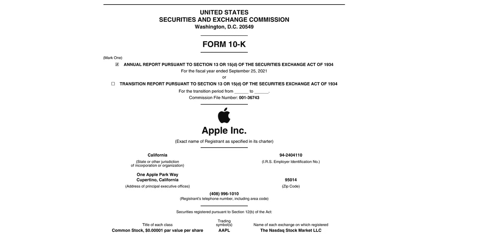
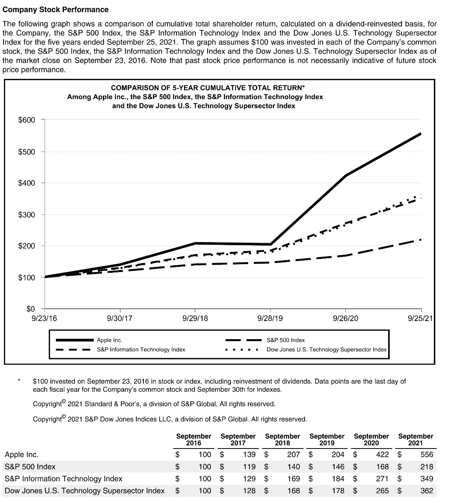
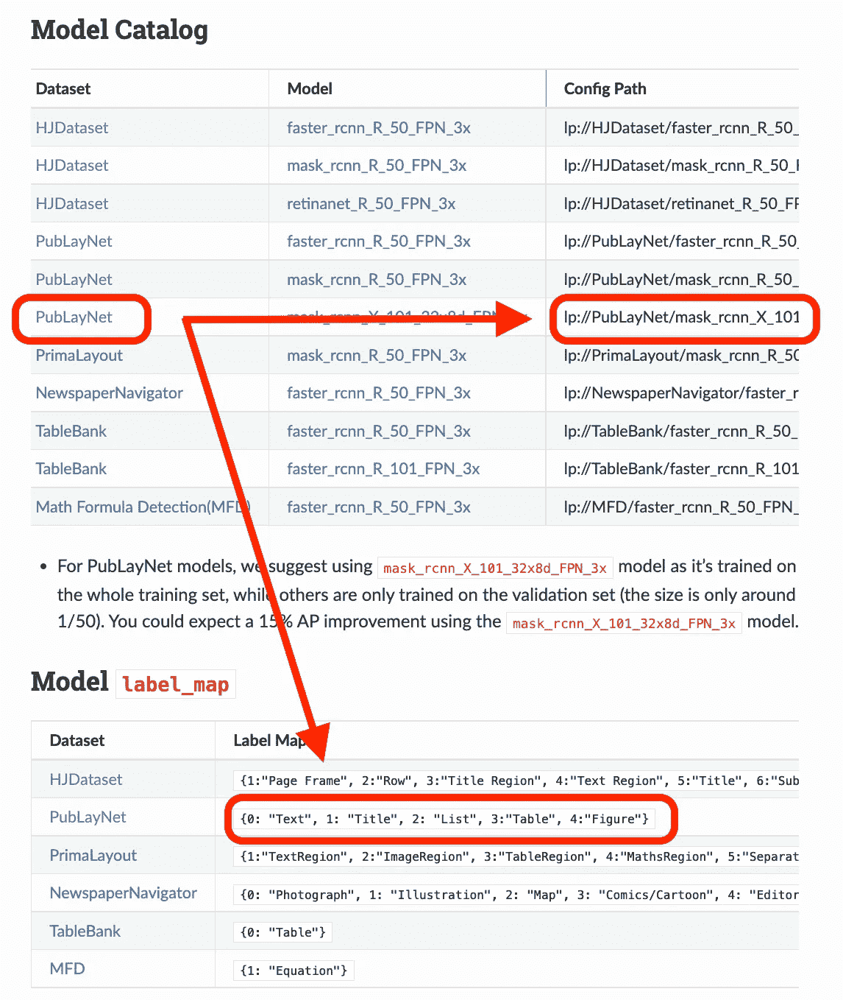
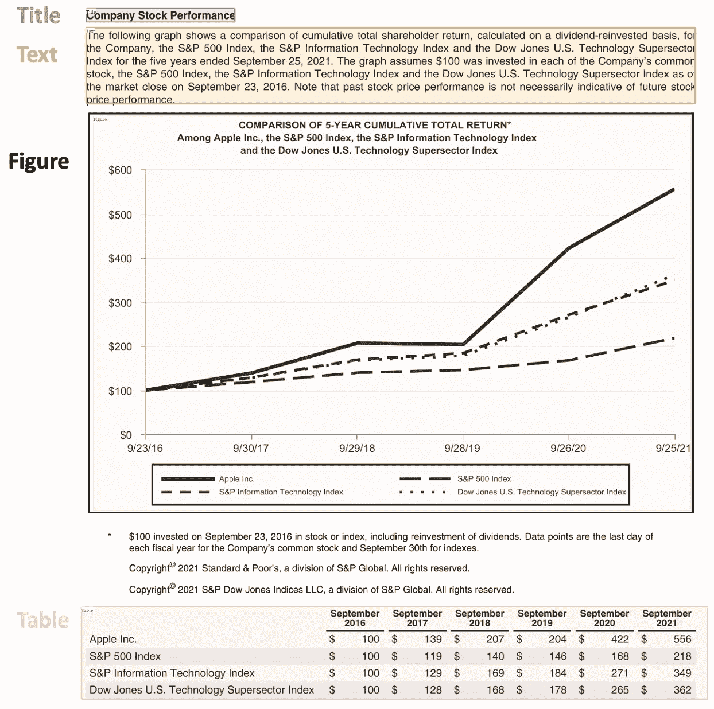
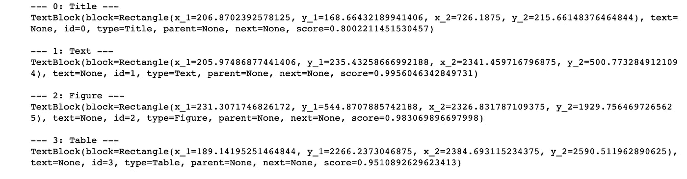
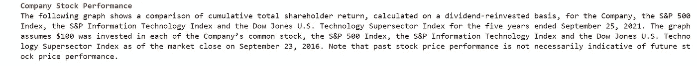
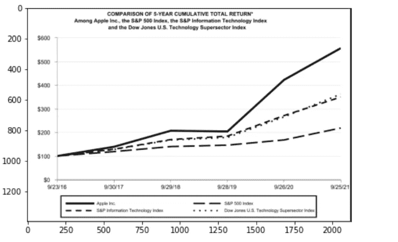
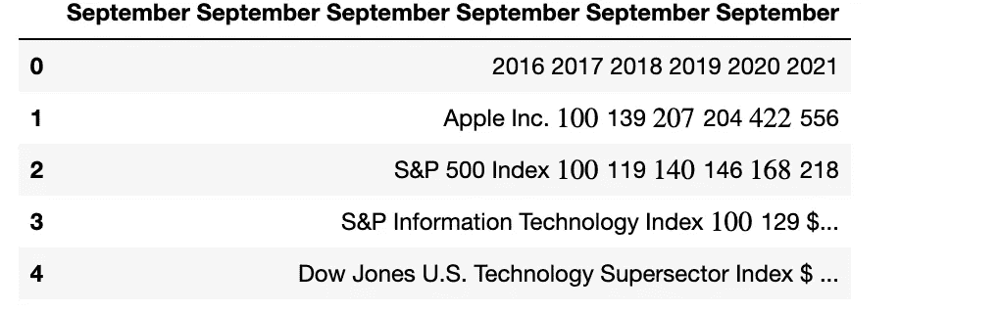
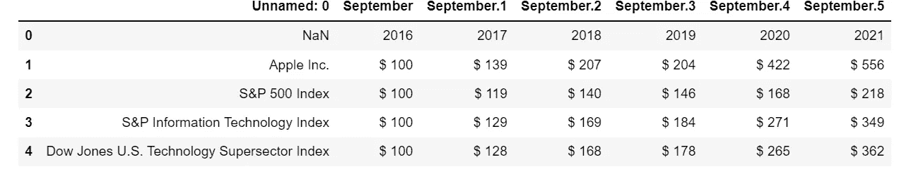

# 使用 Python 和 OCR 进行文档解析

> 原文：<https://towardsdatascience.com/document-parsing-with-python-ocr-75543448e581>


作者图片

## 使用计算机视觉从任何类型的文档中检测和提取文本、图形、表格

## 摘要

在本文中，我将使用 Python 和计算机视觉展示如何解析文档，比如*pdf、*并提取信息。



由[乔治·托马塞蒂](https://unsplash.com/@gtomassetti?utm_source=medium&utm_medium=referral)在 [Unsplash](https://unsplash.com?utm_source=medium&utm_medium=referral) 上拍摄的照片

[**文档解析**](https://en.wikipedia.org/wiki/Parsing) 涉及检查文档中的数据，提取有用的信息。这对公司来说是必不可少的，因为它减少了大量的手工工作。想象一下，必须手动搜索 100 页的表格，然后将它复制并粘贴到其他地方……如果有一个程序可以在 1 秒钟内完成，那该有多酷？

一种流行的解析策略是将文档转换成图像并使用计算机视觉。 [**文档图像分析**](https://en.wikipedia.org/wiki/Document_layout_analysis) 是指应用于文档图像以从像素数据中获取信息的技术。这可能很棘手，因为在一些情况下，对于预期的结果应该是什么样子(文本、图像、图表、数字、表格、公式……)没有明确的答案。最常用的技术是 OCR。

[**【OCR(光学字符识别)**](https://en.wikipedia.org/wiki/Optical_character_recognition) 是通过计算机视觉检测并提取图像中文字的过程。它是在第一次世界大战期间发明的，当时以色列科学家伊曼纽尔·戈德堡创造了一种可以阅读字符并将其转换成电报代码的机器。今天，该领域已经达到了非常高的复杂程度，混合了图像处理、文本定位、字符分割和字符识别。基本上是一种文本对象检测。

在本教程中，我将展示如何使用 OCR 进行文档解析。我将展示一些有用的 Python 代码，这些代码可以很容易地用于其他类似的情况(只需复制、粘贴、运行)，并通过注释遍历每一行代码，这样您就可以很容易地复制这个示例(下面是完整代码的链接)。

<https://github.com/mdipietro09/DataScience_ArtificialIntelligence_Utils/blob/master/computer_vision/example_ocr_parsing.ipynb>  

我将用一家上市公司的 *PDF* 格式的财务报表作为例子(下面的链接)。

[链接](https://s2.q4cdn.com/470004039/files/doc_financials/2021/q4/_10-K-2021-(As-Filed).pdf)

特别是，我将经历:

*   环境设置:导入包、读取数据、预处理
*   检测(文本、图形、表格)
*   摘录(文本、图表、表格)

## 设置

文档解析令人烦恼的地方在于，有如此多的工具可以处理不同类型的数据(文本、图形、表格),但没有一个能够完美地工作。以下是基于人们想要遵循的策略的最流行的包的当前框架:

*   **将文档处理为文本**:用 [*PyPDF2*](https://pypdf2.readthedocs.io/en/latest/) 提取文本，用 [*Camelot*](https://github.com/camelot-dev/camelot) 或[*tabulopy*](https://github.com/chezou/tabula-py)提取表格，用 [*PyMuPDF*](https://pymupdf.readthedocs.io/en/latest/index.html) 提取数字。
*   **将文档转换为图像(OCR)** :用 [*pdf2image*](https://github.com/Belval/pdf2image) 进行转换，用[*pytesserac*](https://github.com/madmaze/pytesseract)*加上其他很多支持库，或者只是 [*LayoutParser*](https://github.com/Layout-Parser/layout-parser) 提取数据。*

*也许你会问自己:“*为什么要麻烦地将页面转换成图像，而不是直接处理 PDF 文件？”。你可以这么做*。*这种策略的主要缺点是编码方案:文档可以有多种编码(如 UTF 8、ASCII、Unicode)，因此转换成文本可能会导致数据丢失。因此，为了避免任何问题，我将使用 OCR 并用 ***pdf2image*** 将页面转换成图像。请注意， *PDF* 渲染库[***Poppler***](https://poppler.freedesktop.org/)*需要运行。***

```
****# with pip**
pip install python-poppler
**# with conda** conda install -c conda-forge poppler**
```

**您可以轻松阅读该文档:**

```
****# READ AS IMAGE**
import **pdf2image**doc = pdf2image.convert_from_path("doc_apple.pdf")
len(doc) **#<-- check num pages** doc[0]   **#<-- visualize a page****
```

****

**作者图片**

**如果要在计算机上保存页面图像，可以使用下面的代码:**

```
****# Save imgs** import **os**folder = "doc"
if folder not in os.listdir():
    os.makedirs(folder)p = 1
for page in doc:
    image_name = "page_"+str(p)+".jpg"  
    page.save(os.path.join(folder, image_name), "JPEG")
    p = p+1**
```

**最后，我们需要设置我们将使用的 CV 引擎。 ***LayoutParser*** 似乎是第一个针对 OCR 的通用包，基于深度学习。它使用两个著名的任务模型:**

*   **检测:[***Detectron***](https://github.com/facebookresearch/detectron2)，脸书最先进的物体检测库(我们将使用第二版 *Detectron2* )。**

```
**pip install layoutparser torchvision && pip install "git+https://github.com/facebookresearch/detectron2.git@v0.5#egg=detectron2"**
```

*   **提取: [***宇宙魔方***](https://github.com/tesseract-ocr/tesseract) ，主要的 OCR 系统，由惠普于 1985 年创建，目前由谷歌开发。我们还必须下载软件，StackOverflow 上的这个[帖子](https://stackoverflow.com/questions/50951955/pytesseract-tesseractnotfound-error-tesseract-is-not-installed-or-its-not-i)解释了如何为不同的操作系统下载软件。**

```
**pip install "layoutparser[ocr]"**
```

**现在，我们已经准备好开始信息检测和提取的 OCR 过程。**

```
**import **layoutparser** as lp
import **cv2** import **numpy** as np
import **io**
import **pandas** as pd
import **matplotlib**.pyplot as plt**
```

## **侦查**

**[(物体)检测](https://en.wikipedia.org/wiki/Object_detection)是在一张图片中寻找多条信息，然后用一个长方形的包围盒将其包围起来的过程。对于文档解析，这些信息是标题、文本、图表、表格…**

**因此，让我们来看一个包含所有内容的复杂页面:**

****

**第 22 页(作者图片)**

**这个页面以一个标题开始，有一个文本块，后面是一个图和一个表，所以我们需要一个经过训练的模型来识别这些对象。幸运的是 *Detectron* 能够胜任这项任务，你只需要从[这里](https://layout-parser.readthedocs.io/en/latest/notes/modelzoo.html#example-usage)选择一个模型，并在代码中指定它的路径。**

****

**作者图片**

**我将要使用的模型只能检测这 4 个对象(文本、标题、列表、表格、图形)。因此，如果你需要识别其他东西(比如方程式)，你必须改变模型。**

```
****## load pre-trained model**
model = lp.Detectron2LayoutModel(
   **"lp://PubLayNet/mask_rcnn_X_101_32x8d_FPN_3x/config",**
   extra_config=["MODEL.ROI_HEADS.SCORE_THRESH_TEST", 0.8],
   label_map={0:"Text", 1:"Title", 2:"List", 3:"Table", 4:"Figure"})**## turn img into array** i = 21
img = np.asarray(doc[i])**## predict** detected = model.detect(img)**## plot** lp.draw_box(img, detected, box_width=5, box_alpha=0.2, 
            show_element_type=True)**
```

****

**作者图片**

**预测对象“*检测到”*包含每个检测到的布局的细节，如边界框的坐标。根据输出在页面上出现的顺序对其进行排序非常有用:**

```
****## sort**
new_detected = detected.sort(key=lambda x: x.coordinates[1])**## assign ids**
detected = lp.Layout([block.set(id=idx) for idx,block in 
                      enumerate(new_detected)])**## check** for block in detected:
    print("---", str(block.id)+":", block.type, "---")
    print(block, end='\n\n')**
```

****

**作者图片**

**完成 OCR 的下一步是正确提取边界框内的信息。**

## **提取，血统**

**为了帮助 OCR 模型，通常使用边界框分割图像，然后使用模型处理分割的图像。最后，我将把提取的输出保存到一个字典中。**

**由于我们看到不同类型的输出(文本、标题、图形、表格)，我将准备一个函数来显示结果。**

```
****'''
{'0-Title': '...',
 '1-Text':  '...', 
 '2-Figure': array([[ [0,0,0], ...]]),
 '3-Table': pd.DataFrame,
}
'''**
def **parse_doc**(dic):
    for k,v in dic.items():
        if "Title" in k:
            print('\x1b[1;31m'+ v +'\x1b[0m')
        elif "Figure" in k:
            plt.figure(figsize=(10,5))
            plt.imshow(v)
            plt.show()
        else:
            print(v)
        print(" ")**
```

**让我们用**文本**来试试:**

```
****# load model**
model = lp.TesseractAgent(languages='eng')dic_predicted = {}for block in [block for block in detected if block.type in [**"Title","Text"**]]:
    ***## segmentation***
    segmented = block.pad(left=15, right=15, top=5, 
                bottom=5).crop_image(img)
    ***## extraction***
    extracted = model.detect(segmented)
    ***## save***
    dic_predicted[str(block.id)+"-"+block.type] = 
                  extracted.replace('\n',' ').strip()**# check**
parse_doc(dic_predicted)**
```

****

**作者图片**

**继续关注**人物**:**

```
**for block in [block for block in detected if block.type == "**Figure**"]:
    ***## segmentation***
    segmented = block.pad(left=15, right=15, top=5, 
                          bottom=5).crop_image(img)
    ***## save***
    dic_predicted[str(block.id)+"-"+block.type] = segmented**# check**
parse_doc(dic_predicted)**
```

****

**作者图片**

**很好，但是那相对容易，**桌子**就难多了。尤其是示例中的这个，因为它没有垂直线来分隔列，而列名在单独的行上。**

```
**for block in [block for block in detected if block.type == "**Table**"]:
    ***## segmentation***
    segmented = block.pad(left=15, right=15, top=5, 
                bottom=5).crop_image(img)
    ***## extraction***
    extracted = model.detect(segmented)
    ***## save***
    dic_predicted[str(block.id)+"-"+block.type] = pd.read_csv( 
                 io.StringIO(extracted) )**# check**
parse_doc(dic_predicted)**
```

****

**作者图片**

**如您所见，提取出的表格并不好。没有 OCR 会不会不一样？让我们尝试在不将文档转换成图像的情况下处理它。我将使用 ***TabulaPy*** 包:**

```
**import **tabula**
tables = tabula.read_pdf("doc_apple.pdf", pages=i+1)
tables[0]**
```

****

**作者图片**

**结果稍微好一点，因为现在表有列了，即使名称仍然是错误的。**

## **结论**

**这篇文章是演示如何用 OCR 执行文档解析的教程。我用 *LayoutParser* 包走了一遍检测和提取的全过程。我展示了如何处理 *PDF* 文档中的文本、图表和表格。**

**我希望你喜欢它！如有问题和反馈，或者只是分享您感兴趣的项目，请随时联系我。**

> **👉[我们来连线](https://linktr.ee/maurodp)👈**

> **本文是 Python 系列 **CV 的一部分，参见:****

**</how-to-detect-objects-with-your-webcam-82693c47bd8>  <https://pub.towardsai.net/image-classification-with-python-cnn-vs-transformers-fe509cbbc2d0> **