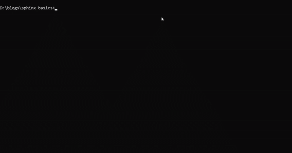
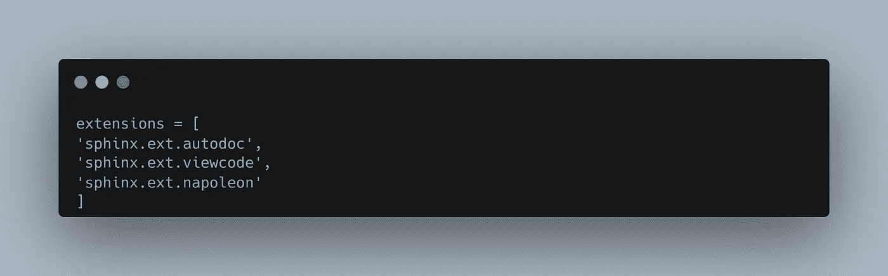
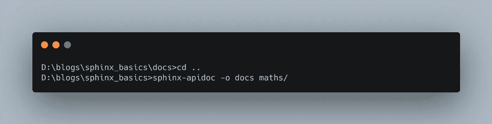
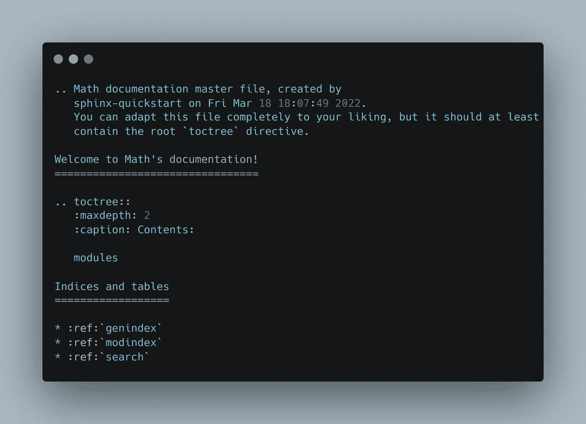
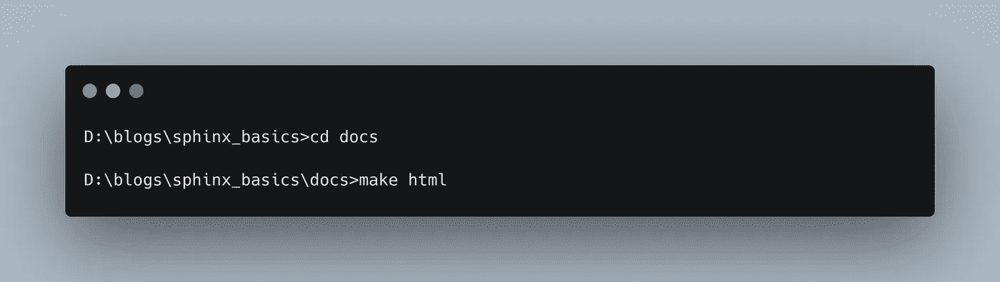
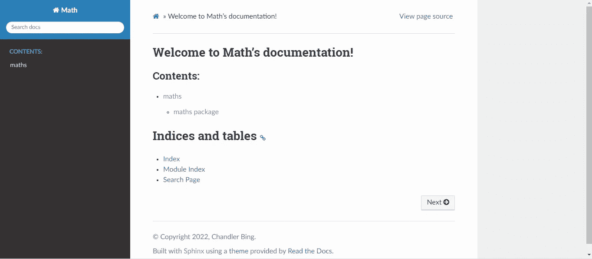
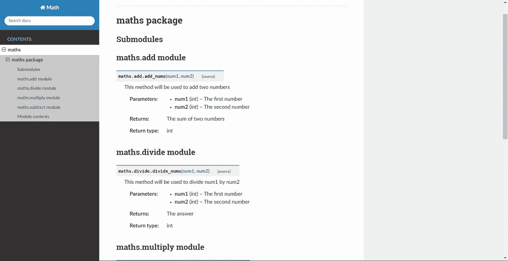
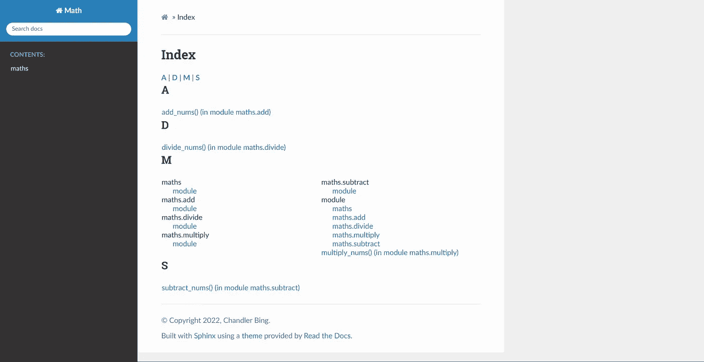

# 用 Sphinx 记录 Python 代码

> 原文：<https://towardsdatascience.com/documenting-python-code-with-sphinx-554e1d6c4f6d>


照片由 [Patrik Fore](https://unsplash.com/@patrickian4) 发自 U[n spash](https://unsplash.com/photos/59lC6TgZAbQ)

当从事一个需要在特定时间框架内完成的项目时，除了代码审查、自动化测试、单元测试和许多其他事情，我们很少有时间留给文档。不管你在开发什么，迟早你和你的同事会再次访问那段代码。当这一天到来时，我们大多数人都将迷失在这些代码块中！

由于耗费时间，文档被省略了，但是如果所有这些都可以自动化，并且只需一瞥，您就可以生成一个漂亮的网站来记录您的全部代码，那会怎么样呢？这就是斯芬克斯的用武之地！

***什么是斯芬克斯？***

简而言之，狮身人面像吸收了你的。rst 文件并将其转换为 HTML，所有这些都是通过一堆命令完成的！像 [Django](https://docs.djangoproject.com/en/4.0/) 、 [NumPy](https://numpy.org/doc/stable/reference/) 、 [SciPy](https://docs.scipy.org/doc/scipy/reference/) 、 [Scikit-Learn](https://scikit-learn.org/stable/) 、 [Matplotlib](https://matplotlib.org/) 等主要 Python 库都是用 Sphinx 编写的。现在，轮到我们使用它了，让我们开始吧。

***安装斯芬克斯:***

```
pip install sphinx sphinx_rtd_theme
```

这将安装 sphinx 包和主题*(可选)*，这将使我们的网站大放异彩。

***文件夹结构:***

首先，你可以克隆我的 [Github 库](https://github.com/Raxy45/sphinx_basics)，它的结构如下。在其中，数学存放了我们的 python 代码，这些代码需要进行文档化，我们的文档将放在 docs 文件夹中。

```
📦sphinx_basics
 ┣ 📂docs
 ┗ 📂maths
 ┃ ┣ 📜add.py
 ┃ ┣ 📜divide.py
 ┃ ┣ 📜multiply.py
 ┃ ┣ 📜subtract.py
 ┃ ┗ 📜__init__.py
```

一般来说，这是使用的惯例，你的代码将在一个源目录中(在我们的例子中是数学目录), docs 将存放你的文档。既然你已经装好了。遵循以下给出的步骤:

***第一步:斯芬克斯-快速入门***

在 docs 文件夹中运行下面的命令

```
sphinx-quickstart
```

运行该命令后，接受默认值。它看起来会像这样:



sphinx 快速入门示例

*sphinx-quickstart* 是一个交互式工具，它询问一些关于您的项目的问题，然后生成一个完整的文档目录和一个`make.bat`文件，稍后将使用该文件生成 HTML。

***第二步:编辑 conf.py 文件***

转到您的`conf.py`文件，取消第 13、14 和 15 行的注释。将`os.path.abspath('.')`改为`os.path.abspath('..')`。这里，我们告诉 sphinx 代码位于当前 docs 文件夹之外。

现在转到扩展部分，添加下面给出的扩展



更新的扩展列表

最后，进入主题，将“雪花石膏”替换为“斯芬克斯 rtd 主题”，完整的更新后的`conf.py`文件如下所示:

最终 conf.py 文件

***第三步:生成。rst 文件***

到目前为止，您的 docs 文件夹中有`index.rst`，这将是您的文档的登录页。但是我们还没有生成`maths.rst`，里面有我们的 python 代码。

转到父文件夹 sphinx_basics，运行命令:

```
sphinx-apidoc -o docs maths/
```



在这个命令中，我们告诉 sphinx 从 maths 文件夹中获取我们的代码，并输出生成的。docs 文件夹中的 rst 文件。在这个命令之后，您将看到在您的文档中生成的`maths.rst`和`modules.rst`。

***第四步:包含 module.rst 并生成 html***

现在，将生成的`modules.rst`文件包含在您的`index.rst`中



[index.rst](https://gist.github.com/Raxy45/ea71369fa0345113534b2911ea667557) 文件

然后我们就可以生成漂亮的文档了，进入 docs 文件夹并运行命令

```
make html
```



就是这样！！！。您可以在 docs 中的 _build 文件夹中看到生成的 HTML 文件，该 HTML 文件如下所示



文档网站的登录页面



数学包

此外，除此之外，您还可以在搜索页面上搜索任何方法、子包等



搜索页面

就是这样！Sphinx 完成了创建 HTML 文档的所有繁重工作。

现在，假设您对代码做了一些更改，现在您想重新构建 HTML，请转到 docs 文件夹并编写

```
make clean html
```

然后

```
make html
```

这将重新构建您的 HTMLs，同时考虑您的更改。

还有，你可以改变[主题](https://sphinx-themes.org/#themes)，尝试不同的；通过格式化文档字符串和更多的东西来改变文档格式！

耶！我们成功地自动化了催眠文档部分。希望这篇文章对你有所帮助，你可以随时记录下你的下一个项目🚀