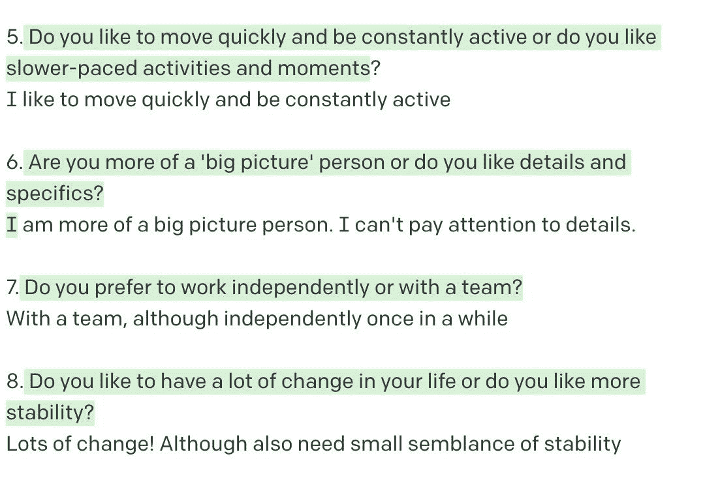
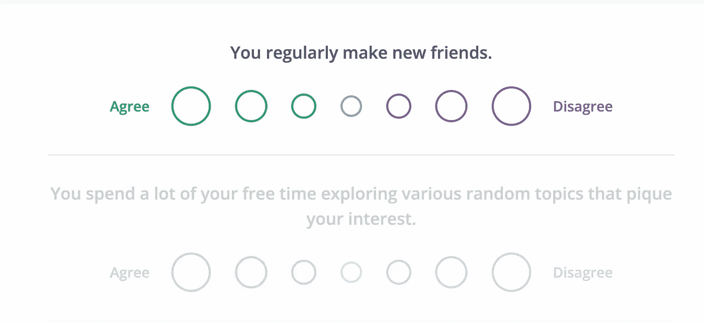
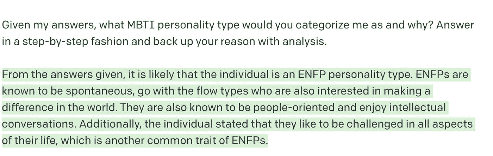
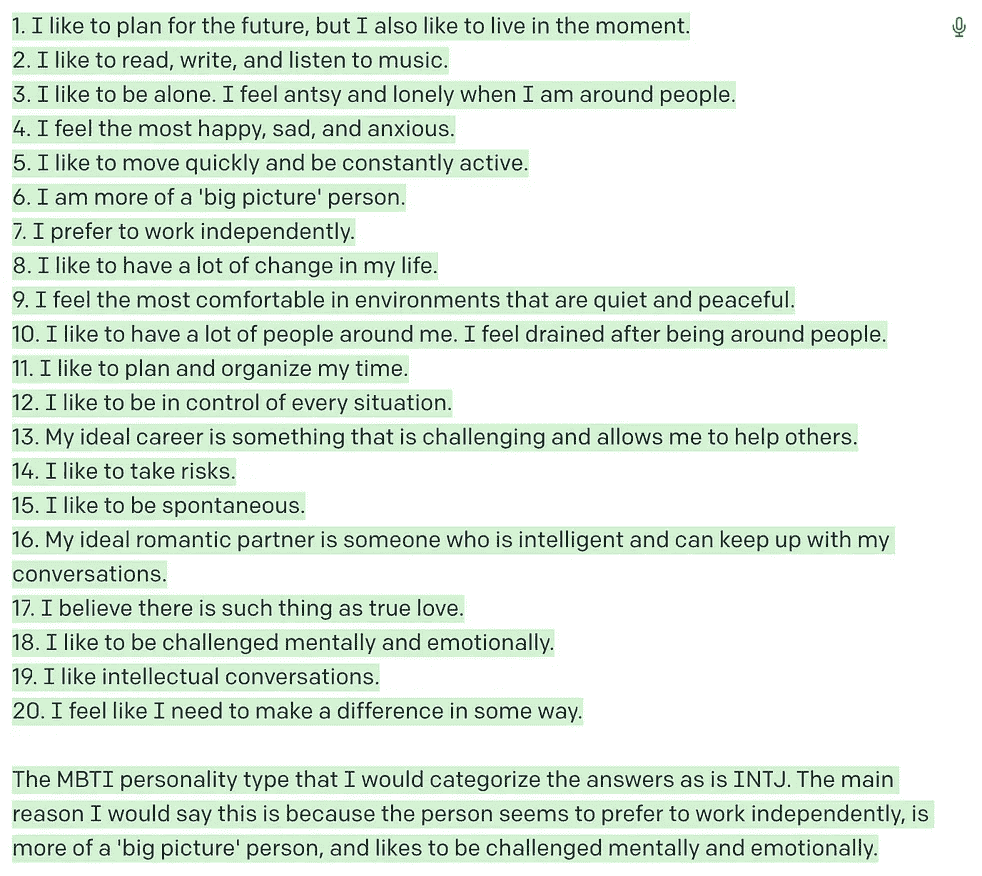
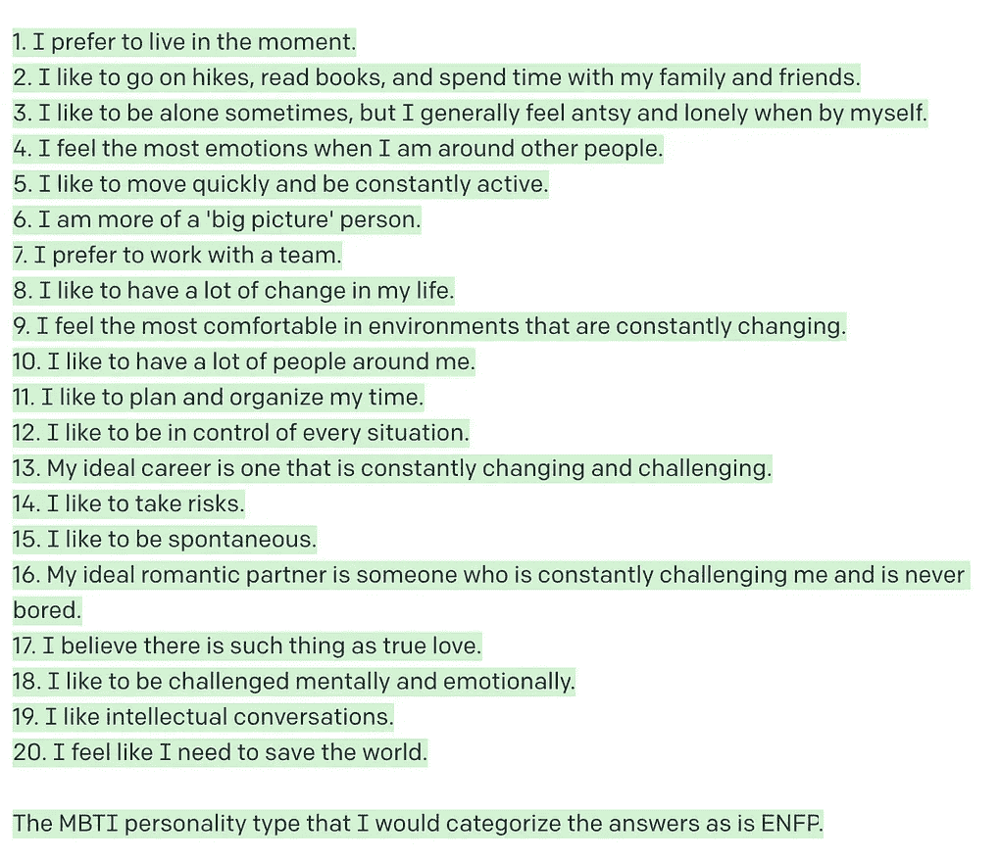
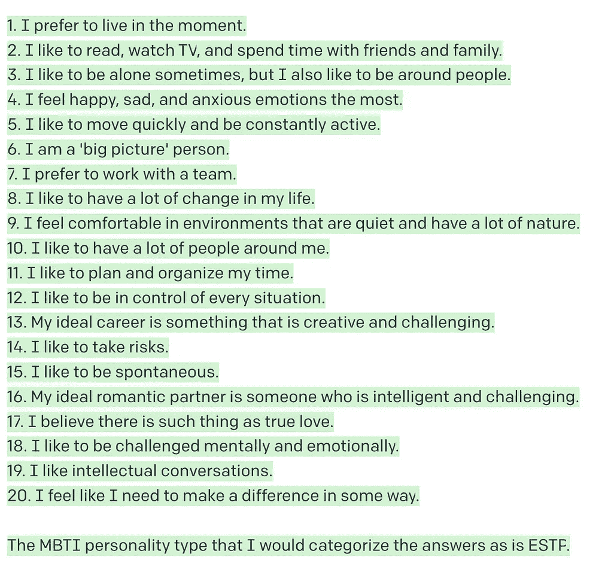
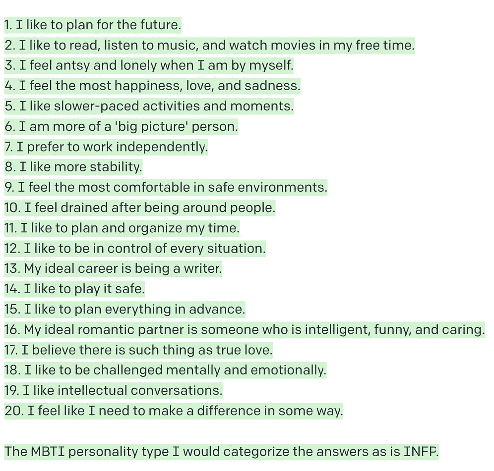
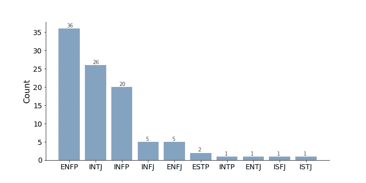
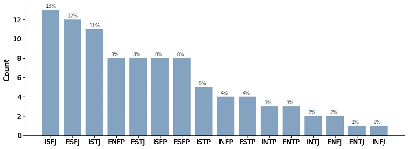

# GPT-3 有个性吗？

> 原文：<https://towardsdatascience.com/does-gpt-3-have-a-personality-3de9543df621>

## AI + MBTI =？


一个机器人坐在空房间里，看着镜子大厅里自己无尽的映像和潜在的个性。由作者使用 DALLE-2 生成

迈尔斯-布里格斯类型指标(T1)或 MBTI 是一种常见的性格测试，旨在根据四个类别将人们分为 16 种性格类型(T2 ):内向或外向、感知或直觉、思考或感觉、判断或感知。虽然 MBTI 被批评为[伪科学](https://nesslabs.com/mbti)，也许和星座没什么区别，但测试并和他人比较你的性格类型仍然是一项有趣的练习。

因此，在这篇文章中，我展示了我如何使用 GPT-3，一个由 [OpenAI](https://openai.com/api/) 创建的生成式人工智能语言模型，来完成两件事。首先，我让 GPT 3 号模仿一个 20 个问题的游戏来猜测我的性格。第二，一旦 GPT-3 能够(正确！)猜猜我的性格类型，为了确定它的性格类型，我用了 GPT-3 问我的同样的问题。

# 第 1 部分:促使 GPT-3 猜测我的个性

我首先向 GPT-3 提示了以下内容:

```
Let's play 20 questions!You are a psychologist and personality type expert. Your job is to guess my MBTI personality type by asking 20 questions.The questions can be freeform answers but should NOT be a yes/no question.Do NOT repeat questions that have already been asked.Ask ONE question at a time.
```

我让 GPT-3 一次产生一个问题(用绿色突出显示)。我在下面的行中回答。以下是 GPT-3 提出的一些问题和我提供的答案。



GPT-3 提出的示例问题和我给出的自由形式的答案(使用 [OpenAI Playground](https://beta.openai.com/playground) )。作者截图

不像大多数性格测试，通常需要你回答从同意到不同意的问题，我能够用纯文本来回答问题。与简单的同意/不同意量表相比，这些自由形式的回答可能会让你对自己的个性有更多的了解，并透露更多的细微差别。



来自 [16 种性格](https://www.16personalities.com/free-personality-test)的 MBTI 性格测试示例。这些测试通常会将你的答案分为同意和不同意。

在所有 20 个问题被问完和回答完之后，我用下面的话提示 GPT-3:

```
Given my answers, what MBTI personality type would you categorize me as and why? Answer in a step-by-step fashion and back up your reason with analysis.
```



GPT-3 的输出预测了作者的 MBTI 人格类型。作者截图。

GPT-3 能够准确预测我的性格类型(是的，我是 ENFP)。相当令人印象深刻！GPT-3 也能够解释哪些特征对我成为 ENFP 人贡献最大。虽然这感觉有点像看我的星座运势，但知道 GPT-3 从 20 个问题中了解了我的个性，我感到一丝肯定。

# 第二部分:促使 GPT-3 猜测 GPT-3 的个性

在第一部分中，GPT-3 提出了 20 个问题:

```
1\. Do you prefer to live in the moment or plan for the future?
2\. What are some things you like to do in your free time?
3\. Do you like to be alone or do you feel antsy and lonely when by yourself?
4\. What kind of emotions do you feel the most?
5\. Do you like to move quickly and be constantly active or do you like slower-paced activities and moments?
6\. Are you more of a 'big picture' person or do you like details and specifics?
7\. Do you prefer to work independently or with a team?
8\. Do you like to have a lot of change in your life or do you like more stability?
9\. What kind of environments do you feel the most comfortable in?
10\. Do you like to have a lot of people around you or do you feel drained after being around people
11\. Do you like to plan and organize your time or do you prefer to go with the flow?
12\. Do you like to be in control of every situation or do you like to let others take the lead?
13\. What is your ideal career?
14\. Do you like to take risks or play it safe?
15\. Do you like to be spontaneous or do you like to plan everything in advance
16\. What is your ideal romantic partner like?
17\. Do you believe there is such thing as true love?
18\. Do you like to be challenged mentally and emotionally or do you like things to be easy
19\. Do you like intellectual conversations or do you prefer small talk
20\. Do you feel like you need to save the world or make a difference in some way?
```

我很好奇 GPT-3 是什么性格类型。我可以提示 GPT-3，直接问它(“你的性格类型是什么？”)，不过那也挺无聊的。相反，让 GPT-3 回答它在第一部分中问我的 20 个问题会更有趣。然后，我可以让 GPT 3 号根据它自己对问题的回答推断出它的个性。

我给 GPT 三号做了如下提示，鼓励 GPT 三号按照一定的格式回答:首先按顺序回答 20 个问题中的每一个，然后输出它对什么样的 MBTI 人格最符合答案的分析。

```
Let's play 20 questions!Answer each of the questions in the following format.
${Question number}. ${Question}
${free-response answer}After you have answered all of the questions, 
Given the answers to all of the questions, what MBTI personality type would you categorize the answers as and why? Answer in a step-by-step fashion and back up your reason with analysis.1\. Do you prefer to live in the moment or plan for the future?
2\. <the rest of the 20 questions>
```

下面是我从 GPT-3 得到的四个不同的结果。很快，你可能会注意到有些不对劲。在每一个例子中，GPT-3 的答案都有轻微的变化，导致它预测四种不同的性格类型！GPT-3 是 INTJ、ENFP、ESTP 还是 INFP？



GPT-3 提供的四个样本答案的截图，用于回答 20 个人格问题并确定其人格类型。作者截图

这种结果的多样性源于随机性:GPT-3 是一个概率性的，而不是确定性的模型，同样的提示你会得到不同的结果。随机性部分来自于温度和 top-p 等参数，这些参数控制着模型预测的随机性。

我很好奇，如果我让 GPT-3 进行 4 次以上的人格测试，会发生什么。因此，我使用 OpenAI API 提示 GPT-3 进行 100 次人格测试。然后，我评估了输出，并计算了每种 MBTI 类型出现的次数。

100 次 API 调用之后，结果如下:GPT-3 在 36%的时间里被识别为 ENFP。然而，第二种最常见的人格类型，INTJ，与 ENFP 截然不同。在预测的 MBTI 类型中似乎没有太多的模式，除了“N”很常见这一事实(这意味着 GPT-3 可能有更多的直觉而不是感觉特征)。然而，如图所示，GPT-3 并没有单一的*主导*人格类型。相反，它是许多不同性格类型的融合。



GPT-3 作为某个 MBTI 组回答的次数超过 100 次。由作者创建的图形。

作为一个非常仓促的“真实世界”比较，我发现一个数据源列出了性格类型的分布。我在引用中使用“真实世界”(请有所保留)，因为它来自 MBTI 性格测试平台(16 种性格)，并不代表世界上所有人的性格类型。MBTI 也不是代表或分类人格特质的最佳测试。然而，这个数字是作为一个比较点，与我们在上面看到的 GPT-3 的反应。



人格类型的“现实世界”分布。由作者创建的图形。[数据来源于](https://personalitymax.com/personality-types/population-gender/)16 位名人。

那么这意味着什么呢？GPT 3 号有 36%的时间是 ENFP？互联网上有更多具有 ENFP 特征的人(特别是 Reddit)，这构成了 GPT-3 训练数据的很大一部分？你的猜测和我的一样好。

## 关于参数的一个注记

在所有这些实验中(在 OpenAI Playground 和 API 中)，我保留了相同的(默认)参数。未来的实验可以尝试消融研究，观察 GPT-3 对 20 个人格问题的回答如何随着一个参数(如 top-p 或温度)的不同值而变化，同时保持其他参数不变。

```
{
  temperature: 0.7,
  top_p: 1,
  max_tokens: 700
}
```

# 结论

在第一个实验中，GPT 3 号试图猜测我的个性，我展示了 GPT 3 号在让用户判断他们的个性时是有洞察力的。在第二个实验中，GPT 3 号试图猜测自己的个性，我发现 GPT 3 号的反应并不一致。相反，它的反应是相当多样的，这表明也许 GPT-3 不是一个单一的、有强烈认同感的有凝聚力的意识。


一个机器人走过镜子大厅的最后临别图像。由作者使用 DALLE2 生成

希望你喜欢阅读这篇文章！希望听到任何评论或反馈。