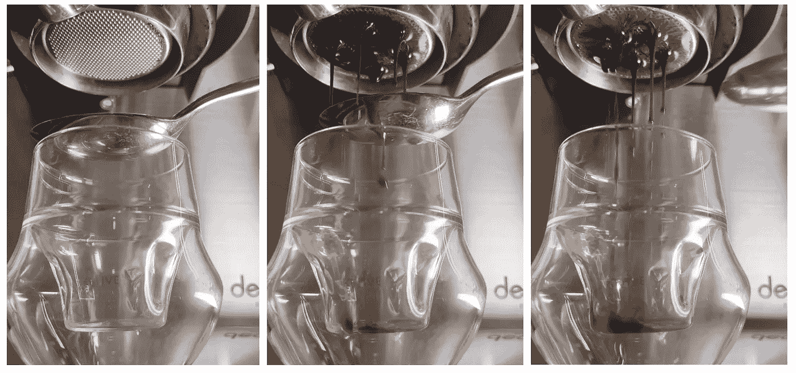
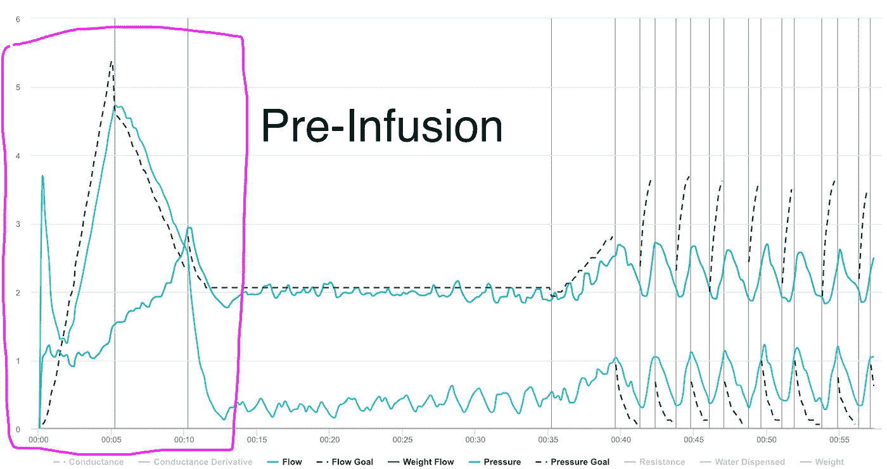
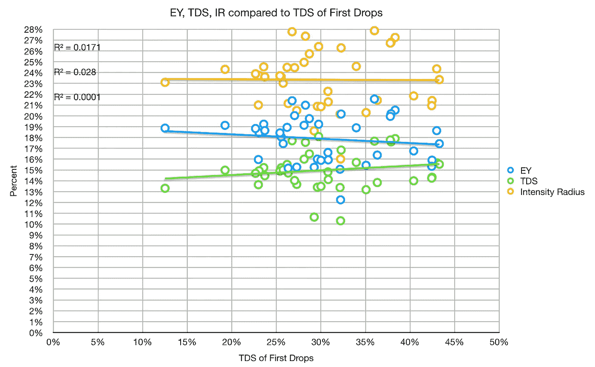

# 最初的咖啡萃取能预测最终的萃取吗？

> 原文：<https://towardsdatascience.com/does-initial-coffee-extraction-predict-final-extraction-6be5487a306>

## 咖啡数据科学

## 收集数据，一次一汤匙

最近，我买了一个像样的咖啡机。这对我来说是一个很大的变化，因为通常，我在手柄上有一个手柄，可以从我的 Kim Express 杠杆机器上拍摄。有了这只新的空出来的手，我很好地利用了它来收集最初的样本:最初的几滴。

我根据一些指标对我的档案进行了修改，经过几轮修改后，我决定一次做几件事。有些是时间，但最终的衡量标准是提取率。我从理论上讲，如果我品尝了最初几滴浓缩咖啡，我可以修改预冲泡，以获得最佳的预冲泡效果。我想这些滴剂可能有助于预测我是否在改善预输注方面做得更好。

# 草案

这是我每次拍摄时使用的协议:

1.  拿着勺子收集最初的几滴
2.  立即倒入杯中。这可能会在勺子上留下一些可溶物。
3.  称一下杯子
4.  使用等量的水进行滴定
5.  测量 TDS 并乘以 2 以说明滴定。

# 设备/技术

[浓缩咖啡机](/taxonomy-of-lever-espresso-machines-f32d111688f1):体面浓缩咖啡机(DE1Pro)

咖啡研磨机:[小生零](/rok-beats-niche-zero-part-1-7957ec49840d)

咖啡:[家庭烘焙咖啡](https://rmckeon.medium.com/coffee-roasting-splash-page-780b0c3242ea)，中杯(第一口+ 1 分钟)

镜头准备:[断奏](https://medium.com/overthinking-life/staccato-espresso-leveling-up-espresso-70b68144f94)和[内外断奏](/inside-out-staccato-espresso-f836fddc0bd1)

[预输注](/pre-infusion-for-espresso-visual-cues-for-better-espresso-c23b2542152e):瞄准一个较长的大约 25 秒的时间

输液:[压力脉动](/pressure-pulsing-for-better-espresso-62f09362211d)

[过滤篮](https://rmckeon.medium.com/espresso-baskets-and-related-topics-splash-page-ff10f690a738) : 20g VST

其他设备: [Atago TDS 计](/affordable-coffee-solubility-tools-tds-for-espresso-brix-vs-atago-f8367efb5aa4)、 [Acaia Pyxis 秤](/data-review-acaia-scale-pyxis-for-espresso-457782bafa5d)、 [Kruve 筛](https://www.kruveinc.com/pages/kruve-sifter)

# 绩效指标

我使用三个[指标](/metrics-of-performance-espresso-1ef8af75ce9a)来评估数据:

</coffee-solubility-in-espresso-an-initial-study-88f78a432e2c>**用折射仪测量总溶解固体量(TDS)，这个数字结合弹丸的输出重量和咖啡的输入重量用来确定提取到杯中的咖啡的百分比，称为**提取率(EY)** 。**

****强度半径(IR)** 定义为 TDS 对 EY 的控制图上原点的半径，所以 IR = sqrt( TDS + EY)。这一指标有助于标准化产量或酿造比的击球性能。**

# **数据分析**

**我收集了 45 个样本，同时浏览了 22 个配置文件。每个配置文件都有多次更改。根据这个数据，前几滴的 TDS 似乎没有什么趋势。**

****

**部分原因可能是最初的几滴并不总是来自同一个地方。如果它们来自篮子的侧面，它可能没有中间的强度大。**

**我不认为这是决定性的证据，证明最初的几滴不能预测一杯浓缩咖啡的最终表现。我的许多镜头都有一些环形提取(在冰球中间较慢的流动)，这在不同的镜头之间有所不同。如果圆盘上的提取变得更加均匀，那么再次测试这个指标可能会很有意思。**

**如果你愿意，请在 [Twitter](https://mobile.twitter.com/espressofun?source=post_page---------------------------) 、 [YouTube](https://m.youtube.com/channel/UClgcmAtBMTmVVGANjtntXTw?source=post_page---------------------------) 和 [Instagram](https://www.instagram.com/espressofun/) 上关注我，我会在那里发布不同机器上的浓缩咖啡照片和浓缩咖啡相关的视频。也可以在 [LinkedIn](https://www.linkedin.com/in/dr-robert-mckeon-aloe-01581595) 上找到我。也可以在[中](https://towardsdatascience.com/@rmckeon/follow)和[订阅](https://rmckeon.medium.com/subscribe)关注我。**

# **[我的进一步阅读](https://rmckeon.medium.com/story-collection-splash-page-e15025710347):**

**[我未来的书](https://www.kickstarter.com/projects/espressofun/engineering-better-espresso-data-driven-coffee)**

**[我的链接](https://rmckeon.medium.com/my-links-5de9eb69c26b?source=your_stories_page----------------------------------------)**

**[浓缩咖啡系列文章](https://rmckeon.medium.com/a-collection-of-espresso-articles-de8a3abf9917?postPublishedType=repub)**

**[工作和学校故事集](https://rmckeon.medium.com/a-collection-of-work-and-school-stories-6b7ca5a58318?source=your_stories_page-------------------------------------)**