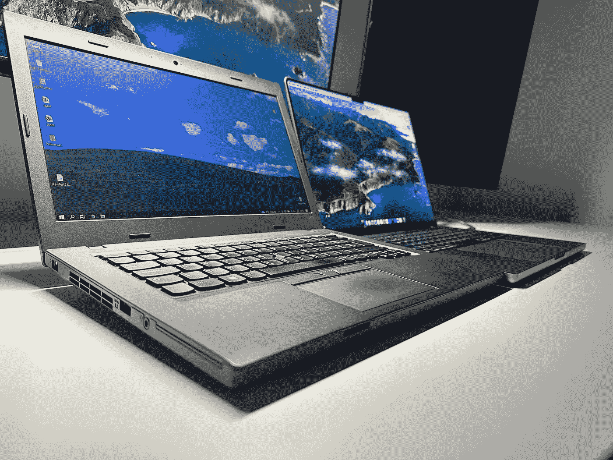
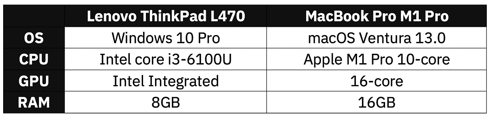
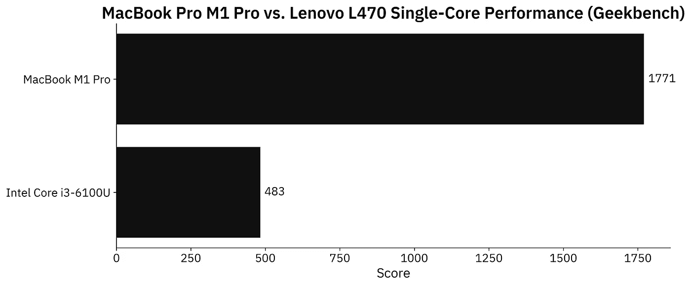
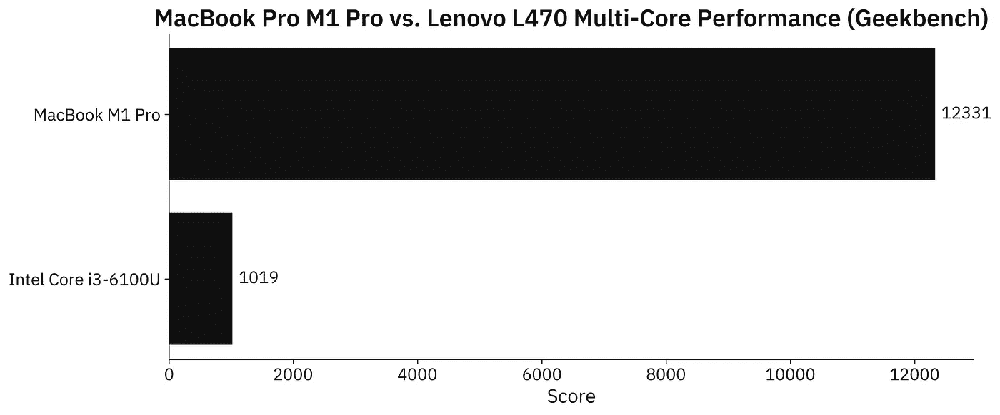
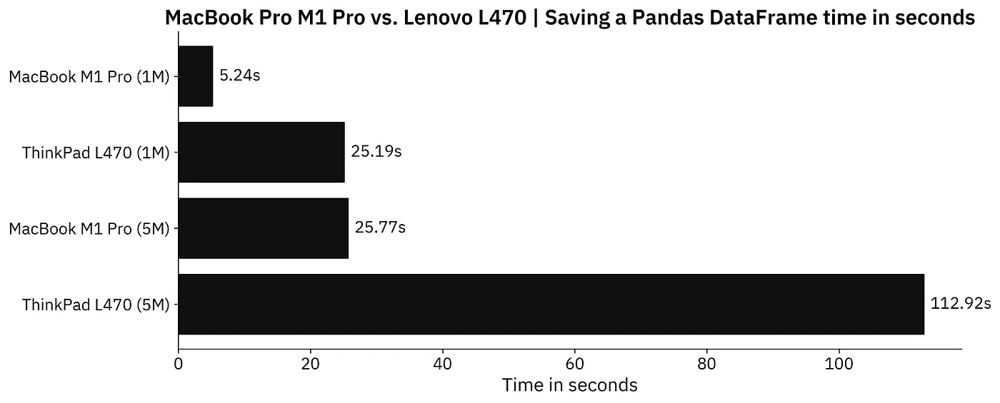
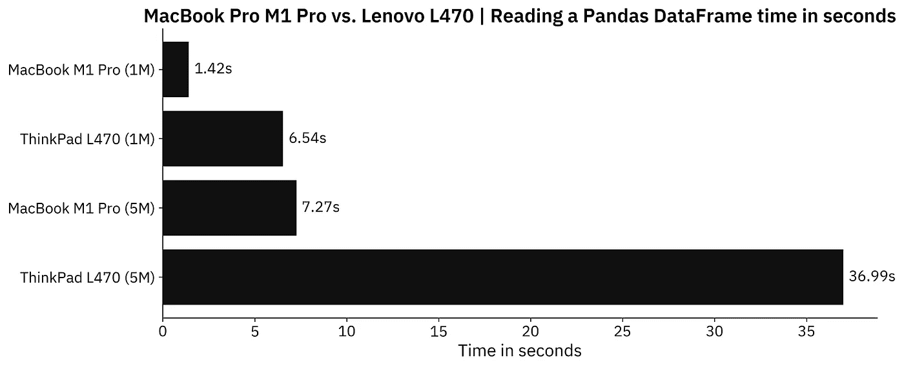
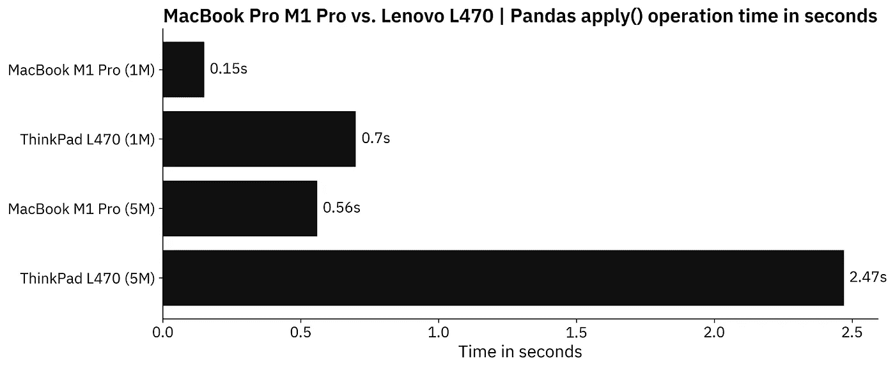
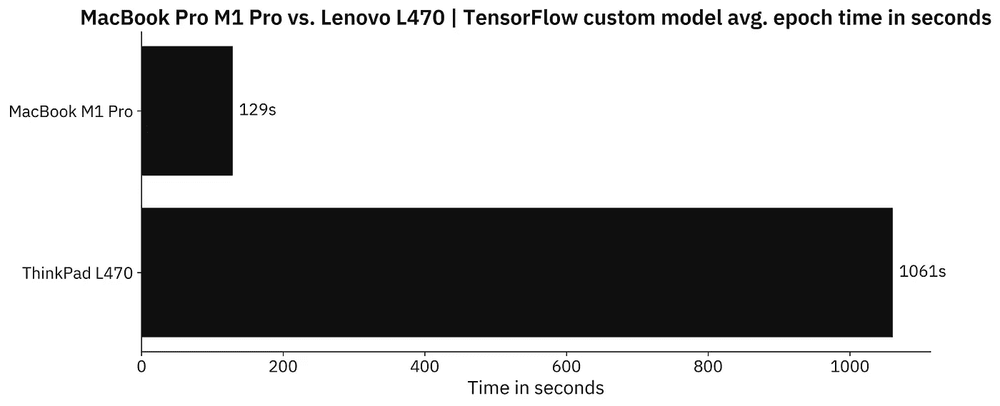
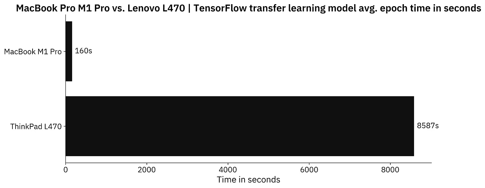

# 您的笔记本电脑对数据科学重要吗？旧 ThinkPad 与新 MacBook Pro 对比

> 原文：<https://towardsdatascience.com/does-laptop-matter-for-data-science-old-thinkpad-vs-new-macbook-pro-compared-67e3fa0f9e09>

## 英特尔 i3–6100 u 上的 Pandas 和 TensorFlow 性能指标评测与 M1 Pro MacBook Pro 相比，速度慢了 50 倍？



文章缩略图— ThinkPad L470(左)和 M1 Pro MacBook(右)(图片由作者提供)

自发布以来，16 英寸的 M1 Pro MacBook 一直是我的首选。它在超高级的表面下提供了令人难以置信的性能，同时可以持续一整天，并拥有可能是业界最好的屏幕。

*但是一台旧的双核联想 ThinkPad 呢？第六代英特尔处理器能接近现代的发电站吗？*继续阅读寻找答案。

在今天的文章中，我们将在一系列基准测试中比较旧的 ThinkPad L470 和现代的 M1 Pro MacBook Pro，从合成产品到熊猫和 TensorFlow。基准测试的范围是有限的，所以一切都可以在十分钟内完成。

在继续之前，让我们比较一下硬件规格:



图 1 —硬件规格对比(图片由作者提供)

这不是真正的苹果之间的比较。Mac 起价 2499 美元，我买的 ThinkPad 不到 200 美元。这要便宜 12 倍以上，所以 Mac 有理由这么做。

不想看书？请观看我的视频:

# 英特尔酷睿 i3–6100 u 性能指标评测——现在还不太好

6100U 早在 2015 年就发布了，所以我们真的不能指望它能与更现代、更强大的芯片相媲美。此外，综合基准只能带我们走这么远，但它们是一个很好的起点。

以下是 i3–6100 u 与单核部门的 M1 Pro 芯片的比较:



图 2 — Geekbench 单核性能(图片由作者提供)

M1 专业版大约快 3.5 倍，这是意料之中的。即使在今天，大多数 Windows 笔记本电脑也无法与之媲美，所以这真的不足为奇。

多核是有趣的地方。i3 只有两个内核，而 M1 Pro 有 8 个性能内核和 2 个效率内核。结果如下:



图 3 — Geekbench 多核性能(图片由作者提供)

如你所见，Mac 在这个测试中快了 12 倍。这是一个巨大的差异，你肯定会在日常使用中注意到这一点。此外，macOS 需要更少的资源来顺利运行，所以这是你必须考虑的另一个问题。

现在让我们进入实际的数据科学基准，从熊猫开始。

# Pandas 基准测试—典型数据工作流程时间对比

在一篇文章中，我只能比较这么多，所以让我们继续讨论基础知识。我们将比较创建、保存、读取和转换熊猫数据帧所需的时间。

## 创建一个熊猫数据框架

让我们创建两个数据集——第一个有 100 万行，第二个大约有 5 行。这些应该足以将 ThinkPad 推向极限。

下面的代码片段导入了本节需要的所有库，还声明了一个函数`create_dataset()`，它创建了数据集。

```
import random
import string
import numpy as np
import pandas as pd
from datetime import datetime
np.random.seed = 42

def create_dataset(start: datetime, end: datetime, freq: str) -> pd.DataFrame:
    def gen_random_string(length: int = 32) -> str:
        return ''.join(random.choices(
            string.ascii_uppercase + string.digits, k=length)
        )

    dt = pd.date_range(
        start=start,
        end=end,
        freq=freq,  # Increase if you run out of RAM
        closed='left'
    )

    df_size = len(dt)
    df = pd.DataFrame({
        'date': dt,
        'a': np.random.rand(df_size),
        'b': np.random.rand(df_size),
        'c': np.random.rand(df_size),
        'd': np.random.rand(df_size),
        'e': np.random.rand(df_size),
        'str1': [gen_random_string() for x in range(df_size)],
        'str2': [gen_random_string() for x in range(df_size)]
    })

    return df
```

现在，让我们使用它来创建 1M 和 5M 数据集:

```
########## 1M Dataset ##########

df_1m = create_dataset(
    start=datetime(2010, 1, 1),
    end=datetime(2020, 1, 1),
    freq='300s'
)

########## 5M Dataset ##########

df_5m = create_dataset(
    start=datetime(2010, 1, 1),
    end=datetime(2020, 1, 1),
    freq='60s'
)
```

以下是笔记本电脑和数据集的时间:


图片 4-创建数据集所需的时间(图片由作者提供)

从各方面考虑，这并不是一个很大的差别。对于 1M 数据集，Mac 大约快 7 倍，对于 5M 数据集，大约快 5 倍。ThinkPad 上没有发生任何崩溃或冻结，只是需要更多的时间。

## 将数据集保存到 CSV 文件

在整个项目过程中，您可能会将数据保存在不同的状态中，因此将花费在这里的时间减到最少会很好。下面的代码片段将两只熊猫的数据帧转储到一个 CSV 文件:

```
########## 1M Dataset ##########

df_1m.to_csv("/Users/dradecic/Desktop/1Mdf.csv", index=False)

########## 5M Dataset ##########

df_5m.to_csv("/Users/dradecic/Desktop/5Mdf.csv", index=False)
```

结果如下:



图 5-将数据集保存为 CSV 文件所需的时间(图片由作者提供)

和我们之前的故事相似。将熊猫数据保存到 CSV 文件时，Mac 的速度大约快了 5 倍。

## 从磁盘读取 CSV 文件

但是反过来呢？在 Mac 上读取 CSV 文件也会快 5 倍吗？代码如下:

```
########## 1M Dataset ##########

df_1m = pd.read_csv("/Users/dradecic/Desktop/1MDF.csv")

########## 5M Dataset ##########

df_5m = pd.read_csv("/Users/dradecic/Desktop/5MDF.csv")
```

结果是:



图 6 —读取 CSV 文件所需的时间(图片由作者提供)

到目前为止，5X 时差似乎是普遍存在的。

## 将函数应用于列

通过调用 DataFrame 列上的`apply()`方法，可以在 data frame 列上应用自定义函数。下面的代码片段颠倒了最初包含 32 个字符的随机字符串的`str1`列:

```
def reverse_str(x) -> str:
    return x[::-1]

########## 1M Dataset ##########

df_1m['str1_rev'] = df_1m['str1'].apply(reverse_str)

########## 5M Dataset ##########

df_5m['str1_rev'] = df_5m['str1'].apply(reverse_str)
```

让我们来看看结果:



图 7 —反转一列字符串所需的时间(图片由作者提供)

又一次，5X 时差对 Mac 电脑有利。

**总结一下**——M1 Pro MacBook 一直比 ThinkPad L470 快 5 倍左右。这并不令人惊讶，但让我们看看 TensorFlow 是否能让这种差异变得更大。

# TensorFlow 基准测试—自定义模型和迁移学习

只是为了解决房间里的大象——可以在 i3–6100 u 或任何其他低端芯片上安装甚至运行 TensorFlow。它可以工作，但是很慢，因为处理器不是很强大，也没有 GPU 的支持。

对于 TensorFlow 基准测试，我使用了来自 Kaggle 的[狗与猫数据集](https://www.kaggle.com/pybear/cats-vs-dogs?select=PetImages)，该数据集是在知识共享许可下授权的。长话短说，你可以免费使用。至于数据集准备，如果您想复制结果，请参考本文中的[。](https://betterdatascience.com/top-3-prerequisites-for-deep-learning-projects/)

让我们开始第一项测试。

## 自定义张量流模型

第一个 TensorFlow 基准测试使用数据扩充，并将[两块卷积模型](https://betterdatascience.com/train-image-classifier-with-convolutional-neural-networks/)应用于图像数据集。它没有什么特别的，只是一个你在学习 TensorFlow 时可能会偶然发现的模型架构:

```
import os
import warnings
from datetime import datetime
os.environ['TF_CPP_MIN_LOG_LEVEL'] = '2'
warnings.filterwarnings('ignore')

import numpy as np
import tensorflow as tf
tf.random.set_seed(42)

####################
# 1\. Data loading
####################
train_datagen = tf.keras.preprocessing.image.ImageDataGenerator(
    rescale=1/255.0,
    rotation_range=20,
    width_shift_range=0.2,
    height_shift_range=0.2,
    shear_range=0.2,
    zoom_range=0.2,
    horizontal_flip=True,
    fill_mode='nearest'
)
valid_datagen = tf.keras.preprocessing.image.ImageDataGenerator(
    rescale=1/255.0
)

train_data = train_datagen.flow_from_directory(
    directory='/Users/dradecic/Desktop/data/train/',
    target_size=(224, 224),
    class_mode='categorical',
    batch_size=64,
    seed=42
)
valid_data = valid_datagen.flow_from_directory(
    directory='/Users/dradecic/Desktop/data/validation/',
    target_size=(224, 224),
    class_mode='categorical',
    batch_size=64,
    seed=42
)

####################
# 2\. Model
####################
model = tf.keras.Sequential([
    tf.keras.layers.Conv2D(filters=32, kernel_size=(3, 3), input_shape=(224, 224, 3), activation='relu'),
    tf.keras.layers.MaxPool2D(pool_size=(2, 2), padding='same'),
    tf.keras.layers.Conv2D(filters=32, kernel_size=(3, 3), activation='relu'),
    tf.keras.layers.MaxPool2D(pool_size=(2, 2), padding='same'),
    tf.keras.layers.Flatten(),
    tf.keras.layers.Dense(128, activation='relu'),
    tf.keras.layers.Dense(2, activation='softmax')
])
model.compile(
    loss=tf.keras.losses.categorical_crossentropy,
    optimizer=tf.keras.optimizers.Adam(),
    metrics=[tf.keras.metrics.BinaryAccuracy(name='accuracy')]
)

####################
# 3\. Training
####################
model.fit(
    train_data,
    validation_data=valid_data,
    epochs=5
)
```

该模型在每台机器上训练了 5 个历元，下图比较了平均历元时间:



图 8-自定义模型上每个历元的张量流平均时间(图片由作者提供)

正如你所看到的，TensorFlow 可以在一台旧笔记本电脑上运行，但与 Mac 相比慢了大约 8 倍。如果你刚刚开始，这不是一个交易破坏者。

## 张量流迁移学习模型

下面的代码片段或多或少与上一个相同，但有一个重要的区别——它现在使用一个[预训练的 VGG-16 网络](https://betterdatascience.com/tensorflow-transfer-learning/)来分类图像:

```
####################
# 1\. Data loading
####################
train_datagen = tf.keras.preprocessing.image.ImageDataGenerator(
    rescale=1/255.0,
    rotation_range=20,
    width_shift_range=0.2,
    height_shift_range=0.2,
    shear_range=0.2,
    zoom_range=0.2,
    horizontal_flip=True,
    fill_mode='nearest'
)
valid_datagen = tf.keras.preprocessing.image.ImageDataGenerator(
    rescale=1/255.0
)

train_data = train_datagen.flow_from_directory(
    directory='/Users/dradecic/Desktop/data/train/',
    target_size=(224, 224),
    class_mode='categorical',
    batch_size=64,
    seed=42
)
valid_data = valid_datagen.flow_from_directory(
    directory='/Users/dradecic/Desktop/data/validation/',
    target_size=(224, 224),
    class_mode='categorical',
    batch_size=64,
    seed=42
)

####################
# 2\. Base model
####################
vgg_base_model = tf.keras.applications.vgg16.VGG16(
    include_top=False, 
    input_shape=(224, 224, 3), 
    weights='imagenet'
)
for layer in vgg_base_model.layers:
    layer.trainable = False

####################
# 3\. Custom layers
####################
x = tf.keras.layers.Flatten()(vgg_base_model.layers[-1].output)
x = tf.keras.layers.Dense(128, activation='relu')(x)
out = tf.keras.layers.Dense(2, activation='softmax')(x)

vgg_model = tf.keras.models.Model(
    inputs=vgg_base_model.inputs,
    outputs=out
)
vgg_model.compile(
    loss=tf.keras.losses.categorical_crossentropy,
    optimizer=tf.keras.optimizers.Adam(),
    metrics=[tf.keras.metrics.BinaryAccuracy(name='accuracy')]
)

####################
# 4\. Training
####################
vgg_model.fit(
    train_data,
    validation_data=valid_data,
    epochs=5
)
```

这次的结果大不相同:



图 9 —迁移学习模型中每个时期的张量流平均时间(图片由作者提供)

正如你所看到的，在 Mac 上，每个时期的平均训练时间几乎没有增加，但在 ThinkPad 上却飞速增长。在 i3–6100 u 上等待迁移学习模型完成培训花费了一天中的大部分时间，因为与 Mac 相比，它几乎慢了 54 倍。

那么，**我们从这些基准测试中学到了什么？**接下来让我们回顾一些见解。

# 旧笔记本电脑上的数据科学—需要考虑的事项

在旧笔记本电脑上进行数据争论或数据科学工作并不是不可能的，尤其是如果你刚刚起步的话。有几件事你应该记住，所以让我们复习一下。

## 旧笔记本电脑+深度学习=谷歌 Colab

没有理由仅仅因为你刚开始深度学习就让一台旧笔记本电脑经历磨难。 [Google Colab](https://www.google.com/url?sa=t&rct=j&q=&esrc=s&source=web&cd=&cad=rja&uact=8&ved=2ahUKEwjGlsvlyL77AhVW8rsIHUIHALwQFnoECBgQAQ&url=https%3A%2F%2Ftowardsdatascience.com%2Fgoogle-colab-how-does-it-compare-to-a-gpu-enabled-laptop-851c1e0a2ca9&usg=AOvVaw003PyYjAysWQ4y-H0WHXA-) 是一个令人惊叹的预配置笔记本电脑环境，不需要任何成本，并且包含 GPU 支持。如果你需要更多的功能和更长的运行时间，可以考虑 Colab Pro。

## 港口的缺乏

说 Mac 有更好的端口选择很奇怪，但在这种情况下确实如此。ThinkPad L470 已经 5+岁了，所以它没有 USB-C，甚至没有 HDMI 端口。连接外接显示器就没那么容易了。

有一个 VGA 端口可用，但这需要一个适配器，如果你有一个现代的外部显示器，图像质量会有所下降。不是交易破坏者，只是需要考虑的事情。

有了 Mac，我可以用一根 USB-C 电缆连接 4K 外部显示器、监视器灯、手机充电器、麦克风和耳机。

## 可怕的屏幕

我从来没有对 ThinkPad 的显示器印象深刻，但 L470 将这种糟糕带到了一个完全不同的水平。显示屏为 14 英寸，对于笔记本电脑来说非常出色，但分辨率不是 1366x768。所有的东西都很大，你不能在屏幕上放超过一两个窗口。色彩准确度也非常糟糕。

如果连接全分辨率的外部显示器更容易，这就不是问题了。

另一方面，Mac 上的迷你 LED 屏幕跨度为 16 英寸，分辨率为 3456x2234。至少可以说，这是白天和黑夜的差别。

# 结论

英特尔的 i3–6100 u 可以相当好地处理熊猫，它也可以用 TensorFlow 训练深度学习模型，尽管速度很慢。你绝对可以在使用它的同时进入数据科学，甚至在行业内从事专业工作。如今大部分工作都在云端完成，所以笔记本电脑归根结底是被美化了的键盘。

与新事物相比，廉价的旧笔记本电脑的最大问题不是原始性能，而是其他方面的妥协。每天看着可怕的屏幕 8 个多小时，处理劣质电池和一大堆电缆并不好玩。

但另一方面，如果你想进入数据科学领域，并有 200 美元的闲钱，一台旧笔记本电脑就足够了。

你对新旧笔记本电脑的对比有什么看法？您目前使用的笔记本电脑曾经风光过吗？如果是，你每天都在与什么问题作斗争？请在下面的评论区告诉我。

*喜欢这篇文章吗？成为* [*中等会员*](/@radecicdario/membership) *继续无限制学习。如果你使用下面的链接，我会收到你的一部分会员费，不需要你额外付费。*

[](https://medium.com/@radecicdario/membership)  

## 更多基准

*   [MacBook M1 vs M1 Pro](https://betterdatascience.com/macbook-m1-vs-m1-pro-for-data-science/)
*   [MacBook M1 vs . Google Colab](https://betterdatascience.com/macbook-m1-vs-google-colab/)
*   [MacBook M1 Pro vs 谷歌 Colab](https://betterdatascience.com/macbook-m1-pro-vs-google-colab/)
*   [MacBook M1 vs RTX 3060 ti](https://betterdatascience.com/macbook-m1-vs-rtx3060ti/)

## 保持联系

*   雇用我作为一名[技术作家](https://betterdatascience.com/contact/)
*   在 YouTube[上订阅](https://www.youtube.com/c/BetterDataScience)
*   在 [LinkedIn](https://www.linkedin.com/in/darioradecic/) 上连接

*原载于 2022 年 11 月 22 日 https://betterdatascience.com*[](https://betterdatascience.com/data-science-old-laptop/)**。**