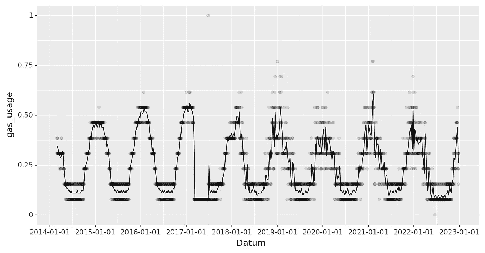
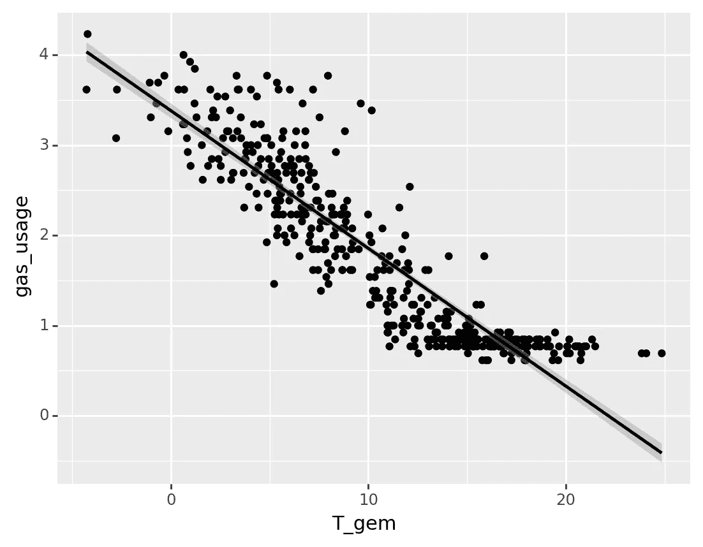
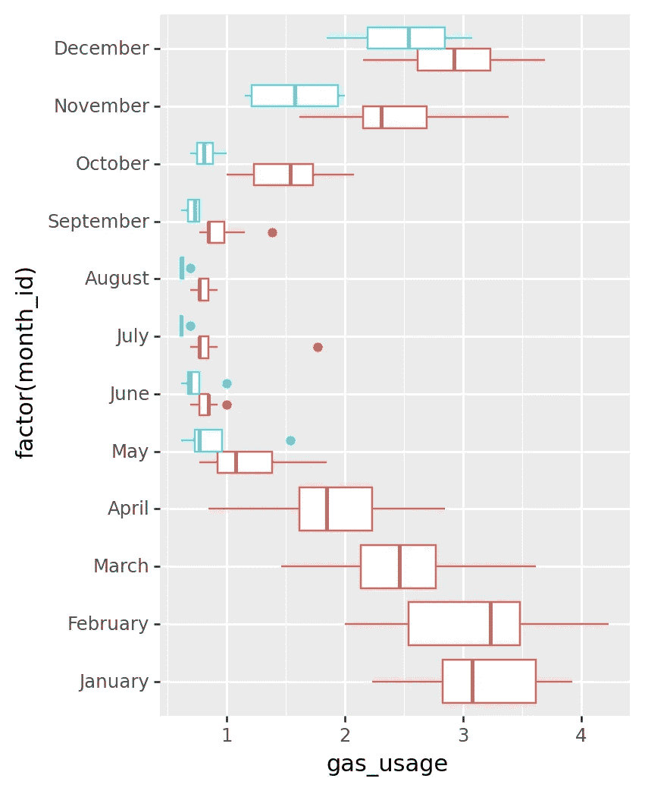
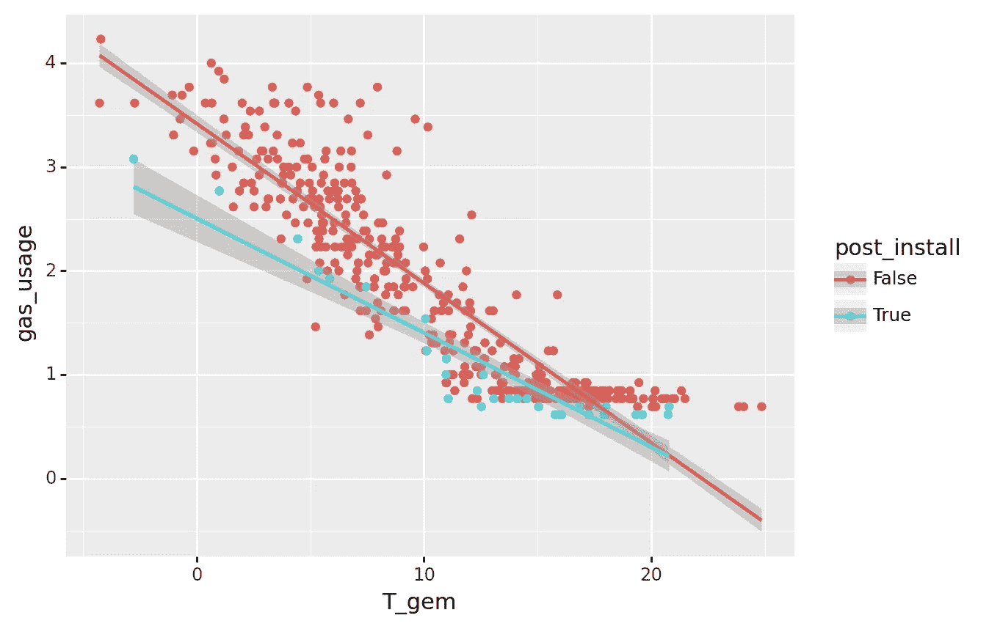
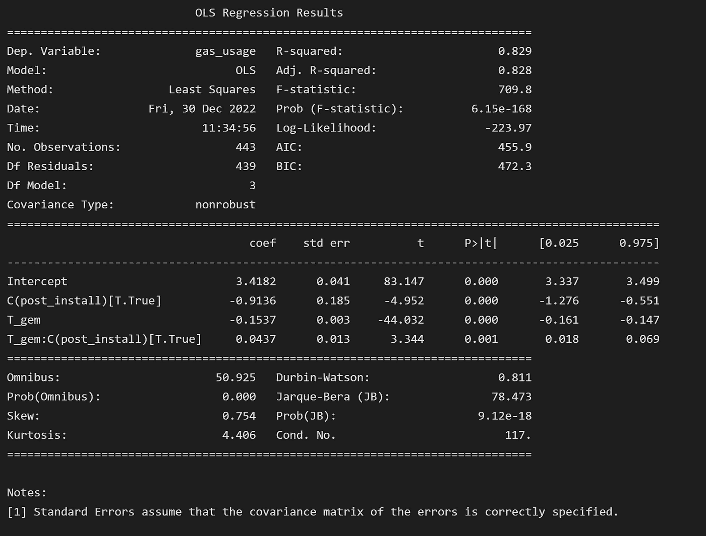
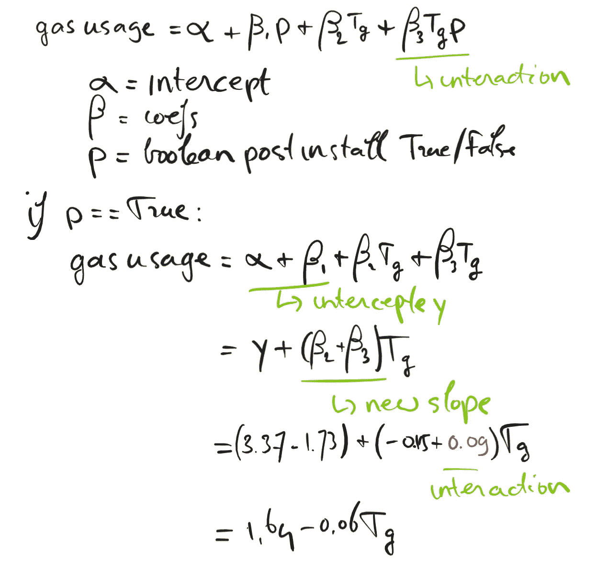

# 我的新中央供暖锅炉对这些疯狂的高油价有帮助吗？

> 原文：<https://towardsdatascience.com/does-my-new-central-heating-boiler-help-with-these-crazy-high-gas-prices-b238fd623bba>

## *在能源危机中，我们使用相互作用的线性回归对我的新中央供暖锅炉的性能进行基准测试*

# **简介**

随着东欧的冲突愈演愈烈，副作用之一是能源价格飙升。自今年年初以来，我的汽油价格轻松翻了两番，所以像一个好书呆子类型的数据科学家一样，我开始研究我的能源使用数据，以减轻我的担忧。幸运的是，我的能源供应商允许我下载过去几年每天的用气量数据。我首先想到的一件事是，我们今年的天然气用量低于我根据前几年的预期。可能导致这种情况的主要怀疑之一是在 2022 年 4 月底安装了一个新的中央供暖锅炉，因为它是唯一使用天然气的设备。

在这篇文章中，我们探索了我的能源数据，并建立了一个回归模型，其中包括量化我的新中央供暖锅炉对我的燃气用量的影响程度的相互作用。

*注:*本文也可以在 github 上阅读[，包含全部代码。](https://github.com/PaulHiemstra/gas_usage_article/blob/main/gas_usage_article.ipynb)

# **日常用气量和温度**

主要数据来源是我的能源供应商 Eneco 的网站。他们允许我从他们的在线系统下载一个 Excel 表格，里面有每天的能源使用情况。请注意，我对我的使用数据(最小-最大比例)进行了标准化，以保护我的数据隐私。此外，我还[下载了附近一个气象站的温度数据](https://daggegevens.knmi.nl/klimatologie/daggegevens),因为我怀疑气体的使用会强烈依赖于外部温度。以下代码读取数据，并根据日期合并两个数据集:



每周每日用气量和每周趋势线(自行创建)

其中点是每天的用气量，线是每周的平均值。这清楚地显示了天然气使用的年度趋势，冬季使用量高，夏季使用量低。一个非常显著的特点是日值在横线上累加。这是因为用气量是以整数增量报告的，有效地将数值四舍五入到最接近的最小整数。为了减轻这种整数效应，我们将整个数据集重新采样为每周总用气量和每周平均温度。使用这些重新采样的数据，我们绘制了一个曲线图，显示温度与用气量的关系:

```
gas_usage = (
    energy_usage['gas_usage']
      .resample('W').sum().reset_index()
      .merge(temperature.resample('W').mean().reset_index(), left_on='Datum', right_on='date')
)

# Some obviously wrong data eliminated
gas_usage = gas_usage.query('gas_usage >= 0.55')

# Eliminate weeks that do not have the full 7 days, because we sum the data over the days
# and for those non-complete weeks this would underestimate the gas_usage, thus skewing the results
non_complete_weeks = (
    energy_usage['gas_usage']
      .resample('W').count() != 7
)
non_complete_dates = non_complete_weeks.loc[non_complete_weeks].index.values
gas_usage = (
  gas_usage.loc[~gas_usage['Datum'].isin(non_complete_dates)]
     .reset_index().drop(columns='index') # This is sadly needed as plotnine will throw an error without it. Might be connected to the new index not being contiguous anymore
)

(
    ggplot(gas_usage, aes(x='T_gem', y='gas_usage')) 
      + geom_point()
      + geom_smooth(method='lm')
)
```



平均周温度与气体使用量(自行创建)

这清楚地表明温度和气体用量之间有很强的相关性。使用这种影响作为基线，我们现在可以尝试和模拟取代中央供暖锅炉的影响。

# **对标集中供热锅炉**

我们对锅炉进行基准测试的第一步是创建一系列每月燃气用量的箱线图。此外，对于新锅炉安装后的几个月，我们增加了单独的箱子:



锅炉安装前后每月用气量的箱线图(自创)

这向我们显示了新锅炉使用更少燃气的第一个暗示，安装后几个月(5 月-9 月，青色方框)显示燃气使用量更低。下一步是为安装前和安装后的数据重新绘制我们的温度与用气量曲线图:



这证实了我们先前的观察:气体用量较低，并且随着回归线的斜率显著降低，这种影响似乎与温度成比例。然而，安装后的数据仍然非常有限，因为寒冷而触发供暖的周数也不多。但是考虑到目前非常高的油价，这给了我一些希望，我们可以用比去年冬天更少的汽油度过这个冬天。*更新:*文章中包含的新数据(截至 12 月 28 日)进一步证实了斜率已经下降，尽管下降幅度没有旧的有限数据显示的严重。p

为了量化这种影响，我们使用 statsmodels 的公式界面创建了一个回归模型。请注意，我们不能简单地在公式中包含两个变量，就像“T_gem + C(post_install)”,因为这将只允许线与线之间的截距不同。这显然不是我们想要的给定的结果，上面的情节，我们希望不同的斜率后和预安装。解决方案是使用相互作用，即告诉回归模型‘t _ gem’和‘gas _ usage’之间的关系基于‘c(post _ install)’而变化。在公式中，您可以使用` *`: `T_gem * C(post_install)`来指定。这意味着“gas_usage”和“T_gem”之间的关系(斜率)对于“C(post_install)”的两个值可以是不同的，导致上面图中的两条线。运行代码会产生:



其中系数需要解释为:

*   “拦截”零摄氏度时的(匿名)用气量
*   ` C(post_install)[T.True]`在零度时，新锅炉使用的燃气少 0.91(post _ install = True)
*   温度从 0 开始每增加一度，用气量下降 0.15，即斜率为-0.15。
*   ` T_gem:C(post_install)[T.True]`新锅炉将`T_gem`的斜率改变 0.04。这使得斜率(-0.15 + 0.04) = 0.11，这意味着当温度下降时，用气量增加不太明显。

这些系数的附加效应是我们所期望的:新锅炉使用更少的气体，但绝对效应随着温度的升高变得不那么强烈。以下回归公式进一步说明了这一点:



# **结论**

对于我在安装新锅炉后获得的有限数据集，情况看起来不错。它使用更少的汽油，并有望大大影响我的水电费。但是也有一些限制:与多年的安装前数据相比，安装后的数据非常有限，特别是因为安装后的冬季数据不包括在内。今年冬天，我当然会收集更多的数据，这将提供更多的确定性。一个潜在的干扰因素可能是我们把恒温器调低到 18 度，这几乎肯定会影响我们的天然气使用。但这是一个在春天解决的有趣话题。*更新:*截至 12 月 28 日的新数据很好地完善了这篇文章:天然气使用量下降，但没有我们根据早期数据预测的那么严重。

本文也可以在 github 上阅读[，包括全部代码。](https://github.com/PaulHiemstra/gas_usage_article/blob/main/gas_usage_article.ipynb)

# 我是谁？

我叫 Paul Hiemstra，是荷兰的一名教师和数据科学家。我是科学家和软件工程师的混合体，对与数据科学相关的一切都有广泛的兴趣。你可以在 medium 上关注我，或者在 LinkedIn 上关注 T4。

如果你喜欢这篇文章，你可能也会喜欢我的其他一些文章:

*   [掌握数据科学并不是学习一系列技巧](/mastering-data-science-is-not-learning-a-series-of-tricks-df66d8529c29)
*   [学习 AI 机器人玩井字游戏系列文章](https://towardsdatascience.com/tagged/rl-series-paul)
*   [牛郎星图解构:可视化气象数据的关联结构](/altair-plot-deconstruction-visualizing-the-correlation-structure-of-weather-data-38fb5668c5b1)
*   [面向数据科学的高级函数式编程:使用函数运算符构建代码架构](/advanced-functional-programming-for-data-science-building-code-architectures-with-function-dd989cc3b0da)
*   [通过规范化扩展您的回归曲目](/expanding-your-regression-repertoire-with-regularisation-903d2c9f7b28)