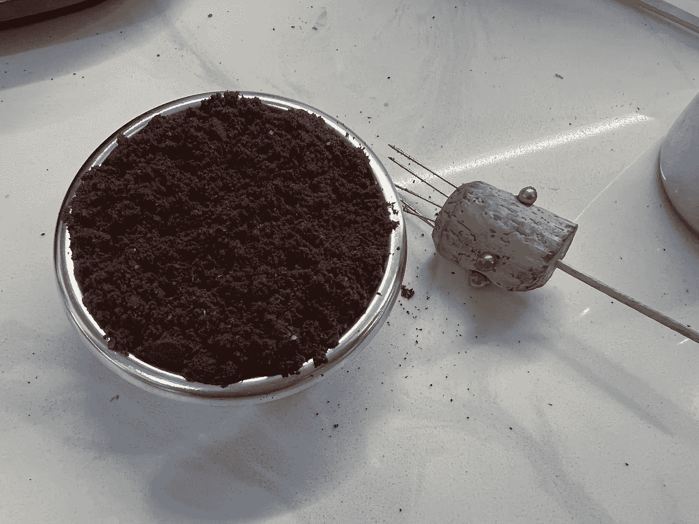
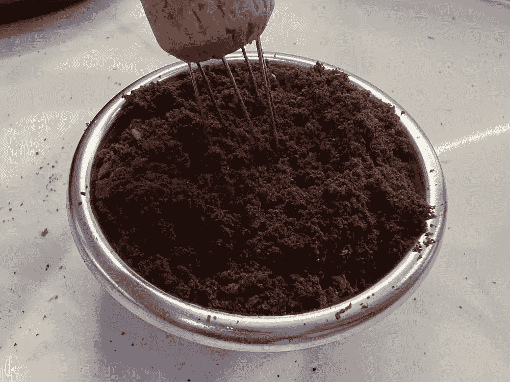
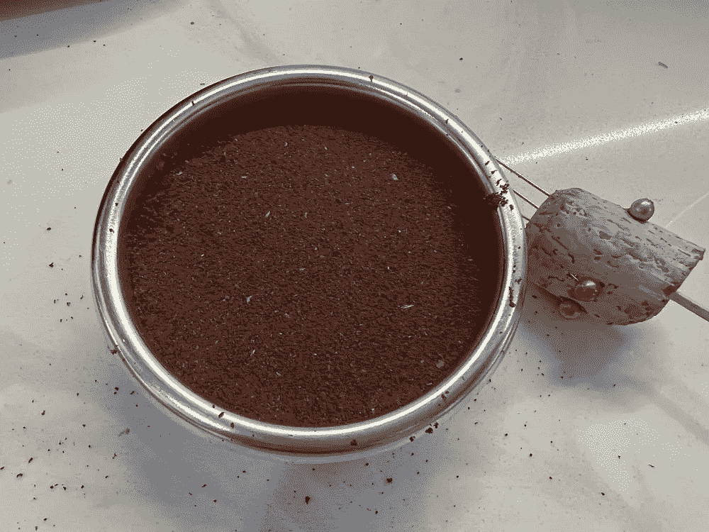
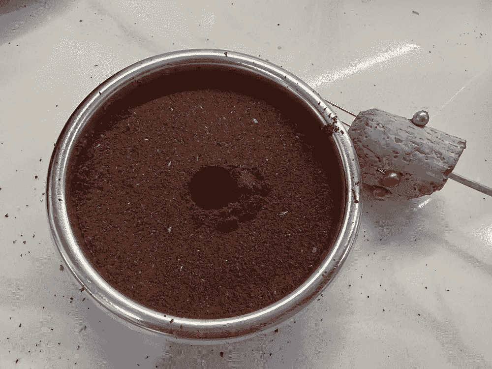
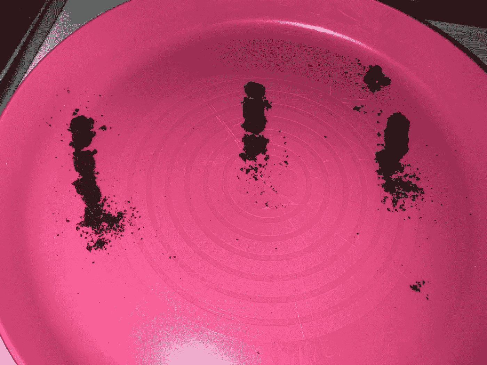
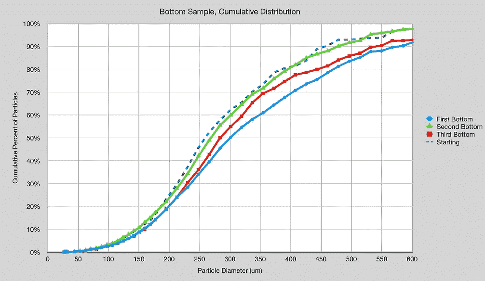
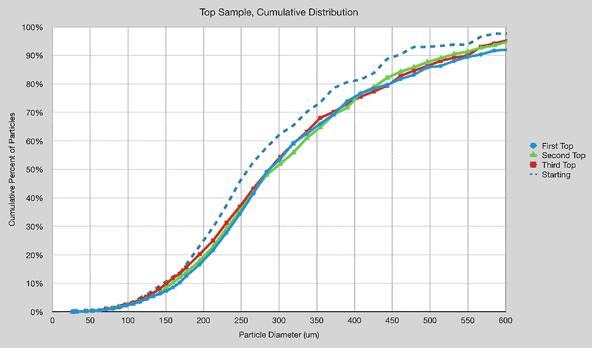
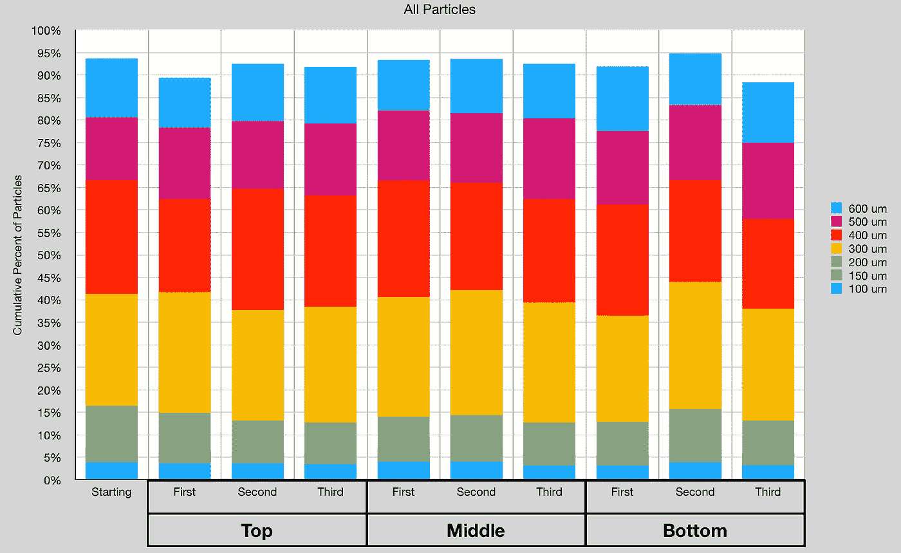
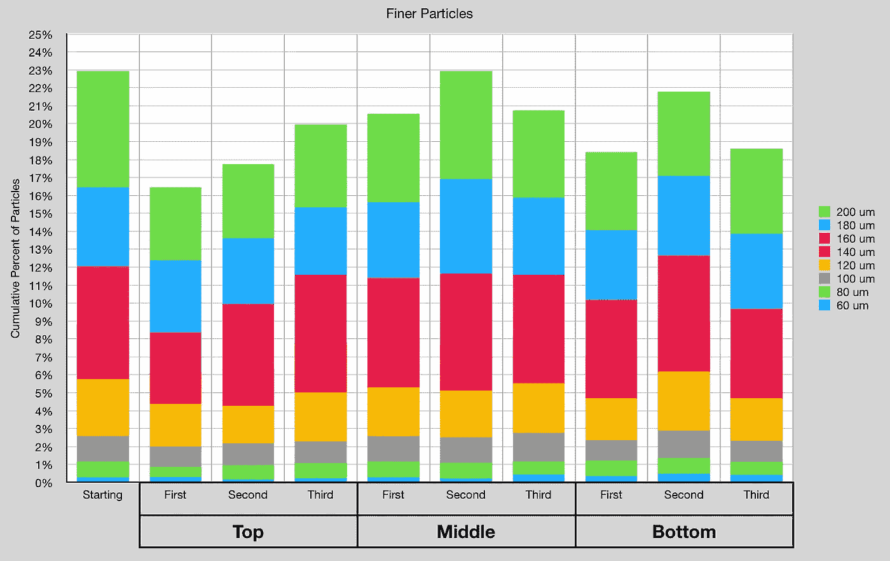
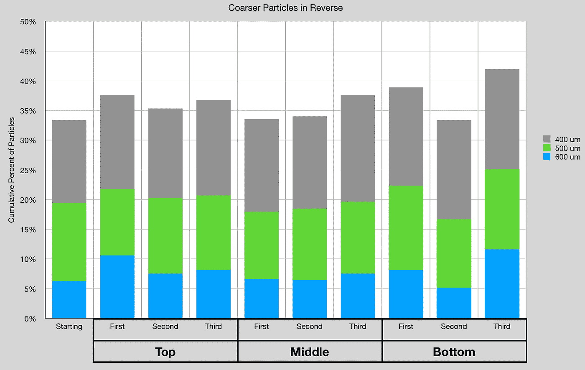

# WDT 会把粉末转移到浓缩咖啡篮的底部吗？

> 原文：<https://towardsdatascience.com/does-wdt-migrate-fines-to-the-bottom-of-the-espresso-basket-e0c845c84259>

## 咖啡数据科学

韦斯分布技术(WDT)已经存在几年了。WDT 通常有助于良好的分配，并已被发现改善咖啡提取。人们遇到的一个困难是不知道去 WDT 需要多长时间。如果你 WDT 太多，细颗粒会从混合和运动中向过滤篮底部移动吗？

我的理论是，由于静电，较细的颗粒会粘在较大的颗粒上。我以前的筛分经验表明，简单的振动不足以使颗粒充分分离。我必须仔细筛选，表明研磨咖啡不像干沙。

所有图片由作者提供

为了测试这一点，我在一些 WDT、更多的 WDT 和太多之后观察了几个样品上的研磨分布。对于每一次迭代，我都会在之后夯实圆盘并提取一个核心样本。我也用了现磨咖啡。

然后我会继续 WDT 咖啡。

我得到了这三个核心样本。这些样本是从冰球中心取出的。

使用[图像处理](https://medium.com/nerd-for-tech/measuring-coffee-grind-distribution-d37a39ffc215)，我测量了开始分布、第一次 WDT 应用、第二次和第三次的分布。对于其中的每一个，我测量了圆盘顶部、中部和底部的分布。

我没有看到表明分布变化的分布变化。

我更仔细地观察了精细层，虽然有一些移动，但不符合迁移的预期。例如，我可以通过顶部减少小于 200 微米的颗粒，但随着时间的推移，它会增加。

我也观察较粗的颗粒，我反过来观察它们，这样我就能理解正在发生的任何变化。没有任何明显的趋势。

从这组实验中，我没有发现 WDT 导致更细的颗粒在拍摄准备过程中迁移的证据。由于我的技术，这是很有可能的，但是我没有数据来支持不同的结论。

所以，如果你担心你做了太多的 WDT，深呼吸。

如果你愿意，可以在推特、 [YouTube](https://m.youtube.com/channel/UClgcmAtBMTmVVGANjtntXTw?source=post_page---------------------------) 和 [Instagram](https://www.instagram.com/espressofun/) 上关注我，我会在那里发布不同机器上的浓缩咖啡照片和浓缩咖啡相关的视频。你也可以在 [LinkedIn](https://www.linkedin.com/in/dr-robert-mckeon-aloe-01581595) 上找到我。也可以关注我在[中](https://towardsdatascience.com/@rmckeon/follow)和[订阅](https://rmckeon.medium.com/subscribe)。

# [我的进一步阅读](https://rmckeon.medium.com/story-collection-splash-page-e15025710347):

[我的书](https://www.kickstarter.com/projects/espressofun/engineering-better-espresso-data-driven-coffee)

[我的链接](https://rmckeon.medium.com/my-links-5de9eb69c26b?source=your_stories_page----------------------------------------)

[浓缩咖啡系列文章](https://rmckeon.medium.com/a-collection-of-espresso-articles-de8a3abf9917?postPublishedType=repub)

工作和学校故事集