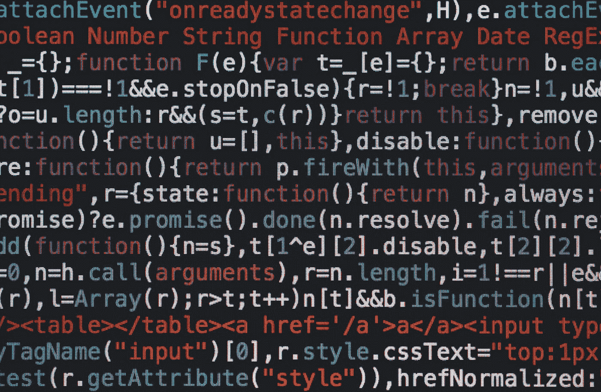

# 你的代码有味道吗？

> 原文：<https://towardsdatascience.com/does-your-code-smell-acb9f24bbb46>

## 什么是代码气味，如何减少代码气味

马库斯·斯皮斯克在 [Unsplash](https://unsplash.com?utm_source=medium&utm_medium=referral) 上的照片

我承认，直到最近一位更资深的开发人员告诉我我的代码“有味道”时，我才发现代码有味道。我看着它们，看着我的代码，想知道它们到底是什么意思。当他们接着解释说代码气味是代码中的模式，不一定会阻止代码运行，但可能表明一些有缺陷的逻辑，或者可能是不稳定或难以维护的代码时，我的脸上一定露出了这种表情。我明白他们的意思，也明白为什么我的代码不是我能写出的最好的代码，所以我着手修复它。然而，从那以后，我想更深入地了解什么是代码味道，以及如何在自己或他人的代码中找到它们。

照片由[在](https://unsplash.com/@battlecreekcoffeeroasters?utm_source=medium&utm_medium=referral) [Unsplash](https://unsplash.com?utm_source=medium&utm_medium=referral) 上的battle creek 咖啡烘焙师拍摄

那么什么是代码气味呢？首先，它们不一定是你的代码中的 bug 或错误，事实上你的代码实际上可以运行得非常好，并通过所有它需要的测试。但是这并不总是好的代码。代码气味基本上是代码片段，在运行时，往往表明逻辑有问题，或者给代码库带来不必要的复杂性。虽然现在并不总是产生问题，但这可能会使代码难以扩展，或者在将来产生难以调试的错误。

代码气味可能会产生一些问题，比如降低处理速度、增加失败的风险，以及进一步产生 bug。糟糕的代码会导致糟糕的代码质量，并且会增加您的团队将来必须处理的技术债务的数量。这是你绝对不希望你的名字出现在代码提交中的。然而，好的一面是代码气味可以被“嗅到”,并且相对快速地发现。尤其是当你的公司使用代码审查系统时，因为其他人可以指出你的问题，或者你使用一个自动工具来标记你的代码库。当然，您更愿意使用后者或者知道要注意什么，而不是依赖别人来发现您的糟糕代码。

实际上，不同项目、不同开发人员、甚至不同公司的代码味道可能不同，因为这将取决于对代码所期望的定义和接受的标准。尽管如此，通常有一些众所周知的代码味道，您可以尝试在自己的代码中减少:

*   **重复代码:**这是同一段代码在你的程序中多次出现的地方。此时，最好尝试将这段代码放入一个函数中，这样你就可以多次调用它，而不必多次输入。这也意味着，如果你需要对它的功能进行修改，你不需要复制这些修改，也不需要冒以后代码中出现 bug 的风险。
*   **不必要的复杂性**:这可能意味着各种各样的事情，但是当你使用复杂的设计模式时，更简单、不复杂的设计也能工作。如果你看着你的代码，认为它可以用一种更简单的方式来完成，或者它看起来很复杂，它可能是可以的。花些时间想想那段代码，写下它应该做什么，什么时候做，然后想想如果你从头开始会有什么变化。然后着手重构代码，使之变得更容易。
*   **做多种事情的大型函数**:这是一个大忌，会让程序很难调试。如果你程序中的一个大函数出了问题，你可能知道错误来自那个函数，但不知道是什么触发了它。这也会使测试变得非常困难，从而使您的代码在将来难以维护。您希望确保您的函数很小，并且只处理一件事情。这使得测试变得非常容易，如果以后出现任何错误，也可以很容易地看到哪里出了问题。
*   嵌套的 if 语句:这也是一种典型的代码味道，所以如果可能的话，你应该尽量避免。这往往表明你的逻辑有问题，或者你试图一次检查太多的事情(这就是我被抓到的做法)。这使得阅读和理解正在发生的事情以及确切的代码运行时间变得非常困难。在这一点上，试着找出你的基本条件应该是什么(无论如何应该做什么)，然后从那里开始你的逻辑工作。这同样适用于 if、elif 和 else 语句链，它们通常看起来非常混乱。
*   **陌生而不相关的名字**:这适用于以不清楚它们做什么或如何使用的方式命名的变量、函数、类和模块。这在数据科学中很常见，我们称事物为“x”或“y ”,没有一般的原因。这也使得代码非常难以阅读。原则上，您希望确保所有的名称都清楚地表明这段代码是什么或者它应该做什么。这也有助于识别大型函数，因为难以命名的函数通常表明它做得太多。尽可能简单明了地给事物命名。你和其他人以后会感谢你的。

这些是程序员在旅程开始时(有时甚至更早)挣扎的常见代码气味，但还有更多。在您自己和其他人的代码中注意这些模式是很重要的，以确保您正在构建的产品是可靠的、健壮的、可伸缩的，从长远来看对您自己和客户都有好处。一旦识别出来，重要的是尽可能地重构代码，同时试图确保不会引入更多的气味，并且所有的测试仍然通过。这将使下一个接管你的代码的人免于在将来不得不重构你的工作，并减少为你的团队引入技术债务的可能性。

## 结论

虽然代码气味不会破坏你的代码，但是注意它们是很重要的。当您刚开始尝试学习很多东西并让事情运转起来时，这可能很难，但是能够识别它们并知道如何解决它们将使您能够产生更好的代码，这对您的团队未来是有用的。创建一个新的变化或新的特性可能会花费你更多的时间，但是如果没有代码的味道，这些代码在将来会更健壮、更简单、更易维护，这意味着你将有更多的时间来构建产品，而不是简单地维护它。祝你好运！

如果你喜欢你所读的，并且还不是 medium 会员，请使用下面我的推荐链接注册 Medium，来支持我和这个平台上其他了不起的作家！提前感谢。

  

或者随意查看我在 Medium 上的其他文章:

     