# 进行解释性数据分析

> 原文：<https://towardsdatascience.com/doing-explanatory-data-analysis-f184c01557e7>

## 有没有可能完全在 GPU 上完成？


约书亚·索蒂诺在 [Unsplash](https://unsplash.com?utm_source=medium&utm_medium=referral) 上拍摄的照片

当我们对训练**深度学习模型不感兴趣时，我总是在黑暗中感觉这些 GPU 设备有多有用。**不过，最近看了一些关于熊猫以及如何加快处理速度的文章。这些文章让我有点好奇，所以我决定启动我的**数据科学机器，在 **GPU、**上抓取**一个大文件，看看我是否能在 GPU 上完成整个 EDA 练习。我在黑暗中有一种阳光的感觉，有点像照片里的人。

那么 EDA 可以完全在 GPU 上完成吗？让我们来了解一下！

# 我的数据科学机器

让我们从了解主机开始。

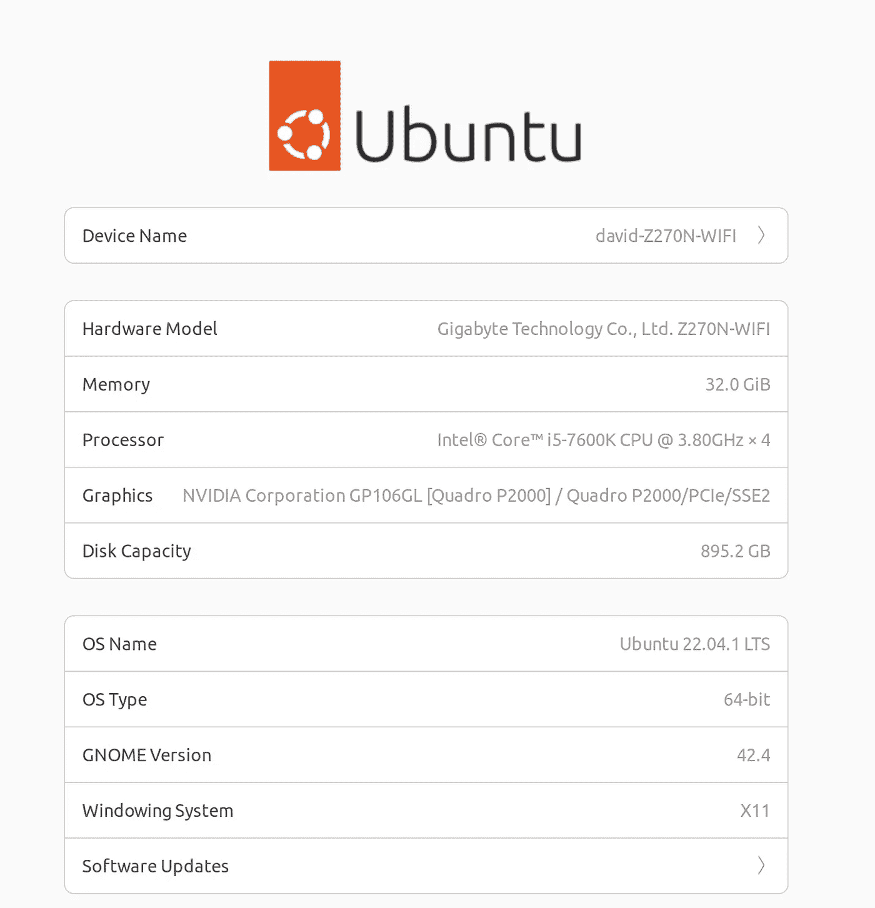

来自 about 系统的截图——在 Ubuntu 设置中——作者在写作当天的图片

系统的主要**亮点是:-**

*   **主板** : [Z270N-WIFI](https://www.gigabyte.com/Motherboard/GA-Z270N-WIFI-rev-10#kf)
*   **处理器** : [英特尔 4 核 i5–7600k](https://www.intel.com/content/www/us/en/products/sku/97144/intel-core-i57600k-processor-6m-cache-up-to-4-20-ghz/specifications.html)第七代 Kaby Lake
*   **GPU**:[Quadro p 2000](https://www.nvidia.com/content/dam/en-zz/Solutions/design-visualization/productspage/quadro/quadro-desktop/quadro-pascal-p2000-data-sheet-us-nvidia-704443-r2-web.pdf)5 GB gddr 5，1024 个 Cuda 核心
*   **内存** : 32.0 Gig — [海盗船复仇红](https://www.corsair.com/eu/en/Categories/Products/Memory/VENGEANCE%C2%AE-LPX-16GB-%282-x-8GB%29-DDR4-DRAM-3200MHz-C16-Memory-Kit---Red/p/CMK16GX4M2B3200C16R)
*   **电源:**海盗船积分仪 500w
*   **存储** : 895.2 GB，支持 SDD、FDD 和 mSata 硬盘
*   **操作系统**:LTS Ubuntu 22 . 04 . 1

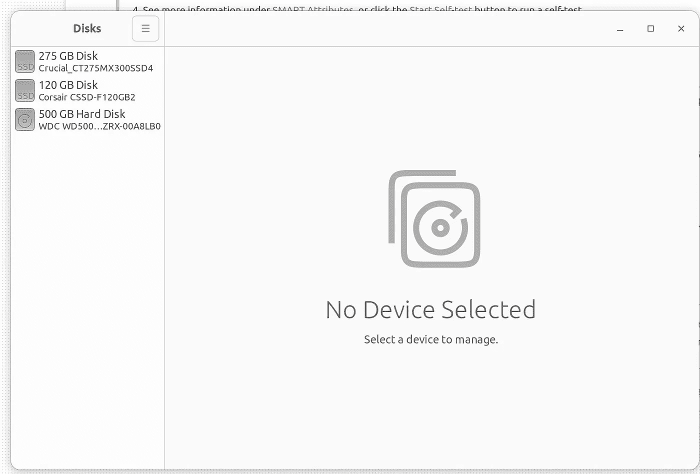

该系统有三种板载存储类型——作者在写作当天截图。

我自己组装了系统，并按照主板和 GPU 卡上允许的价格升级了组件。这个系统可以处理大多数任务，应该足以应对我们的挑战！我希望你同意，它是安全的说，没有硬件障碍！

## 用于实验的数据集

我为 GPU 实验选择了一个有 [7M 记录](https://www.kaggle.com/peopledatalabssf/free-7-million-company-dataset)的数据文件。在 Kaggle [1]上描述了[700 多万家公司的数据集，并在其他文章中使用，如](https://www.kaggle.com/datasets/peopledatalabssf/free-7-million-company-dataset)[“使用 Python 对 700 万家公司进行探索性数据分析”](https://medium.com/jovianml/exploratory-data-analysis-on-company-datasets-c331beaa28d0)

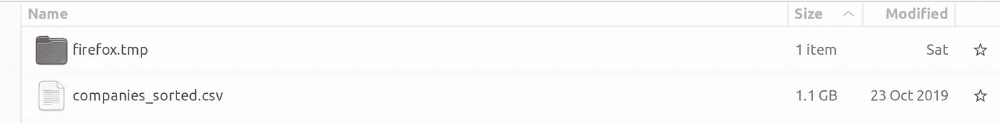

本地驱动器上数据文件的屏幕截图。图片由作者提供。

该文件大小为 1.1 GB，有 700 多万行和 11 列。由于 700 多万行，它扼杀了 Excel。 [Alteryx](https://www.alteryx.com/) 整个吞下。 [PowerBi 和 PowerQuery](https://support.microsoft.com/en-us/office/about-power-query-in-excel-7104fbee-9e62-4cb9-a02e-5bfb1a6c536a) 可以处理这个文件，但是我必须做摘要视图来将它们加载到 Excel 中。

在下载和使用数据集之前，最好检查许可，并确定所有权和权限。根据[知识共享 CC0.01](https://pdl.ai/3PhCOLo) 获得许可的 700 多万公司数据集。 ***“你可以复制、修改、分发和执行作品，即使是出于商业目的，都无需征得许可。”***

也有特定于发布者的规则，例如关于数据科学的[。因此，请小心选择数据集和来源，将许可证与出版商条款&条件相匹配。](/questions-96667b06af5#de82)

## GPU 设置

通常，调用 Nvidia-smi 是我检查和确定 GPU 是否可用的第一件事。我们看到，CUDA 11.4 可与 Nvidia 驱动程序 470.141.03 一起使用。所有这些都与我今年早些时候安装 Quadro 时所做的设置一致。

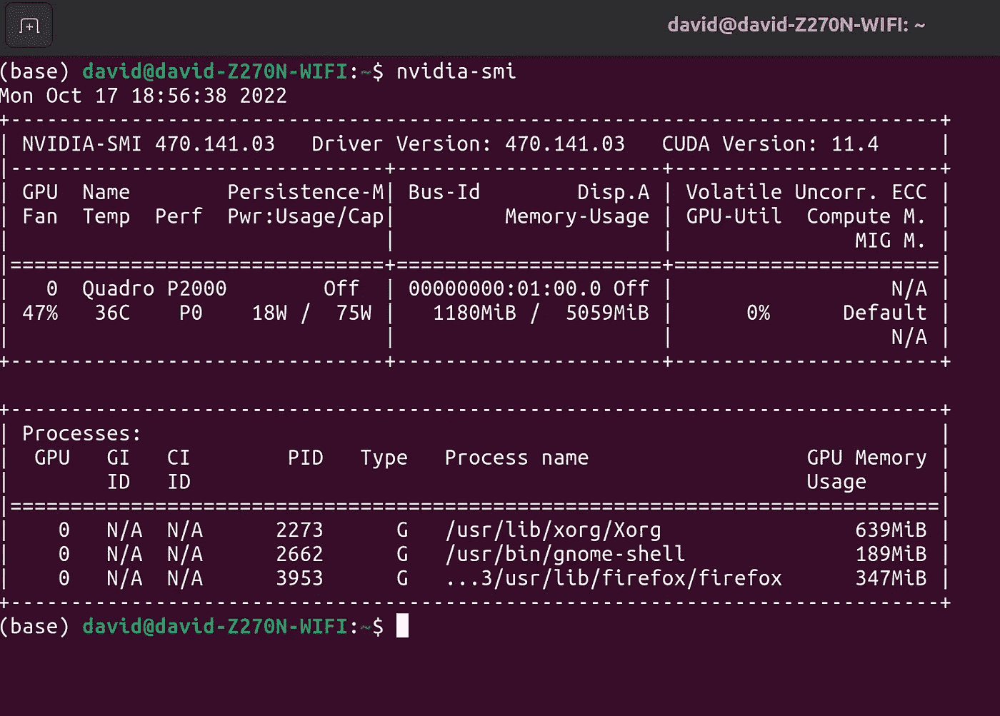

作者展示 Nvidia-smi 命令输出的图片。

您可能会注意到，GPU 上已经有一些工作负载，这只会导致问题。几乎 1GB 的卡 RAM ***已经被分配。*** 因此，我们必须将视觉显示工作负载转移到英特尔板载 GPU 上。重新配置 Xorg 屏幕设置使得 NVIDIA GPU 可以自由地专用于数据工作！我很喜欢在 4K 看网飞！

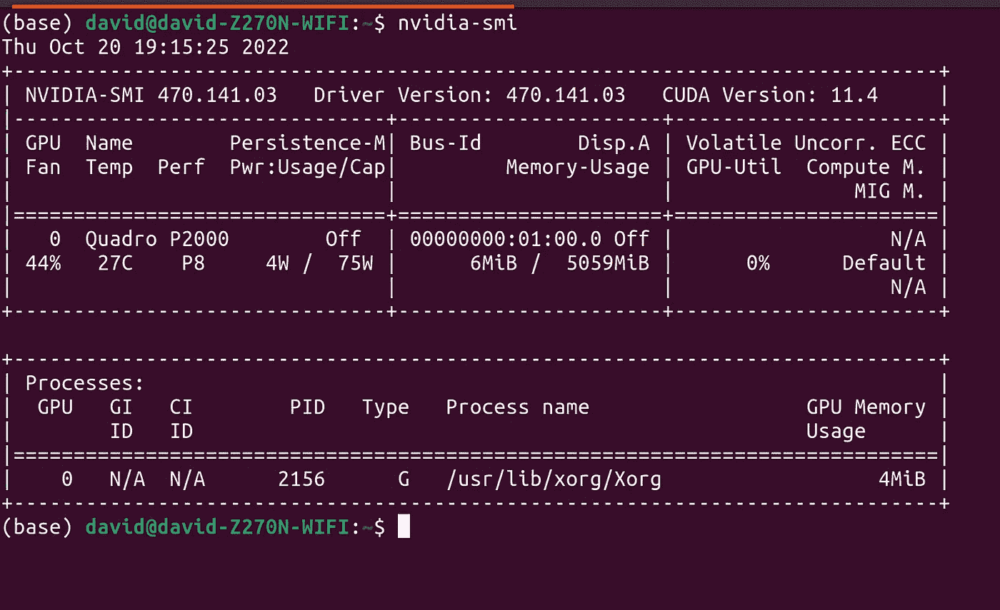

将视觉显示移到英特尔 CPU/GPU 后，NVIDIA 卡的可用性更高。作者图片

接下来，我们需要安装[急流](https://rapids.ai/)

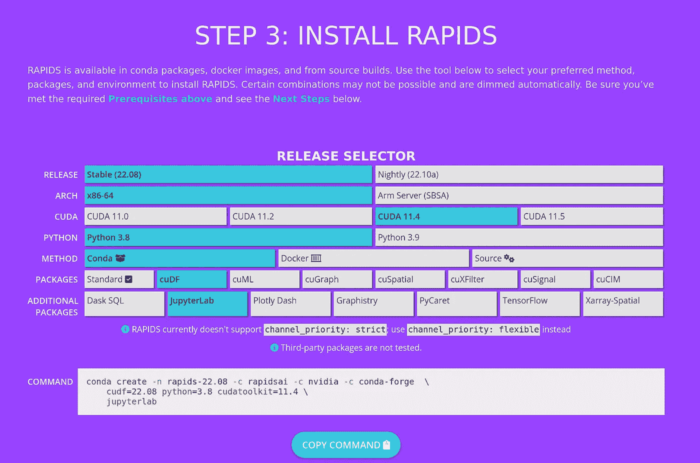

从[https://rapids.ai/start.html](https://rapids.ai/start.html)

复制命令并粘贴到终端。让 conda 负责一切，但只是根据您的系统做出正确的选择，以避免冲突和问题。最后，激活环境(rapids-22.08)，启动 jupyter 并做一个快速测试。

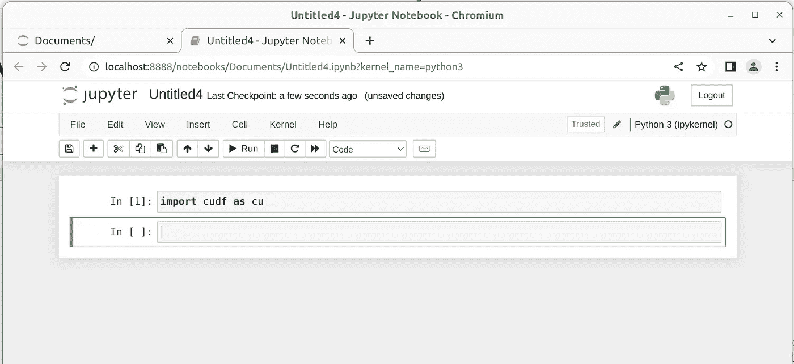

Jupyter 笔记本加载 cudf 成功的截图。作者图片

好了，我们了解了我们的硬件，并配置了我们的软件；现在是时候来点 EDA 了。**感谢**感谢**激流队，**我没有复杂的依赖挑战。

# 我们就偷懒吧，把文件扔在卡上。

因为 Rapids 安装在一个环境中，所以您必须首先激活该环境。我使用了 Anaconda Navigator，只是从可用的环境中进行选择。我使用的是 **rapids-22.08** ，这个环境是由 RAPIDS conda install 命令创建的——见前面。

我对这种快速而肮脏的方法感到惊讶。**成功了！**


照片由[帕蒂·布莱克](https://unsplash.com/@pattib?utm_source=medium&utm_medium=referral)在 [Unsplash](https://unsplash.com?utm_source=medium&utm_medium=referral) 上拍摄

让我们分几个块来看一下代码

## 加载模块

导入常规嫌疑人和 CUDF。因为我不确定我能走多远，所以我同时使用 cudf(cu)和 pandas(pd)。

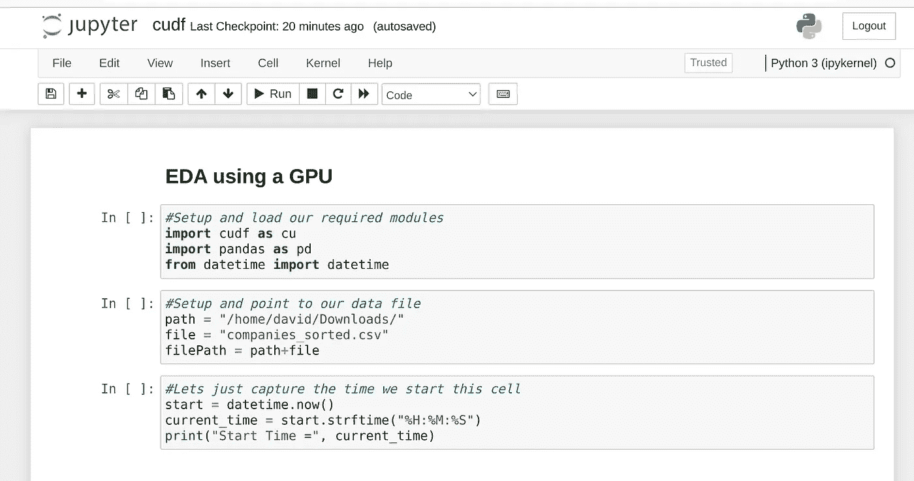

朱庇特笔记本——作者截图

## 构建基于 GPU 的数据框

请注意。read_csv()方法，它看起来类似于 pandas 方法，但是我们需要深入了解不同之处。现在，我只想感受一下它的表现，如果有的话！

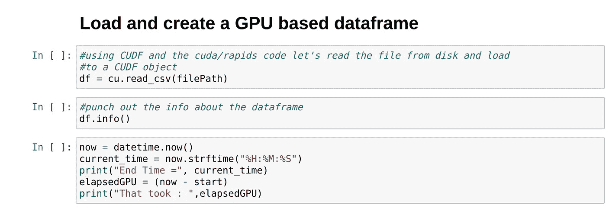

作者截图

## 使用传统的 RAM 和 CPU 计算方法

可能还要做一个 cudf。DataFrame.from_pandas！

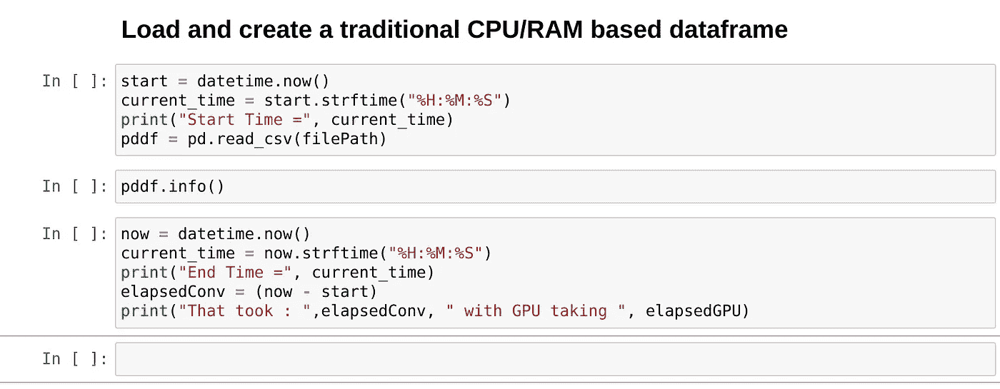

作者截图

# 结果

令人惊讶的是，这种方法开箱即用。之前我做了很多' **SUDOing** '和其他**痛苦的依赖**问题的解决。

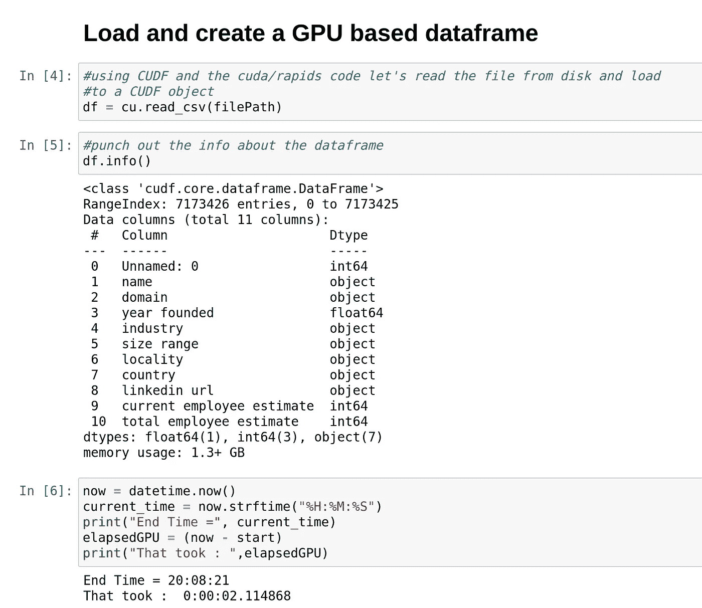

作者截图

我仍然很惊讶这样一种懒惰的方法起作用了——只需要大约 2 秒钟就可以读取那个大文本文件并将其传输到 GPU。印象深刻！该文件在磁盘上有 1.1GB。注意内存的使用——它是 1.3+ GB，嗯！Alteryx 在 Mac Mini M1 的 Windows 11 上通过 Parallels 报告了 6.4 秒。几分钟后，Power Query 仍在后台运行查询。

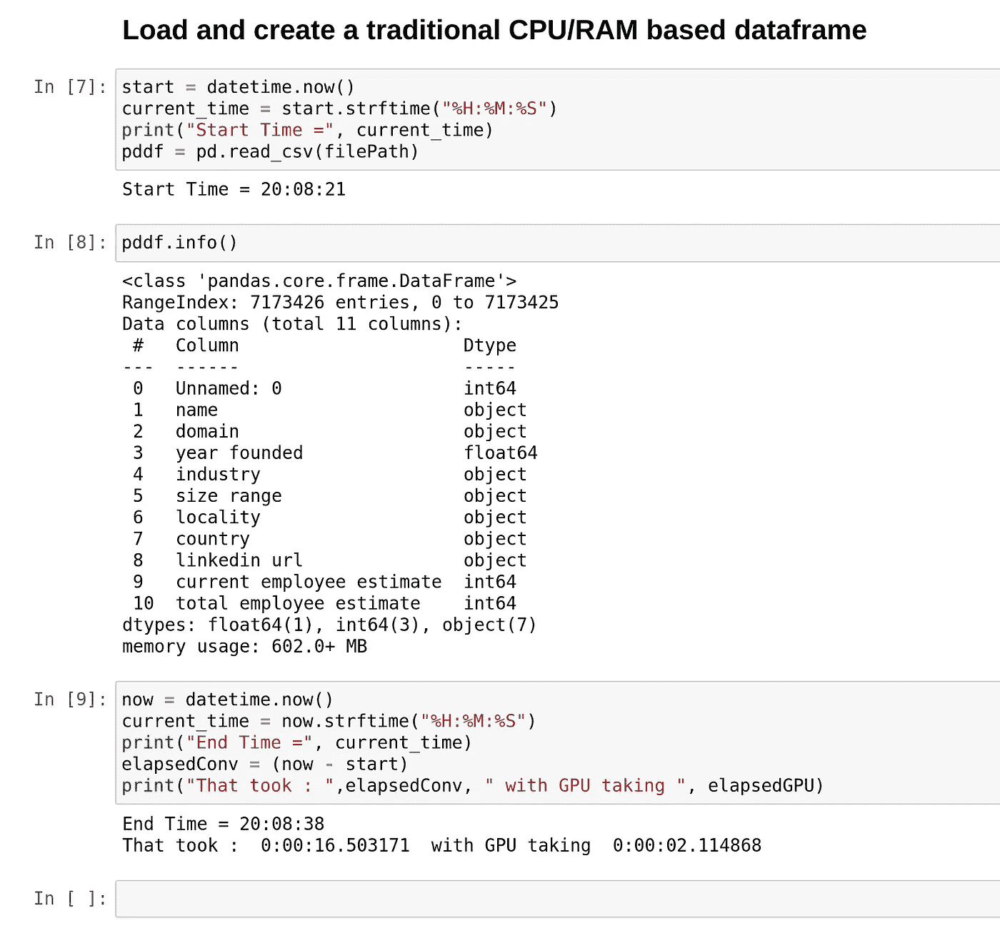

作者截图。

不出所料，装载熊猫总是开箱即用。读取、创建数据结构和将数据帧加载到 RAM 中需要 16 秒。几乎慢了 8 倍。但是看看内存占用大小-> 602.0+ MB 对 1.3+ GB。从视觉上看，两个设备上的数据帧具有相同的列和数据类型。

再次使用 NVIDIA-smi

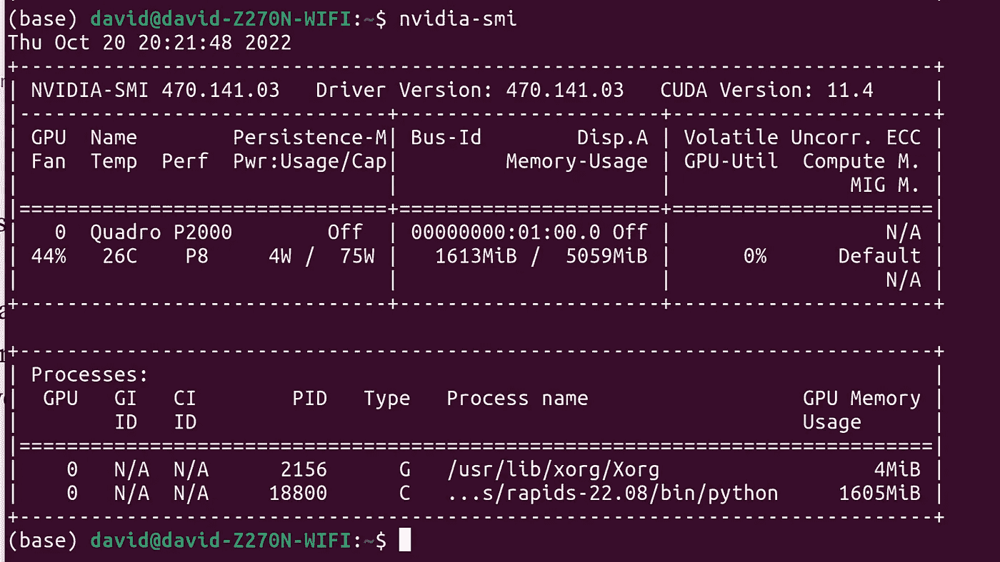

作者使用 Nvidia-smi 命令输出的截图

事实上，GPU 将 python 报告为分配了 1605 兆字节存储的用户。这令人印象深刻。

## 清洁

所以我们知道可以把大文件加载到 GPU，但是清理呢？尤其是丢失的值，计算代价会很高。

```
if(df.isnull().values.any()):
    missing = df.isnull().sum()
    print(missing)
    print(" ")
    for col in df.columns:
        print (col, "-\t", df[col].nunique())df.dropna(axis=0,inplace=True)df.notnull().sum()
```

打印缺失值汇总的基本代码，显示每列中唯一条目的数量，删除列中缺失值的所有行，然后转储所有非缺失值的汇总。

这种代码在 GPU 上速度快如闪电，但在传统的 CPU/RAM 方法上速度很慢。

```
Summarize missing: CPU/RAM: That took : **0:00:30.536083** 
with GPU taking **0:00:01.035225**
```

在传统配置上需要 30 秒，而在 GPU 上几乎不需要。Aggregation 和 groupby 也极快，语法和熊猫一样。

```
df.groupby('size range').agg({'year founded': ['min', 'max', 'count'], 'country': lambda x: x.nunique(), 'current employee estimate': 'median'})
```

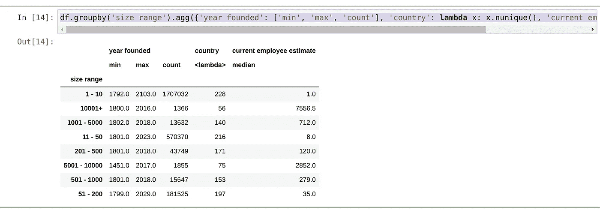

图片由作者在练习中从 Jupyter 笔记本中获得

```
df = df[df['year founded'] < 2023].copy()
pddf = pddf[pddf['year founded'] < 2023].copy()
```

子设置和复制数据帧在这两种方法中的行为也是相同的。酷！

## 形象化

好吧，清理一个数据帧在 GPU 上效果更好，但是一些图形呢？

好吧，这就是你可能已经在等待的东西！消息是 CUDF 不像 Pandas 那样包装 matplotlib。因此，我们不能直接在 GPU 数据框架外绘图。相反，我们必须将数据从 GPU 卡复制到主板 RAM 中。

```
df.to_pandas().plot()
```

自然，这就是我们停下来的地方。毕竟，我无法在 GPU 上完成整个 EDA 练习。我可以很快地准备一个数据框架，而且几乎没有痛苦，速度也很快！

# 警告

GPU 设备的行为不同于传统方法。像%%timeit%%这样的项目会导致 GPU 出现内存错误。

```
del pddf
del df
```

从 GPU 中删除数据帧会释放设备上的分配，并允许加载更多数据帧。您必须注意释放分配，否则设备会抱怨。

## 贮藏室ˌ仓库

我把我的代码加载到 GitHub，你可以在下面的链接找到这个笔记本。

[](https://github.com/CognitiveDave/ReadingList/blob/main/cudf.ipynb)  

为什么不加入 medium？50 美元的投资在 12 个月内是不错的回报

[](https://cognitivedave.medium.com/membership)  

# 参考文献/引文

[1]700 多万公司数据集根据[知识共享 CC0.01](https://pdl.ai/3PhCOLo) 获得许可。你可以直接从人民数据实验室索取一份[的拷贝，并在这里阅读更多关于他们](https://www.peopledatalabs.com/company-dataset?utm_campaign=Company%20Dataset&utm_source=Medium%20&utm_medium=Social%20&utm_term=company-dataset)[的内容。](https://medium.com/@peopledatalabs/2019-global-company-dataset-8acca1f1caf0)这里的数据用于加载到 GPU 上，并用于创建战术总结。