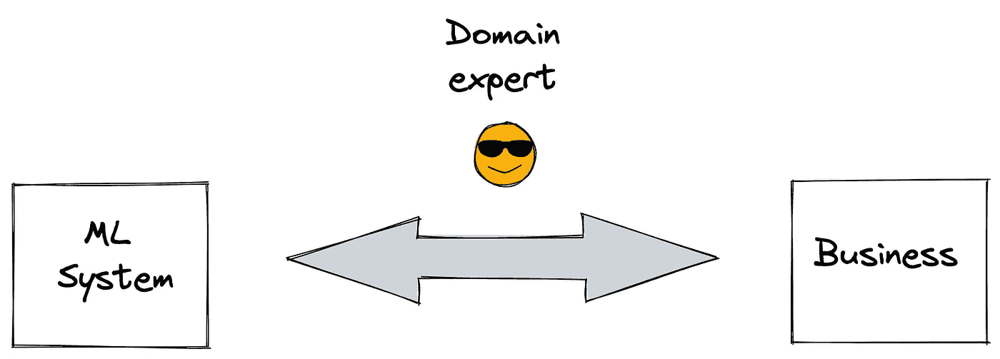

# 领域专家是健壮的 ML 系统的基本模块

> 原文：<https://towardsdatascience.com/domain-expert-is-an-essential-block-of-a-robust-ml-system-a29fd1576832>

## 在试图做得更好之前，先了解业务

在 [Unsplash](https://unsplash.com/s/photos/automation?utm_source=unsplash&utm_medium=referral&utm_content=creditCopyText) 上拍摄的 [ThisisEngineering RAEng](https://unsplash.com/@thisisengineering?utm_source=unsplash&utm_medium=referral&utm_content=creditCopyText)

我们看到不同的数字表明有多少百分比的机器学习模型从未投入生产。我不想给出一个确切的数字，但我们只能说大多数机器学习模型都没有实现生产化。

无法进行最后一步部署可能有多种不同的原因。

例如，与模型提供的值相比，运算在计算和存储方面可能太昂贵。或者，当模型被缩放时，结果和性能急剧恶化。

我们也可能无法将模型正确地部署到生产中。这是一个操作问题，可以通过实施一个强大的 MLOps 系统来处理和解决。

MLOps 指的是用许多不同类型的操作构建一个系统的过程，这些操作是同步的并且协同工作。

就像 DevOps 是创建大规模软件系统的常见做法一样，高效的机器学习系统也需要 MLOps。

数据科学家可以使用 Jupyter 笔记本中的样本数据集来创建和评估机器学习模型。

然而，当涉及到将 Jupyter 笔记本中的这个模型转换为在生产中连续运行的 ML 系统时，需要涉及到其他角色。

在这篇文章中，我们将讨论我认为对于创建一个健壮的、有利可图的、有益的 ML 系统最关键的角色:领域专家。

# 领域专家

这些都是懂业务的人。它们不一定是面向数据的，但对于数据如何在特定领域发挥作用提供了非常有价值的反馈。

ML 系统中面向数据的人员(例如，数据科学家、数据分析师、数据工程师)不可能对业务有全面的了解，这通常需要在特定领域积累多年的经验。

领域专家充当面向数据的人员和业务之间的桥梁。信息以洞察力、反馈或行动的形式在这座桥上双向流动。

(图片由作者提供)

假设一个数据科学团队试图为一家拥有许多商店的杂货零售商创建一个预测系统。

# 如何开始

ML 系统应该从领域专家开始。它们有助于定义业务目标和关键绩效指标(KPI ),这对于衡量 ML 系统的绩效至关重要。

领域专家知道企业需要什么。它们有助于解决需要解决的问题和有潜力改进的流程。

数据科学家或机器学习工程师挖掘数据，以提取见解，发现模式和关系。但是，需要将他们引向具有更大影响或商业价值的问题。这是领域专家可以帮忙的。

# 如何结束

假设面向数据的专业人员和领域专家坐在一起，进行长时间的头脑风暴。他们提出了问题和解决问题的方法。

设计并实现了 ML 系统。然后，我们开始看到结果。这些指标看起来不错，至少基于预定义的 KPI。

然而，我们离产生商业影响还很远。例如，问题可能是银行的客户流失预测。从数据科学家的角度来看，只要评估指标符合预定义的值，解决方案就很好。

然而，ML 系统的主要目标并不是满足度量标准。重要的是创造的商业价值。因此，领域专家应该参与到这样的场景中。

他们在负责 ML 系统的团队和以业务为导向的部门(如客户服务和市场营销)之间传递信息。这个信息流主要由迭代反馈组成，目标是使生产中的 ML 系统创造价值。

# 最后的话

一个 ML 系统由许多构件组成，这就是为什么有一个完整的规程来使它工作:MLOps。

MLOps 中涉及的职业可能会因组织或业务而异。典型的角色有数据科学家、数据工程师、软件工程师、机器学习工程师/架构师和领域专家。

当然，每个角色的工作都是至关重要的，但我觉得领域专业知识的重要性有时被低估了。没有领域专家或非常了解业务的人的 ML 系统很可能会失败。

你可以成为[媒介会员](https://sonery.medium.com/membership)来解锁我的作品的全部访问权限，以及媒介的其余部分。如果你已经是了，别忘了订阅[如果你想在我发表新文章时收到电子邮件的话。](https://sonery.medium.com/subscribe)

感谢您的阅读。如果您有任何反馈，请告诉我。