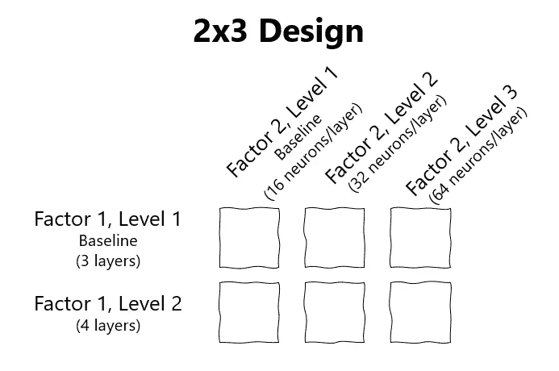
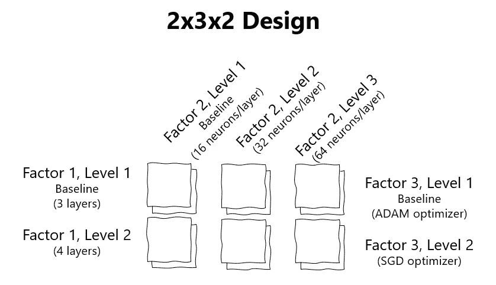

# 不要忘记你的数据科学家头衔中的“科学家”(第 2 部分)

> 原文：<https://towardsdatascience.com/dont-forget-about-the-scientist-in-your-data-scientist-title-part-2-28c208b86ba2>

## 在不引入混淆变量的情况下同时测试多个因素

[国家癌症研究所](https://unsplash.com/@nci?utm_source=medium&utm_medium=referral)在 [Unsplash](https://unsplash.com?utm_source=medium&utm_medium=referral) 上拍摄的照片

如果您错过了第 1 部分，请前往那里阅读完整的[实验设计介绍](/dont-forget-about-the-scientist-in-your-data-scientist-title-824f2c4110b)。

作为快速复习，实验设计是一种技术，允许研究人员评估许多不同因素对系统的影响[1]。我们讨论了如何避免混杂因素，并浏览了一些例子，但我们并没有真正讨论如何同时测试多个因素。

# 添加另一个因素

## 析因设计的美妙之处在于它非常容易扩展。

让我们从[以前的帖子](/dont-forget-about-the-scientist-in-your-data-scientist-title-824f2c4110b)中构建一个假设的深度学习模型的例子。每个级别中包含的具体内容并不重要，因此了解深度学习概念并不是能够理解的必要条件。

要评估如果模型中的神经元数量增加会发生什么，只需在实验中添加一个因子即可。让我们看看如果神经元的数量增加到 32 或 64(即 3 个级别:级别 1 是 16 的基线，级别 2 是 32，级别 3 是 64)会发生什么。为了全面衡量这一变化的影响，需要创建额外的实验来测试这些不同的超参数配置。下面是这一过程的概述，每个方框代表一个实验。

作者图片:2×3 因子设计

从 2x1 设计到 2x3 设计会导致额外增加四个测试场景。这看起来很简单，但是除了测试如果层数增加会发生什么之外，还创建了其他场景来测试不同数量的神经元场景。这里重要的一点是，我们需要测试一个因素的每一个水平与另一个因素的每一个水平。当一个实验被概括为 2×3 因子设计时，很容易进行数学计算，并看到需要测试六个场景来全面评估每个选项。最终的结果是，通过使用一个度量来测试性能，很容易评估六个场景中哪一个表现最好。

# 再加一个因素？？

这太简单了，为什么要止步于此呢？让我们疯狂一下，再加一个因素。

为了真正了解析因设计(这是我们在这里讨论的实验设计的具体类型的名称)是如何扩展的，让我们播放一个场景，其中我们还想测试不同的优化器。最初，ADAM 是基线优化器，但是如果使用 SGD，让我们测试一下性能指标的变化。为此，设计从 2x3 设计变为 2x3x2。这导致我们以前的设计有 6 个场景移动到一个将测试 12 个场景。

作者图片:添加两个级别的附加因子(优化器)的概要

冒着多余的风险，您可以很容易地看到，添加另一个具有两个级别的因素，使我们根据新因素的所有级别来评估之前的每个场景。此时，应该很容易看出这个框架的可扩展性。然而，增加一个额外的因素会增加总体工作量，这也是显而易见的。

# 自动化您的实验

如您所见，析因设计是一个很容易扩展的概念，但就需要测试的场景数量而言，它可能最终成为一个负担。这听起来可能需要做很多工作。如果每个场景都被单独测试，那么它肯定是可以的。

但是，通过创建嵌套的 for 循环，可以自动测试每个因素。这应该会减少将这个框架付诸实践的摩擦。只需确保将结果和基准度量保存到每个设计级别的列表或字典中。当所有的场景都完成后，你的实验将呈现一个模型的每个排列是如何执行的清晰画面。

总的来说，通过遵循实验设计框架，确定模型结果是否朝着正确的方向发展变得更加容易。不要将模型设计和评估的大部分精力集中在算法上，要确保在方法上花费一些时间来达到最终的模型状态。很容易认为一个小的改变不会影响性能或者只会略微改变结果。实验设计提供了一种方法，以确保这些结论植根于科学和严谨。实验设计，更确切地说是析因设计，是添加到您的数据科学家工具箱中的一个很好的工具。

## 来源

[1][https://www . jmp . com/en _ us/articles/what-is-experimental-design . html](https://www.jmp.com/en_us/articles/what-is-experimental-design.html)