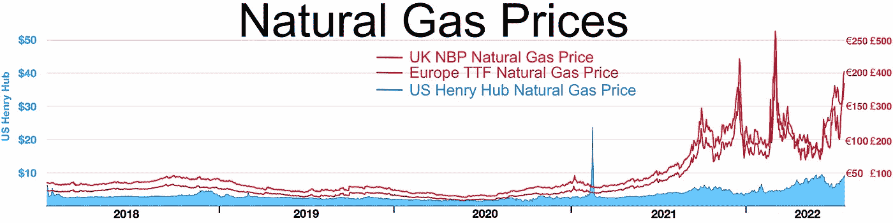
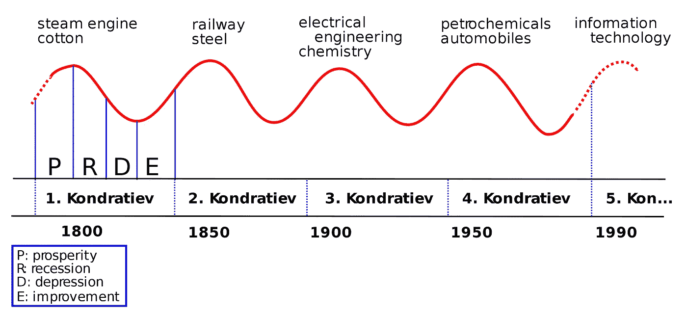

# 不要让通货膨胀和经济衰退毁了你的数据策略

> 原文：<https://towardsdatascience.com/dont-let-inflation-and-recession-ruin-your-data-strategy-a7e744ca0240>

## 宏观经济学如何帮助数据领导者制定稳健且有远见的数据战略

# 作为一个数据领导者，你到底为什么要关心宏观经济？

你曾经和高层领导在会议室里讨论过通货膨胀或经济衰退吗？以及如何建立一个特别工作组来解决这个问题？我有。这让我很不舒服。每个人似乎都有自己的看法，但我不明白他们在谈论什么。我想知道他们是如何学习经济学的。这不是你在学校学的东西，对吗？至少不是以一种适用于你工作的方式。这也不是你每天在工作中都会遇到的事情。每隔一年，当一些不寻常的事情发生时，你就会接触到它。那么，所有这些高级领导人似乎都很轻松地做出预测和决策，这怎么可能呢？作为一名年轻的经理，看到自己缺乏经验暴露出来，感觉很糟糕。经济学是曾经让我感到难为情的话题之一。当经济衰退来袭时，更有经验和智慧的高层领导似乎总是更清楚正在发生什么，接下来会发生什么，以及该做什么。

> 作为一名年轻的经理，看到自己缺乏经验暴露出来，感觉很糟糕。

经济风暴数据——人工智能生成的艺术与 [DALL。E](https://labs.openai.com/)

山村里的长辈可以通过云的形状和天空的颜色告诉你是要下雨还是要下雪。他们知道如何探测和准备即将到来的雷暴。当然，他们不能阻止风暴的发生，也不能防止所有的损害，但他们通常比年轻人准备得更充分。

> *要变老变聪明，你必须先变年轻变笨*

然而，我有一个好消息:你不必永远在你的高层面前显得愚蠢。如果你能从别人的经验中学习，你会变得更聪明，更早。在商界，就像在山区一样，你可以学会识别经济衰退或恶性通货膨胀的早期迹象以及对你的业务可能产生的后果，这样你就可以更好地带领你的团队度过难关。

## 什么是宏观经济学？

根据维基百科:

> ***宏观经济学*** *是* [*经济学的一个分支*](https://en.wikipedia.org/wiki/Economics) *把一个* [*经济*](https://en.wikipedia.org/wiki/Economy) *作为一个整体来处理表现、结构、行为和决策。比如，利用利率、税收和政府支出来调节经济的增长和稳定。*

换句话说，宏观经济学是对你的企业所处的全球环境的研究。

## 宏观经济学大部分时间“看不见”的原因。

做生意的时候宏观经济学无处不在。但是因为它一直在这里，而且通常移动很慢，所以你甚至不会注意到它。宏观经济学对于经理来说就像水对于鱼一样。

让我用戴维·福斯特·华莱士的一个故事来说明我的观点:

> *有两条小鱼在游泳，它们碰巧遇到一条游向相反方向的老鱼，老鱼朝它们点点头说:“早上好，孩子们。水怎么样？”两条小鱼游了一会儿，最后其中一条看着另一条，问道:“水到底是什么？”*

鱼缸里的小鱼不明白什么是水，因为它从未遇到过其他任何东西。它甚至不能理解水的存在。

同理，一个有五年经验的年轻经理，从来没有经历过衰退，或者相反，只知道衰退。

## 你没看到不代表不会改变

下图说明，你可能有整整 10 年的工作经验，但仍从未遇到过像目前这样的能源价格上涨。

[天然气价格由维基百科](http://by Wikipedia CC BY-SA 3.0) CC BY-SA 3.0

另一个例子是看更广泛的经济。1926 年，经济学家尼古拉·康德拉蒂耶夫提出资本主义经济体系存在 40 年周期的假设。在 20 年的上升阶段，公司投入大量资金来对抗竞争，价格也随之上涨。达到峰值后，由于供应过剩和需求放缓，经济会放缓 20 年。此后，这一理论受到了挑战并得到了丰富。但我们仍然确信，经济不是一个水平不变的海洋，而是一个潮汐周期非常缓慢的海洋。这一潮流不断改变着商业环境。在周期的某一点，事情开始加速，让那些没有准备好的人大吃一惊。

[康德拉季耶夫波](https://en.wikipedia.org/wiki/Kondratiev_wave)由维基百科 CC BY-SA 3.0

我并不是说你应该变得偏执，对一切不可避免会出错的事情麻木不仁。但是了解宏观经济学会给你一个直觉，让你知道明天事情会如何变化，并挑战你的假设。

## 不懂经济学会让你付出什么代价

如果你不了解宏观经济学，这里有两个在你领导数据函数期间可能出错的例子:

*   一场重大的、意料之外的通胀浪潮可能会突然出现。突然，你发现以客户为中心的定价成了首席执行官的头等大事。你需要几周时间来了解哪些类别的通货膨胀将受到最严重的打击，以及如何重新调整数据科学团队来解决这个问题。当您的团队开始运作时，您的竞争对手已经重新定位了他们的整个目录定价。他们行动更快，并大胆宣布将保护旗舰产品的价格。他们赢得了对客户价格认知的竞争，同时保护了他们的利润。在你反应过来的几周内，你损失了数百万的息税折旧及摊销前利润。
*   一场突如其来的疫情引发了严重的供应短缺。曾经运转良好的供应链开始崩溃。您刚刚花了两年时间构建了一个最先进的需求预测算法，将准确性提高了 2 个百分点，这是一个值得称赞的成功。问题是你的算法被微调以在平稳的巡航速度条件下工作。现在销售曲线快速下降，算法预测销售会完全崩溃，你必须在它搞乱你的整个供应链之前拔掉它。

在 2019 年，那些世界末日的场景会让你笑得不敢相信。现在你知道这真的发生了。人们很容易将它们视为无人能预测的不可抗力。真的吗？有没有一种方法可以让您的数据策略更具弹性，以便为最坏的情况做好准备？有没有办法比你的竞争对手更快更好地应对危机？我相信宏观经济学技能会给你这种优势，我会举例说明如何做到这一点。

## 宏观经济学知识给你一个直升机视角，让你看得更远

理解宏观经济学将帮助你在空间和时间上看得更远。

*   在太空中，因为你会明白世界上其他地区的经济状况会有很大的差异。在你的欧洲总部，通货膨胀可能不是一个问题，但在业务运营的新兴国家，通货膨胀却是一个反复出现的危险。
*   及时，因为即使你现在正在经历增长，如果你的核心客户群的购买力明天被通货膨胀摧毁，你很可能会失去你的业务。

这一增强的愿景将使您能够:

*   当经济风暴来袭时，做一个有战略头脑的冷静领导者，
*   在董事会面前看起来更聪明，这总是感觉很好，说实话。

最终，我相信宏观经济学素养可以成就或毁灭一个首席数据官。根据《HBR》的一篇文章，CDO 的平均任期只有两年半:“为什么首席数据官的任期这么短？”[1].这意味着你只有一次机会。如果你最初的战略仅仅一年后就因为经济环境的变化而变得无关紧要，这将严重降低你成功的机会。

> *CDO 的平均任期只有两年半。这意味着你只有一次机会。*

# 经济条件决定您的数据策略的例子

在接下来的部分中，我将给出具体的例子，说明如何在数据策略中考虑宏观经济因素，如通货膨胀和 GDP。我将说明它会如何影响:

*   您的用例优先级。
*   您的数据团队的组织。

# 通货膨胀的影响

通货膨胀是价格水平的普遍上涨。大多数发达经济体的通胀率稳定在 2%以下。它允许最低限度的失业和通货膨胀的不利影响。然而，新兴经济体更容易出现恶性通货膨胀，有时会带来灾难性的后果。在最严重的危机中，人们的工资每天会被支付很多次，因为早上赚的 100 美元的国家货币到当天晚上可能会贬值 20%。人们在午休时开始购买食品杂货，因为如果他们等到下午 5 点，价格会变得更贵。即使在发达经济体，通胀也可能像 2022 年那样失控，成为首席执行官们最关心的问题。

## 用例优先级

在通货膨胀时期，你的成本可能会急剧增加，并在几个月内将你的利润降至零。这意味着成本控制用例以及定价用例成为优先事项。

*   在成本控制用例类别中，能源价格通常是上涨最快的。如果你能够进行能效分析，你就知道在哪里采取行动来实现节约。
*   在定价用例类别中，如果您可以利用高级分析，您可以战略性地确定价格增长目标。你将冻结需求价格弹性最高的产品的价格上涨。这样你就能在低价竞争中击败竞争对手。你将最大限度地提高不太敏感产品的价格，因为你比竞争对手更便宜，从而赢得利润。

## 数据团队组织

如果你在一家跨国公司工作，对于你在伦敦总部的数据科学家来说，通货膨胀可能是一个非常抽象的概念，而对于你在伊斯坦布尔办公室的数据科学家来说，这可能是完全正常的事情。土耳其业务部门可能没有资源来开发端到端价格弹性算法，最好在总部为整个集团开发。然而，你可以让你的土耳其数据科学家微调通胀经济的算法。

# 国内生产总值和增长的影响

## 用例优先级

当经济衰退来袭时，每个客户群都会受到不同的影响。例如，越朴素的家庭失去的购买力越多。这扭曲了你的客户细分。这需要你与市场营销密切合作，量化需求的结构性变化，并定义可操作的杠杆。

然后，你的公司变得厌恶风险，并试图控制成本，以度过营业额崩溃。你将不得不在成本效益用例上与财务部门合作。

## 数据团队组织

当经济衰退出现时，你的数据预算可能会缩减，或者至少增长会更慢。你将比以往任何时候都更需要向你的首席财务官证明你的价值。衡量价值创造需要花费数月时间来建立官僚机构和能力。因此，即使今天很容易获得预算，开始跟踪价值创造也可能是值得的，这样当糟糕的日子到来时你就可以做好准备。

# 如何开始

*   **问经济问题**:不要只依赖公司战略幻灯片，你可以通过研究对潜在经济假设的敏感性，使你的战略更稳健、更有远见。例如，问你的营销部门:“什么会出错？”，“当经济衰退来临时，我们的客户需求会发生什么变化”？或者问你的财务部门:“在恶性通货膨胀的情况下，成本结构会以多快的速度和多深的程度演变？”。
*   **学习基础知识:**了解供给、需求、通货膨胀和 GDP。在我看来，如果你不能上完整的课程，学习经济学家的历史是最令人信服的方法。早期的经济学家从非常简单的模型开始，经过几十年的研究，这些模型被挑战、扩充或替换。观察他们的思维过程是令人着迷和有启发性的。

如果你不知道从哪里开始，这里有一些我推荐的资源。我没有深入研究所有这些内容，但内容似乎经过改编，并以一种可操作的方式呈现出来(我没有任何从属关系):

*   《宏观经济学简明指南:经理、高管和学生需要知道的东西》，作者是[大卫·A·莫斯](https://www.amazon.fr/David-A-Moss/e/B001HOUZU8/ref=dp_byline_cont_book_1)。虽然我没有读它，但它在亚马逊上被评为 4.6 星，这对于一本经济学书来说是很了不起的。它似乎是为管理者设计的。一个好的简洁的选择，比大的教科书便宜。
*   [Coursera](https://www.coursera.org/learn/macroeconomics-for-business-management)上的商业管理宏观经济学 MOOC。评论是恒星与 4.9 星评级。它似乎提供了坚实的理论基础以及商业规划和投资决策的应用。因为它代表了 14 小时的学习。
*   [经济学](https://www.mheducation.co.uk/higher-education/feature/begg-vernasca/economics-12th)，教科书作者[大卫·贝格](https://www.amazon.com/s/ref=dp_byline_sr_book_1?ie=UTF8&field-author=David+Begg&text=David+Begg&sort=relevancerank&search-alias=books)，[吉安路易吉·韦尔纳斯卡](https://www.amazon.com/s/ref=dp_byline_sr_book_2?ie=UTF8&field-author=Gianluigi+Vernasca&text=Gianluigi+Vernasca&sort=relevancerank&search-alias=books)，[鲁迪格·多恩布什](https://www.amazon.com/s/ref=dp_byline_sr_book_3?ie=UTF8&field-author=Rudiger+Dornbusch&text=Rudiger+Dornbusch&sort=relevancerank&search-alias=books)，[斯坦利·菲舍尔](https://www.amazon.com/s/ref=dp_byline_sr_book_4?ie=UTF8&field-author=Stanley+Fischer&text=Stanley+Fischer&sort=relevancerank&search-alias=books)。这是我为宏观经济学课学习的书。它内容全面，既有深入的理论探讨，又有大量图表和历史插图，读起来引人入胜。它非常丰富和详细，所以需要一定的努力，但你可以浏览一下。它也涵盖了微观经济学。

# 结论

宏观经济学不是你作为数据领导者需要的第一技能。然而，基本的宏观经济学知识将帮助你在空间和时间上看得更远。这对有效的领导至关重要。了解通货膨胀和 GDP 增长将使您能够构建更加优化和稳健的数据策略。你不会被经济危机压垮，而是冷静地领导。

> 不要等到老了才明白。历史会重演。

特别感谢我的编辑[本·胡伯尔曼](https://medium.com/@benzbox)，让这篇文章对社区来说更具相关性和可操作性。

[1]达文波特、比恩和金、[为什么首席数据官的任期如此之短？](https://hbr.org/2021/08/why-do-chief-data-officers-have-such-short-tenures) (2021 年)，HBR