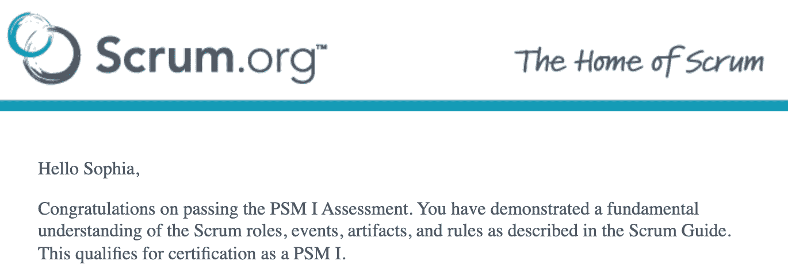
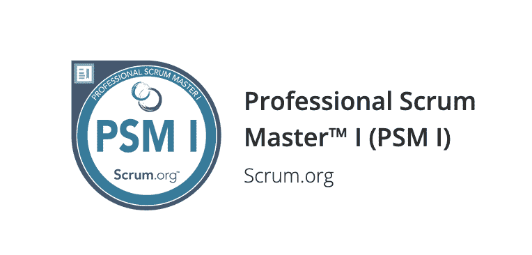

# 不要让数据科学家做 Scrum

> 原文：<https://towardsdatascience.com/dont-make-data-scientists-do-scrum-de87bc921a6b>

## 来自数据科学家和认证 Scrum 大师的想法

Photo by [傅甬 华](https://unsplash.com/@hhh13?utm_source=unsplash&utm_medium=referral&utm_content=creditCopyText) on [Unsplash](https://unsplash.com/?utm_source=unsplash&utm_medium=referral&utm_content=creditCopyText)

> [*Scrum 指南*](https://scrumguides.org/scrum-guide.html)*::*Scrum 是一个轻量级框架，通过对复杂问题的适应性解决方案，帮助个人、团队和组织产生价值。”

Scrum 已经超级流行很多年了。我对它在营销上的成功感到惊讶。这就像软件开发管理框架世界的卡戴珊。我对 Scrum 也有同样的感觉，因为《敏捷宣言》的作者之一在他的文章中写道:“一旦宣言流行起来，敏捷这个词就变成了一块磁铁，吸引着任何有观点、有时间、有产品要卖的人。”

对我来说，Scrum 看起来很重过程，这违背了敏捷宣言的第一个价值观——个人和交互重于过程和工具。但也许我对 Scrum 了解不够？所以我决定学习更多关于 Scrum 的知识，甚至成为一名认证的 Scrum 大师。现在我更明白为什么我不喜欢它，为什么它对数据科学家来说不理想。

# **1。Scrum 是不可变的**

> [*Scrum 指南*](https://scrumguides.org/scrum-guide.html)*:*“Scrum 框架，正如这里所概述的，是不可变的。虽然只实现 Scrum 的一部分是可能的，但结果不是 Scrum。Scrum 只完整地存在，并且作为其他技术、方法和实践的容器运行良好。
> 
> “框架的每个元素都服务于一个特定的目的，这个目的对于 Scrum 实现的整体价值和结果是必不可少的。改变 Scrum 的核心设计或想法，省略元素，或者不遵循 Scrum 的规则，掩盖了问题，限制了 Scrum 的好处，甚至可能使它变得毫无用处。”

Scrum 是一个框架，由一个 Scrum Master、一个产品所有者和一个或多个开发人员组成的小团队组成。Scrum 被组织成 Sprint，有四个与 Sprint 相关的事件:Sprint 规划、每日 Scrum、Sprint 回顾和 Sprint 回顾。根据 Scrum 指南，Scrum 是不可变的。敏捷框架怎么可能一点都不敏捷？许多人说他们喜欢只使用吉拉门票和每日站立，根据 Scrum 指南，这不是 Scrum。

# **2。数据科学家并不致力于单一的“产品”,我们的工作往往不是一个增量**

> [*Scrum 指南*](https://scrumguides.org/scrum-guide.html)*:*“Scrum 的核心是冲刺，这是一个月或更短的时间，在此期间，一个完成的、可用的、有价值的产品增量被创造出来。这适用于每一次冲刺。Sprint 的目的是产生一个有价值和有用的工作产品增量。”

数据科学家通常只从事各种项目，每个项目都与不同的利益相关者相关联。同一个团队的数据科学家通常不从事相同的“产品”工作，而是有着共同的“产品目标”。数据科学家所做的工作通常不是增量，也不是为单一的“产品目标”或“冲刺目标”而设计的。

# **3。数据科学家并不总是需要产品负责人**

> [*Scrum 指南*](https://scrumguides.org/scrum-guide.html) *:* “产品负责人代表了产品 Backlog 中众多利益相关者的需求。产品负责人代表 Scrum 团队的利益相关者，这包括在产品 Backlog 中代表他们想要的需求。

依靠产品负责人代表 Scrum 团队的利益相关者进行数据科学研究是一个糟糕的想法。正如我前面提到的，数据科学家经常与许多不同的利益相关者和不同的项目合作。仅仅从产品负责人那里了解背景是不够的，没有动力，也没有必要。对于数据科学家来说，更有效的方法是直接与利益相关者互动，了解问题的背景，深入与利益相关者的讨论，并自己制定计划。

同样，在 Scrum 中，产品负责人的责任是将复杂的问题分解成待办事项。这对数据科学家也不起作用。数据科学家做的大部分工作是研究，而不是产品开发。给定问题和问题的背景，我们设计我们自己的*项目路线图和分析框架。因为所需的任务对任何人来说都还不清楚，从数据科学家那里拿走这些任务是不合理的，他们的工作是让他们清楚。*

产品负责人为项目设定优先级也是不合理的。其他利益相关者经常给我们项目的时间表。由于这些需求来自不同的来源，数据科学家需要能够根据所有不同项目的时间表和紧迫性来确定自己时间的优先级。如果需要，数据科学经理，而不是产品所有者，应该能够提供帮助。

# **4。Scrum 夺走了所有权**

> Srum.org:“开发人员何时成为 Sprint Backlog 项目的唯一所有者？
> 
> 从来没有。所有 Sprint Backlog 项目都由 Scrum 团队的开发人员“拥有”。整个 Scrum 团队负责在每个 Sprint 中创建有价值的、有用的增量，并且为 Sprint 选择的产品 Backlog 项目集由开发人员集体所有。没有一个单独的开发人员可以声称对一个项目的所有权，因为这将阻碍沟通和协作。随着学习的深入，开发人员会在整个 Sprint 过程中更新 Sprint Backlog。"

数据科学家拥有自己的项目是相当常见的。拥有这种主人翁意识从本质上激励数据科学家在项目中做得更好。坦率地说，数据科学家可能甚至不想拥有其他数据科学家的项目。例如，一个从事新闻提要工作的数据科学家不应该觉得他/她应该拥有另一个数据科学家正在从事的广告项目。所涉及的知识和专业技能不会在人与人之间均匀地转移，部分原因是每个人都在探索特定主题的旅程中。即使两个数据科学家在同一个项目中工作，在我看来，每个人仍然应该拥有项目的不同部分。

# **5。“完成”的定义因项目而异**

> [*Scrum 指南*](https://scrumguides.org/scrum-guide.html) :要求开发者符合 Done 的定义。如果有多个 Scrum 团队一起开发一个产品，他们必须相互定义并遵守相同的 Done 定义。
> 
> 理解和应用 Scrum 框架允许团队和组织在 30 天或更短的时间内迭代地和增量地交付“完成”工作的可发布软件的有价值的产品。

不同的项目差别很大，不可能对我们所有的项目使用相同的 Done 定义。

# **6。冲刺复习不起作用**

> [*Scrum 指南*](https://scrumguides.org/scrum-guide.html) *:* “冲刺评审的目的是检验冲刺的成果，确定未来的改编。Scrum 团队向关键利益相关者展示他们的工作成果，并讨论产品目标的进展。

一个数据科学家团队可能有许多不同的关键利益相关者。我们邀请哪些利益相关者参加冲刺评审？对于数据科学家来说，在每周的项目会议上直接向各种项目干系人展示结果通常更有效。

# **更多想法**

如果 Scrum 不起作用，那么什么*会为数据科学家团队工作呢？我喜欢一个朋友的建议，忽略 Scrum 的形式，想想 Scrum 的哪些部分在数据科学而不是软件开发的背景下是有价值的。我确实认为人渣的三大支柱(透明、检查、适应)有道理。我认为所有这三个价值可以简单地通过与涉众的每周项目会议、项目演示的每周团队会议以及良好的文档来实现。具体来说:*

## *1。如何让人们对他们正在做的事情有一个共同的理解？*

**与利益相关者的每周项目会议**和**项目演示的每周团队会议**让每个人都有机会公开他们在做什么、他们的进展和他们的计划。我想了解其他人项目中的思维过程、研究框架和详细的学习内容，我不在乎人们每天/每小时都在做什么。这就是为什么我更喜欢项目演示，而不是毫无意义地浏览每一张票/任务，而不去了解项目的背景和细节。对于指导和学习新的技术技能，深入项目演示会议或**结对编程**会议的技术细节也会有所帮助。

**文档**也有助于提高透明度。包含所有会议记录、决策、分析、结果和其他内容的共享项目文档通常很有价值。找不到所有的文件？使用 wiki 页面列出所有项目文档。对于喜欢吉拉门票的团队来说，吉拉可以是一个很好的记录工具，这样就可以记录正在做的事情。使用什么文档工具取决于团队自己的偏好。

## *2。如何就成功的要素达成共识？*

由于数据科学家项目通常没有“完成”的明确定义，我们如何检查和衡量成功？与涉众的每周项目会议、项目演示的每周团队会议和文档允许涉众和团队成员检查、深入研究并给出有意义的反馈。为了在项目上取得成功，可能有两种情况:a)涉众或数据科学家自己对项目有一个清晰的愿景和期望。在这种情况下，当项目符合利益相关者的期望时，数据科学家就完成了项目。b)通常情况下，利益相关者或数据科学家只有一个模糊的初始想法，项目期望是一个正在进行的对话。在这种情况下，与利益相关者会面和沟通以制定潜在的计划和后续步骤是非常重要的。每周都会有新的项目步骤，当利益相关者和数据科学家觉得可以与他人分享见解时，项目就可以完成了。

## *3。什么时候决定一种方法不起作用，需要一种新的方法？*

就实际工作而言，数据科学家在会议和文档审查中收到上下文和反馈，这有助于他们改进甚至在需要时转向新的分析框架。鉴于数据科学工作的研究性质，反复试验是不可避免的。因此，尝试一些东西，然后发现它可能不工作也没关系。

就结构和管理方法而言，Scrum 呼吁召开一次 Sprint 回顾会议，讨论什么可行，什么不可行。我认为这是一个很好的想法，但它可以集成到其他方法中。每个人都应该感到鼓舞，在空闲时间和会议上表达他们的担忧。我认为在每周例会和与经理一对一的会议中给人们一些时间和空间是一个很好的做法。如果关注是有价值的，并且需要单独的空间来讨论，我们可以安排一个会议来讨论这个关注。

如果你是数据科学家或数据科学经理，我很好奇你的团队是如何管理的，以及你对 Scrum 的体验。请让我知道。很想听听大家的经验和建议。

# 参考资料:

*   Scrum.org
*   Scrumguides.org
*   https://pragdave.me/blog/2014/03/04/time-to-kill-agile.html
*   【http://agilemanifesto.org/ 

作者索菲亚·杨 2022 年 1 月 4 日

在 [Medium](https://sophiamyang.medium.com/) 、 [Twitter](https://twitter.com/sophiamyang) 、 [Linkedin](https://www.linkedin.com/in/sophiamyang/) 和 [YouTube](https://www.youtube.com/channel/UCruSa8hlUAa3aHQ189oOggQ) :)上关注我