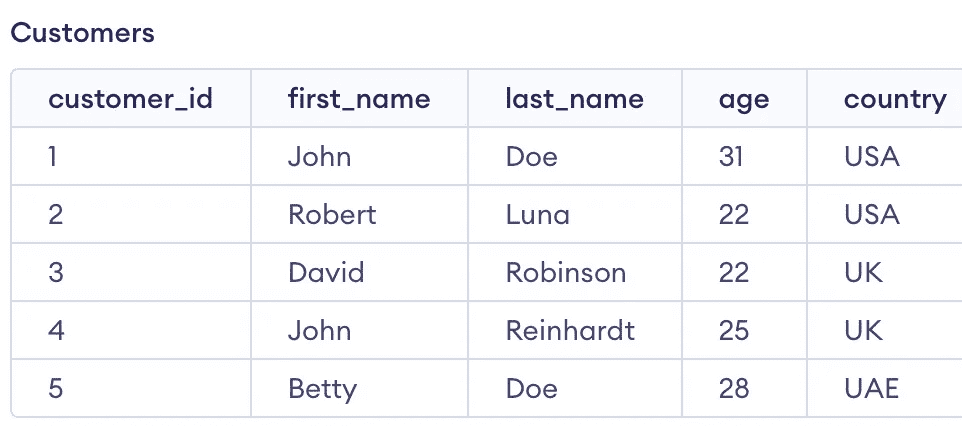
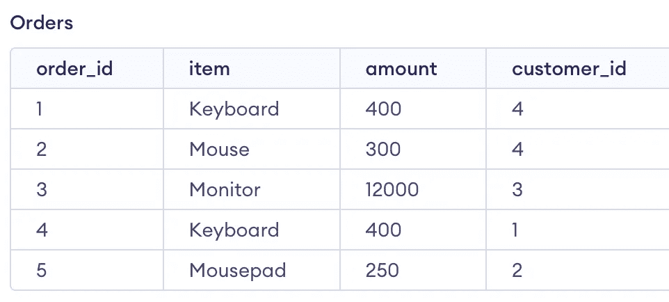
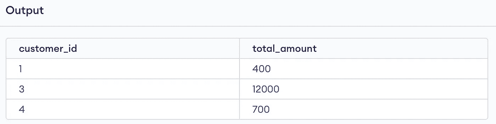
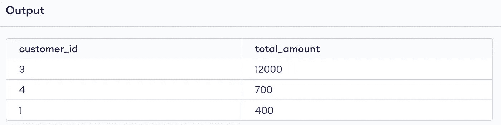
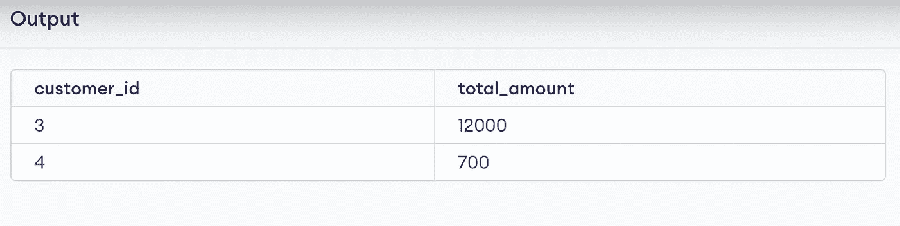
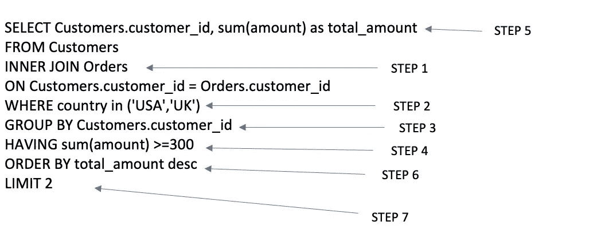

# 不要以“Select”语句开始 SQL 查询

> 原文：<https://towardsdatascience.com/dont-start-your-sql-queries-with-select-clause-d30fa1b701f6>

## 遵循这种正确的方法来编写 SQL 查询


图片来源:Unsplash

## 问题是

大多数开发人员开始用' SELECT '子句编写他们的 SQL 查询，然后编写' FROM '，' WHERE '，' HAVING'…诸如此类。但这不是编写 SQL 查询的“正确”方式，因为这很容易出现语法错误，尤其是如果您是 SQL 初学者。

## 解决方案

“理想的”查询编写顺序应该与 SQL executor 执行查询的方式一致。这将确保您不会犯任何语法错误，并编写高效的 SQL 查询。您将知道如何在执行连接之前过滤数据，何时使用“HAVING”或“WHERE”子句等等。

在这篇博文中，我们将探讨编写 SQL 查询的“理想”方式，这将帮助您成为一名高效的 SQL 开发人员。

我们将使用客户和订单表(如下)来查找来自美国/英国的总消费超过 300 美元的前 2 名客户。



客户表(图片由作者提供)



订单表(作者图片)

让我们深入探讨编写 SQL 查询的正确方法。

## 1.总是以 FROM/JOIN 开头

直观地说，第一步是使用 FROM 子句读取表并执行 JOIN(如果需要的话)。因此，您应该始终以“FROM”/“JOIN”语句开始查询。

```
 FROM Customers
INNER JOIN Orders
ON Customers.customer_id = Orders.customer_id
```

甚至在执行连接之前，我们也可以从输入表中过滤行。我们可以通过在连接的“ON”子句后添加“AND”子句来做到这一点。

```
-- Filter happens before Join

FROM Customers
INNER JOIN Orders
ON Customers.customer_id = Orders.customer_id
AND country in ('USA','UK')
```

## 2.那搬到哪里去

执行顺序中的第二个子句是 WHERE 子句。它用于在应用连接后过滤数据表。

WHERE 子句非常有助于减少行数，尤其是当我们处理具有数百万行的大型数据集时。

```
FROM Customers
INNER JOIN Orders
ON Customers.customer_id = Orders.customer_id
WHERE country in ('USA','UK')
```

## 3.然后使用分组依据

Group By 子句应写在 Where 子句之后。它用于根据选定的一列或多列对行进行分组。

在下面的查询中，我们根据客户 id 对行进行分组。分组后，每个客户 id 在输出中都有一行。我们一般使用聚合(sum，min，max 等。)当我们把数据分组的时候。在本例中，我们将找到 Orders 表中 amount 列的总和。

```
FROM Customers
INNER JOIN Orders
ON Customers.customer_id = Orders.customer_id
WHERE country in ('USA','UK')
GROUP BY Customers.customer_id
```

## 4.在分组依据之后

HAVING 子句在 group by 之后执行，它用于筛选 GROUP BY 操作中生成的聚合行。

在我们的例子中，我们将过滤每个客户花费的金额总和大于 300。

```
FROM Customers
INNER JOIN Orders
ON Customers.customer_id = Orders.customer_id
WHERE country in ('USA','UK')
GROUP BY Customers.customer_id
HAVING sum(amount) >300
```

> WHERE 子句在 GROUP BY 之前执行，而 HAVING 子句在 GROUP BY 之后执行。因此，WHERE 子句不能筛选聚合数据。

## 5.然后编写 SELECT 子句

我们希望在输出中显示的列是使用 SELECT 子句选择的。

如果我们使用 GROUP BY 子句对数据进行分组，我们需要使用 select 语句选择分组后的列。

在我们的示例中，我们将选择客户 id 和 sum(金额)来显示对应于每个客户的支出。

```
select Customers.customer_id, sum(amount) as total_amount
FROM Customers
INNER JOIN Orders
ON Customers.customer_id = Orders.customer_id
WHERE country in ('USA','UK')
GROUP BY Customers.customer_id
HAVING sum(amount) >300
```



输出(图片由作者提供)

## 6.在 SELECT 子句后使用 ORDER BY

选择列之后，下一步是提供我们希望输出行的顺序。

在我们的示例中，我们可以使用 ORDER BY 子句按照总支出的降序对行进行排序。

```
SELECT Customers.customer_id, sum(amount) as total_amount
FROM Customers
INNER JOIN Orders
ON Customers.customer_id = Orders.customer_id
WHERE country in ('USA','UK')
GROUP BY Customers.customer_id
HAVING sum(amount) >=300
ORDER BY total_amount desc
```



输出(图片由作者提供)

## 7.最后写限制条款！

写入序列的最后一步是限制我们希望在输出中看到的行数。

在我们的例子中，我们可以将输出行的总数限制为 2。

```
SELECT Customers.customer_id, sum(amount) as total_amount
FROM Customers
INNER JOIN Orders
ON Customers.customer_id = Orders.customer_id
WHERE country in ('USA','UK')
GROUP BY Customers.customer_id
HAVING sum(amount) >=300
ORDER BY total_amount desc
LIMIT 2
```



输出(图片由作者提供)

## 结论

我们看到了编写 SQL 查询的理想方式，它与 SQL 查询的执行方式一致。

如果您还没有这样做，我希望您将按照下面的顺序编写您的 SQL 查询。



作者图片

## 感谢您的阅读！

你可以在收件箱里看到我所有的帖子。 [***做到这里*** *！*](https://anmol3015.medium.com/subscribe)

*如果你自己喜欢体验媒介，可以考虑通过* [***注册会员***](https://anmol3015.medium.com/membership) *来支持我和其他几千位作家。它每个月只需要 5 美元，它极大地支持了我们，作家，你可以在媒体上看到所有精彩的故事。*

***关注我*** *查看我在你的订阅中的数据科学帖子。*