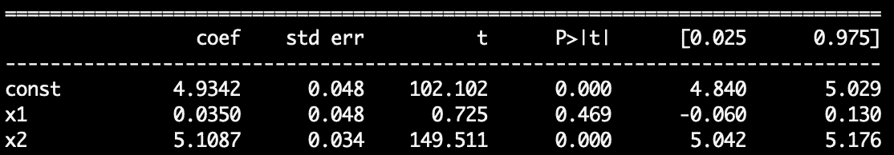
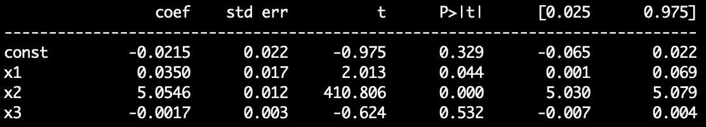

# 不要在 A/B 测试中使用 T 测试

> 原文：<https://towardsdatascience.com/dont-use-a-t-test-for-a-b-testing-e4d2ef7ab9b6>

## 如何使用多元线性回归确定 ATE 和统计显著性

你有没有想过加快 A/B 测试的速度？好吧，这可以说是在 A/B 测试环境中减少方差的最高 ROI 解决方案。


照片由[亚历克斯·罗伯特](https://unsplash.com/@alexrobert?utm_source=medium&utm_medium=referral)在 [Unsplash](https://unsplash.com?utm_source=medium&utm_medium=referral) 拍摄

频繁主义者的实验通常被用于实验。然而，与贝叶斯或序贯方案相比，频繁 A/B 测试通常需要大样本量，这减慢了公司迭代。下面我们将讨论一个实际的解决方案，它允许我们在一半的时间内达到统计显著性。

与之前的帖子不同，我们不会评论一篇论文。相反，我们将汇集我在过去 8 个月中所做的研究，并在此过程中链接相关资源。

事不宜迟，让我们开始吧…

# 技术 TLDR

t 检验是在 A/B 检验中确定统计显著性的最简单的频率主义方法。函数形式为`north_star ~ const + treatment_indicator`的 OLS 在数学上等同于 T 检验，但是它允许我们包含减少方差的协变量。一个著名的例子就是 [CUPED](/how-to-double-a-b-testing-speed-with-cuped-f80460825a90) 。

通过利用稳健的因果模型而不是 T 检验，我们可以自由地大幅降低方差。

# 1 —设置

让我们慢一点，真正明白发生了什么。为了便于交流，我们将从一个例子开始。

我们是在线应用商店的数据科学家。我们的目标是确定 app store 游戏的最佳排名算法(图 1)。


图 1:在线应用商店的例子。图片作者。

我们可以利用任何参与度数据，例如点击、下载、评分等。我们也可以使用这些指标的加权组合。

然而，为了测试最好的系统，我们将利用因果推理的黄金标准:A/B 测试。我们的控制臂将采用**默认排序算法**，每个治疗臂将采用**新排序算法**。最后，我们的北极星指标，我们用来作为实验成功标准的指标，将是**收入。**

# 2—基线:T 检验

传统的 frequentist A/B 测试程序将利用双样本 T 检验来查看我们的治疗组是否显示出与我们的对照组有统计学上的显著差异。实现起来非常简单高效，如下所示…

```
from scipy.stats import ttest_ind
import numpy as np
np.random.seed(1)mu_c = 5
mu_t = 5 + 0.05                                 # 1% liftc = np.random.normal(loc=mu_c, scale=1, size=1e4)
t = np.random.normal(loc=mu_t, scale=1, size=1e4)ate = np.mean(t) - np.mean(c)                # 0.04966
percent_lift = ate / np.mean(c)              # 0.0099
p_val = ttest_ind(t, c).pvalue               # 0.00044
```

在上面的例子中，我们创建了一个控制和处理阵列，其中处理平均比控制高 1%。这代表了 1%的提升，表明我们治疗部门使用的算法增加了 1%的收入。

从那里，我们计算提升百分比和统计意义。如最后两行代码所示，正如预期的那样，我们的模拟返回了 0.99% 的提升，非常接近 1%。还要注意，我们观察到 p 值为 **0.00044** ，远低于标准的 0.05 阈值。

太好了！T 检验有效。

现在，虽然 T 检验在统计学上非常稳健，但它们留下了很多问题。interest 的主要缺点是，他们假设我们度量观察中的所有方差都是真正的噪声**。通常，在现实世界中，我们称系统方差*为噪声*，因为我们没有可靠解释方差的变量。**

****但是，在大多数实验中，并不是所有的方差都是不可解释的，我们将使用线性回归来控制这些趋势。****

# **3 —线性回归**

**线性回归是一个比基本 T 检验更强大的工具。但在我们深入讨论之前，让我们先退一步。**

**我们选择的假设检验由我们的数据生成机制决定——在这种情况下，随机分配给治疗组或对照组。通过随机分配和中心极限定理，我们保证满足 T 检验的所有假设。**

**然而，对于线性回归，我们必须对协变量更加小心。我必须避免的主要问题是特征之间的共线性，尤其是我们的治疗指标。但这是非常可行的。**

**还要注意，与许多因果推断模型不同，我们不必假设模型是正确的，因为给定随机分配，我们有渐近推断。所以，在英语中，**我们可以用线性回归来确定 ATE 和统计显著性。****

**让我们看一个例子。**

## **3.1-T 检验的奇偶校验**

**下面，我们利用 statsmodels 包来重新创建 T 检验的结论…**

```
import statsmodels.api as sm# 1\. Create treatment indicator variable (1 = treat)
is_treat = np.append(np.repeat(1, len(t)), np.repeat(0, len(c)))# 2\. Create independent and dependent vars
x = np.array([is_treat, np.repeat(1, len(t) + len(c))]).T
y = np.append(t, c)# 3\. Fit LM
lm = sm.OLS(y, x).fit()# 4\. Observe ATE and stat sig
ate_ols  = lm.params[0]                                # 0.04966
pval_ols = lm.pvalues[0]                               # 0.00044
round(ate_ols, 6) == round(ate, 6)                     # True
```

**我们首先创建一个二元处理虚拟变量和一个常数。然后，我们使用这两个特征来拟合我们的模型，作为对我们的兴趣指标(收入)的预测。最后，我们提取治疗指标的系数及其 p 值。**

**正如我们所见，线性回归产生的平均治疗效果(ATE)与 T 检验产生的效果相同。从数学上来说，他们是相同的。**

**所以现在我们可以清楚地看到，OLS 和 T 检验的步骤产生了相同的结果，但我们为什么要使用 OLS 呢？**

# **4 —多元线性回归**

**正如这一节的标题所暗示的，OLS 允许我们使用多个变量。随着我们增加相关变量的数量，理论上我们将减少方差并更快达到统计显著性。**

**现在重要的是重申我们必须避免共线特征。这意味着我们的特征没有一个能够*非常*相互关联。当这种情况发生时，不仅模型系数表现奇怪，而且方差会被夸大，这损害了我们确定统计显著性的能力。**

## **4.1 —解释变量**

**让我们看另一个例子。在下面的代码中，我们开发了两个协变量:`seasonal`和`covariate_random`。请注意，在现实世界中，我们实际上是解释性变量，如一周中的某一天或来自用户的总收入。**

```
seasonal = np.sin(np.arange(len(control))) + np.array([1 if np.random.uniform(len(control)) > 0.7 else 0])
covariate_random = np.random.chisquare(5, size=n)c *= seasonal
c += covariate_randomt *= seasonal
t += covariate_random
```

**在使用季节性和随机协变量来衡量我们的治疗和控制后，我们接下来拟合多元线性回归。**这个多元回归缺少我们的** `**covariate_random**` **变量。**输出可以在图 2 中看到…**

```
x = np.array([np.repeat(1, len(t) + len(c)), 
              is_treat, 
              np.append(seasonal, seasonal))]).T
y = np.append(t, c)lm = sm.OLS(y, x).fit()
print(lm.summary())
```

****

**图 MLR 的输出，其中 x1 是治疗指标，x2 是季节性成分。图片作者。**

**在图 2 中，我们的治疗指示器(x1)指示一个 **0.0350** ATE。但是，它在统计上并不显著，如 P > |t|列中的 0.469 所示。我们还要注意，我们的治疗指标变量的标准误差是 **o.o48\.****

**现在，`covariate_random`掌握了我们的因变量收入的重要信息，我们用它来创建我们的治疗/控制值。所以，让我们把它加入到模型中，看看会发生什么…**

****

**图 MLR 的输出，其中 x1 是治疗指标，x2 是季节性因素，x3 是我们的“协变量”。图片作者。**

**可以看到，我们的待遇指标 x1 的系数仍然是 **0.0350** 。这很好——我们没有添加共线性变量。然而，真正令人印象深刻的是 P > |t|列—我们已经从 P 值 0.469 到 0.044。**

****通过简单地包含预测协变量，我们能够达到统计显著性。**我们不需要收集更多数据，例如延长实验时间。我们只是利用统计数据和关于数据方差的知识。**

**很容易看出这个微不足道的例子是如何推广到现实世界的。如果您有一个健壮的因果模型，您的组织可以更快地迭代，并使更少的用户暴露于次优处理。**

**本节的最后一点(感谢评论中的 Alvin)，在探索治疗指标变量和其他解释变量之间的关系时，探索相互作用可能是一个好主意。**

## **4.2-正则化协变量选择**

**值得注意的是，在现实世界的例子中，会有许多潜在的协变量，其中一些可能包括之前的购买行为、在平台上的持续时间、一天中的时间、一周中的日期等。理论上，稳健的多元模型会考虑所有这些因素(假设要素之间不存在共线性)。**

**这里，为我们的因果模型做一些特征选择是有意义的。但是请注意，在我们的休闲模型中包括像 LASSO 这样的正则化项会破坏协变量和我们的治疗指标之间的独立性，从而破坏因果推断。**

**如果要构建多元因果模型，请确保使用独立数据集进行要素选择。**在最终模型中不包括正则化。****

## **4.3-使用 CUPED 减少方差**

**最后一个技巧是利用方差减少技术，例如 [CUPED](/how-to-double-a-b-testing-speed-with-cuped-f80460825a90) 。一句话，CUPED 使用实验前的数据从我们的实验数据中去除“通常的”差异。有了方差减少的 ATE，我们能够更快地达到统计显著性。**

**[ML 模型](https://j-sephb-lt-n.github.io/exploring_statistics/cuped_cupac_and_other_variance_reduction_techniques.html)最近也变得流行，以减少实验方差，但它们涉及到大量更多的工作。也就是说，如果你是一家大公司，这可能是值得的。**

# **5 —摘要**

**在这篇文章中，我们通过使用多元线性回归来估计 ATE，确定统计意义，并减少方差。如果你在实验中使用 T 检验这样的频率主义方法，那么利用多元 OLS 可能会对你有好处。然而，确保你符合 OLS 的假设——如果你不符合，你的 ATE 和统计显著性计算将是错误的。**

***感谢阅读！我会再写 17 篇文章，把学术研究带到 DS 行业。查看我的评论，链接到这篇文章的主要来源和一些有用的资源。***