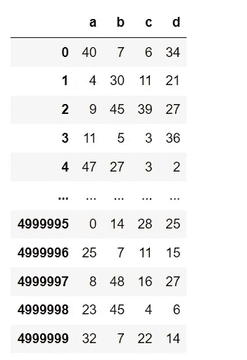

# 不要在 Python 中使用 Apply，遵循这些最佳实践！

> 原文：<https://towardsdatascience.com/dont-use-apply-in-python-there-are-better-alternatives-dc6364968f44>

## 应用功能的替代方案，可将性能提高 700 倍


图片来源:Unsplash

## **什么是应用功能——如果你还不知道的话！**

Apply 函数是一个单行函数，可用于在数据帧的所有元素上或跨数据帧的行或列应用操作。

## **简介**

数据科学家/分析师经常使用 Apply 函数来执行数据操作任务**，但是当您的数据有太多行时使用它真的是最佳选择吗？**

**不尽然！**

在这篇博客中，我们将看看下面 3 个非常有用的替代方法，你可以用它们来代替 Apply 函数，尤其是当你有大量的行时:

1.  *并行化*
2.  *Loops(是的，可以更快！)*
3.  *矢量化(最佳实践！)*

但是首先，让我们来看看 apply 函数在大型数据集上的执行时间。

**创建数据集**

我们将创建一个具有 5 百万行和 4 列的数据集。每列可以有一个从 0 到 50 的整数值。

```
import numpy as np
import pandas as pddf = pd.DataFrame(np.random.randint(0, 50, size=(5000000, 4)), columns=('a','b','c','d'))df.shape
# (5000000, 5)df.head()
```



数据框(图片由作者提供)

**定义功能**

现在，让我们定义我们的函数，该函数基于 dataframe/input 变量的现有列中的值返回一些值。

```
def infer(a,b,c,d):
    if a==0:
        return d
    elif a <= 25 & a>0:
        return b-c
    else:
        return b+c
```

**应用功能**

现在，我们将使用“应用”函数来调用上一步中定义的推断函数。

```
import timestart = time.time()
df['e'] = df.apply(lambda x: infer(x['a'], x['b'], x['c'], x['d']), axis = 1)
end = time.time()
print(end - start)### Time taken: 200 seconds
```

应用功能大约需要 **200 秒**才能得到结果。

让我们来看看替代方法:

## 选项 1:并行化

并行化是通过将大数据块划分为较小的数据块来实现的，这些较小的数据块使用多个 CPU 和内核的能力来并行处理。

有几个包，比如 *Swifter* 和 *Dask* ，我们可以使用它们实现并行化。在这篇博客中，我们将看看 swifter，因为它非常容易使用，并且在某些情况下可以达到几乎相同的结果或更好的结果。

我们可以简单地在 dataframe 之后调用 swifter 包，然后继续应用函数。

```
## install the package
!pip install swifter## import the package 
import swifter## use the swifter package
start = time.time()
df['e'] = df.swifter.apply(lambda x: infer(x['a'], x['b'], x['c'], x['d']), axis = 1)end = time.time()
print(end - start)## Time taken: 60 seconds
```

因此，使用 Swifter 包，我们可以将执行时间减少 3 倍以上，对于简单添加包名来说，这已经不错了。

Swifter 试图以最好的方式实现 apply 函数，要么在后端使用 Dask 将其矢量化或并行化，要么在数据集很小的情况下简单地使用 pandas apply。

## 选项 2:循环

我知道这听起来令人震惊，但如果你有一个没有太多列的数据集，那么这种技术可以方便地获得比 swifter 包更好的结果。

诀窍是首先将 dataframe 转换成默认的 light 数据结构，比如数组或字典，然后遍历这些行来操作数据集。

```
start = time.time()## empty list 
list2 = []## adding 'e' column with default 0
df['e'] = 0## convert dataframe into array 
for row in df.values:
    if row[0] == 0:
        row[4] = row[3]

    elif row[0] <= 25 & row[0] > 0:
        row[4] = row[1]-row[2]
    else:
        row[4] = row[1] + row[2]
    list2.append(row)

df2 = pd.DataFrame(list2, columns=['a', 'b', 'c', 'd','e'])end = time.time()
print(end - start)## Time taken: 20 seconds
```

因此，使用 for 循环遍历数组，我们能够将执行时间减少到 20 秒，比 apply 函数提高了 10 倍。

## 选项 3:矢量化

矢量化是在数据集上实现数组操作的技术。在后台，它一次将操作应用于数组或序列的所有元素(不像 for 循环一次处理一行)。

对 python 代码进行矢量化是实现最佳性能的最佳实践。

```
# using vectorization 
start = time.time() df['e'] = df['b'] + df['c']
df.loc[df['a'] <= 25, 'e'] = df['b'] -df['c']
df.loc[df['a']==0, 'e'] = df['d']end = time.time()
print(end - start)
## 0.28007707595825195 sec
```

因此，我们能够将运行时间减少到 0.28 秒，比应用函数的运行时间快 700 倍。

# 摘要

*   我们研究了 python 中 Apply 函数的 3 种替代方法，尤其是当数据集包含大量行时。
*   我们了解了 swifter 软件包的并行处理能力。
*   我们发现，如果聪明地使用，python 中的循环并没有那么糟糕。
*   对于一个大型数据集，代码的矢量化带来了最佳的性能提升，大约是 apply 函数的 700 倍。因此，使用矢量化处理大型数据集是最佳实践。

我希望你从这篇文章中学到了一些新的东西。

你可以在收件箱里收到我的帖子。 [***做到这里*** *！*](https://anmol3015.medium.com/subscribe) *如果你喜欢体验媒介的自己，可以考虑通过* [***报名会员来支持我和其他成千上万的作家。它每个月只需要 5 美元，它极大地支持了我们，作家，而且你也有机会通过你的写作赚钱。***](https://anmol3015.medium.com/membership)