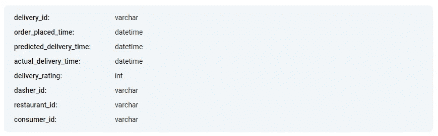
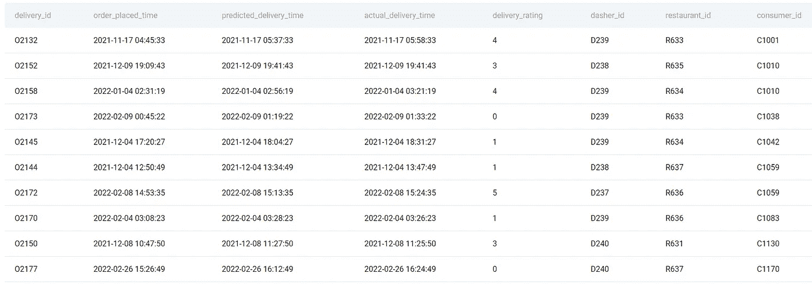

# DoorDash SQL 面试问题

> 原文：<https://towardsdatascience.com/doordash-sql-interview-questions-509e1dfbb1fb>

## *一个有趣的 DoorDash SQL 面试问题和解决方案的详细演练*


作者在 [Canva](https://canva.com/) 上创建的图片

我们今天为您选择的 DoorDash SQL 面试问题很有趣，因为它要求您了解各种 SQL 概念。它通过使用 **TO_CHAR()** 和 **EXTRACT()** 等函数来测试您处理不同类型数据的能力。还有，它涉及到 [**聚合函数**](https://www.stratascratch.com/blog/the-ultimate-guide-to-sql-aggregate-functions/?utm_source=blog&utm_medium=click&utm_campaign=tds) 和 **CASE** 语句。

我们不会把问题和解决方案扔给你。如果你继续阅读，你会发现我们对如何回答这个问题的建议，而不仅仅是这个。其他任何 DoorDash 或者其他公司的 [*SQL 面试题*](https://www.stratascratch.com/blog/sql-interview-questions-you-must-prepare-the-ultimate-guide/?utm_source=blog&utm_medium=click&utm_campaign=tds) 都可以用。我们相信这对你参加任何 SQL 面试都有很大帮助。

为了让它更有帮助，我们制作了一个视频，可以让你更容易地了解我们在这里将要谈论的一切。反之亦然。

## DoorDash SQL 面试问题

**极度延迟交货**

我们要谈的问题就是这一个。

> 如果实际交付时间比预测交付时间晚 20 分钟以上，则交付被标记为极度延迟。在每个月中，有百分之多少的订单是极度延迟的？以 YYYY-MM 格式输出月份，以及相应的极迟订单占本月所有订单的百分比。

如果你想跟随我，这是的[链接。](https://platform.stratascratch.com/coding/2113-extremely-late-delivery?code_type=1&utm_source=blog&utm_medium=click&utm_campaign=tds)

如果你事先对公司有过调研(强烈推荐！)，这是展示你对业务理解的时候了。

Doordash 想要调查他们的送货时间是有道理的。尤其是在食品行业，准时交货对于确保客户满意度至关重要。除此之外，还影响食品质量和安全。食物需要新鲜供应！

假设你是 DoorDash 的一名数据分析师，管理层想知道每个月他们的订单中有多少百分比是“极度延迟交付”。如果订单交付时间比预计交付时间晚 20 分钟以上，则交付被视为“极度延迟”。

凭直觉，我们会逐月监控“极度延迟”交付的数量。然而，我们不能只看这个数字。总交付量将每月变化，并根据季节、假期以及公司的总体发展而波动。一个更好的跟踪指标是“极度延迟”订单占总订单的百分比。这正是这个 DoorDash SQL 面试问题要求我们做的。

理想情况下，我们希望看到这个指标随着时间的推移而降低，或者至少保持在某个阈值内。否则，这是一个值得关注的原因，导致收视率低，回头客少，食品质量差。比你想象的要快，公司倒闭了。你就失业了！

我们不能让你为失去工作做好准备，但我们可以为找到工作做好准备！

# 解决这一问题的解决方案框架


作者在 [Canva](https://canva.com/) 上创建的图像

现在你明白了你需要解决的问题，让我们开始制定解决方案。

为此使用一个框架将帮助你组织你的想法，并以一种面试官可以理解的方式进行交流。这一点很重要，因为经常不仅仅是你的编码技能被测试，你的交流技能也被测试。

我们推荐的框架由以下步骤组成。

1.  探索和理解数据集
2.  确认并陈述你的假设
3.  用英语或伪代码概述你的高级方法
4.  编码解决方案
5.  代码优化(如果有)

如果你还不熟悉这个，去看看这个视频，里面详细解释了所有的步骤。

# 1.浏览数据集

我们得到了 **delivery_orders** 表，其中显示了配送 ID、下订单的时间、预计配送时间、实际配送时间、为该配送提供的评级，以及配送员(骑手)、餐馆和消费者(顾客)的 ID。

下面是表格结构。



该表的预览显示了以下数据。



一旦下了订单，就会给它分配一个惟一的交付 ID，然后记录订单的相关细节，如客户、餐馆、日期和订单时间。计算交货时间/交货的预期到达时间，并将订单分配给配送员/骑手，其 ID 也包含在表中。订单交付后，会记录准确的时间，客户会通过评分提供反馈。

# 2.确认并陈述你的假设

该问题没有提供如果订单被取消或交付正在途中(即，已下单但尚未交付)会发生什么情况的信息。

你可以和面试官澄清这一点。我们没有这个选项，所以我们假设数据集只包含已履行的订单。

# 3.概述高级方法

现在，让我们解开获得目标输出表所需的东西。这个 DoorDash SQL 面试问题要求我们显示每个月的极度延迟订单的比例。

输出应该以 YYYY-MM 格式显示月份，在第二列中显示相应的极度延迟订单的百分比。

为了获得所需格式的日期，我们需要从 order_placed_date 列中提取月份和年份信息。

至于百分比，需要计算每个月的延期订单总数和订单总数。

获得订单总数很容易:我们只需要计算唯一的交货 id 的数量。但是每个月的极晚订单总数呢？

为了确定某个订单是否是“极度”延迟订单，我们必须比较预测交货时间和实际交货时间这两列。如果实际交付时间超过预测交付时间超过 20 分钟，那么我们就有一个“极度延迟”订单。

为了剔除非常晚的订单，我们将使用 CASE 语句。

将这个详细的描述分成几个步骤:

1.  TO _ CHAR()-从 order_placed_date 列中提取月份和年份，格式为 YYYY-MM
2.  案例陈述——确定行级别的极度延迟交付
3.  EXTRACT() —获取实际交付时间和预测交付时间之间的差值(以分钟为单位)
4.  SUM() —获取极度延迟交货的总数
5.  COUNT()和 DISTINCT —获取所有交付的总数；除以上一步得到百分比
6.  CAST()-获取百分比中的小数点(浮点)
7.  分组依据-按月获取输出

一旦你列出了所有的步骤，和面试官核对一下。这有助于你尽早获得反馈。如果一切顺利，您可以开始编码了。

# 4.编码解决方案

编码现在仅仅意味着将上述步骤翻译成 SQL 代码。

1.**提取月份和年份**

我们将使用 TO_CHAR()函数获取所需格式的数据。

```
SELECT TO_CHAR(order_placed_time,'YYYY-MM') AS year_month
FROM delivery_orders;
```

如果您的想法是使用 EXTRACT()或 DATE_PART()函数，您可以这样做。但是，这些函数不会直接获得您需要的格式，即 YYYY-MM。如果您想了解更多关于日期时间操作的信息，请查看此视频。

**2。识别极度迟交的货物**

CASE 语句是 SQL 中的一个 IF-THEN-ELSE 语句，它将允许我们识别极度延迟的交付。

```
SELECT TO_CHAR(order_placed_time, 'YYYY-MM') AS year_month,
       CASE
           WHEN (prediced_delivery_time - actual_delivery_time) > 20 THEN 1
           ELSE 0
       END
FROM delivery_orders;
```

然而，要做到这一点，我们需要提取分钟并减去它们。

**3。以分钟为单位显示差异**

在这一步中，我们将使用 EXTRACT()函数。到目前为止，代码是这样的。

```
SELECT TO_CHAR(order_placed_time, 'YYYY-MM') AS year_month,
       CASE
           WHEN EXTRACT(MINUTE
                        FROM (actual_delivery_time - predicted_delivery_time)) > 20 THEN 1
           ELSE 0
       END
FROM delivery_orders; 
```

**4。极度延迟交货的数量**

CASE 语句除了每一个非常晚的交付外，还会显示整数 1。为了得到它们的数量，我们使用 SUM()聚合函数。

```
SELECT TO_CHAR(order_placed_time, 'YYYY-MM') AS year_month,
       SUM(CASE
               WHEN EXTRACT(MINUTE
                            FROM (actual_delivery_time - predicted_delivery_time)) > 20 THEN 1
               ELSE 0
           END)
FROM delivery_orders;
```

**5。所有交付的数量**

下一步是使用 COUNT()和 DISTINCT 查找所有唯一交付的数量。此外，极晚交货的数量必须除以这个数字。

```
SELECT TO_CHAR(order_placed_time, 'YYYY-MM') AS year_month,
       SUM(CASE
               WHEN EXTRACT(MINUTE
                            FROM (actual_delivery_time - predicted_delivery_time)) > 20 THEN 1
               ELSE 0
           END)/COUNT(DISTINCT delivery_id)*100
FROM delivery_orders;
```

**6。转换为浮点型**

上面的 get 将除法结果显示为整数。即零，因为极度延迟交货的数量低于总交货数量。

要解决这个问题，可以使用 CAST()函数。我们将使用双冒号(::)，这是该函数的简写。

```
SELECT TO_CHAR(order_placed_time, 'YYYY-MM') AS year_month,
       SUM(CASE
               WHEN EXTRACT(MINUTE
                            FROM (actual_delivery_time - predicted_delivery_time)) > 20 THEN 1
               ELSE 0
           END)/COUNT(DISTINCT delivery_id)::FLOAT*100 AS perc_extremely_late
FROM delivery_orders;
```

**7。按年月分组**

现在剩下的就是使用 GROUP BY 子句了，您已经得到了这个 DoorDash SQL 面试问题的完整答案。

```
SELECT TO_CHAR(order_placed_time, 'YYYY-MM') AS year_month,
       SUM(CASE
               WHEN EXTRACT(MINUTE
                            FROM (actual_delivery_time - predicted_delivery_time)) > 20 THEN 1
               ELSE 0
           END)/COUNT(DISTINCT delivery_id)::FLOAT*100 AS perc_extremely_late
FROM delivery_orders
GROUP BY 1;
```

这一结果需要引起注意，因为 Doordash 有几个月的交货时间非常晚，比例很高。表现最差的是 2022 年 1 月，约有 36%的订单极度延迟。同样，2021 年 11 月也有令人不安的 31%的交付业绩。这样，公司管理层会希望调查根本原因，以便将极迟交付保持在最低限度；否则，漫长的等待可能会吓跑 Doordash 的宝贵客户！

# 5.代码优化

您是否需要这一步取决于代码本身。有些代码不需要优化，而有些则需要。面试官往往喜欢要求一个代码进行优化。受访者这样做的能力表明，他们可以编写一个有效的代码。

如果面试结束的时候还剩下更多的时间，那就想想你该如何改进解决方案，即使面试官没有要求你优化。

对于我们的 DoorDash 问题解决方案，我们可以改进它。一个方便的技巧是使用公共表表达式或 cte。

如果存在列转换或者代码更复杂，那么在出现错误的情况下，会使您的解决方案更难理解和调试。cte 在这里特别有用！

通过在汇总最终结果之前编写 CTE，我们可以优化我们的解决方案。

```
WITH orders AS
  (SELECT TO_CHAR(order_placed_time, 'YYYY-MM') AS year_month,
          delivery_id,
          CASE
              WHEN EXTRACT(MINUTE
   FROM (actual_delivery_time - predicted_delivery_time)) > 20 THEN 1
              ELSE 0
          END AS extremely_late
   FROM delivery_orders)

SELECT year_month,
       SUM(extremely_late)/COUNT(DISTINCT delivery_id)::FLOAT*100 AS perc_extremely_late
FROM orders
GROUP BY 1;
```

运行这段代码，您将看到它返回与第一个解决方案相同的结果。

## 结论

这个中等难度的 SQL 面试问题真正展示了面试官喜欢问的问题。我们讨论了数据聚合，处理日期、数据转换、CASE 语句和数据分组。这些也是在工作面试中测试的流行的 SQL 概念。还有更多这样的 DoorDash 问题，请查看我们的帖子“ [*最常见的 DoorDash 数据科学家面试问题*](https://www.stratascratch.com/blog/most-common-doordash-data-scientist-interview-questions/?utm_source=blog&utm_medium=click&utm_campaign=tds) ”。尝试解决其中的一些问题，看看你在这里学到的东西是否可以应用到其他问题上。在面试中回答问题时，不要忘记使用结构化框架。这对你来说真的很重要！

【https://www.stratascratch.com】最初发表于[](https://www.stratascratch.com/blog/doordash-sql-interview-questions/?utm_source=blog&utm_medium=click&utm_campaign=tds)**。**