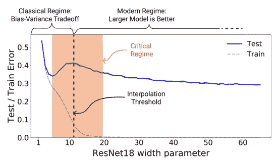

# 人工智能的新旧视角及其对知识产权纠纷的影响

> 原文：<https://towardsdatascience.com/double-descent-and-ml-models-as-generalized-database-indexes-5d3b1db49b5b>

## 像 Github copilot、GPT-3 和 DALLE2 这样的模型是否模糊了机器学习和传统搜索索引之间的界限？

# 介绍

工程师们学习数据库以及如何使它们能够被有效地查询；数据科学家学习如何建立统计模型，以及如何使他们的预测更准确…这两者永远不会相遇。这篇文章的目标是挑战这种观念，特别是在 LLM 的一些有趣属性的背景下，并沿着用于查询数据群体的数据结构和算法的连续体来看待这两者。

数据库索引允许您使用输入键确定性地搜索数据集；机器学习模型基于输入特征搜索一般人群(它被视为其中的一部分)。此外，人工智能和 LLM 的巨大飞跃颠覆了一些关于机器学习模型可以有多灵活的基本假设，同时仍然保持对人群进行概括的能力。从这些模型运行的规模来看，类似搜索引擎的用例已经出现，为数据库和机器学习之间看似抽象的联系提供了现实世界和法律利益(见最近[对微软](https://www.vice.com/en/article/bvm3k5/github-users-file-a-class-action-lawsuit-against-microsoft-for-training-an-ai-tool-with-their-code)的集体诉讼)。

## 空间换时间

数据库索引是一种数据结构，允许您高效地遍历大型数据集；它用时间(你将等待寻找一个项目)换取空间(你用空间存储关于如何找到那个项目的附加信息)。标准的基于树的索引允许您在`log(N)`时间压缩它的分支，而不是在`N`时间扫描原始表。这些捷径基本上是有方向的:给定这个主键或辅键的值，我应该移动到哪里才能命中数据集中最近的目标？很简单。

## 作为超适合机器学习模型的数据库索引

监督机器学习模型也在数据集之上构建结构，目标是在原始集中的数据之外进行归纳。他们不再习惯于*发现*，而是习惯于*推断*或*预测*。我们可以将这些模型视为索引的一般化:它不是基于提供的特征在您的*样本*中找到匹配元素，而是预测或推断*总体*中最接近的元素。

监督机器学习模型传统上比数据库索引更小、更严格，因为它们的目标是超越可用数据进行归纳，用方差换取偏差。如果您不需要对现有的数据进行归纳，您只需要使用数据库索引！(这实际上是很多渴望进入数据科学的企业没有考虑到的事情。)

考虑到这种心理模型，数据库索引只是一个完全过度拟合的监督模型:它根本不能超越它所看到的数据进行归纳，但它能很好地在给定的`X`样本中找到任何`y`…所有方差没有偏差。

## 除了偏差-方差权衡…双重下降

因此，我们可以将 ML 模型视为人口数据的指数，但是，在传统的统计建模中，您必须用足够的方差来换取偏差，从功能上来说，它看起来完全不像指数，这种类比只是一篇博客文章的有趣思想实验。

来源:https://arxiv.org/pdf/1912.02292.pdf

如果你不需要做这样的权衡，这个类比能让我们走多远？对于尖端的深度神经网络，这种折衷并不总是存在。根据 [OpenAI 的研究](https://openai.com/blog/deep-double-descent/)，在某些条件下，“过度拟合”一个模型(或者继续训练远远超过传统统计建议的折衷曲线上的点)会提高测试数据的性能。超过插值阈值后，模型只会变得越来越好。还没有完全理解为什么模型会这样做，因为一旦训练误差为零，目标函数就不会为模型变得更好提供明显的“激励”。但是让我试着提供一个直觉…

一个看似合理的解释是统计学上的:神经网络是一个通用的函数逼近器，并且“好”模型(阅读那些可以有效插值的模型)比“坏”模型(那些貌似符合训练数据但在现实生活中表现不佳的模型)多得多。此外，过参数化模型更加灵活，能够为特定训练集生成比有效的更小模型(即，更少的拟合参数)更多的模型候选。*因此，随着非零模型参数数量的增加，解空间变得更大，选择“好”模型的可能性变得更大。*

## 大型语言模型作为搜索引擎的含义

当你运行谷歌图片搜索时，该引擎会返回最有可能匹配你的关键词的索引图片的子集。当你在 DALLE 2 中输入一个提示时，一个扩散过程迭代地向一个图像工作，该图像基于在训练时看到的字幕-图像对最大化输入单词的概率。[原始论文](https://arxiv.org/pdf/2102.12092.pdf)指出，“为了扩展到 120 亿个参数，我们通过从互联网上收集 2.5 亿个文本-图像对，创建了一个类似于 300M (Sun et al .，2017)规模的数据集。”

在这种情况下，谷歌搜索和 DALLE 2 提示看起来没什么不同。抛开算法差异不谈，用户体验的核心差异是 DALLE 2 能够零拍摄图像生成，而谷歌搜索只能返回之前看到的内容。由 GPT-3 驱动的 Github copilot 以类似的方式对开源代码进行操作，从大规模参数化模型中生成“新颖”代码片段。

一个用 DALLE 2 武装起来的作家能为他们的漫画书生成看起来可疑地像来自漫威宇宙的东西的小说标题吗？我不是律师，但是，如果我要反对这种权利，我会使用数据库索引和机器学习之间的类比。机器学习只是对关于数据集的信息进行编码的许多方法之一。直到最近，它看起来一点也不像传统的数据库。但讽刺的是，现在的规模和复杂程度揭示了贯穿线。