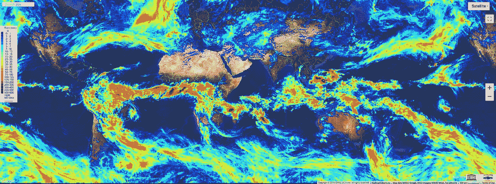
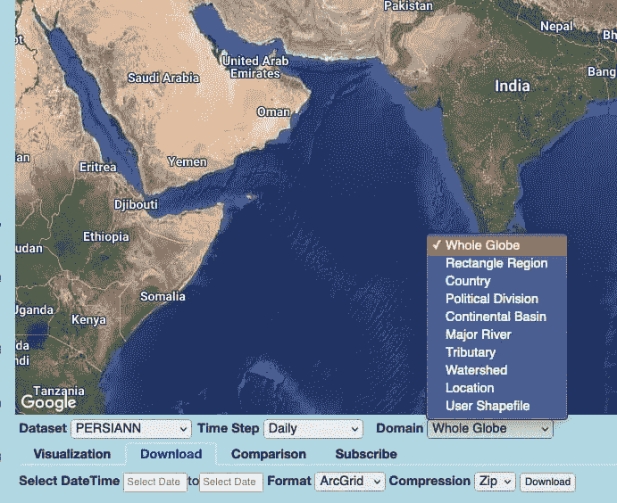
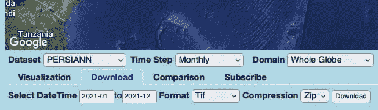
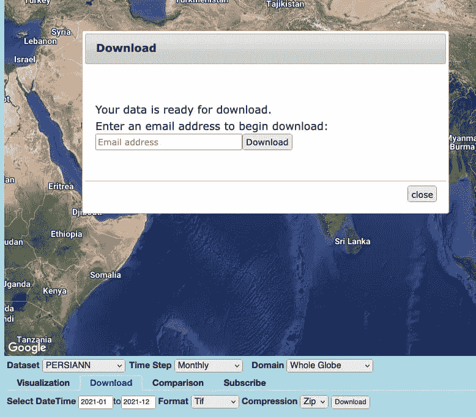
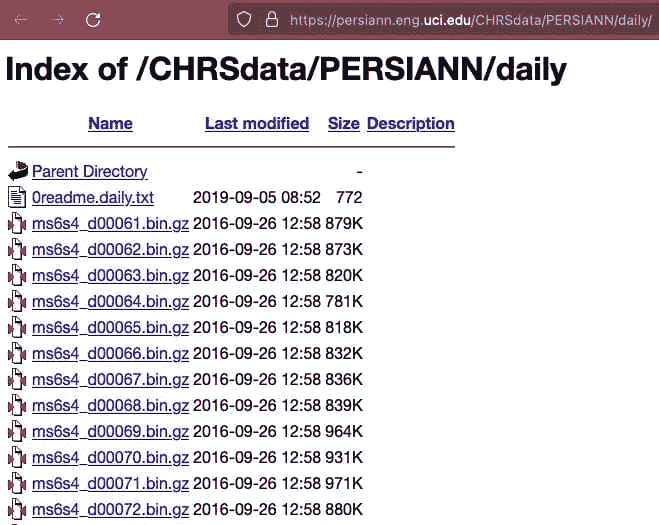
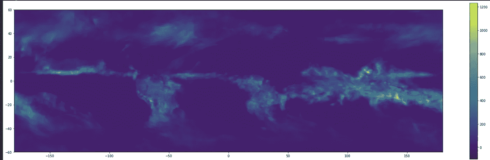

# 使用 Python 从 CHRS 数据门户下载雨量卫星数据

> 原文：<https://towardsdatascience.com/download-rainfall-satellite-data-from-chrs-data-portal-using-python-1055d55bef0d>

## 教程-使用 Python 模块轻松查询和下载降雨卫星数据以进行快速分析



使用 Python 从 CHRS 数据门户下载雨量卫星数据。CHRS 制作的 [iRain 工具](https://irain.eng.uci.edu/)截图。

降雨量是几个用例的重要指标，包括农业生产率增长分析、气候变化分析等。了解一个地区的降雨模式和波动有助于制定农业季节的战略计划。

有几个数据源提供降雨卫星数据。CHRS 门户网站是其中之一，它提供基于遥感卫星数据的全球降雨指标。在本教程中，让我们看看如何使用 python 从 CHRS 数据门户下载降雨卫星数据。

我的其他文章:

<https://www.samashti.space/articles/why-you-need-to-use-geopackage-files-instead-of-shapefile-or-geojson>  <https://www.samashti.space/articles/how-to-use-qgis-spatial-algorithms-with-python-scripts>  

# 什么是 CHRS？

CHRS 代表水文气象和遥感中心。这是一个由加州大学欧文分校(UCI)建立的中心。CHRS 大学在其教师和研究人员的帮助下，建立了一系列旨在解决水文过程相关问题的产品/系统。这些产品利用遥感数据和机器学习(神经网络)模型来了解和预测各种活动对水资源的影响。

CHRS 数据门户通过多个项目提供降水和相关产品。例如， [PERSIANN](https://chrs.web.uci.edu/SP_activities00.php) (使用人工神经网络从遥感信息中估计降雨量)系统根据遥感数据计算降雨量的估计值。其他系统还有 [PERSIANN-CCS](https://chrs.web.uci.edu/SP_activities01.php) ， [PERSIANN-CDR](https://climatedataguide.ucar.edu/climate-data/persiann-cdr-precipitation-estimation-remotely-sensed-information-using-artificial) ，[PDIR-现在](https://journals.ametsoc.org/view/journals/hydr/21/12/jhm-d-20-0177.1.xml)， [PERSIANN-CCS-CDR](https://www.nature.com/articles/s41597-021-00940-9) 。这些数据公布在公共领域，供所有人使用。

> 💡注:CHRS 还提供了两个探索性工具来直接在浏览器上可视化数据— [iRain](https://irain.eng.uci.edu/) 、 [RainSphere](https://rainsphere.eng.uci.edu/) 。

# [计]元数据

# 佩尔夏恩

**数据周期:**2000 年 3 月至今

**覆盖范围:**60° S 至 60 N

**分辨率:** 0.25 x 0.25

**HTTP 下载(全地球):** [每小时一次、](https://persiann.eng.uci.edu/CHRSdata/PERSIANN/hrly/) [3 小时一次、](https://persiann.eng.uci.edu/CHRSdata/PERSIANN/3hrly/) [6 小时一次、](https://persiann.eng.uci.edu/CHRSdata/PERSIANN/6hrly/) [每天一次、](https://persiann.eng.uci.edu/CHRSdata/PERSIANN/daily/) [每月一次、](https://persiann.eng.uci.edu/CHRSdata/PERSIANN/monthly/) [每年一次](https://persiann.eng.uci.edu/CHRSdata/PERSIANN/yearly/)

FTP 也可用:ftp://persiann.eng.uci.edu/CHRSdata/PERSIANN

**最新更新:**接近实时，延迟 2 天

# PERSIANN-CCS

数据周期:2003 年 1 月至今

**覆盖范围:**60° S 至 60 N

**分辨率:**0.04×0.04

**HTTP 下载(全地球):**[每小时一次，](https://persiann.eng.uci.edu/CHRSdata/PERSIANN-CCS/3hrly/) [每小时三次，](https://persiann.eng.uci.edu/CHRSdata/PERSIANN-CCS/6hrly/) [每天一次，](https://persiann.eng.uci.edu/CHRSdata/PERSIANN-CCS/daily/) [每月一次，](https://persiann.eng.uci.edu/CHRSdata/PERSIANN-CCS/mthly/) [每年一次](https://persiann.eng.uci.edu/CHRSdata/PERSIANN-CCS/yearly/)

**FTP 也可用:**ftp://persiann.eng.uci.edu/CHRSdata/PERSIANN-CCS

**最新更新:**实时

# PERSIANN-CDR

数据周期:1983 年 1 月至今

**覆盖范围:**南纬 60°至北纬 60°

**分辨率:** 0.25 x 0.25

**HTTP 下载(全地球):** [每日、](https://persiann.eng.uci.edu/CHRSdata/PERSIANN-CDR/daily/) [每月、](https://persiann.eng.uci.edu/CHRSdata/PERSIANN-CDR/mthly/) [每年](https://persiann.eng.uci.edu/CHRSdata/PERSIANN-CDR/yearly/)

**FTP 也可用:**ftp://persiann.eng.uci.edu/CHRSdata/PERSIANN-CDR

**3hr PERSIANN-CDR:**[3hr PERSIANN-CDR，](https://persiann.eng.uci.edu/CHRSdata/PERSIANN-CDR/adj_3hB1) [自述](https://persiann.eng.uci.edu/CHRSdata/PERSIANN-CDR/adj_3hB1/README_PERSIANN-CDR_3hr.txt)

**最新更新:**2020 年 9 月

# PDIR-现在

**数据周期:**2000 年 3 月 1 日至今

**覆盖范围:** 60 S 到 60 N

**分辨率:**0.04×0.04

**HTTP 下载(全地球):**[每小时一次，](https://persiann.eng.uci.edu/CHRSdata/PDIRNow/PDIRNow3hourly/) [每小时三次，](https://persiann.eng.uci.edu/CHRSdata/PDIRNow/PDIRNow6hourly/) [每天一次，](https://persiann.eng.uci.edu/CHRSdata/PDIRNow/PDIRNowdaily/) [每月一次，](https://persiann.eng.uci.edu/CHRSdata/PDIRNow/PDIRNowmonthly/) [每年一次](https://persiann.eng.uci.edu/CHRSdata/PDIRNow/PDIRNowyearly/)

数据文件格式: [PDIRNow 自述文件](https://persiann.eng.uci.edu/CHRSdata/PDIRNow/PDIRNow_readme.txt)

**FTP 也可用:**ftp://persiann.eng.uci.edu/CHRSdata/PDIRNow

# 下载数据

# 在门户上查询数据

任何用户都可以通过在 [CHRS 数据门户](https://chrsdata.eng.uci.edu/)上创建查询来下载全球任何地方的降雨卫星数据。对于每个数据集，您可以从下拉列表中选择可用的时态粒度，并选择过滤域。过滤域可以是全球、任何特定的国家、地区或位置。您甚至可以提供一个 shapefile 来查询数据。



从 CHRS 数据门户查询数据以下载降水数据。[查询工具](https://chrsdata.eng.uci.edu/)作者截图。

选择时间步长、属性域和数据集后，提供开始和结束日期以及可用选项(ArcGrid、NetCDF、Tif)中的下载数据格式。



查询 2021 年 PERSIANN 数据的示例，粒度为全球每月。[查询工具](https://chrsdata.eng.uci.edu/)作者截图。

完成查询的详细信息并单击下载按钮后，您将被带到一个对话框，提供电子邮件地址。成功提交后，您将通过电子邮件收到一个链接，通过提供的地址下载数据。



在提示中提供电子邮件地址。您应该会收到一封邮件，其中包含所查询数据的下载链接。[查询工具](https://chrsdata.eng.uci.edu/)作者截图。

您需要手动浏览用户界面来查询数据，并通过电子邮件提示流程下载数据。此外，下载链接是通过电子邮件发送的，这只会减慢下载过程。还有一种替代方法，你可以通过它下载数据，以避免电子邮件的提示。

# HTTP 下载

CHRS 还通过一个 HTTP 服务器提供数据，你可以用它来下载数据。根据每个数据集的可用时间步长，可用数据适用于整个地球。您可以参考上面的元数据部分，以获得可用时间步长及其各自 HTTP 服务器链接的概述。



HTTP 服务器上 PERSIANN 系统的每日降雨量数据。作者提供的 [HTTP 服务器](https://persiann.eng.uci.edu/CHRSdata/PERSIANN/daily/)的截图。

虽然这种方法可以帮助您克服电子邮件验证过程，但是您必须手动下载每个观察的文件。与您可以在 UI 上进行的灵活查询相比，数据可以以“. bin.gz”格式提供。

# 使用 Python

上述两种方法都有一些局限性。因此，我使用 python 构建了一个实用程序库来处理从 CHRS 数据门户查询和下载降雨卫星数据。实用程序库 [chrs-persiann-util](https://github.com/samashti/chrs-persiann-util) 让您可以查询不同时间步长和文件格式的可用数据集。

<https://github.com/samashti/chrs-persiann-util>  

要安装这个库，请将 GitHub 项目克隆到您的本地，并从您的终端的根目录运行以下命令；

```
python setup.py install
```

或者，您也可以直接从 Github 链接安装；

```
pip install git+https://github.com/samashti/chrs-persiann-util.git
```

安装完成后，您可以使用该库下载数据，如下所示:

```
from chrs_persiann import CHRSparams = {
    'start': '2021010100',
    'end': '2021010300',
    'mailid': 'test@gmail.com',
    'download_path': '~/Downloads',
    'file_format': 'Tif',
    'timestep': 'daily',
    'compression': 'zip'
}dl = CHRS()# PERSIANN
dl.get_persiann(**params)
```

在 [Github](https://github.com/samashti/chrs-persiann-util#readme) 上阅读更多关于库和输入查询参数标准的用法。

# 下载和可视化降雨数据

让我们来看一下一月份的降雨量卫星数据。你也可以在 Google Colab 上找到这个例子。

<https://colab.research.google.com/drive/1erI4OIrZZkqQfz5FEzmp_q4nxD7PcHnc?usp=sharing>  

让我们首先初始化所需的 python 模块。我们使用 rasterio 来读取下载后的栅格数据。

```
import rasterio
import zipfile
from chrs_persiann import CHRS
```

在这里，我们想下载 2022 年 1 月的个人数据。因此，我将相应的查询参数传递给实用程序库，并下载 zip 格式的降雨卫星数据。

```
params = {
    'start': '2021010100',
    'end': '2021013100',
    'mailid': 'test@gmail.com',
    'download_path': '/home/',
    'file_format': 'Tif',
    'timestep': 'monthly',
    'compression': 'zip'
}dl.get_persiann(**params)
```

您应该可以在日志中看到正在进行的查询和订购过程，如下所示；

```
Querying data & Placing the order...
Query Params:start date - 2021010100
end date - 2021013100
time step - monthly
data type - PERSIANN
file format - Tif
compression format - zip
download path - /home/Query complete.
Order Details - User IP: 108598346, File: 2022-03-10074331am
Generating Data url...
File url Generated - <https://chrsdata.eng.uci.edu/userFile/108598346/temp/PERSIANN/PERSIANN_2022-03-10074331am.zip>
Downloading compressed data file - /home/PERSIANN_2022-03-10074331am.zip
Download Complete ------------------------------------------
```

现在，我们检查下载的 zip 文件并查看可用的光栅文件。

```
file = '/home/PERSIANN_2022-03-10074331am.zip'
z = zipfile.ZipFile(file)
z.filelist
```

我们看到`PERSIANN_1m202101.tif`是 zip 文件内容的一部分，我们有兴趣使用 rasterio 读取这个文件。

```
rasterfile = z.filelist[0].filename
raster = rasterio.open(f'/vsizip/{file}/{rasterfile}')
```

成功读取栅格后，我们可以利用 rasterio 和 matplotlib 库快速可视化栅格。

```
from rasterio.plot import show
from matplotlib import pyplot as pltfig, ax = plt.subplots(figsize=(30,9))# use imshow so that we have something to map the colorbar to
image_hidden = ax.imshow(raster.read(1), cmap='viridis')# plot on the same axis with rio.plot.show
image = show(raster.read(1), transform=raster.transform, ax=ax, cmap='viridis')# add colorbar using the now hidden image
fig.colorbar(image_hidden, ax=ax)
```



2022 年 1 月全球 CHRS 降雨数据。图片作者。

# 摘要

在这个快速教程中，我们学习了如何通过多种方法从 CHRS 门户网站下载降雨卫星数据，包括使用 python 模块。chrs-persiann-util 将帮助您对数据集进行查询，并从您的代码中下载进行快速分析。如果您喜欢试验代码，您可以查看这个 Google Colab 笔记本上的代码。

<https://colab.research.google.com/drive/1erI4OIrZZkqQfz5FEzmp_q4nxD7PcHnc?usp=sharing>  

如果你喜欢这个博客，喜欢&订阅博客，以获得关于未来博客帖子的通知。如有任何疑问或讨论，你可以在 [LinkedIn](https://www.linkedin.com/in/nikhilhubballi/) 和 [Twitter](https://twitter.com/samashti_) 上找到我。

阅读其他帖子:

<https://www.samashti.space/articles/how-to-geocode-addresses-for-free>  <https://www.samashti.space/articles/why-geospatial-data-is-the-way-forward-in-data-analytics> 